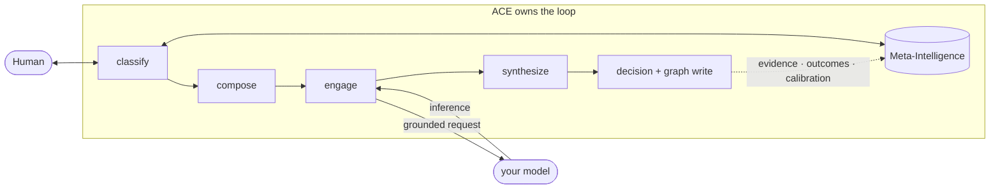
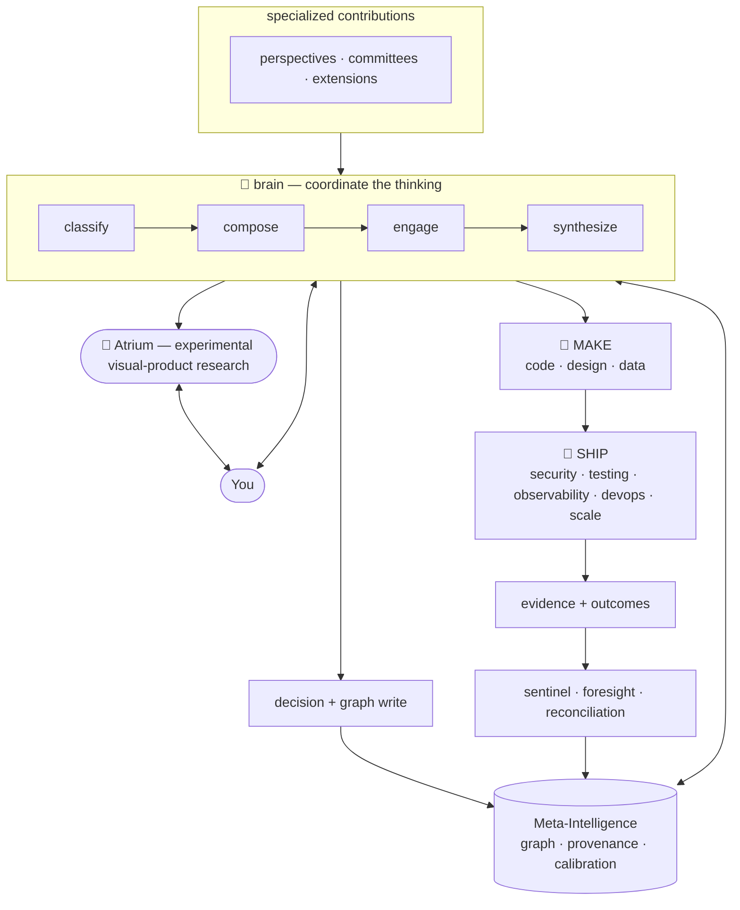

<div align="center">

# ACE — Augmented Cognition Engine

***Bring the problem. ACE assembles the thinking.***

**An open-source, self-hosted reasoning core — a partner team for thinking.**
ACE composes a problem-fit set of perspectives, routes them through the model
provider you configure, and synthesizes a recommendation. Accepted decisions
and corrections can persist, giving later work the context of what came before.

> **Developer preview — 0.1.1.** The supported self-hosted interaction path is
> the `ace` CLI and exactly 11 thin MCP tools.

[Get started](#start-here-get-a-product-recommendation) · [What works today](https://github.com/augmented-cognition-engine/core/blob/main/docs/capability-maturity.md) · [Documentation](https://github.com/augmented-cognition-engine/core/blob/main/docs/README.md) · [Architecture](https://github.com/augmented-cognition-engine/core/blob/main/docs/architecture.md) · [Public roadmap](https://github.com/orgs/augmented-cognition-engine/projects/1) · [License](#license)

**Human ↔ ACE ↔ LLM** · **Nine-layer cognitive loop** · **Dynamic composition** · **Living Product Graph** · **MAKE + SHIP**

**For teams** — durable reasoning context for important decisions &nbsp;·&nbsp; **For builders** — an extensible, provider-neutral core, BYOK

*Created and initially stewarded by Edwin Amirian. QueryLabs is the founding sponsor and operator
of the official hosted and commercial offerings.*

</div>

---

## Start here: get a product recommendation

Bring one real product decision. Guided setup asks how ACE should access a model, starts the
self-hosted runtime, and returns a reasoned recommendation—not merely a health check.

You need macOS or Linux, Git, Python 3.12, [`uv`](https://docs.astral.sh/uv/), Docker Engine with
Compose v2, and access to one [supported model provider](https://github.com/augmented-cognition-engine/core/blob/main/docs/providers.md).

```bash
git clone https://github.com/augmented-cognition-engine/core ace
cd ace
uv sync
uv run ace setup
```

Setup explains each provider choice, creates private local configuration, starts SurrealDB and
ACE, signs in the CLI, and offers to reason through your first decision. If anything is not ready,
run `uv run ace doctor` and follow its exact recovery command. The flow is safe to rerun.

That is the product-builder path. Continue below only when you want the product model,
architecture, provider details, MCP connection, extension SDK, or manual service controls.

---

## The shift

Most AI makes *you* the operator: you write the prompt, you steer it, you catch
what it forgot. ACE inverts that — it owns the loop, convenes the right
perspectives, and covers the parts a happy path always misses.

| Operating a chatbot | Partnering with ACE |
|---|---|
| You continually restate and steer the task | You bring the problem; ACE composes the reasoning shape |
| One response path | Multiple perspectives can be composed and synthesized |
| Context resets unless you provide it again | Accepted decisions and corrections can persist in a graph |
| Risk-checking depends on the prompt | Skeptic and security perspectives can be composed when the task calls for them |

---

## The architecture is the feature

ACE is not a prompt wrapper with a memory plugin. It owns a layered cognitive
loop around the model: it decides what kind of reasoning is needed, assembles
the team and method, keeps the provenance of what informed the result, and can
connect later evidence back to the decision.



| Major feature | What makes it different |
|---|---|
| **The nested loop — `Human ↔ ACE ↔ LLM`** | ACE owns routing, memory, composition, sequencing, and graph writes. The configured model supplies inference inside the loop; it does not become the system of record or the orchestrator. |
| **A nine-layer cognitive pipeline** | Meta-Intelligence → classification → orchestration and agent composition → engagement → disciplines × frameworks → synthesis → decision and graph write → sentinel → foresight, with evidence returning to the standing substrate. |
| **Dynamic composition** | ACE does not send every problem to one fixed agent. It selects *who* should reason, *how* they should reason, the frameworks and depth to use, and an independent, team, pipeline, adversarial, or fan-out orchestration shape. |
| **Deep, inspectable deliberation** | Multiple perspectives can contribute, disagree, critique, and converge. Receipts, traces, provenance, and retained decisions make the result inspectable beyond the final prose. |
| **Meta-Intelligence + the Living Product Graph** | Observations, insights, decisions, capabilities, work, predictions, and outcomes live as durable nodes connected by typed semantic edges—not as one flattened chat history. Grounding edges can identify which beliefs depend on a changed object. |
| **Continuous learning with epistemic guardrails** | Corrections and accepted decisions can persist; outcomes can be detected; forecasts can be reconciled; calibration can return to later orchestration. Provenance and trust priors deliberately discount ACE's own generated material, and no automatic improvement is assumed. |
| **MAKE and SHIP arms** | MAKE turns approved reasoning into code, design, data, and scaffolds. SHIP challenges security, testing, observability, DevOps, and scale before work leaves. They are implemented first-class arms; their public end-to-end paths are still experimental in 0.1.x. |
| **Extensions without a fork** | Builders can add personas, committees, frameworks, recipes, instruments, tools, and schema through a public extension boundary while keeping the core provider-neutral and BYOK. |

The [architecture deep dive](https://github.com/augmented-cognition-engine/core/blob/main/docs/architecture.md) maps the as-built boundaries,
all nine layers, graph semantics, MAKE/SHIP loop, learning system, and extension seams.

---

## Inspired by the octopus

ACE takes architectural inspiration from the octopus: a lean coordinating
brain working with specialized arms and a living network of memory. The core
classifies the problem, composes the reasoning team, and coordinates its work;
the graph carries nodes, semantic edges, provenance, predictions, outcomes,
and the context that can inform what happens next.

The analogy describes the design, not a literal ratio of code or intelligence.
It also describes more than the 0.1.x compatibility surface: MAKE, SHIP,
sentinel, foresight, calibration, and learning are first-class parts of the
implemented architecture even where their public APIs and end-to-end paths are
still experimental.



- **The brain** (`core/engine/`) decides *who should think about this* and convenes them — `classify → compose → engage`. Selection combines explicit policy, configuration, and learned signals.
- **Meta-Intelligence** is the standing substrate: retained observations, insights, decisions,
  capabilities, reasoning traces, predictions, outcomes, provenance, and semantic relationships.
- **Specialized contributions** supply perspectives, committees, and extensions around the shared
  reasoning core.
- **MAKE and SHIP are first-class architectural arms.** MAKE turns approved reasoning into code,
  design, data, and scaffold artifacts. SHIP challenges production readiness across security,
  testing, observability, DevOps, and scale; its current gate assesses and proposes rather than
  mutating. Their implementations ship in the repository, while their APIs and end-to-end
  execution paths are not yet compatibility-stable 0.1.x contracts.
- **Continuous learning closes the loop.** Captured evidence and outcomes can update graph context,
  effectiveness signals, predictions, and calibration so later composition and reasoning can start
  better informed. The architecture is explicit about provenance and discounts self-generated
  material; it does not promise that every run learns or improves automatically.
- **The experimental visual-product/research track** — Atrium prototypes Canvas interactions.
  Think Tank is its deep-deliberation research mode. Atrium releases with 0.1.1 as a public
  repository beta, not as a supported Python artifact.
- **Extensions grow new arms** — teach ACE your domain without forking the core. The shipped [reference extension](#extensions-are-real-not-hypothetical) exercises that public mechanism.

Full deep-dive with every layer: [`docs/architecture.md`](https://github.com/augmented-cognition-engine/core/blob/main/docs/architecture.md).

---

## Two preview interaction surfaces

Interact with the same reasoning core through MCP or the terminal. Atrium is a separate
experimental visual-product/research track released as a repository beta, not a supported 0.1.1
interaction surface.

### `MCP` — in the AI you already use
ACE's tools inside Claude and any MCP client: retrieve what you've decided,
capture what you learn, ground the model in your own history.

```
ace_load("pricing strategy")        # pull the reasoning you've already done
ace_capture(…)                      # record an observation through the public contract
```

### `CLI` — one line, a whole committee
Drop a question from the terminal; a problem-fit team convenes, deliberates,
and hands back a reasoned recommendation — with the kill criteria it would revisit.

```bash
ace login                                            # one-time: authenticate the CLI
ace run "should we ship the freemium tier this quarter?"
# → committee convenes: PM · Skeptic · Growth — deliberates — recommends
```

### `Atrium` — experimental visual-product research
Atrium is the experimental visual-product/research track where Canvas interactions are prototyped
and studied. Current work explores how committee formation, contributions, stages, disagreement,
and convergence might become visible. Its source and separate Node app are included in the public
repository as a beta, but not in the Python wheel/sdist, golden path, supported-runtime claims, or
launch promise.

---

## Watch it think

Bring a real, half-formed thought to ACE through MCP or CLI. ACE classifies what
kind of thinking it needs, convenes a problem-fit composition, and synthesizes
a position grounded in what it already knows. Atrium research prototypes study how that process
might take visual form; a supported partnership interface is outside 0.1.1.

That loop is the whole product:

```
Human ──partners with── ACE ──partners with── LLM (model-agnostic)
                          │
              ┌───────────┴───────────────────────────┐
              │  ACE owns the loop:                    │
              │    routing       (classifier)          │
              │    orchestration (the committee)       │
              │    memory        (knowledge graph)     │
              │    capture       (decisions)           │
              │    foresight     (world model)         │
              │    sentinel      (continuous watch)    │
              │    calibration   (prediction record)   │
              └────────────────────────────────────────┘
```

The LLM never owns that loop — it's called as the inference resource *inside*
it, at the steps ACE decides need one. That's why the model is swappable and
the reasoning is grounded rather than improvised.

---

## Get your first recommendation

Bring one real product decision. The guided setup gets ACE running, asks what
you are working through, and returns a first reasoned recommendation. Service,
database, authentication, and MCP details stay behind the guided path unless
you need to inspect or operate them.

This is the authoritative developer-preview path. It passed isolated clean-user proxy trials on
both macOS and Linux; the exact evidence and limitations remain public.

The Python distribution is `ace-core`; it preserves the `ace` import package,
the `ace` CLI command, and version `0.1.1`. A package-only installation provides the Python
package and commands for inspection or an existing ACE service:

```bash
python -m pip install ace-core==0.1.1
python -c "import ace; print(ace.__version__)"
ace --help
ace setup --help
```

The self-hosted first-recommendation journey uses the source checkout below because it includes
the pinned Compose stack and release-maintained local service scripts.

Prerequisites:

- macOS or Linux;
- Git;
- Python 3.12;
- [`uv`](https://docs.astral.sh/uv/);
- Docker Engine with Compose v2 (Docker Desktop is sufficient on macOS);
- credentials for one provider from [`docs/providers.md`](https://github.com/augmented-cognition-engine/core/blob/main/docs/providers.md).

```bash
git clone https://github.com/augmented-cognition-engine/core ace
cd ace
uv sync
uv run ace setup
```

`ace setup` is the recommended first-run path. It asks which model route to
use (Anthropic, OpenAI, Codex, a Claude setup token or CLI, or Ollama), handles
the local mechanics, and then offers to work through your first product
decision. The generated recommendation—not a health check—is the activation
outcome.

Behind the guided flow, setup:

- generates the local JWT and API credentials;
- verifies Codex sign-in or the selected Ollama model before starting services;
- writes `.env` with mode `0600` without replacing existing secrets;
- starts SurrealDB through Docker Compose and applies every migration;
- starts the ACE API as a local background process;
- logs the CLI and thin MCP client in automatically.

The command is safe to rerun. Use `uv run ace setup --no-start` to prepare the
configuration only, `--skip-first-task` to stop after readiness, or provide the
first decision non-interactively:

```bash
OLLAMA_HOST=http://localhost:11434 uv run ace setup \
  --provider ollama \
  --first-task "Which customer segment should we validate first?" \
  --non-interactive
```

Setup records privacy-local onboarding evidence in `~/.ace/onboarding.jsonl`:
time to readiness, time to first result, guided interventions, failure stage,
and first-result success. It never records credentials or task text and sends
nothing remotely. Clean-user trials can add `--onboarding-trial` to capture
self-reported maintainer-help and architecture-knowledge requirements.
Summarize the local evidence without opening the JSONL directly:

```bash
uv run ace onboarding report
uv run ace onboarding report --json-output
```

If setup is interrupted, rerun the same command. Existing credentials and
completed work are reused. Failure messages distinguish Docker startup,
schema migration, API startup, authentication, and first-result failures and
point to the corresponding retry or diagnostic command.

Verify the complete preview path:

```bash
uv run ace doctor
uv run ace doctor --live-provider  # one explicitly requested minimal model call
uv run ace model-policy
```

Inspect the current product landscape without triggering reasoning or writes:

```bash
uv run ace landscape
```

The versioned snapshot shows product intent, capabilities, decisions, corrections, evidence,
accepted/provisional/contested/rejected relationships, history, work, and outcomes. It is scoped to
the authenticated product, deterministically ordered, explicitly degraded when data is incomplete,
and documented in the [Living Product Graph read contract](https://github.com/augmented-cognition-engine/core/blob/main/docs/living-product-graph.md).

The default install uses the CPU-friendly ONNX embedding path. The optional
1.3B-parameter CodeSage backend is intentionally not part of the release image;
install it with `uv sync --extra codesage` only when you explicitly select
`EMBEDDING_PROVIDER=codesage` and accept its substantially larger model/runtime.

After a restart, manage the local background runtime with:

```bash
uv run ace service start
uv run ace service status
uv run ace service logs --lines 80
uv run ace service stop   # preserves the SurrealDB volume
```

The independent validation procedure is documented in the
[clean-user onboarding trial](https://github.com/augmented-cognition-engine/core/blob/main/docs/onboarding-trials.md). Passing automated
tests or a maintainer rehearsal does not pass the onboarding roadmap gate.

For development, CI, or manual control, the equivalent expanded setup remains:

```bash
cp .env.example .env                       # configure secrets and one provider
docker compose -f infra/docker-compose.yml up -d surrealdb
uv run python scripts/schema_apply.py
uv run uvicorn core.engine.api.main:app --host 127.0.0.1 --port 3000
uv run ace login --api-key '<the API_KEY from .env>'
```

Reproduce the public product-builder golden path. A retail product team chooses between targeted
exit recovery and a universal navigation improvement using checksum-backed, CC BY 4.0 evidence.
ACE records the decision, accepts a privacy correction, survives a runtime restart, and must change
the later experiment because of that correction—not merely retrieve or quote it:

```bash
uv run python scripts/verify_product_builder_golden_path.py initial
uv run ace service stop
uv run ace service start
uv run python scripts/verify_product_builder_golden_path.py later --runtime-restarted
```

The [outcome-first walkthrough](https://github.com/augmented-cognition-engine/core/blob/main/docs/product-builder-golden-path.md)
contains the frozen public input, source/license manifest, clean-replay protocol, structural
assertions, provider metadata, failure recovery, timing expectations, and limitations. It does not
require one exact model answer and adds no new public surface.

For a shorter local capture-and-load smoke without the R4 restart and material-decision assertions:

```bash
uv run python scripts/verify_golden_path.py
```

The stricter M2 reasoning demonstration is intentionally two-phase so an API
restart occurs between human preference capture and later use:

```bash
uv run python scripts/verify_signature_scenario.py initial \
  --preference "Prefer the inspectable thin MCP/CLI proof; defer surface breadth."
# Stop and restart the API, then from a fresh terminal/process:
uv run python scripts/verify_signature_scenario.py later
```

It writes inspectable evidence under `evaluations/results/` and fails unless the
later decision materially applies the captured constraint identifier. The verified
Claude CLI subscription run returned the later three-stage decision in 352.6 seconds;
route latency remains observable evidence, not a promise for every task or provider.

To connect an MCP client, register the command `uv run ace-mcp-client` with its
working directory set to the clone. The thin server exposes exactly `ace_start`,
`ace_load`, `ace_capture`, `ace_task`, `ace_status`, `ace_capture_idea`,
`ace_search`, `ace_briefing`, `ace_impact`, `ace_history`, and `ace_related`.
It reuses the token written by `ace login`. Call `ace_start`, then
`ace_load("strategy")` before domain work.

`ace_task` uses a durable asynchronous receipt contract. It returns within a bounded submission
window with either a completed result or a `pending`/`running` task ID; long reasoning continues
after the MCP call or HTTP connection ends. Retrieve it with `ace_status(filter="task:…")` (or
`ace_status(task_id="task:…")`). `completed`, `failed`, and `degraded` are distinct terminal states;
a polling timeout is not a task failure. Automatic identical retries reuse active work and
same-hour submissions; pass the same optional `request_id` for an explicit retry, or a new one for
an intentional rerun. An API restart does not claim cancellation or transparent recovery:
unfinished in-process receipts become durably `degraded` and completed output remains retrievable.
The CLI and verification scripts poll the same receipt rather than holding a multi-minute HTTP
request open. The public `model="budget"` semantic used by `ace quick` resolves to the configured
`LLM_BUDGET_MODEL` before provider execution; the terminal receipt records the selected provider
and resolved model even when a nested provider does not populate aggregate route counters.

When finished, stop the managed local runtime and return to the directory that
contains the clone:

```bash
uv run ace service stop
cd ..
```

Atrium is an experimental visual-product/research track released as a repository beta and is
separately gated. Its setup is not part of the 0.1.1 golden path or supported runtime.

---

## Build with it

Out of the box ACE reasons about anything, using its default committee. To make
it think in your domain's terms, you write an **extension** — a package that
teaches the kernel new personas, frameworks, recipes, instruments, tools, and
schema, without forking it and without editing a central registry.

```bash
python -m scripts.scaffold_extension <your_domain>
```

This copies the extension ACE already ships and runs (`extensions/reference/`)
and renames every identifier for you — your starting point is never a stub,
it's a fully wired, fully working extension for your domain, with your domain's
committee already assembling correctly. **The committee is baked in. You bring
the domain, not the plumbing.**

This surface — the `Extension` protocol, the `Registry` facade, the scaffold,
the entry-point contract — is **the ACE SDK**.

Full walkthrough, file by file: [build your first
extension](https://github.com/augmented-cognition-engine/core/blob/main/docs/build-your-first-extension.md). Exact contract for every
`Registry` call: [extension API stability](https://github.com/augmented-cognition-engine/core/blob/main/docs/extension-api.md). What
"extension" means and who's built one: [`extensions/README.md`](https://github.com/augmented-cognition-engine/core/blob/main/extensions/README.md).

The boundary is enforced, not just described: the kernel runs naked with
`ACE_DISABLE_EXTENSIONS=1`, and `tests/test_kernel_boundary.py` guards against
core ever importing an extension. Extensions import `core`; `core` never
imports extensions.

---

## Extensions are real, not hypothetical

ACE ships with a complete, working extension — [`extensions/reference/`](https://github.com/augmented-cognition-engine/core/tree/main/extensions/reference)
(the `product` extension). It isn't a toy stub: it registers recipes, a
committee, and instruments through the same `ace.extensions` entry point your
extension will use. Copy it, rename it, and you have a working domain extension.
The worked example *is* the proof the pattern holds.

An extension is not a theme on top of a chatbot. It's a marketing department, a
trading desk, a code reviewer — anything a problem-fit committee can reason
about, wearing your domain's terms instead of ACE's defaults. Domain-specific
extensions live in their own repos, outside this tree, owned by whoever builds
them.

The `0.1.x` preview treats designated **Stable** extension seams as compatibility
aims. Changes require proposal and migration evidence, while experimental and
internal seams may still change on preview minor releases. See the [stability
contract](https://github.com/augmented-cognition-engine/core/blob/main/docs/extension-api.md).

---

## Bring your model

ACE is provider-agnostic by contract, not by claim. `get_llm()` resolves an
eleven-slot chain and returns the first match; engine code never imports a concrete
provider. Every provider — including ones you write — passes the same
behavioral conformance suite ([`tests/llm/conformance.py`](https://github.com/augmented-cognition-engine/core/blob/main/tests/llm/conformance.py)).

ACE's access goal is broader than API keys: use a sanctioned subscription-backed
shell or agent when you already pay for one, use an API key for speed and
automation, or run locally for sovereignty. Consumer subscriptions are not
generic API credentials—ChatGPT-plan access belongs behind a Codex adapter,
while general OpenAI API usage is billed separately.

**A ChatGPT subscription through Codex** (no OpenAI Platform API key):

```bash
codex login
codex login status
export SUBSCRIPTION_PROVIDER=codex
export CODEX_CLI_MODEL=gpt-5.6-terra
export CODEX_CLI_EFFORT=default
export REQUIRE_SUBSCRIPTION=1
```

Set `SUBSCRIPTION_PROVIDER=auto` (the default) or `claude` to use ACE's existing
Claude-first subscription route instead. ACE invokes `codex exec` as a stateless,
read-only completion transport and leaves credential storage and refresh to Codex.
ACE maps its four semantic levels onto each provider's actual catalog:
Haiku→Luna, Sonnet→Terra, and both Opus/Fable→Sol for GPT; Claude retains
the distinct Haiku→Sonnet→Opus→Fable progression. Effort is a separate,
adaptive dimension on both routes: Fast and Capable leave effort at the provider
default; Reasoning uses high and Frontier uses xhigh. Max remains an explicit
override. Claude Haiku receives no effort flag because that model does not support it.

**Any OpenAI-compatible backend** (Groq, Together, OpenRouter, vLLM, LM Studio,
Azure, OpenAI itself — zero extra dependencies):

```bash
export OPENAI_COMPAT_BASE_URL=https://api.groq.com/openai/v1
export OPENAI_COMPAT_API_KEY=gsk_...                # optional for keyless local servers
export OPENAI_COMPAT_MODEL=llama-3.3-70b-versatile  # default: gpt-5.6-terra
```

**A local model via Ollama** (free, no key):

```bash
export OLLAMA_HOST=http://localhost:11434
export OLLAMA_MODEL=llama3.2
```

**A Claude subscription or metered Anthropic key**:

```bash
export LLM_API_KEY=<your-anthropic-api-key>   # metered, pay-per-token
# — or a subscription token, no per-call dollars —
export CLAUDE_CODE_OAUTH_TOKEN=<token from `claude setup-token`>
export LLM_API_KEY=sk-test-placeholder   # optional placeholder; falls through to the subscription
```

Full matrix, billing semantics, and the safeguards that stop a stray exported
key from silently billing a metered API: [`docs/providers.md`](https://github.com/augmented-cognition-engine/core/blob/main/docs/providers.md).
By default `ace doctor` does not spend model tokens: it reports a configured route
as unverified (or a locally confirmed CLI session as authenticated). Add
`--live-provider` only when you want one minimal request to verify model
reachability. The durable R3 evidence and current live-route limitation are in
[`docs/r3-provider-validation.md`](https://github.com/augmented-cognition-engine/core/blob/main/docs/r3-provider-validation.md).

---

## Running with Docker

The repo ships a `Dockerfile` and an `infra/docker-compose.yml` that brings up
SurrealDB and the API together:

```bash
docker compose -f infra/docker-compose.yml up --build
```

The API is exposed on `:3000`, SurrealDB on `:8001`. Set your `LLM_API_KEY` (and
any provider env from above) in `.env` before bringing the stack up.

---

## The test gates

```bash
make test-fast          # the fast suite (pytest -m "not e2e")
make test-naked-kernel  # the kernel runs with NO extensions loaded + boundary guard
make lint               # ruff check + format --check
```

`make test-naked-kernel` is the boundary in CI form: it runs the suite with
`ACE_DISABLE_EXTENSIONS=1` and asserts core never reaches into an extension.

---

## Repo layout

```
ace/
├── core/
│   ├── engine/      ← Python reasoning OS (orchestration, memory, foresight…)
│   ├── schema/      ← SurrealDB knowledge-graph schemas
│   └── ui/
│       └── canvas/  ← Atrium, the experimental React research Canvas
├── ace_mcp_client/  ← thin pure-HTTP MCP client
├── extensions/
│   ├── reference/   ← canonical worked example — copy this to start your own
│   └── README.md    ← the contract every extension follows
├── docs/            ← architecture, providers, maturity, and extension guides
├── infra/           ← docker-compose for SurrealDB + API
├── scripts/         ← schema apply, health check, scaffold_extension
└── tests/           ← backend + provider-conformance test suite
```

---

## License

Apache-2.0 — see [`LICENSE`](https://github.com/augmented-cognition-engine/core/blob/main/LICENSE) for the full text and [`NOTICE`](https://github.com/augmented-cognition-engine/core/blob/main/NOTICE). Existing ACE code is
copyright Edwin Amirian; contributors retain copyright in their contributions and license them
under Apache-2.0. QueryLabs LLC is the founding sponsor. Atrium source in this repository is
Apache-2.0 repository beta source, not part of the supported Python 0.1.1 artifact. Separately
distributed extensions state their own license. The default stack runs SurrealDB 3.1.4 separately;
the SurrealDB server is source-available under BSL 1.1 rather than OSI open source.

<div align="center">

---

**Bring a thought. Meet the team.** &nbsp;·&nbsp; [Quickstart](#start-here-get-a-product-recommendation) · [Build an extension](https://github.com/augmented-cognition-engine/core/blob/main/docs/build-your-first-extension.md)

</div>
