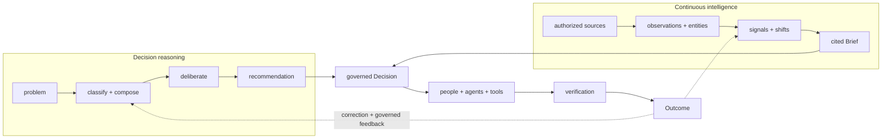
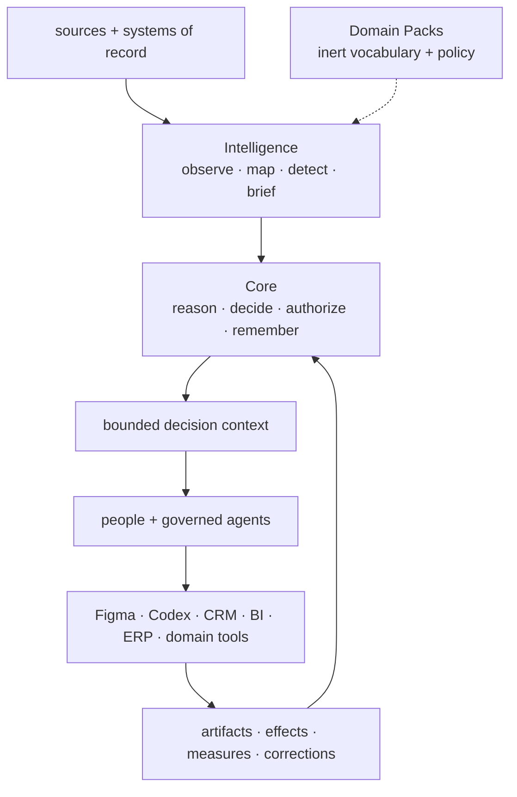

<div align="center">

# ACE — Augmented Cognition Engine

**ACE is the open Intelligence OS. Build intelligence, not infrastructure.**

ACE is a self-hosted **Intelligence Operating System**: the governed brain between systems of
record and systems of action. Connect the sources that matter and ACE turns changing evidence
into cited Briefs, living monitors, decisions, coordinated work, and outcome-aware intelligence.
ACE is provider-neutral; provenance, authority, durable state, and exact receipts stay built into
the result instead of becoming infrastructure every product team must recreate.

> **Generation is abundant. Continuity of judgment is not.**


[Get started](#quickstart) · [Vision](https://github.com/augmented-cognition-engine/core/blob/main/VISION.md) · [Manifesto](https://github.com/augmented-cognition-engine/core/blob/main/MANIFESTO.md) · [What works today](https://github.com/augmented-cognition-engine/core/blob/main/docs/capability-maturity.md) · [Architecture](https://github.com/augmented-cognition-engine/core/blob/main/docs/architecture.md) · [Roadmap](https://github.com/augmented-cognition-engine/core/blob/main/ROADMAP.md) · [Documentation](https://github.com/augmented-cognition-engine/core/blob/main/docs/README.md)

</div>

---


*ACE 1.1 Code Intelligence in Atrium: ask what changed, inspect the supported answer and its
governed evidence, and see why it matters.*

## What ACE does

Most AI products answer the prompt in front of them. The human still has to reconstruct the past,
decide which expertise is missing, coordinate people and agents, notice contradictions, and
remember what happened afterward.

ACE owns that loop:

```text
understand → reason → decide → coordinate → act with authority → verify → learn
```

Its first complete experience is the Intelligence Builder:

```text
Choose Intelligence → Connect → Map → Watch → cited Brief → Activate → Learn
```

1. **Choose Intelligence.** Start with the decision context you want to improve.
2. **Connect.** Bind only the sources and permissions you approve.
3. **Map.** Review an editable, cited concept model of entities, relationships, and exclusions.
4. **Watch.** Define what matters, what counts as change, and who should know.
5. **Brief.** Receive source-grounded intelligence with uncertainty, disagreement, and relevance.
6. **Activate.** Approve the exact plan and effects; ACE keeps watching under that authority.
7. **Learn.** Return decisions and outcomes as governed proposals without rewriting history.

Builders do not need to hand-author Domain Pack JSON or learn compiler mechanics before receiving
first intelligence value. Generated material passes the same fail-closed compatibility,
conformance, authority, and activation boundaries as expert-built material.

The current published stable package and public-index install is `ace-core==1.1.0`, the bounded
**ACE 1.1 Code Intelligence** release.

### Two connected loops


```mermaid
flowchart LR
    subgraph R["Decision reasoning"]
        P["problem"] --> C["classify + compose"] --> D["deliberate"] --> REC["recommendation"]
    end
    subgraph I["Continuous intelligence"]
        S["authorized sources"] --> O["observations + entities"] --> CH["signals + shifts"] --> B["cited Brief"]
    end
    REC --> DEC["governed Decision"]
    B --> DEC
    DEC --> W["people + agents + tools"] --> V["verification"] --> OUT["Outcome"]
    OUT -. "correction + governed feedback" .-> C
    OUT -.-> CH
```

**Decision reasoning** begins when a person or product brings a problem. ACE selects and
coordinates a problem-fit approach, records what shaped the result, and preserves the Decision for
inspection and correction.

**Continuous intelligence** begins with authorized sources. ACE admits observations, updates
entity state, detects material change, routes attention, and assembles a cited Brief. Either loop
can invoke the other through the same governed Decision and Outcome model.

### What you can build

- **Domain intelligence applications** for markets, world events, code, products, research,
  operations, or any other bounded decision context.
- **Decision systems** whose evidence, reasoning, authority, and outcomes must survive beyond one
  model response.
- **Governed AI backends** that need provider-neutral inference, scoped action, append-only state,
  replay, human disposition, and attributable feedback.

ACE supplies both the Intelligence Builder experience and the governed runtime beneath it.
Specialized products remain the hands. ACE keeps them working from the same evidence and Decision.

[Explore the Intelligence OS and Builder →](https://github.com/augmented-cognition-engine/core/blob/main/docs/intelligence-os.md)

## Trustworthy intelligence is the feature

ACE wraps a **lean coordinating** Core around specialized reasoning and Intelligence capabilities;
the octopus is useful inspiration for that shape, **not a literal ratio** of code or intelligence.
The cognitive runtime remains visible inside the product: **Human ↔ ACE ↔ LLM**,
**A nine-layer cognitive pipeline**, and **Dynamic composition** describe how ACE assembles and
governs reasoning. Core + Intelligence + Domain Packs make that machinery reusable without moving
domain nouns, executable behavior, or authority into the kernel.


```mermaid
flowchart TB
    SRC["sources + systems of record"] --> INT["Intelligence<br/>observe · map · detect · brief"]
    INT --> CORE["Core<br/>reason · decide · authorize · remember"]
    PACK["Domain Packs<br/>inert vocabulary + policy"] -.-> INT
    CORE --> TOPIC["bounded decision context"]
    TOPIC --> PART["people + governed agents"]
    PART --> TOOLS["Figma · Codex · CRM · BI · ERP · domain tools"]
    TOOLS --> OUT["artifacts · effects · measures · corrections"]
    OUT --> CORE
```

- **Core owns cognition and control:** identity, immutable and temporal state, reasoning,
  authority, Decisions, Outcomes, and receipts.
- **Intelligence owns sensing and orientation:** Observation, Entity, Shift, Signal, Case, Brief,
  monitoring, routing, synthesis, and pack conformance.
- **Domain Packs own vocabulary and policy:** independently versioned, inert declarative data.
- **Adapters own bounded I/O:** exact source or destination access under separate authority.
- **Atrium is the human control plane:** it reads and acts through the same ACE API, never a second
  state or authority system.

ACE provides graph-grounded, calibrated foresight. It projects conditional consequences of
decisions, exposes the mechanisms and uncertainty behind them, observes what actually happens,
and uses resolved forecasts to improve later reasoning.

[Read the architecture →](https://github.com/augmented-cognition-engine/core/blob/main/docs/architecture.md) · [Inspect trust boundaries →](https://github.com/augmented-cognition-engine/core/blob/main/docs/trust-and-security.md)

## One stack, many intelligence systems

ACE is infrastructure for building intelligent systems around consequential work—not a collection
of content-generation point solutions.

| Intelligence system | What ACE keeps coherent | What stays downstream |
|---|---|---|
| **World and Market Intelligence** | Sources, actors, entities, claims, shifts, uncertainty, Briefs, Decisions, and Outcomes | Data providers, research sources, publishing, analysis, and execution tools |
| **Code Intelligence — passed in 1.1** | Intent, architecture, symbols, affected tests, concurrent work, handoffs, release evidence, incidents, and outcomes | IDEs, Git, coding agents, CI, and deployment systems |
| **Personal Intelligence — 1.2** | Notes, files, projects, decisions, and evolving interests | Read-only local Markdown/Obsidian, PDF, CSV, and JSON to start; one remote knowledge source only after the local journey passes |
| **Product, Design, and Organizational Intelligence — 1.5** | Needs, research, rationale, ownership, systems, policy, dependencies, experiments, and outcomes | Figma, product tools, CRM, BI, ERP, and each team's systems of record |

Solution Bundles combine exact Packs, adapters, monitors, applications, outcome mappings, and
conformance fixtures. They specialize ACE without forking its durable intelligence, reasoning, or
authority model.

## Code Intelligence: ACE’s first recursive proof

Code Intelligence has **passed in the public ACE 1.1.0 release**. The tagged release, trusted PyPI
publication, clean public-index installation, release evidence, and four public records agree.
Software makes the complete ACE loop measurable: Decisions connect to repositories, symbols,
dependencies, tests, reviews, releases, incidents, and later Outcomes.

ACE separates three improvement loops:

1. **Complete the current change.** Detect missed consumers, tests, migrations, documentation,
   acceptance evidence, or stale concurrent work; perform a bounded linked repair; reverify.
2. **Improve the codebase.** Present reusable architecture opportunities separately with semantic
   evidence, ownership, alternatives, blast radius, migration, verification, and rollback.
3. **Improve future work.** Use repeated verified experience to propose better agent definitions,
   procedures, context policy, routing, frameworks, Pack policy, or verification; evaluate and
   activate the exact revision under explicit authority.

**ACE Builds ACE** applies these loops to ACE's own roadmap and repository under matched
coding-agent controls. ACE may inspect, diagnose, coordinate, propose, and verify its own work.
Repository access never grants approval, merge, release, deployment, policy, promotion, or expanded
authority.

[Read the governed Code Intelligence contract →](https://github.com/augmented-cognition-engine/core/blob/main/docs/design/governed-code-improvement-loop-v1.md)

## Useful for one. Compounding for many.

ACE 1.1.0 is stable for the documented single-user, single-node topology. The same semantic kernel
is designed to grow from a private workspace into shared and federated intelligence:

```text
one owner
  + invited participants
  + shared Topics and explicit roles
  + organization policy and relationships
  + bounded federation
= the same durable intelligence, with more coordination and boundaries
```

Governance scales with consequence, not merely seat count. A high-impact action may require review
for one person; a low-risk investigation can remain lightweight inside a large organization.
Adding the second person or the ten-thousandth must not invalidate existing identity, provenance,
Decisions, memory, ownership, or receipts.

[Read the product vision →](https://github.com/augmented-cognition-engine/core/blob/main/VISION.md) · [Read the scale-invariant architecture →](https://github.com/augmented-cognition-engine/core/blob/main/docs/design/scale-invariant-product-architecture-v1.md)

## Quickstart

Install the stable package:

```bash
python -m pip install ace-core==1.1.0
python -c "import ace; print(ace.__version__)"
ace --help
```

The public-index package, GitHub Release, and this source tree now identify `ace-core==1.1.0`.

Or run the complete self-hosted Intelligence OS. You need macOS or Linux, Git, Python 3.12, `uv`,
Docker Engine with Compose v2, and credentials for one supported provider.

```bash
git clone https://github.com/augmented-cognition-engine/core ace
cd ace
uv sync
uv run ace setup
```

Then verify and open Atrium:

```bash
uv run ace doctor
uv run ace atrium
```

[Follow the complete installation guide →](https://github.com/augmented-cognition-engine/core/blob/main/docs/getting-started.md)

## What is real today

**ACE 1.1 is stable for the documented single-user, single-node topology; 1.1.0 is the recommended
release.**

| Status | Product boundary |
|---|---|
| **Stable 1.1.0** | The bounded 1.0 personal Intelligence OS plus Code Intelligence: repository-to-reasoning graph, change impact, Code lens, untrusted-repository admission, bounded coding-agent handoffs, governed improvement loops, SurrealDB 3.2/v179 recovery, and product-scoped delegated cognition review |
| **Later 1.x** | Personal Intelligence, safe upgrades, Topic and Pack Kit, connected organizational intelligence, governed self-improving agents, portability, and interoperability |
| **2.0 direction** | Permission-sensitive collaborative organizational intelligence across teams and external participants |

The stable 1.0 claim is deliberately bounded. ACE does not claim distributed operation, hostile
extension isolation, arbitrary web access, autonomous authority, universal connectors, managed
hosting, or beneficial impact beyond its frozen evaluation evidence.

[See exact capability maturity →](https://github.com/augmented-cognition-engine/core/blob/main/docs/capability-maturity.md) · [Inspect 1.1 public release evidence →](https://github.com/augmented-cognition-engine/core/blob/main/docs/evidence/ace-1.1.0-public-release-v1.md)

## Choose your path

| I want to… | Go here |
|---|---|
| Understand the product promise | [Vision](https://github.com/augmented-cognition-engine/core/blob/main/VISION.md) and [Manifesto](https://github.com/augmented-cognition-engine/core/blob/main/MANIFESTO.md) |
| Install ACE and reach first value | [Getting started](https://github.com/augmented-cognition-engine/core/blob/main/docs/getting-started.md) |
| Understand the Intelligence Builder | [Intelligence OS guide](https://github.com/augmented-cognition-engine/core/blob/main/docs/intelligence-os.md) |
| Use CLI, MCP, or Atrium | [Interfaces](https://github.com/augmented-cognition-engine/core/blob/main/docs/interfaces.md) |
| Configure a model | [Providers](https://github.com/augmented-cognition-engine/core/blob/main/docs/providers.md) |
| Build with the public contracts | [Python API](https://github.com/augmented-cognition-engine/core/blob/main/docs/python-api.md) |
| Build a domain extension | [Extension tutorial](https://github.com/augmented-cognition-engine/core/blob/main/docs/build-your-first-extension.md) |
| Understand safety and ownership | [Trust boundaries](https://github.com/augmented-cognition-engine/core/blob/main/docs/trust-and-security.md) |
| Contribute to ACE | [Development guide](https://github.com/augmented-cognition-engine/core/blob/main/docs/development.md) and [Contributing](https://github.com/augmented-cognition-engine/core/blob/main/CONTRIBUTING.md) |
| See current and future work | [Roadmap](https://github.com/augmented-cognition-engine/core/blob/main/ROADMAP.md) |

The [documentation index](https://github.com/augmented-cognition-engine/core/blob/main/docs/README.md) routes product builders, operators, extension authors, contributors, and reviewers without turning this README back into the entire manual.

## License and stewardship

ACE Core is Apache-2.0. See [LICENSE](https://github.com/augmented-cognition-engine/core/blob/main/LICENSE) and [NOTICE](https://github.com/augmented-cognition-engine/core/blob/main/NOTICE). Separately distributed extensions and Domain Packs declare their own licenses. The default stack runs SurrealDB separately under its own license.

ACE was created and is initially stewarded by Edwin Amirian. QueryLabs is the founding sponsor.

<div align="center">

---

**Bring the domain. ACE keeps the receipts.**

[Get started](https://github.com/augmented-cognition-engine/core/blob/main/docs/getting-started.md) · [Read the vision](https://github.com/augmented-cognition-engine/core/blob/main/VISION.md) · [Explore the architecture](https://github.com/augmented-cognition-engine/core/blob/main/docs/architecture.md)

</div>
