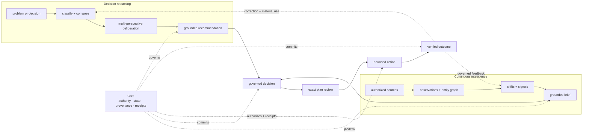
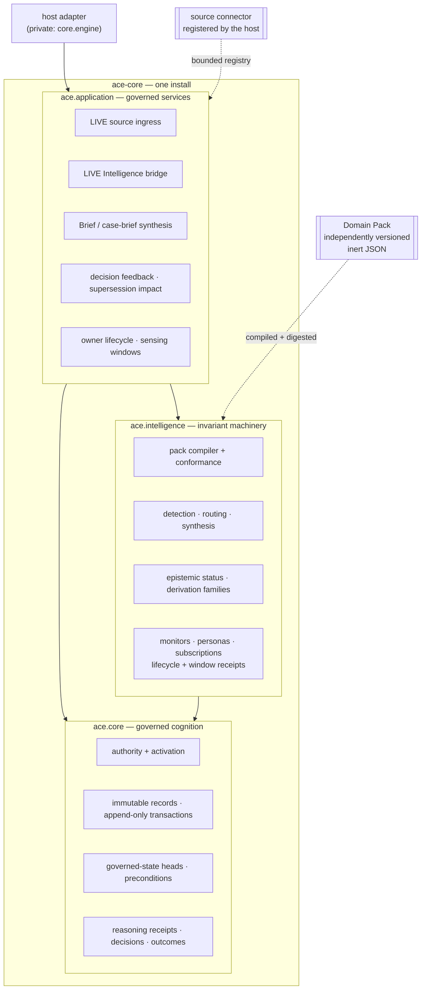

<div align="center">

# ACE — Augmented Cognition Engine

**ACE, the Intelligence Builder. Build intelligence, not infrastructure.**

ACE is an open, self-hosted **Intelligence Operating System** for products that need to stay
oriented as evidence changes. Its first product experience is the Intelligence Builder: connect
the sources that matter and let ACE turn changing evidence into source-grounded briefings, living
monitors, and an intelligence system that improves with governed feedback. ACE is provider-neutral;
provenance, authority, durable state, and exact receipts stay built into the result instead of
becoming infrastructure every product team must recreate.


[Quickstart](#quickstart) ·
[Vision / Manifesto](https://github.com/augmented-cognition-engine/core/blob/main/MANIFESTO.md) ·
[What ACE does](#what-ace-does) ·
[Builder journey](#the-intelligence-builder-journey) ·
[Architecture](#architecture-one-install-two-bounded-contexts) ·
[Domain Packs](#domain-packs-add-a-vertical-without-touching-the-kernel) ·
[Python surface](#the-public-python-surface) ·
[Limitations](#maturity-and-limitations) ·
[Roadmap](https://github.com/augmented-cognition-engine/core/blob/main/ROADMAP.md)

</div>

---

## What ACE does

ACE is an **Intelligence Operating System**, experienced first through the **Intelligence Builder**:
a guided way to turn authorized, changing sources into useful intelligence without asking each
product team to build its own ingestion, ontology, monitoring, briefing, provenance, authority, and
feedback infrastructure. A configured model may supply inference inside the loop; ACE owns the
governed intelligence lifecycle around it.

- **Understand.** Admit evidence with source identity and time, resolve it into a temporal entity
  graph, and preserve the difference between observations, claims, inference, and unknowns.
- **Reason.** Classify a problem, dynamically compose useful perspectives and methods, orchestrate
  deliberation, and synthesize an inspectable recommendation grounded in the admitted context.
- **Decide.** Record the recommendation, human disposition, decision, rationale, and evidence as
  durable, attributable state rather than leaving them in a chat transcript.
- **Act.** Carry an authorized Decision into an effect-free plan, exact human review, bounded
  execution, honest terminal state, verification, repair, and separate promotion through an
  explicitly registered trusted adapter.
- **Observe and improve.** Reconcile decisions and forecasts with later outcomes, preserve
  corrections, and make governed feedback available to later reasoning. ACE does not silently
  rewrite history or grant itself new authority.

### The Intelligence Builder journey

ACE's north-star experience is deliberately simpler than its internal architecture:

```text
Connect → Map → Watch → Brief → Activate
```

1. **Connect.** Choose a few supported sources, see the exact requested permission and scope, and
   approve only the bounded connection you want.
2. **Map.** ACE proposes an editable, cited **concept model** for the entities, relationships,
   terminology, and exclusions it found.
3. **Watch.** ACE proposes what to monitor, what counts as material change, who it matters to, and
   how often to look.
4. **Brief.** A cited first briefing appears with uncertainty, disagreement, and why each item
   matters—even before every optional integration is configured.
5. **Activate.** You review the exact permissions and effects, approve the plan, and receive an
   activation receipt. ACE then keeps watching; feedback improves relevance without silently
   changing authority.

Builders should not hand-author Domain Pack JSON or learn compiler mechanics to reach this moment.
Generated material still passes the same fail-closed schema, compatibility, conformance, authority,
and activation boundaries as an expert-built pack.

**Maturity:** ACE 1.0 is the stable single-user Intelligence OS for the documented local,
single-node topology. It composes the Builder foundation, governed Agent Composition, authorized
Agent Memory, one authorized Intelligence resource plane, and Atrium into a resumable personal
workflow. Independent World and Market products reproduce the same public contracts. The Python
artifact remains usable without Atrium, and the public MCP surface remains exactly eleven tools.

### Two connected loops

ACE supports deliberate reasoning over a problem and continuous intelligence over changing
sources. They converge on the same governed decision and outcome model.


```mermaid
flowchart LR
    subgraph REASON["Decision reasoning"]
        PROBLEM["problem or decision"] --> CLASSIFY["classify + compose"]
        CLASSIFY --> DELIB["multi-perspective deliberation"]
        DELIB --> REC["grounded recommendation"]
    end

    subgraph INTEL["Continuous intelligence"]
        SRC["authorized sources"] --> OBS["observations + entity graph"]
        OBS --> CHANGE["shifts + signals"]
        CHANGE --> BRIEF["grounded brief"]
    end

    REC --> DEC["governed decision"]
    BRIEF --> DEC
    DEC --> REVIEW["exact plan review"]
    REVIEW --> ACTION["bounded action"]
    ACTION --> OUT["verified outcome"]
    OUT -.->|"correction + material use"| CLASSIFY
    OUT -.->|"governed feedback"| CHANGE

    CORE["Core<br/>authority · state · provenance · receipts"] -.->|governs| REC
    CORE -.->|governs| BRIEF
    CORE -.->|commits| DEC
    CORE -.->|authorizes + receipts| ACTION
    CORE -.->|commits| OUT
```

The **decision-reasoning loop** begins when a person or product brings a problem. ACE selects and
coordinates a problem-fit reasoning approach, records how the result was produced, and keeps the
decision available for inspection and correction.

The **continuous-intelligence loop** begins with an authorized source. ACE admits an Observation,
updates entity state, detects a Shift against a baseline, routes a meaningful Signal, and assembles
a cited Brief for a subscriber or decision context.

The same application can use both: an intelligence Brief can trigger deeper deliberation, and the
resulting decision and outcome can change what the intelligence system watches next.

### What you can build

- **Domain intelligence applications** such as World Intelligence for public-issue sensemaking or
  Market Intelligence for competitors, products, narratives, customers, and go-to-market change.
- **Decision systems** for product, strategy, research, operations, and other work where the
  reasoning and its evidence must survive beyond one model response.
- **Governed AI backends** that need provider-neutral inference, scoped authority, append-only
  state, replay, human disposition, and attributable outcome feedback.

ACE supplies both the Intelligence Builder experience and the governed runtime beneath it. Ready-
to-use domain applications ship separately, but their users should encounter first intelligence
value—not the names of ACE's internal layers.

---

## How ACE is structured

Most AI systems treat state as a side effect: a chat log, a vector index, or a cache. ACE treats
governed state as part of the product and makes the reasoning replayable.

- **One install, one repository.** `ace-core` ships **Core** and **Intelligence** together. There is
  no second service to run to get the reasoning and intelligence contracts.
- **Core owns cognition and control.** Authority, temporal and immutable state, reasoning,
  receipts, decisions, and outcomes. Nothing durable is written except through Core.
- **Intelligence owns sensing and orientation.** The Observation → Entity Snapshot → Shift → Signal
  → Brief pipeline, owner-governed monitor/subscription lifecycle, explicitly requested sensing
  windows, routing, and pack conformance are domain-neutral.
- **Domain Packs supply vocabulary and policy.** Ontology, source mappings, shift definitions,
  personas, synthesis templates, and policy ship as independently versioned, **inert declarative
  data** — compiled and content-addressed, never imported or executed.

Adding a vertical means supplying a pack and registered connectors, not modifying the kernel.

### How continuous intelligence runs

Each hop from Observation through Brief is a typed contract, not a convention. Every resource
carries lineage to its exact inputs, including content digests and availability time, so a Brief
can be walked back to the admitted source material that produced it.

The pipeline runs in two clearly separated modes:

| Mode | What it means | What it can touch |
|---|---|---|
| **PREPARED** | Analysis over supplied material. Pure functions over contract values. | No network, no clock authority, no side effects. |
| **LIVE** | Governed effects against an authorized real source. | One exact resolved source definition, through an activation-bound, authority-checked adapter. |

Interpretation functions are mode-typed and refuse to cross: `detect_numeric_shift` accepts only
PREPARED snapshots, `detect_live_numeric_shift` only LIVE ones. **No pure Intelligence function
grants LIVE authority** — the application bridge must independently prove a committed activation
and authorize persistence through Core.

### Trustworthy intelligence is the feature

ACE wraps a **lean coordinating** Core around specialized reasoning and Intelligence capabilities;
the octopus is useful inspiration for that shape, **not a literal ratio** of code or intelligence.
The existing cognitive runtime remains visible inside this architecture: **Human ↔ ACE ↔ LLM**,
**A nine-layer cognitive pipeline**, and **Dynamic composition** describe how ACE assembles and
governs reasoning. Core + Intelligence + Domain Packs describe how the same machinery becomes a
reusable intelligence-building system without putting domain nouns or executable behavior in the
kernel. These boundaries explain why the experience can be trusted; they are not concepts an
end-user must learn before receiving a useful Brief.

ACE provides graph-grounded, calibrated foresight. It projects conditional consequences of
decisions, exposes the mechanisms and uncertainty behind them, observes what actually happens, and
uses resolved forecasts to improve later reasoning.

---

## Architecture: one install, two bounded contexts


```mermaid
flowchart TB
    subgraph PKG["ace-core — one install"]
        direction TB
        subgraph APP["ace.application — governed services"]
            A1["LIVE source ingress"]
            A2["LIVE Intelligence bridge"]
            A3["Brief / case-brief synthesis"]
            A4["decision feedback · supersession impact"]
            A5["owner lifecycle · sensing windows"]
        end
        subgraph INT["ace.intelligence — invariant machinery"]
            I1["pack compiler + conformance"]
            I2["detection · routing · synthesis"]
            I3["epistemic status · derivation families"]
            I4["monitors · personas · subscriptions<br/>lifecycle + window receipts"]
        end
        subgraph CORE["ace.core — governed cognition"]
            C1["authority + activation"]
            C2["immutable records · append-only transactions"]
            C3["governed-state heads · preconditions"]
            C4["reasoning receipts · decisions · outcomes"]
        end
    end

    PACK[["Domain Pack<br/>independently versioned<br/>inert JSON"]] -.->|compiled + digested| INT
    CONN[["source connector<br/>registered by the host"]] -.->|bounded registry| APP
    APP --> INT
    APP --> CORE
    INT --> CORE
    HOST["host adapter<br/>(private: core.engine)"] --> APP
```

The dependency direction is enforced, not just described: `ace.application` depends on `ace.core`
and `ace.intelligence`; `ace.intelligence` depends on `ace.core`; **nothing under `ace/` imports the
host.** Architecture gates in the test suite assert this.

### What each layer owns

| Layer | Owns | Explicitly does not own |
|---|---|---|
| **`ace.core`** | Authority resolution and authority-use receipts; capability-use receipts; immutable records and atomic append-only transactions; governed-state heads with rechecked preconditions; canonical source snapshots and URI/IP validation; governed reasoning requests, bindings, and terminal receipts; decisions and outcomes. | Domain vocabulary. Core never learns what a "competitor" or a "port call" is. |
| **`ace.intelligence`** | The Domain Pack compiler and its fail-closed diagnostics; the Observation → Entity Snapshot → Shift → Signal → Brief resource contracts; numeric-delta and categorical-transition detection; signal routing; brief synthesis and canonical rendering; epistemic status and derivation families; supersession impact; monitors, persona bindings, subscriptions; owner-lifecycle and sensing-window receipts. | Persistence, network access, scheduling, delivery, or a clock. Importing `ace.intelligence` performs no discovery, I/O, compilation, activation, or host composition. |
| **`ace.application`** | Services that compose the two: LIVE source ingress, the LIVE Intelligence bridge, Brief and case-brief synthesis, prepared intelligence ledger, decision feedback, supersession-impact admission, domain-activation admission, owner-governed monitoring lifecycle, and sensing-window admission. | Connector implementations, source transport, scheduling, delivery, publication, or external action — those remain separately authorized host/application responsibilities. |
| **Domain Pack** (separate artifact) | Ontology, source mappings, detection rules, personas and routing rules, synthesis templates, epistemic-status vocabularies, feedback policy, capability requirements, authority requests, overlay slots. | Code. A pack is data all the way down. |

---

## Domain Packs: add a vertical without touching the kernel

A Domain Pack is a manifest plus JSON module resources. The compiler
(`ace.intelligence.packs.compiler.compile_pack_document`) is a **pure, deterministic function**: it
performs no discovery, import, I/O, clock read, model call, secret lookup, registry mutation, or
persistence operation.

JSON is the portable wire and audit format, not a requirement that customers author configuration
by hand. A UI, CLI, template, or guided agent can draft the same inert material from reviewed source
scope and concept proposals. Regardless of authoring surface, the compiler and conformance helper
validate the exact generated bytes before a separate approval can activate them.

What that buys you:

- **Content addressing.** Every resource is digest-checked; every module is canonicalized and
  hashed; the pack gets a `pack_digest`. Semantically identical packs with different key order or
  indentation compile to byte-identical IR. One changed attribute changes the digest.
- **No executable surface.** The compiler rejects any key named `regex`, `template`, `expression`,
  `predicate`, `handler`, `script`, `eval`, `exec`, `jsonpath`, and friends — and rejects mappings
  that try to select or override host-owned envelope fields such as `source_digest`,
  `activation_id`, or `product_id`. A pack cannot smuggle in behavior.
- **Fail-closed diagnostics.** Errors arrive as stable `(severity, code, path, message)` records:
  `unknown_target_entity_type`, `missing_required_outputs`, `module_cycle`, `digest_mismatch`.
- **Independent versioning.** Packs carry their own `pack_id` and semantic `version`, and declare
  the compiler and runtime contracts they target. They ship on their own schedule.
- **Independent verification.** A pack that declares no epistemic-status module for a template
  simply does not get status-aware synthesis — it does not silently get a permissive default.

### A generic pack, end to end

Domain Packs are **JSON** (`media_type` is fixed to `application/json`); the compiler parses with a
strict reader that rejects duplicate object keys, non-finite numbers, and lone surrogates. Nothing
below is vertical-specific — swap `watched_subject` for `vessel`, `competitor`, `service`, or
`counterparty` and the kernel is unchanged.

`modules/ontology.json` — what exists in your world:

```json
{
  "contract": "ace.intelligence.ontology/v1alpha1",
  "module_id": "domain_ontology",
  "entity_types": [
    {
      "entity_type_id": "watched_subject",
      "display_name": "Watched Subject",
      "attributes": [
        { "attribute_id": "name", "value_type": "string", "required": true },
        { "attribute_id": "tracked_value", "value_type": "number" },
        { "attribute_id": "status", "value_type": "string" }
      ]
    }
  ],
  "relation_types": []
}
```

`modules/detection.json` — what counts as a material change:

```json
{
  "contract": "ace.intelligence.detection/v1alpha2",
  "module_id": "domain_detection",
  "numeric_delta_rules": [
    {
      "detector_id": "tracked_value_moved",
      "entity_type_id": "watched_subject",
      "attribute_id": "tracked_value",
      "metric": "percent_change",
      "threshold": 10.0,
      "direction": "any",
      "shift_type": "tracked_value_shift",
      "signal_type": "tracked_value_signal"
    }
  ],
  "categorical_transition_rules": [
    {
      "detector_id": "status_changed",
      "entity_type_id": "watched_subject",
      "attribute_id": "status",
      "transitions": [{ "from_value": "nominal", "to_value": "degraded" }],
      "shift_type": "status_shift",
      "signal_type": "status_signal"
    }
  ]
}
```

`pack.json` — the manifest that binds them, with declared capabilities, authority requests, and
operator-tunable overlay slots:

```json
{
  "contract": "ace.intelligence.domain-pack-manifest/v1alpha1",
  "metadata": {
    "pack_id": "example_domain",
    "version": "0.1.0",
    "display_name": "Example Domain",
    "description": "A domain-neutral illustration of the pack contract."
  },
  "resources": [
    { "resource_id": "ontology",  "path": "modules/ontology.json",  "digest": "sha256:<64 hex>" },
    { "resource_id": "detection", "path": "modules/detection.json", "digest": "sha256:<64 hex>" }
  ],
  "modules": [
    {
      "module_id": "domain_ontology",
      "contract": "ace.intelligence.ontology/v1alpha1",
      "resource_id": "ontology"
    },
    {
      "module_id": "domain_detection",
      "contract": "ace.intelligence.detection/v1alpha2",
      "resource_id": "detection",
      "depends_on": ["domain_ontology"]
    }
  ],
  "capability_requirements": [
    {
      "requirement_id": "public_snapshot",
      "capability": "source_snapshot",
      "contract": "ace.source.snapshot/v1alpha1"
    }
  ],
  "authority_requests": [
    { "request_id": "read_public_source", "authority": "source_read" }
  ],
  "overlay_slots": [
    { "slot_id": "watched_subjects", "value_kind": "string_list", "required": true }
  ]
}
```

Additional module contracts a pack may declare, all compiled by the same function:
`ace.intelligence.source-mapping/v1alpha1` (source field → ontology attribute, with bounded
transforms only), `ace.intelligence.personas/v1alpha1` (personas plus signal-routing rules),
`ace.intelligence.synthesis/v1alpha1` and `/v1alpha2` (brief templates),
`ace.intelligence.epistemic-status/v1alpha1` and `/v1alpha2`, and
`ace.intelligence.decision-outcomes/v1alpha1` (feedback policy).

---

## What 1.0 adds

ACE 1.0 turns the released Intelligence OS foundation into one complete personal product journey:
choose an Intelligence experience, review and bind exact sources, see permission and health state,
approve activation, receive a cited first Brief, and retain an attributable later update with a
semantic diff. Ask ACE, corrections, decisions, optional reviewed handoffs, outcomes, and
proposal-only learning all use the same authorized durable resources.

World and Market remain independently versioned Solution Bundles rather than Core-owned domains.
Their trusted Builders and connectors are separately installed and never gain authority merely by
being present. Market's bounded release path prepares an engine-ready direction package and routes
it through Core's existing handoff contracts; downstream design, content, campaign, ERP, trading,
and other execution engines remain outside ACE.

Model access is bring-your-own: direct OpenAI or Anthropic API keys, signed-in Codex or Claude CLI
subscription routes, OpenAI-compatible endpoints, and local Ollama are supported configuration
choices. A ChatGPT or Claude subscription is not converted into an API key; ACE uses the provider's
authenticated CLI route when that subscription-backed option is selected.

### What 0.8.3 added

0.8.3 is a compatibility patch for independently packaged Intelligence products. It adds the
public conformance seam needed to resolve exact installed Domain Packs and preserves source
publication time separately from observation and ingestion time. Market and other external
consumers can therefore test the exact installed pack and retain truthful bitemporal provenance
without importing the private host runtime.

The patch also carries the subsequent single-user Builder hardening already merged on the 0.8
line. It preserves schema head v177, exactly eleven public MCP tools, the inert Domain Pack
boundary, and the separately versioned adapter model.

### What 0.8.2 added

0.8.2 makes first use start with the outcome a person wants rather than ACE's internal
architecture. Atrium discovers every admitted onboarding profile from the governed Intelligence
resource plane, presents each domain as a selectable Intelligence experience, and always offers a
Core-owned Custom Intelligence path. Domain labels, starter questions, and source groups remain
declarative pack metadata; selection grants no source, monitoring, or activation authority.

World and Market supply their own profiles from independent repositories. Core remains
domain-neutral and names neither vertical. This is backward-compatible product-experience
hardening of the 0.8 Intelligence OS promise and the entry foundation for—not completion of—the 0.9
Single-user Intelligence Builder gate.

### What 0.8.1 added

0.8.1 turns the Intelligence OS foundation into a clearer first-run product experience without
changing the 0.8 public architecture or widening authority.

- **Live onboarding state.** Atrium projects the exact append-only Intelligence Builder session
  and shows proposal, working, blocked, retrying, and complete states from durable records.
- **A decision-oriented command center.** Intelligence, Opportunities, Agents, Connections, and
  Strategy are first-class destinations. An Opportunity is intelligence awaiting a decision: a
  Case, material Shift, or early Signal with evidence and a next decision window.
- **Decision-readable intelligence.** Briefs and every decision-facing Signal, Shift, Case,
  Decision, Action, Outcome, and Feedback record use a visual What / Why / How / When grammar.
  Missing materiality or event time stays visibly missing, while evidence, unknowns, limits,
  receipts, and lineage remain inspectable rather than overwhelming the answer.
- **An ACE-owned visual identity.** Cognitive blue leads the shared product, cyan marks live
  intelligence, violet is reserved for agent and memory composition, and green means verified
  success. Customer branding remains a replaceable deployment overlay.
- **A reproducible World AI demonstration.** The paired World release supplies the guided
  Connect → Map → Watch → Brief journey and an immutable local replay through the same governed
  resource plane.

### What 0.8.0 added

0.8.0 makes the **Intelligence Operating System** the coherent product experience rather than an
architecture users have to assemble themselves.

- **One governed resource plane.** Sources, Connections, Observations, Entity state, Signals,
  Shifts, Cases, Briefs, Monitors, Subscriptions, Agents, Decisions, Actions, Outcomes, Feedback,
  memory, and provenance share one authorized point-in-time query contract with explicit partial
  and degraded states.
- **Atrium is intelligence-first.** The repository-delivered workspace opens on a briefing and
  attention queue, makes Intelligence, Opportunities, Agents, Connections, and Strategy first-
  class, and keeps downstream Work out of the product's center. Ask ACE answers only from
  authorized resources and cites exact revisions.
- **The complete builder stack.** Connect → Map → Watch → Brief → Activate, agent composition,
  governed memory, and bounded action now feed the same public intelligence model rather than
  appearing as separate subsystems.
- **Runtime ownership is explicit.** Core owns cognition, durable state, authority, and outcomes;
  Intelligence owns domain-neutral sensing and orientation; Domain Packs own vocabulary and
  policy; connectors and trusted adapters own reviewed I/O and effects.
- **Two-domain product proof.** World Intelligence reproduces a recorded official-source journey
  through reviewed Action and measured Feedback. Market Intelligence reproduces an independent
  competitive-price journey with an explicit `no_action` analyst disposition. Neither domain adds
  nouns or branches to Core.
- **Authority remains bounded.** Feedback proposals do not apply themselves, Domain Packs remain
  inert, Atrium is not a second source of truth, and the MCP boundary remains exactly eleven tools.

### What 0.7.0 added

0.7.0 is the public **Intelligence Builder Foundation** release: the first coherent foundation for
ACE as an Intelligence Operating System. The visible product journey is:

```text
Connect → Map → Watch → Brief → Activate
```

- **Five bounded onboarding agents.** Connection, Ontology, Intelligence, Briefing, and Activation
  agents create editable proposals and exact handoffs. No agent grants itself authority.
- **Stable generated Domain Packs.** Machine-readable schemas, deterministic compilation,
  compatibility negotiation, golden-fixture conformance, structured diagnostics, and exact
  activation receipts keep packs inert, portable, and inspectable.
- **Governed composition.** AC1–AC7 separates participant eligibility, planning, onboarding,
  lifecycle, delivery, measurement, and policy admission while preserving exact authority.
- **Authorized memory.** AM0–AM3 adds episodic experience, typed assertions and corrections,
  authorized recall, explicit scoring and omissions, and a canonical Context Manifest without
  letting memory choose agents or widen tools.
- **Two-domain proof.** World Intelligence and a private B2B Market Intelligence deployment
  exercise materially different nouns and policies through unchanged Core + Intelligence APIs,
  including restart, upgrade, rollback, and fail-closed conformance.
- **Stable public boundary.** Core and Intelligence remain one install, schema head remains v177,
  and the public MCP surface remains exactly eleven tools.

### What 0.6.0 added

0.6.0 is the public **Measured Intelligence** release. It adds a bounded, domain-neutral way to
determine whether an intelligence artifact or governed cognition revision helped, harmed, or
remains unproven under explicit product-owned criteria. No governance proposal applies itself.

- **Exact evaluation identity.** Product-owned criteria, matched conditions, evaluated artifacts,
  material-use attribution, Decisions, reviewed Actions, observed results, Outcomes, controls, and
  cutoffs remain exact immutable coordinates rather than free-form claims.
- **Useful, harmful, or unproven.** Missing attribution, mismatched conditions, post-cutoff
  evidence, unavailable outcomes, duplicate evidence, and insufficient matched support fail closed
  to explicit exclusions or `unproven` rather than manufacturing benefit.
- **Append-only governance proposals.** Evaluations may propose promotion, rejection, rollback, or
  retirement, but every proposal remains non-effective, non-selectable, unapplied, and subject to
  separate human/Core authority. An authorized disposition records `accept` or `reject` as a
  durable `no_action` Decision without silently changing live state.
- **Durable replay and provenance.** Evaluation and proposal receipts reopen exactly across a real
  store restart; stable replay returns historical material, while divergent replay, scope drift,
  and unauthorized promotion fail closed.

The bounded **Reasoning into Action** topology introduced in 0.5.0 remains unchanged: one ACE host,
one durable store, and explicitly trusted in-process adapters. The separately packaged reference
adapter is distribution 0.4.1 with `ace-core>=0.8.0,<1.1`; its unchanged executable
implementation keeps artifact identity 0.1.0.

The governed Intelligence foundation introduced in 0.4.0 remains part of the same install:

- **Governed LIVE source ingress** as a packaged public application service. One exact resolved
  source definition is captured through an activation-bound, authority-checked adapter and admitted
  atomically as five durable records — acquisition receipt, canonical source snapshot, Observation,
  Entity Snapshot, admission receipt — under four rechecked governed-state heads.
- **The governed LIVE Intelligence bridge and LIVE Brief synthesis.** Admitted snapshots derive
  Shift → Signal → attention dispositions, and route-triggered Briefs run through Core governed
  reasoning, with exact idempotent replay and restart reopening of every admission.
- **Bounded connector composition.** LIVE cognition is composed into the host exclusively through a
  private adapter. Connectors register in a constructor-supplied registry keyed by exact artifact
  identity: **no dynamic entry-point loading, no embedded code in domain packs, and no persistence
  path outside Core's immutable-record port.**
- **Fail-closed acquisition.** Source acquisition fails closed on scope, URI, redirect, DNS/IP
  rebinding, payload size, digest, replay, timing, and authority violations. Authority-use receipts
  are single-use and non-reusable across admissions.
- **Packaged conformance seams** (`ace.testing`) so an external package can exercise the public
  service contracts — including restart and replay — without importing the host.
- **Unchanged public surface.** Exactly eleven MCP tools. Extension-disabled (naked-kernel) startup
  still works and composes no LIVE service. Schema head stays at **v175**, with additive,
  append-only governed-state and immutable-record migrations.

The 0.4.0 milestone also carries a teaching-experience track (propose → inspect → approve → use →
measure → revise or retire). The governed-LIVE slice above is what shipped; see the
[roadmap](https://github.com/augmented-cognition-engine/core/blob/main/ROADMAP.md) for the rest.

Full detail: [CHANGELOG](https://github.com/augmented-cognition-engine/core/blob/main/CHANGELOG.md).

---

## Quickstart

### Fastest verified path — no database, no provider, no keys

The Core and Intelligence contracts are pure. You can compile a pack and exercise the full
derivation machinery on a laptop in seconds:

```bash
git clone https://github.com/augmented-cognition-engine/core ace
cd ace
uv sync
uv run pytest tests/intelligence -q
```

That runs the Domain Pack compiler, detection, routing, synthesis, epistemic status, source
mapping, ledger, activation, and governed-reasoning suites against no external service.

### Full self-hosted runtime

Running the reasoning service adds a database and a model provider.

**Prerequisites:** macOS or Linux · Git · Python 3.12 ·
[`uv`](https://docs.astral.sh/uv/) · Docker Engine with Compose v2 · credentials for one
[supported provider](https://github.com/augmented-cognition-engine/core/blob/main/docs/providers.md).

```bash
uv run ace setup
```

`ace setup` asks which model route to use, generates local credentials, writes `.env` with mode
`0600` without replacing existing secrets, starts SurrealDB through Docker Compose, applies every
migration, starts the ACE API as a local background process, and logs in the CLI and thin MCP
client. It is safe to rerun; if it is interrupted, run the same command again.

```bash
uv run ace doctor          # configuration, database, schema, auth, provider routing, API, MCP
uv run ace service status
uv run ace service logs --lines 80
uv run ace service stop    # preserves the SurrealDB volume
```

`ace doctor` verifies operational readiness only. It does not certify the correctness of data
already in the graph, and by default it spends no model tokens — add `--live-provider` for one
explicitly requested minimal call.

Manual control, for CI or development:

```bash
cp .env.example .env
docker compose -f infra/docker-compose.yml up -d surrealdb
uv run python scripts/schema_apply.py
uv run uvicorn core.engine.api.main:app --host 127.0.0.1 --port 3000
uv run ace login --api-key '<the API_KEY from .env>'
```

### Package-only install

The distribution is `ace-core`; it provides the `ace` import package, the `ace` CLI, and the
`ace-mcp-client` command.

```bash
python -m pip install ace-core
python -c "import ace; print(ace.__version__)"
ace --help
```

The self-hosted runtime path above uses the source checkout because it carries the pinned Compose
stack and the release-maintained local service scripts.

### Test gates

```bash
make test-fast          # the fast suite (pytest -m "not e2e")
make test-naked-kernel  # the kernel with NO extensions loaded, plus the boundary guard
make lint               # ruff check + format --check
```

---

## The public Python surface

Everything below uses only public `ace.*` APIs and runs with no database, no network, and no model
provider.

### Compile a Domain Pack

```python
import hashlib
import json

from ace.intelligence.packs.compiler import compile_pack_document


def resource(payload: dict) -> bytes:
    return json.dumps(payload, sort_keys=True, separators=(",", ":")).encode("utf-8")


def digest(payload: bytes) -> str:
    return "sha256:" + hashlib.sha256(payload).hexdigest()


ontology = resource(
    {
        "contract": "ace.intelligence.ontology/v1alpha1",
        "module_id": "domain_ontology",
        "entity_types": [
            {
                "entity_type_id": "watched_subject",
                "attributes": [
                    {"attribute_id": "name", "value_type": "string", "required": True},
                    {"attribute_id": "tracked_value", "value_type": "number"},
                ],
            }
        ],
    }
)

manifest = resource(
    {
        "contract": "ace.intelligence.domain-pack-manifest/v1alpha1",
        "metadata": {
            "pack_id": "example_domain",
            "version": "0.1.0",
            "display_name": "Example Domain",
        },
        "resources": [
            {
                "resource_id": "ontology",
                "path": "modules/ontology.json",
                "digest": digest(ontology),
            }
        ],
        "modules": [
            {
                "module_id": "domain_ontology",
                "contract": "ace.intelligence.ontology/v1alpha1",
                "resource_id": "ontology",
            }
        ],
    }
)

pack = compile_pack_document(manifest, {"modules/ontology.json": ontology})

print(pack.metadata.pack_id)          # example_domain
print(pack.pack_digest)               # sha256:...  stable across key order and whitespace
print([m.module_id for m in pack.modules])
```

Compilation is fail-closed. Tamper with a byte and you get a `PackCompilationError` carrying a
`digest_mismatch` diagnostic with the exact path — not a silently different pack.

### Append immutable records and replay them

```python
import asyncio
from datetime import UTC, datetime

from ace.core import AppendOnlyTransactionRequestV1, ImmutableRecordV1
from ace.testing import InMemoryImmutableRecordStore

observed_at = datetime(2026, 8, 7, 12, 0, tzinfo=UTC)

record = ImmutableRecordV1(
    product_id="product:demo",
    record_space="live",
    record_kind="observation",
    record_key="watched_subject:acme@2026-08-07",
    payload_contract="ace.intelligence.observation/v1alpha1",
    payload={"tracked_value": 42.0},
    as_of=observed_at,
    available_at=observed_at,
    processing_order=0,
)

request = AppendOnlyTransactionRequestV1(
    product_id="product:demo",
    record_space="live",
    transaction_key="admit:watched_subject:acme@2026-08-07",
    records=(record,),
    submitted_at=observed_at,
)


async def main() -> None:
    store = InMemoryImmutableRecordStore()
    receipt = await store.append(request)
    replayed = await store.append(request)      # exact replay, not a second write
    assert receipt == replayed

    print(record.storage_id)                    # immutable_record:<stable digest>
    print(record.material_hash)                 # sha256:<canonical material>


asyncio.run(main())
```

Storage identity and material hash are **derived, never supplied**. Passing a `storage_id` that does
not match the record's scope and key is a validation error, so a caller cannot forge identity or
retroactively edit material behind a stable ID. `InMemoryImmutableRecordStore` is a reference port
for conformance and fault tests — production hosts supply Core's database-backed adapter.

### Other public entry points

| Import | What it gives you |
|---|---|
| `ace.core` | `GovernedStateStore`, `ImmutableRecordStore`, `CoreAuthorityResolver`, `GovernedReasoningService`, `DecisionV1Alpha1`, `OutcomeV1Alpha1`, `canonical_json`, `canonical_hash`, `stable_id` |
| `ace.intelligence` | `detect_numeric_shift` / `detect_live_numeric_shift`, `detect_categorical_shift`, `route_shift_as_signal`, `eligible_signal_routes`, `assemble_canonical_brief`, `derive_claim_epistemic_statuses`, `project_supersession_impact`, `interpret_prepared_source_mapping` |
| `ace.intelligence.packs.runtime` | `bind_prepared_activation`, `resolve_detector_rule`, `resolve_brief_synthesis_policy`, `resolve_epistemic_status_policy`, `resolve_feedback_policy` |
| `ace.application` | `LiveSourceIngressService`, `LiveIntelligenceBridgeService`, `LiveBriefSynthesisService`, `BriefSynthesisService`, `PreparedDecisionFeedbackService`, `DomainActivationAdmissionService` |
| `ace.testing` | `InMemoryImmutableRecordStore`, `exercise_live_source_ingress_restart`, `exercise_prepared_ledger_restart`, `exercise_prepared_source_mapping` |

Public contracts are `v1alpha1` / `v1alpha2`. They are versioned in the name so a change is visible,
but they are alpha and may change on a preview minor release.

---

## MCP: still exactly eleven tools

The thin, pure-HTTP MCP client exposes the same eleven tools it did in 0.2 and 0.3. **0.4.0 adds
none.**

| Tool | Purpose |
|---|---|
| `ace_start` | Establish product and session context |
| `ace_load` | Load relevant accumulated intelligence |
| `ace_capture` | Persist an observation or correction |
| `ace_task` | Submit orchestration with a durable receipt |
| `ace_status` | Retrieve task or system status |
| `ace_capture_idea` | Preserve an emerging idea |
| `ace_search` | Search accumulated intelligence |
| `ace_briefing` | Retrieve a return briefing |
| `ace_impact` | Inspect likely code impact |
| `ace_history` | Inspect file or symbol history |
| `ace_related` | Find related code and knowledge |

To connect a client, register the command `uv run ace-mcp-client` with its working directory set to
the clone. It reuses the token written by `ace login`. Call `ace_start` first, then `ace_load(...)`
before domain work.

`ace_task` uses a durable asynchronous receipt contract: it returns within a bounded submission
window with either a completed result or a `pending`/`running` task ID, and long reasoning continues
after the MCP call ends. Retrieve it with `ace_status(filter="task:…")`. `completed`, `failed`, and
`degraded` are distinct terminal states — a polling timeout is not a task failure.

Setup and provider details:
[`docs/providers.md`](https://github.com/augmented-cognition-engine/core/blob/main/docs/providers.md)
·
[`docs/capability-maturity.md`](https://github.com/augmented-cognition-engine/core/blob/main/docs/capability-maturity.md)
·
[`docs/governed-cognition-builder.md`](https://github.com/augmented-cognition-engine/core/blob/main/docs/governed-cognition-builder.md)
·
[`docs/governed-cognition-operations.md`](https://github.com/augmented-cognition-engine/core/blob/main/docs/governed-cognition-operations.md)

---

## Security and governance invariants

These are enforced by contract validation and architecture tests, not by convention.

**Authority**
- Every LIVE effect requires a resolved authority grant and a committed domain activation. Prepared
  analysis grants no authority under any circumstance.
- Authority-use receipts are single-use and cannot be reused across admissions.
- Capability use is bound to exact artifact identity, so a capability granted for one artifact does
  not carry to another.
- Models may propose. Models cannot approve, activate, roll back, expire, supersede, retire, or
  grant execution authority.

**State**
- All durable writes go through Core's immutable-record port as atomic append-only transactions.
  There is no persistence path around it.
- Governed-state heads carry preconditions that are **rechecked inside the commit**; a stale head
  fails the transaction rather than racing it.
- Identity and material hashes are derived from canonical JSON. Supplying a mismatched
  `storage_id`, `material_hash`, or `request_hash` is a validation error.
- Replay is exact: the same transaction key with the same material returns the same receipt; the
  same key with different material raises a replay conflict.

**Acquisition**
- Source acquisition fails closed on scope, URI, redirect, DNS/IP-rebinding, payload-size, digest,
  replay, timing, and authority violations. HTTPS URIs are validated exactly and IP literals are
  checked against non-public ranges.
- **ACE does not browse.** There is no automatic or arbitrary web access. A connector may fetch only
  one exact resolved source definition, and only through the bounded registry the host constructed.

**Packs and connectors**
- Domain Packs are inert data. The compiler rejects executable-shaped fields and refuses mappings
  that touch host-owned envelope fields.
- Connectors register in a constructor-supplied registry keyed by exact artifact identity. There is
  no dynamic entry-point loading for LIVE source connectors.
- The naked kernel (`ACE_DISABLE_EXTENSIONS=1`) boots and composes no LIVE service. `make
  test-naked-kernel` is that boundary in CI form.

Report vulnerabilities per
[SECURITY.md](https://github.com/augmented-cognition-engine/core/blob/main/SECURITY.md).

---

## Repository map

```
.
├── ace/                      ← the public package (this is the product surface)
│   ├── core/                 ← authority, immutable records, governed state, reasoning, decisions
│   ├── intelligence/
│   │   ├── contracts/        ← pack, resources, detection, synthesis, epistemic, ledger, monitors…
│   │   ├── packs/            ← compiler, runtime binding, activation, diagnostics
│   │   └── detection/        ← numeric delta, categorical transition
│   ├── application/          ← LIVE ingress, LIVE bridge, brief synthesis, decision feedback
│   └── testing/              ← packaged conformance seams for external packages
├── core/
│   ├── engine/               ← the host runtime (private): API, CLI, orchestration, adapters
│   ├── schema/               ← SurrealDB migrations (head: v177)
│   └── ui/canvas/            ← Atrium, the repository-delivered Intelligence OS workspace
├── ace_mcp_client/           ← thin pure-HTTP MCP client (the eleven tools)
├── extensions/reference/     ← the worked extension example the kernel actually loads
├── examples/                 ← independent example packages
├── docs/                     ← architecture, providers, maturity, operations, evidence
├── evaluations/              ← frozen fixtures and acceptance results
├── infra/                    ← docker-compose for SurrealDB + API
├── scripts/                  ← schema apply, journeys, verification, scaffolding
└── tests/                    ← including tests/intelligence, the no-service contract suite
```

`ace/` is the public boundary. `core/engine/` is the host and is private — public `ace` contracts
stay host-free, and host adapters are the only `core.engine` edge into the public package.

---

## Maturity and limitations

**ACE 1.0 is stable for the documented single-user, single-node topology.** Its claims remain
bounded to the provider-free and installed-artifact journeys recorded in the evidence archive.
Read this section before you build on it.

What is bounded:

- **Single node.** One ACE API/worker deployment and one SurrealDB/SurrealKV database. Distributed
  ordering, multi-writer consistency, multi-region failover, and exactly-once delivery across
  independent databases are **not** claimed.
- **Trusted extensions only.** In-process Python extensions must be explicitly trusted. There is no
  hostile-code isolation.
- **Versioned compatibility.** Existing `v1alpha1` / `v1alpha2` contract strings are frozen for the
  1.0 compatibility line. Incompatible changes require a new contract string and a documented
  migration/deprecation path.
- **Domain Packs and connectors are independently versioned** and are **not** part of this release's
  compatibility promise. There is no domain-pack marketplace, registry, or distribution channel —
  packs are artifacts you build and supply.
- **Python 3.12 only.**

What ACE does not claim:

- No hosted SaaS. ACE is self-hosted; you run the database and bring your own model credentials.
- Atrium is supported as repository-delivered preview source and remains optional. It is not
  embedded in the Python wheel, and it never becomes a second persistence or authority path.
- No automatic or arbitrary web access.
- No real-world causal accuracy, calibrated forecasting, autonomous learning, general model of
  reality,
  or demonstrated beneficial impact outside the frozen, bounded evaluation scopes recorded in
  [`docs/evidence/`](https://github.com/augmented-cognition-engine/core/blob/main/docs/evidence/README.md).
- Security review to date is an independent **AI** review, not a human penetration test,
  professional audit, or certification. That limitation travels with the evidence.

Current supported/experimental/internal boundaries:
[`docs/capability-maturity.md`](https://github.com/augmented-cognition-engine/core/blob/main/docs/capability-maturity.md).
Point-in-time acceptance receipts:
[`docs/evidence/`](https://github.com/augmented-cognition-engine/core/blob/main/docs/evidence/README.md).

---

## Roadmap and contributing

The north-star loop is:

```text
understand → reason → decide → act with authority → observe outcomes → improve future reasoning
```

0.5.0 delivers bounded Reasoning into Action. Public 0.6.0 (*Measured Intelligence*) connects that
journey to later product-owned outcomes. Public 0.7.0 established the Intelligence Builder
Foundation. Public 0.8.0 turns that foundation into one coherent Intelligence Operating System:
the unified resource plane, Atrium, builder agents, governed composition and memory, and World /
Market product proof. Exact release evidence is recorded in the
[0.8 release closeout](https://github.com/augmented-cognition-engine/core/blob/main/docs/evidence/intelligence-os-v0.8.0-release-closeout-v1.md).

- [Public roadmap](https://github.com/augmented-cognition-engine/core/blob/main/ROADMAP.md) — outcome
  state, sequencing, and declared boundaries
- [Roadmap project board](https://github.com/orgs/augmented-cognition-engine/projects/1) — live Now /
  Next / Later
- [Architecture](https://github.com/augmented-cognition-engine/core/blob/main/docs/architecture.md) —
  as-built boundaries
- [Contributing](https://github.com/augmented-cognition-engine/core/blob/main/CONTRIBUTING.md) ·
  [Code of conduct](https://github.com/augmented-cognition-engine/core/blob/main/CODE_OF_CONDUCT.md) ·
  [Security policy](https://github.com/augmented-cognition-engine/core/blob/main/SECURITY.md)
- [Issues](https://github.com/augmented-cognition-engine/core/issues) — the best first contribution is
  a Domain Pack for a vertical we have not tried, plus the diagnostic it made you wish existed

Good contributions to start with: a new detector family, a synthesis template contract, a source
connector against a public API, or a conformance seam that makes an external package easier to test.

---

## License

Apache-2.0 — see
[`LICENSE`](https://github.com/augmented-cognition-engine/core/blob/main/LICENSE) and
[`NOTICE`](https://github.com/augmented-cognition-engine/core/blob/main/NOTICE).

Existing ACE code is copyright Edwin Amirian; contributors retain copyright in their contributions
and license them under Apache-2.0. QueryLabs LLC is the founding sponsor. Separately distributed
extensions and Domain Packs state their own licenses. The default stack runs SurrealDB separately;
the SurrealDB server is source-available under BSL 1.1 rather than OSI open source.

<div align="center">

---

**Bring the domain. ACE keeps the receipts.**

[Quickstart](#quickstart) ·
[Domain Packs](#domain-packs-add-a-vertical-without-touching-the-kernel) ·
[Limitations](#maturity-and-limitations)

</div>
