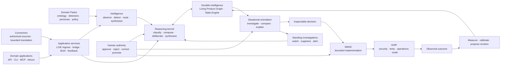

# ACE public roadmap

ACE is the open-source foundation for governed intelligence: a provider-neutral runtime for
building products that maintain context, reason over evidence, detect meaningful change, make
inspectable decisions, act under explicit authority, and learn from outcomes. Models provide
inference inside the loop. ACE owns the state, composition, lifecycle, authority, provenance, and
outcome loop around them.

This roadmap is the authoritative public view of ACE outcome state and dispatch. It describes
product capabilities rather than internal release operations, commercial plans, customer work, or
security-sensitive details. Priorities may change as maintainers learn from users and contributors.

## North star

The complete product loop is:

```text
understand → reason → decide → act with authority → observe outcomes → improve future reasoning
```

ACE is organized around four durable responsibilities:

- **Core** owns cognition and control: provider-neutral reasoning orchestration, product-scoped
  identity, immutable and temporal state, provenance, authority, decisions, execution contracts,
  and outcomes.
- **Intelligence** owns domain-neutral sensing and orientation: Observation, Entity Snapshot,
  Shift, Signal, Brief, Case, monitor, routing, synthesis, feedback, pack compilation, and
  conformance contracts.
- **Domain Packs and connectors** supply vocabulary and source access: ontology, source mappings,
  detector definitions, personas, synthesis policy, source adapters, and domain policy without
  making those nouns or rules part of Core.
- **Domain applications and product surfaces** expose the appropriate experience through an
  application, API, CLI, MCP, IDE, workflow, or Atrium without becoming the owner of durable
  intelligence.

The north-star acceptance test is:

> Can a builder use ACE to make a product more context-aware, evidence-driven, inspectable, and
> adaptive without forking Core or Intelligence, embedding domain nouns in the platform, or
> surrendering human authority?

One cross-cutting expression of that north star is **continuous situational intelligence**: ACE
maintains living orientation over any bounded, changing subject a user is authorized to examine.
The subject may be personal, organizational, market, geopolitical, scientific, technical, or
another pack-defined domain. Core owns authority, durable state, governed reasoning, decisions,
and outcomes. Intelligence owns the neutral resource and derivation contracts. Domain Packs own
what entities, relations, measurements, material changes, personas, and synthesis policies mean;
connectors own the reviewed translation from an authorized source into that boundary.

## Roadmap and design-document hierarchy

- **This file** owns current public outcome state, sequencing, and dispatch.
- [Architecture](docs/architecture.md) records the as-built system and dependency boundaries.
- [Governed cognition design](docs/design/capability-evolution.md) details how ACE can be taught,
  reviewed, versioned, measured, revised, and retired.
- [State Engine design and implementation record](docs/design/state-engine-roadmap.md) preserves the
  two-plane design, TP0–TP8 sequence, contracts, tests, and historical packet decisions.
- [Capability maturity](docs/capability-maturity.md) defines the current supported, experimental,
  internal, and planned product surface.
- The [evidence archive](docs/evidence/README.md) contains point-in-time acceptance and release
  receipts. Evidence records do not independently change roadmap state.

Roadmap outcome states are used strictly:

- **ready** — authorized and able to start;
- **active** — currently being executed;
- **candidate** — implementation exists, but evidence or reconciliation is incomplete;
- **not ready** — a dependency or acceptance gate remains;
- **passed** — outcome, verification evidence, limitations, and roadmap reconciliation are complete;
- **superseded** — replaced by an accepted newer outcome.

## Current release checkpoint

`ace-core` 0.5.0 is published on PyPI and GitHub. It carries the governed-cognition and Intelligence
foundation forward and completes the bounded Reasoning into Action promise: an exact approved
Decision can proceed through an effect-free plan, exact human review, durable admission, bounded
execution, honest terminal state, separate verification, linked repair when the prior effect is
known, and separate promotion. T1 and B1 are passed for the documented single-host topology with
explicitly trusted constructor-supplied adapters; schema head remains v176 and the thin MCP surface
remains exactly eleven tools.

The [0.5.0 GitHub Release](https://github.com/augmented-cognition-engine/core/releases/tag/v0.5.0),
public [`ace-core==0.5.0`](https://pypi.org/project/ace-core/0.5.0/) package, and separately released
`ace-reference-workspace-action==0.1.0` adapter are bound by the
[Reasoning into Action release evidence](docs/evidence/reasoning-into-action-v0.5.0-release-readiness.md).
A checkout-free environment installed both public artifacts and reproduced the independent World
Intelligence P2C2 governed Reality Brief-to-reviewed-action journey. World Intelligence 0.9.0 is
also independently published and resolves the public Core 0.5.0 dependency.

The 0.4.x line remains the passed Governed Cognition milestone. Patch releases 0.4.3 and 0.4.4
hardened canonical cognition persistence and task-source timestamp compatibility, and the public
0.4.4 artifact remains the exact GC1 external-consumer receipt below.

The [0.4.4 GitHub Release](https://github.com/augmented-cognition-engine/core/releases/tag/v0.4.4)
and public `ace-core==0.4.4` package expose proposal teaching, semantic-diff inspection, authorized
human review, materially attributed fresh use, exact receipt inspection, lifecycle governance, and
the canonical persistence fixes required by a real external consumer. The
[GC1 public external-consumer evidence](docs/evidence/gc1-public-external-consumer-v1.md) binds the
tag, trusted publication, artifact hashes, clean public-index runtime, independent Market journey,
restart durability, failure controls, and released conformance coverage. The earlier
[builder-surface evidence](docs/evidence/gc1-public-builder-surface-v1.md) remains the exact
point-in-time receipt for 0.4.2. GI1 remains the packaging, contract, and publication outcome first
passed by 0.4.0.

The [0.4.1 GitHub Release](https://github.com/augmented-cognition-engine/core/releases/tag/v0.4.1)
and public `ace-core==0.4.1` package remain the exact Core identity used by the completed GI2
cross-domain falsification below; that historical receipt is not rewritten to substitute the newer
release.

Domain neutrality remains a falsification result rather than a packaging property: a single-domain
abstraction always looks neutral from inside that domain. **GI2 is now passed** through the public
Core 0.4.1, World Intelligence 0.8.0, and Market Intelligence 0.6.0 artifacts. The tagged World
journey reproduces its frozen Case and Brief identities, while a clean public-index environment
compiles and activates both inert packs through unchanged platform APIs, retires Market, and proves
the World binding remains active and byte-identical. The exact receipts and limitations are in the
[GI2 public cross-domain evidence](docs/evidence/gi2-public-cross-domain-falsification-v1.md).

The broader governed-cognition builder-experience gate is now passed. An independent Market
Intelligence consumer reproduced proposal, human disposition, exact revision use, restart
persistence, retirement failure, and attribution against a running public-package deployment.
Released Core conformance tests cover rejection, revision, rollback, expiry, unavailable
dependencies, effectiveness classification, and non-selectable revision/retirement proposals.
**GC1** is therefore passed in 0.4.x.

The release remains bounded to the documented single-node topology and trusted in-process Python
extensions. It does not establish hostile-code isolation, distributed operation, general
real-world causal accuracy, autonomous learning, a general model of reality, or general beneficial
impact.

ACE provides graph-grounded, calibrated foresight. It projects conditional consequences of
decisions, exposes the mechanisms and uncertainty behind them, observes what actually happens,
and uses resolved forecasts to improve later reasoning. F1 freezes the bounded contract; the
agent-only L1 v7 study establishes beneficial impact against every required control within its
frozen executable-workload scope, without claiming general real-world benefit.

## Public release plan

The [ACE Public Roadmap](https://github.com/orgs/augmented-cognition-engine/projects/1) is the live
operational view of this plan. Each release has one public milestone issue that owns its product
promise, included scope, acceptance gate, dependencies, and explicit boundaries. The Project shows
whether that issue is **Now**, **Next**, or **Later**; this file remains the canonical narrative and
maps each release to the granular outcome ledger below.

Release targets describe sequence, not calendar commitments. ACE follows three release rules:

1. one minor release makes one major product promise;
2. that promise requires a reproducible public acceptance journey, declared limitations, and
   reconciled evidence before it is complete;
3. patch releases harden a published promise without introducing a backward-incompatible public
   contract or silently widening authority.

| Target | Public milestone | Lane | Granular outcome map | Public issue |
|---|---|---|---|---|
| 0.2.x | State Engine stabilization | **Maintenance** | Inherits the passed R0, R1, R2, R3, R4, R5, R6, R7, G1, IA-R1, I1, I2, I3, F1, L1, K1, K2, and K3 foundation; patch work is limited to compatibility, migration, recovery, observability, reliability, security, and documentation hardening | [#1](https://github.com/augmented-cognition-engine/core/issues/1) |
| 0.3.x | Productized State | **Maintenance** | PS1 passed in 0.3.1 through the K1–K3 spine, R1/R4 onboarding pattern, G1 and IA-R1 inspection, I1–I3 receipts, and E1 extension/governance boundary; later patches are compatible hardening only | [#2](https://github.com/augmented-cognition-engine/core/issues/2) |
| 0.4.x | Governed Cognition | **Passed** | GI1 passed in 0.4.0; GC1 passed against public 0.4.4 through the supported teach, inspect, approve, use, measure, revise, rollback, and retire lifecycle, an independent Market consumer, restart durability, attribution, and failure controls | [#3](https://github.com/augmented-cognition-engine/core/issues/3) |
| 0.5.0 | Reasoning into Action | **Passed** | T1 and B1 pass for bounded attributable action under the explicit single-host, trusted-adapter topology; I1 authority receipts govern the execution-adapter slice | [#37](https://github.com/augmented-cognition-engine/core/issues/37) |
| 0.6.0 | Measured Intelligence | **Next** | Productizes the bounded L1 evidence loop, connects I3 material use to product-owned outcomes, advances the SI4 orientation/attention evaluation slice, and advances F2 only where evidence or demonstrated user need justifies a broader consequence contract | [#38](https://github.com/augmented-cognition-engine/core/issues/38) |
| 0.7.0 | Domain and Extension Platform | **Later** | Completes the stable third-party platform promise across GI1, E1, and E2 and advances SI3: pack schemas, SDKs, conformance, compatibility, permissions, isolation, heterogeneous evidence sources, telemetry, adapters, and lifecycle policy | [#39](https://github.com/augmented-cognition-engine/core/issues/39) |
| 0.8.0 | Reasoning Workspace | **Later** | Builds on G1 and IA-R1 to expose the I1–I3, E1, B1, L1, and SI1–SI4 lifecycle through a coherent permission-aware human experience | [#40](https://github.com/augmented-cognition-engine/core/issues/40) |
| 0.9.0 | Collaborative Runtime | **Later** | Advances H1, SI3 sensitive-source governance, and the remaining T1/E2 operational guarantees across tenancy, shared authority, privacy, portability, recovery, and managed operation | [#41](https://github.com/augmented-cognition-engine/core/issues/41) |
| 1.0.0 | Reasoning OS | **Later** | Stabilizes the complete supported loop and all milestone-critical contracts across Core, Intelligence, Domain Packs, connectors, product surfaces, governance, action, outcomes, operation, and portability | [#42](https://github.com/augmented-cognition-engine/core/issues/42) |

### Parallel domain validation

The release spine above belongs to `ace-core`. Domain applications version independently in sibling
repositories and consume the same public Core + Intelligence contracts. Their product releases do
not change the ACE Core version, and their domain nouns, connectors, and policies do not move into
this repository.

World Intelligence and Market Intelligence are the current validation targets. Together they must
exercise materially different entities, sources, detectors, personas, epistemic policies, and
decision cadences. A failure found by either domain returns to Core only as a domain-neutral
contract, compiler, conformance, governance, or runtime requirement. A domain-specific workaround
does not become platform code.

This work proceeds in parallel with Core releases. A domain demonstration does not promote
an ACE capability by itself; promotion still requires reproducible public evidence, declared
limitations, and reconciliation in this roadmap. The Market GC1 journey contributes to the passed
Core outcome only because it is composed with the public builder surface and released Core
conformance evidence.

### 0.2.x — State Engine stabilization

Public promise: keep the first major State Engine release dependable while the next product
milestone is built.

- Preserve the bounded single-node R7, F1, and K1–K3 contract across fresh invocations and runtime
  restarts.
- Harden compatibility, migrations, recovery, diagnostics, documentation, reliability, and
  security without changing the product promise.
- Keep failures and degraded states visible and preserve the published thin-tool boundary.

Release gate: required quality, security, compatibility, and publication checks pass, and no patch
introduces a backward-incompatible public contract. New promises or authority move to a later minor
release.

### 0.3.x — Productized State

Public promise: a builder can install ACE, add an extension, provide real product context, inspect
composed state, make and correct a decision, and observe the correction materially influence later
reasoning after a restart.

- Turn the passed K1–K3 bounded capability into the obvious supported product journey rather than
  requiring a builder to understand ACE internals.
- Integrate G1 and IA-R1 inspection with I1 decisions and corrections, I2 deliberation attribution,
  and I3 material-use receipts.
- Use the passed E1 packaging, compatibility, isolation, security, restart, and conformance
  boundary without placing domain logic in Core.
- Publish a clean-environment example, failure behavior, supported limits, and reproducible
  acceptance evidence.

Release gate: **passed in ace-core 0.3.1.** The public extension-first journey proves
classification, composition, evidence, provenance, decision capture, correction, persistence, and
later material use through supported interfaces. The tagged artifacts passed the release matrix,
trusted publication, exact registry-hash comparison, and a clean public-index installation. See the
[Productized State release evidence](docs/evidence/productized-state-v0.3.1-release-readiness.md).

### 0.4.x — Governed Cognition

Public promise: builders can run governed Intelligence and teach and revise a reasoning system
through a supported lifecycle: propose, inspect, approve, version, use, measure, revise, roll back,
or retire.

**Delivered in 0.4.0 — GI1:**

- Put Core + Intelligence in one install behind enforced public dependency boundaries.
- Compile independently versioned, inert JSON Domain Packs with fail-closed diagnostics and
  packaged conformance seams.
- Admit an exact authorized LIVE source through bounded connector composition, then derive Shift,
  Signal, attention disposition, and governed Brief resources with provenance and exact replay.
- Preserve the eleven-tool MCP surface, naked-kernel startup, schema v175, and single-node limits.

**Passed in 0.4.x — GC1:**

- Make the canonical E1 teaching lifecycle obvious through supported public interfaces.
- Create inspectable proposals from authorized tasks, corrections, conversations, and documents.
- Use immutable revisions, durable approval receipts, provenance, explicit authority, bounded
  discovery, and exact use attribution.
- Support rejection, rollback, supersession, conflict, expiry, disablement, and retirement without
  erasing history or enabling silent self-modification.

The public `ace-core==0.4.2` release added a thin `ace cognition` builder workflow over the existing
authenticated HTTP boundary. Releases 0.4.3 and 0.4.4 hardened canonical persistence and
task-source timestamp compatibility discovered by the external-consumer journey. Public 0.4.4 now
passes the complete supported gate: an independent consumer taught a reusable capability through
public interfaces, a human inspected and governed the change, fresh invocations materially used
the exact approved revision with complete attribution before and after restart, and retirement
failed a distinct later required use closed. Released conformance tests cover the remaining
rejection, revision, rollback, expiry, unavailable-dependency, and effectiveness branches.

Release gate: **passed.** GI1 and GC1 are passed and the 0.4.x milestone is complete. The subsequent
0.5.0 T1/B1 gate also passed under its separately recorded boundary.

### 0.5.0 — Reasoning into Action

Public promise: ACE can reason under explicit authority and carry an approved decision into
bounded, attributable action.

- Complete the T1 guarantees needed for writable work: cancellation, replay identity, restart
  recovery, portability, resource reporting, and explicit topology boundaries.
- Advance B1 through declared capabilities, permissions, preconditions, approvals, results,
  failures, recovery, review, repair, and promotion.
- Keep product tools and domain actions in domain applications, connectors, or explicitly trusted
  extensions while Core enforces neutral authority and execution contracts.
- Require MAKE artifacts to pass independent SHIP security, testing, observability, operations,
  and scale gates before promotion.

Release gate: **passed.** The public-artifact journey proceeds from admitted evidence to governed
reasoning, an authorized Decision, exact human review, bounded action, honest terminal receipt,
separate verification, and separate promotion. Released conformance covers denial, timeout,
cancellation, duplicate request, partial effect, restart uncertainty, linked repair, and exact
replay. ACE makes no unrestricted-autonomy claim.

The first bounded packet was
[T1A durable cancellation](docs/design/t1a-durable-cancellation-work-packet-v1.md). It hardens the
existing negotiated extension-invocation seam around immutable duplicate handling and restart
receipt reconciliation. T1A's historical candidate record is composed into the passed public
0.5.0 closeout; it did not independently authorize external effects.

The second bounded packet was
[T1B execution limits and timeout receipts](docs/design/t1b-execution-limits-work-packet-v1.md).
It adds a neutral declared wall-clock limit, process-local deadline enforcement, and explicit
terminal resource reporting to direct and trusted-extension tasks. Its historical candidate record
is composed into the passed public 0.5.0 closeout. It does not claim CPU or memory enforcement,
distributed deadlines, or remote execution.

The third bounded packet was
[T1C durable task attempt and replay](docs/design/t1c-durable-task-replay-work-packet-v1.md). It
predeclares a domain-neutral attempt identity on every new task receipt and lets failed or
restart-degraded direct tasks create one deterministic linked successor from their persisted
request. T1C's historical candidate evidence is composed into the public 0.5.0 closeout. Its
[candidate evidence](docs/evidence/t1c-durable-task-replay-candidate-v1.md) binds public review,
final-head CI, exact merge identity, real restart, full regression, and an isolated wheel probe.
T1C does not claim
distributed exactly-once execution, remote-worker recovery, provider-stream continuation,
remote execution, or external-effect compensation.

The fourth bounded packet was
[B1A governed action execution](docs/design/b1a-governed-action-execution-work-packet-v1.md). It
introduces a domain-neutral public candidate service that binds an authorized Decision to one
effect-free adapter plan, persists admission before execution, and records success, failure,
partial effect, timeout, cancellation, or restart uncertainty without allowing a Domain Pack to
execute code. B1C supplies the independently released adapter proof, and B1A's historical candidate
record is composed into the public 0.5.0 closeout. Its
[candidate evidence](docs/evidence/b1a-governed-action-execution-candidate-v1.md) binds public review,
final-head CI, exact merge identity, the focused contract suite, full regression, naked-kernel
boundary, an isolated local-wheel probe, and the merged B1B fresh-process restart proof. It does not
claim cross-process or distributed
exactly-once effects, compensation, container equivalence, remote execution, or complete SHIP
promotion beyond the documented bounded lifecycle.

The fifth bounded packet was
[B1B durable action restart and host composition](docs/design/b1b-durable-action-restart-work-packet-v1.md).
It adds exact constructor-only host registration, the supported SurrealDB composition path, strict
database-JSON replay, and a fresh-process proof that an admitted action with no terminal receipt is
never implicitly executed again. B1B's historical candidate record is composed into the public
0.5.0 closeout.
Its [candidate evidence](docs/evidence/b1b-durable-action-restart-candidate-v1.md) binds the exact
reviewed head and merge, all six final-head CI gates, full regression, real SurrealDB fresh-process
replay, and isolated installed-wheel host composition. It does not claim
distributed exactly-once effects, compensation, an independently packaged adapter, action
review/repair/promotion by itself.

The sixth bounded packet was
[B1C independent action adapter](docs/design/b1c-independent-action-adapter-work-packet-v1.md). It
adds a separately buildable trusted reference distribution over the public action-adapter contract
and one real create-only workspace export. The adapter is excluded from the Core wheel, imports no
host internals, performs no discovery, and must be constructed and registered explicitly by exact
artifact identity. Its
[candidate evidence](docs/evidence/b1c-independent-action-adapter-candidate-v1.md) binds the focused
conformance and host-registration checks, independently built and installed wheels, public review,
all six final-head CI gates, and the exact merge identity. Public 0.5.0 supplies the released-
artifact closeout. B1C
does not provide arbitrary
filesystem access, safe untrusted code, distributed exactly-once effects, compensation, action
review/repair/promotion by itself.

The seventh bounded packet was
[B1D action review, repair, and promotion](docs/design/b1d-action-review-repair-promotion-work-packet-v1.md).
It adds an additive reviewed lifecycle around the unchanged B1A admission and terminal contracts:
an authenticated human judgment binds the exact effect-free plan and Core authorization before
execution; post-effect verification stays separate from promotion; and repair is a new linked
successor rather than a silent retry. Unknown effects are ineligible for repair, and success never
promotes itself. B1D's historical candidate record is composed into the public 0.5.0 closeout. Its
[candidate evidence](docs/evidence/b1d-action-review-repair-promotion-candidate-v1.md) binds the
exact reviewed head and merge, all six final-head CI gates, full regression, real SurrealDB
review-to-promotion restart, and independently built wheels. It does not provide compensation, distributed
exactly-once effects, remote execution, or untrusted code.

The bounded release closeout is frozen in the
[0.5.0 Reasoning into Action release work packet](docs/design/reasoning-into-action-v0.5.0-release-work-packet-v1.md).
The supported topology is one ACE host, one durable store, and explicitly trusted in-process
adapters; portability means an independently packaged adapter consumes only the public contract,
not distributed execution. World Intelligence P2C2 supplies the external Decision-to-reviewed-
action journey. The exact tag, PyPI Core package, separate adapter release assets, checkout-free
World reproduction, hashes, and boundaries are recorded in the
[0.5.0 release evidence](docs/evidence/reasoning-into-action-v0.5.0-release-readiness.md). T1, B1,
and 0.5.0 are therefore **passed** for the explicit single-host topology.

### 0.6.0 — Measured Intelligence

Public promise: reasoning revisions are promoted, rejected, rolled back, or retired because of
measured outcomes rather than intuition alone.

- Link outcome identity and provenance to decisions, actions, cognition revisions, forecasts, and
  observed results.
- Compare unchanged and revised behavior under matched conditions and report quality, latency,
  cost, failures, degraded states, and important limitations.
- Carry the passed bounded L1 method into product-owned outcome journeys without broadening its claim
  or substituting material influence for beneficial impact.
- Advance F2 only when demonstrated evidence or user need justifies broadening the F1 consequence
  contract.
- Add matched, leakage-bounded evaluation for situational orientations and attention signals,
  including citation correctness, contradiction recall, source and time coverage, calibration,
  detection delay, false-alert rate, revision stability, and useful, harmful, or unproven impact.

Release gate: a public evaluation journey traces a governed change from proposal through measured
result and explicit promotion, rejection, rollback, or retirement. ACE does not self-certify
improvement or optimize outside product-defined outcomes and authority.

### 0.7.0 — Domain and Extension Platform

Public promise: third parties can build, test, distribute, and operate ACE Domain Packs,
connectors, and trusted extensions that remain portable across compatible hosts.

- Publish versioned pack schemas, connector and extension SDKs, manifests and capability models,
  permission declarations, golden-fixture conformance suites, and deprecation policy.
- Demonstrate independent Domain Packs from multiple domains without forking or embedding product
  logic in Core or Intelligence.
- Establish supported Core/Intelligence/pack/connector/extension version skew, upgrade and
  deprecation policy, isolation, security review, recovery and effect semantics, telemetry, and
  failure diagnosis.
- Grow E2 across product-owned sources, scheduled work, IDEs, messaging, webhooks, and bounded
  execution adapters.
- Demonstrate pack- and connector-owned qualitative, quantitative, time-series, geospatial, track,
  event, and market-contract evidence with explicit units, vintages, precision, coverage,
  revisions, gaps, and source-specific semantics rather than flattening every observation into
  prose.

Release gate: independent packs, connectors, and trusted extensions pass their applicable public
compatibility and conformance checks; requested authority is visible before activation; and
failures remain isolated and diagnosable.

### 0.8.0 — Reasoning Workspace

Public promise: builders and operators can inspect and govern the full reasoning lifecycle from one
coherent, permission-aware workspace.

- Evolve the G1 and IA-R1 read foundation into navigable views of context, evidence, provenance,
  decisions, corrections, cognition revisions, actions, outcomes, uncertainty, and conflict.
- Add permission-aware case files for standing investigations, as-of orientations, claim versus
  action assessments, reaction timelines, competing hypotheses, unknowns, watch conditions,
  revision diffs, and entitled source deep links.
- Expose approvals and other governed controls only when their underlying public authority and
  runtime contracts are supported.
- Drive workspace behavior through the same public interfaces available to products and extensions.
- Preserve accessibility, stable identity, visible degraded behavior, and the durable records as
  the source of truth.

Release gate: one end-to-end journey can be understood, inspected, and governed from the workspace
without reading internal implementation details. The workspace is optional and does not become a
second source of truth.

### 0.9.0 — Collaborative Runtime

Public promise: teams can operate shared reasoning systems with explicit tenancy, authority,
portability, and recovery guarantees.

- Establish isolation between products, teams, and tenants plus attributable roles, approvals,
  concurrent changes, and shared audit history.
- Enforce consent, access, redaction, retention, deletion, export, and source-entitlement policy for
  personal, organizational, licensed, or otherwise sensitive situational evidence.
- Complete backup, export, import, migration, restore, interruption recovery, and disaster-recovery
  journeys.
- Publish supported deployment modes, operational guarantees, resource expectations, and degraded
  behavior.
- Support managed operation without requiring ACE or another hosted organization to own a user's
  durable intelligence.

Release gate: isolation and authorization boundaries are reproducibly tested; shared changes remain
attributable and recoverable; and portability preserves required public records across supported
deployment modes.

### 1.0.0 — Reasoning OS

Public promise: ACE is a stable, open, provider-neutral reasoning technology stack that any product
can extend to become more context-aware, evidence-driven, inspectable, governable, and adaptive.

- Stabilize the public contracts for context, state, evidence, deliberation, decisions, correction,
  cognition, authority, action, outcomes, standing investigations, versioned orientations,
  attention policy, Intelligence resources, Domain Packs, connectors, extensions, and operation.
- Preserve domain-neutral Core and Intelligence layers, product-owned packs and connectors,
  optional product surfaces, portable durable intelligence, and explicit human authority.
- Publish compatibility, migration, recovery, security, governance, deprecation, and breaking-change
  policies.
- Demonstrate the complete loop through multiple independent product and extension journeys across
  supported providers and deployment modes.

Release gate: every milestone-critical contract is supported and reproducible from public artifacts
and evidence, with no hidden mutation, implicit execution authority, provider lock-in, deployment
lock-in, or organizational ownership requirement.

## Continuous situational intelligence sequence

**Product promise:** ACE can maintain living, source-grounded orientation over any bounded subject
a user is authorized to examine. The same neutral loop can support personal, organizational,
market, geopolitical, scientific, technical-system, or other pack-defined intelligence:

```text
observe → detect material change → update bounded state → compare claims, commitments, and behavior
→ identify reactions and consequences → orient → watch what could change the conclusion
```

This is a cross-cutting product outcome, not a new domain in Core or Intelligence and not an
additional promise silently added to an earlier minor release. It uses the passed GI1, K1–K3, and
I1–I3 foundations and is delivered incrementally through governed cognition, measured
intelligence, the domain and extension platform, the reasoning workspace, and the collaborative
runtime. The public SI1–SI4 outcome and acceptance work are tracked in
[issue #47](https://github.com/augmented-cognition-engine/core/issues/47).

### SI1. Reproducible situational orientation

- Accept a bounded subject, as-of question, optional entities and time window, and explicit
  evidence, context, latency, and cost budgets.
- Produce an immutable, versioned orientation with a concise bottom line; supporting,
  contradicting, superseding, missing, and unavailable evidence; alternative explanations;
  uncertainty and causal limits; falsifiers and watch conditions; source-level citations and deep
  links; and an exact diff from the prior orientation.
- Preserve the answer that was justified at each historical cutoff. Later evidence creates a new
  revision and never leaks backward into an as-of answer or rewrites the prior receipt.
- Keep statement, observation, belief, hypothesis, simulation, action, reaction, and outcome
  identities distinct and prove which items materially affected the orientation.

### SI2. Standing investigations and accountable change

- Make a question a durable case rather than a one-off prompt: subject, owner, scope, current
  orientation, open unknowns, competing hypotheses, falsifiers, watch conditions, cadence,
  authority, and revision history remain inspectable across restarts.
- Represent statements and commitments with actor and role, modality, target, magnitude, timeframe,
  preconditions, exceptions, and a declared observable test. Represent legal, administrative,
  financial, enforcement, operational, and other domain-defined actions separately.
- Assess commitment against observed behavior as `aligned`, `partially_aligned`, `contradicted`,
  `too_early`, `unverifiable`, or `insufficient_evidence`, with the exact interpretation and
  evidence frozen in the assessment receipt.
- Build reaction dossiers that distinguish attributed verbal response, policy or legal response,
  market repricing, physical or operational behavior, and mere temporal co-movement. A reaction or
  sequence edge alone never establishes causation.

### SI3. Heterogeneous evidence and source governance

- Let connectors map source-specific records into Intelligence's Observation contract while Core
  preserves temporal identity, durable state, provenance, authority, and receipts. Domain Packs
  declare how structured measurements, time series, locations, tracks, events, market-contract
  states, data vintages, revisions, units, precision, coverage, gaps, and degraded conditions are
  interpreted.
- Track epistemic role, proximity, domain expertise, primary versus commentary status, ownership,
  syndication or common origin, and historical performance without collapsing source trust into one
  universal scalar. Repeated reporting from one origin must not masquerade as independent
  corroboration or dominate bounded retrieval.
- Preserve source spans and access-controlled deep links while enforcing consent, entitlement,
  quotation, redaction, retention, deletion, export, and audit policy. Licensed or sensitive content
  may ground an answer without being reproduced to an unauthorized reader.
- Keep source translation in bounded connectors and domain ontologies, aliases, detector
  configuration, materiality rules, and specialized trust policy in Domain Packs. Intelligence
  owns domain-neutral resolution, delta, scoring, routing, synthesis, and feedback mechanisms; Core
  owns scope, identity, time, durable state, provenance, reasoning, receipts, authority, and failure
  semantics.

### SI4. Attention and measured orientation quality

- Maintain explicit, correctable attention policy over subjects, entities, geography, horizons,
  novelty, magnitude, confidence, source diversity, time sensitivity, acceptable interruption, and
  delivery channels. Personalization must remain attributable and must not silently broaden access.
- Trigger work from material state change or a standing watch condition rather than raw ingestion
  volume. Rank signals using user relevance and expected consequence while penalizing duplication,
  weak coverage, stale evidence, and unresolved conflict; silence must remain a valid result.
- Record why an orientation or alert was generated, suppressed, grouped, delayed, delivered,
  dismissed, corrected, or used, including the evidence and policy revisions involved.
- Evaluate historical questions only with frozen as-of cutoffs and test citation correctness,
  primary-source and contradiction coverage, calibration, detection delay, false-alert rate,
  revision stability, analyst action, and beneficial, harmful, or unproven effect against declared
  controls.

Acceptance gate: external Domain Packs from at least two materially different scopes reproduce the
same Core + Intelligence lifecycle without embedding their domain ontology in either layer. Given
a bounded as-of question, each journey ingests mixed evidence, produces a source-linked
orientation, distinguishes claims from observed behavior and reactions, exposes contradictions and
unknowns, establishes a standing watch, emits or suppresses a material-change signal under explicit
policy, survives a runtime restart, and updates by append-only revision when later evidence arrives.
Evaluation must include future-information leakage controls, duplicated-origin and entitlement
negative controls, causal-overclaim checks, alert-quality measures, and declared limits; it does
not claim omniscience, general real-world causal accuracy, or universal benefit.

## Reasoning OS architecture sequence



## Product phases

| Phase | Product question | Current position | Outcomes | Release target |
|---|---|---|---|---|
| 1. Reasoning foundation | Can ACE reliably reason, remember, and explain what happened? | **Passed** | R0–R7, G1, IA-R1, I1–I3, and F1 passed | through 0.2.x |
| 2. Product state | Can a product maintain grounded state and reason about change and consequences? | **Passed** | K1–K3, E1, and PS1 passed; Productized State is published in 0.3.1 | 0.3.x |
| 3. Governed cognition and intelligence | Can a builder run domain-neutral Intelligence and teach the product how to reason without silent self-modification? | **Passed** | GI1 passed in 0.4.0; GC1 passed against public 0.4.4 and an independent Market consumer | 0.4.x |
| 4. Reasoning into action | Can an approved decision safely produce attributable work? | **Passed** | T1 and B1 passed in 0.5.0 for the bounded single-host, trusted-adapter topology | 0.5.0 |
| 5. Measured intelligence | Can ACE prove when retained intelligence or a capability helped, hurt, or remains unproven? | **Next; bounded evidence gate passed** | L1 and I3 passed; F2 not ready | 0.6.0 |
| 6. Domain and extension ecosystem | Can any product adopt, specialize, operate, and retain ownership of ACE intelligence? | **Pack foundation passed; ecosystem gated** | GI1 and E1 passed; E2 and H1 not ready | 0.7.0 and 0.9.0 |
| 7. Human experience | Can people inspect and govern the full loop without learning ACE internals? | **Read-only and governance foundations passed** | IA-R1, G1, E1, and L1 passed; the writable workspace remains bounded by B1 and H1 | 0.8.0 |
| 8. Continuous situational intelligence | Can ACE maintain a trustworthy, changing orientation over any bounded subject without making its domain ontology part of Core or Intelligence? | **GI1 substrate passed; product outcome not ready** | SI1–SI4 require GI1, independent Domain Packs, K1–K3, I1–I3, E2, L1, F2 where justified, and the workspace and collaboration slices of H1 | cross-cuts 0.4.x–0.9.0; complete by 1.0.0 |

## Immediate dispatch

### Completed technical prerequisite: bounded Product State outcomes

K1, K2, and K3 are `passed` for the bounded single-node contract. The independent Fjord Operations
extension and frozen acceptance receipt complete the required product-builder journey:

1. install ACE and a product extension without modifying Core;
2. ingest and replay product-scoped temporal evidence;
3. inspect supported, contested, provisional, superseded, and unknown belief state;
4. review transition hypotheses and compare action, no-action, and alternative rollouts;
5. use the bounded result in a durable ACE decision;
6. capture a later outcome and reconcile the original rollout without rewriting it;
7. preserve identity, provenance, authority, isolation, degraded behavior, and restart continuity;
8. publish the supported surface, limitations, clean-user journey, and acceptance receipt.

Exit condition: **passed.** A builder can give a product a bounded State Engine through the extension
boundary, and the
[K1-K3 product-journey evidence](docs/evidence/state-engine-k1-k3-product-journey-v1.md) records the
clean install, exact receipts, restarts, failure semantics, limitations, and unchanged eleven-tool
surface. E1 passed separately through the exact ace-core 0.3.0 release evidence; this journey does
not promote T1, distributed guarantees, or real-world causal accuracy.

### Completed milestone: 0.3.x Productized State

The Fjord Operations K1–K3 receipt proves the bounded capability and independent extension journey.
E1 separately passed with ace-core 0.3.0. The new Productized State receipt now proves the integrated
implementation through authenticated ingestion, supported CLI orchestration, read-only receipt
inspection, v171 schema zero, a v168→v171 upgrade, real restarts, correction, and later material use.

The completed 0.3.x implementation sequence was:

1. freeze one obvious extension-first golden path that begins with product value and progressively
   reveals deeper ACE surfaces;
2. bind the passed E1 packaging, compatibility, isolation, security, restart, and conformance
   evidence to that journey;
3. connect G1 and IA-R1 inspection to I1 decisions and corrections, I2 deliberation attribution,
   and I3 material-use receipts without adding domain logic to Core;
4. publish clean-environment installation, configuration, recovery, degraded-state, and limitation
   guidance for a product builder;
5. run the required compatibility, security, release, and public-artifact acceptance matrix; and
6. reconcile the evidence, milestone issue, Project lane, capability maturity, and this roadmap
   before publication.

Items 1–6 passed. The integrated journey is recorded in
[Productized State evidence](docs/evidence/productized-state-journey-v1.md), and the exact release,
artifact, trusted-publication, registry, and clean-install receipts are recorded in the
[0.3.1 release evidence](docs/evidence/productized-state-v0.3.1-release-readiness.md). The acceptance
runner finding that real SurrealDB product-scope binding returned empty inspection families was
corrected with typed record IDs and retained as a regression.

Exit condition: **passed.** The [0.3.x milestone](https://github.com/augmented-cognition-engine/core/issues/2)
passes its public acceptance gate, and the versioned public release is reproducible from published
artifacts. K1–K3 and E1 remain bounded passed inputs; PS1 is the passed productized outcome.

### Completed release: 0.4.0 governed Intelligence foundation

GI1 is `passed`. ACE 0.4.0 packages Core + Intelligence together, enforces their dependency
boundary, compiles inert Domain Packs, admits bounded LIVE sources, derives exact replayable
Intelligence resources, synthesizes governed Briefs, preserves the naked kernel, and publishes the
same eleven MCP tools. The release, trusted PyPI workflow, and clean public-index installation are
linked from the current release checkpoint above.

This does not close GC1, SI1–SI4, or any domain product. It establishes the shared substrate those
outcomes consume.

### Governed Intelligence platform substrate — P1 and P2 evidence (0.4.1 public closeout)

GI1 passed with the packaged `ace-core` 0.4.0 distribution described above. `ace-core` 0.4.1 then
published the P1/P2 platform evidence records that extend the same substrate. The individual
records below remain immutable point-in-time documents and retain their original
candidate/local wording; the later
[GI2 public cross-domain evidence](docs/evidence/gi2-public-cross-domain-falsification-v1.md)
binds them to the public release line rather than rewriting their historical status.

The independent `augmented-cognition-engine/domain-world-intelligence` repository is now tagged,
released, and published as `ace-domain-world-intelligence==0.8.0`. The separate Market repository
is likewise public as `ace-domain-market-intelligence==0.6.0`. Their tagged and installed-artifact
journeys close the publication dependency that kept GI2 open.

The 0.4.1 substrate was delivered in two ordered packet sequences:

**P1 — the first governed LIVE spine**, from one authorized live source through a routed Brief and
a closed feedback loop:

- [P1C1 declarative source-mapping](docs/evidence/platform-p1c1-declarative-source-mapping-v1.md) —
  the closed source-mapping declaration module and PREPARED interpreter that turns one compiled
  Pack IR, mapping ID, and host snapshot into one content-addressed Observation and Entity Snapshot.
- [P1C2 governed LIVE source ingress](docs/evidence/platform-p1c2-governed-live-source-ingress-v1.md)
  — atomic admission of one authenticated LIVE capture into a source-acquisition receipt, snapshot,
  Observation, and Entity Snapshot.
- [P1D1 shift-triggered PREPARED Brief](docs/evidence/platform-p1d1-governed-routed-brief-v1.md) —
  one routed Signal turned into one canonical PREPARED Brief over its Shift and Entity Snapshots.
- [P1E governed PREPARED feedback](docs/evidence/platform-p1e-governed-feedback-v1.md) — a Decision
  and later Outcome closing the loop back into an append-only Intelligence policy-state commit.
- [P1F governed LIVE intelligence bridge](docs/evidence/platform-p1f-governed-live-intelligence-bridge-v1.md)
  — the first bounded operational spine end-to-end: LIVE Observation → Entity Snapshot → Shift →
  Signal → route → governed LIVE Brief.

**P2A — the separate JSON-only World Domain Pack**, compiling through unchanged `ace-core`:
seven conformance tests, five fail-closed mutations, and co-installation alongside the Market
Domain Pack. P2A is consumer-repository conformance evidence recorded in the
Domain-World-Intelligence repository, not in `ace-core`, so no separate Core evidence record was
ported into this archive for it. Its public `v0.8.0` tag and package now make that consumer proof
independently reproducible.

**P2 — Case-bound governance and domain-neutral falsification packets**, run against the second,
independent World Intelligence domain:

- [P2B categorical detection](docs/evidence/platform-p2b-categorical-detection-v1.md),
  [P2B immutable Case closure](docs/evidence/platform-p2b-immutable-case-closure-v1.md), and
  [P2B independent resource admission](docs/evidence/platform-p2b-independent-resource-admission-v1.md)
  — domain-neutral categorical transition detection, immutable Case closure, and independently
  admitted PREPARED resources.
- [P2C Case-bound governed Brief](docs/evidence/platform-p2c-case-bound-governed-brief-v1.md) —
  Brief synthesis bound to an open Case, closing packet `WI-CR-005`.
- [P2D per-statement epistemic status](docs/evidence/platform-p2d-per-statement-epistemic-status-v1.md)
  — packet `WI-CR-002`, domain-neutral per-statement epistemic status.
- [P2E derivation-family independence](docs/evidence/platform-p2e-derivation-family-independence-v1.md)
  — packet `WI-CR-003`, domain-neutral derivation-family independence.
- [P2F supersession-impact projection](docs/evidence/platform-p2f-supersession-impact-projection-v1.md)
  — packet `WI-CR-004`, domain-neutral supersession-impact projection.
- [P2G owner-governed monitoring](docs/evidence/platform-p2g-owner-governed-monitoring-v1.md)
  — local candidate closing the implementation side of packets `WI-CR-007` and `WI-CR-008` with
  append-only owner lifecycle and explicitly requested sensing-window receipts. Public artifact
  publication and independent consumer replay remain open, so SI1–SI4 do not advance here.

Two earlier local checkpoints record intermediate 0.3.x/0.4.x-era work and are preserved for history
rather than as current status: the
[context manifest and code-context checkpoint](docs/evidence/context-manifest-code-context-v1.md)
and the
[Productized State golden-journey checkpoint](docs/evidence/productized-state-golden-journey-v1.md).
Both predate the P1/P2 sequence above and are superseded by it.

These point-in-time records did not move an outcome by themselves. Their former publication gate
has now passed: Core 0.4.1, World 0.8.0, and Market 0.6.0 are public, the tagged World conformance
suite passes, and the clean public-index two-domain activation and retirement-isolation journey
passes. GI2 is therefore reconciled to `passed`; GI1 and GC1 are passed, while SI1–SI4 remain
bounded future outcomes.

### 1. Completed governed-cognition builder journey

E1 passed for ace-core 0.3.0 and establishes one canonical cognition model. GI1 passed in 0.4.0 and
establishes the governed Intelligence substrate. GC1 makes the cognition lifecycle an obvious
supported public experience:

```text
teach → propose → inspect → approve → use → measure → revise or retire
```

The accepted dependency sequence was:

1. preserve the converged recipe and legacy `Skill`/`Job`/`Phase` migration behavior;
2. create inspectable learning proposals from tasks, corrections, conversations, and documents;
3. approve immutable recipe, instrument, or framework revisions with durable human receipts;
4. support rejection, rollback, supersession, conflict, expiry, and retirement without deleting
   history;
5. discover and load only relevant approved cognition within explicit context and cost budgets;
6. record the exact cognition revisions considered, selected, used, omitted, or unavailable.

Exit condition: **passed.** The public 0.4.4 builder and independent Market consumer journeys prove
that an extension can teach ACE a reusable reasoning capability, a human can govern the change,
and fresh invocations can materially use the exact approved revision across restart without
widening the thin MCP contract. The exact receipts and composed negative-path coverage are in the
[GC1 public external-consumer evidence](docs/evidence/gc1-public-external-consumer-v1.md).

### 2. Strengthen the runtime before writable action

T1 must establish cancellation, replay identity, restart recovery, portability, resource
reporting, and explicit single-process versus distributed guarantees. Only then should B1 progress
from read-only inspection to a local writable workspace, isolated container execution, and later
remote adapters. MAKE artifacts must pass independent SHIP security, testing, observability,
operations, and scale gates before promotion.

Exit condition: approved reasoning can produce attributable work without giving a model implicit or
unbounded execution authority.

### 3. Productize bounded learning-impact evidence

L1 is `passed` for the bounded executable-workload claim. Its first leakage-bounded retrospective
probe and the agent-only v5 result remain negative; v6 remains formally invalid because one ACE case
failed the frozen I3 field-level lineage check. The independently seeded v7 correction replicate
froze that already-required check before collection, completed 192 decisions across 48 eligible
clusters on one matched live route, and passed last-observation persistence, naïve/base-rate, and
matched model-only with all three cluster-adjusted 95% lower bounds above zero. The claim does not
extend to humans, customers, providers, external products, or general real-world benefit. I3
material influence alone still does not establish benefit. F2 remains gated until demonstrated
evidence or user need justifies a broader consequence contract.

Exit condition: ACE can state, with reproducible evidence, when a capability helped, hurt, or
remains unproven and can propose—not silently apply—a revision or retirement.

### 4. Grow the domain, connector, extension, and product-surface ecosystem

GI1 establishes the inert Domain Pack compiler, external conformance seams, and bounded connector
composition. E1 establishes N-1 compatibility, isolation and security review, recovery/effect
semantics, operability, and conformance evidence for the exact ace-core 0.3.0 trusted in-process
Python-extension boundary. E2 can now add pack distribution, connector lifecycle, product-owned
telemetry, scheduled work, IDEs, messaging, webhooks, and remote execution adapters. H1 later adds
tenancy, shared authority, portability, recovery, and managed operation without transferring
ownership of a user's durable intelligence.

Atrium evolves alongside these phases as a read-first view of state, reasoning, approvals, actions,
outcomes, and proposed cognition changes. It gains no new write or execution authority merely by
rendering them.

### 5. Validate continuous situational intelligence through external domains

SI1–SI4 now begin from the passed GI1 substrate rather than asking each vertical to rebuild its own
entity, Shift, Signal, Brief, Case, provenance, and feedback machinery. The validation sequence is:

1. freeze domain-neutral contracts for standing investigations, orientation revisions, reaction
   dossiers, attention policies, subscriptions, and attention receipts; the P2G local candidate
   now covers owner lifecycle and bounded sensing-window receipts without claiming scheduled work;
2. keep structured measurements, time series, geospatial tracks, market state, source-origin
   clustering, entitlement, privacy, and source-specific materiality in Domain Packs or connectors;
3. run World Intelligence through the public compiler and application seams using public-issue,
   event, claim, correction, and source-independence semantics;
4. run Market Intelligence through the same seams using competitor, product, customer, narrative,
   campaign, and go-to-market semantics;
5. accept platform changes only when both can express the need as a domain-neutral contract,
   compiler, conformance, governance, or runtime requirement;
6. connect governed domain policy to evaluation before exposing standing watches, alerts, case
   files, timelines, maps, or revision controls through supported surfaces; and
7. reconcile SI1–SI4 evidence into the 0.4.x–0.9 milestone gates without changing a domain release
   into an ACE Core capability claim.

Exit condition: the SI1–SI4 acceptance gate is reproducible from public artifacts across at least
two materially different external domain packages, with privacy, entitlement, future-leakage,
duplicated-origin, causal-overclaim, restart, degraded-state, and attention-quality evidence. Until
then, continuous situational intelligence is a planned cross-cutting outcome, not a supported
general-intelligence claim.

## Outcome ledger

| ID | State | Public outcome | Dependency / acceptance evidence |
|---|---|---|---|
| R0 | passed | Publish `ace-core` 0.1.0 through a credential-free release path | GitHub Release, PyPI release, successful OIDC workflow, and public-index install verified |
| R1 | passed | Make first use effortless and outcome-led for product builders | [Clean-trial evidence](docs/evidence/r1-onboarding-evidence.md) covers isolated macOS and Linux journeys, recovery, and `ace doctor` |
| R2 | passed | Ship the focused 0.1.1 onboarding, packaging, and documentation release | [Release evidence](docs/evidence/r2-release-evidence.md) covers installs, artifacts, CI, tag, trusted publication, GitHub Release, and public-index verification |
| R3 | passed | Validate provider setup, authentication, diagnostics, and degraded behavior | [Provider evidence](docs/evidence/r3-provider-validation.md) covers the supported matrix, live subscription routes, degraded behavior, and current-main CI |
| R4 | passed | Publish a reproducible product-builder golden-path demonstration | [Golden-path evidence](docs/product-builder-golden-path.md) proves a decision, human correction, restart, later material use, and provenance through supported surfaces |
| R5 | passed | Ship ace-core 0.1.2 inspectability and foresight | [R5 release evidence](docs/evidence/r5-release-readiness.md) records artifacts, regressions, migration/restart health, publication, provenance, and public installation |
| R6 | passed | Ship ace-core 0.1.3 attributable deliberation and experimental extension invocation | [R6 release evidence](docs/evidence/r6-release-readiness.md) records boundaries, regressions, publication, provenance, and public installation |
| R7 | passed | Ship ace-core 0.2.0 State Engine | [R7 release evidence](docs/evidence/r7-release-readiness.md) records architecture, migrations, regressions, scale, merge/tag identity, GitHub Release, trusted PyPI publication, provenance, and public installation |
| G1 | passed | Promote the read-only Living Product Graph into a supported inspectable journey | [G1 evidence](docs/evidence/g1-living-product-graph-evidence.md) proves the bounded, deterministic, assertion-backed read contract and strict no-write boundary |
| IA-R1 | passed | Define the read-only information architecture for inspecting ACE state | [IA-R1 evidence](docs/evidence/ia-r1-product-map.md) establishes the operator hierarchy, provenance, uncertainty, failures, identity, and no-write/no-execution authority |
| I1 | passed | Make decisions, evidence, corrections, approvals, and outcomes inspectable | [Decision and correction receipts](docs/decision-correction-receipts.md) prove stable identity, disposition, provenance, isolation, redaction, and restart continuity |
| I2 | passed | Make deliberation and synthesis attributable without exposing hidden chain-of-thought | [I2 evidence](docs/evidence/i2-attributable-deliberation-evidence.md) proves selection, bounded contributor artifacts, disagreement, synthesis lineage, failure behavior, and restart continuity |
| I3 | passed | Make retained-intelligence use and its decision effect inspectable | [I3 evidence](docs/evidence/i3-intelligence-use-evidence.md) proves retrieval/use distinctions, exact decision deltas, controls, failure cases, and restart continuity |
| F1 | passed | Freeze the honest contract for graph-grounded calibrated foresight | [F1 evidence](docs/evidence/f1-foresight-evidence.md) proves the bounded forecast, observation, resolution, scoring, comparator, and non-causal contract |
| K1 | passed | Maintain grounded temporal state over large product-scoped knowledge bases | [K1-K3 product evidence](docs/evidence/state-engine-k1-k3-product-journey-v1.md) adds clean extension install, temporal ingestion/replay, exact counts/lineage/isolation, five belief meanings, supported v168 migrations, restarts, and a supported guide to the prior scale/readiness evidence |
| K2 | passed | Model inspectable world dynamics and state-transition hypotheses | [K1-K3 product evidence](docs/evidence/state-engine-k1-k3-product-journey-v1.md) proves an extension-owned product hypothesis with mechanism, preconditions, horizon, uncertainty, evidence/counterevidence challenge, review, stale behavior, and explicit causal limits |
| K3 | passed | Simulate, compare, and reconcile consequences of possible actions | [K1-K3 product evidence](docs/evidence/state-engine-k1-k3-product-journey-v1.md) proves action/no-action/alternative comparisons, durable decision/I3/promotion receipts, immutable outcome reconciliation, correction supersession, real restart/interruption recovery, later material use, and honest failure bounds |
| PS1 | passed | Make the passed State Engine an obvious supported extension-first product journey | [Productized State evidence](docs/evidence/productized-state-journey-v1.md) passes authenticated adapter discovery/ingestion, `ace state` orchestration, integrated G1/IA-R1 and I1–I3 receipt inspection, v171 schema-zero, v168→v171 upgrade, restarts, correction, and later material use; the [0.3.1 release evidence](docs/evidence/productized-state-v0.3.1-release-readiness.md) binds the exact tag, official CI, trusted PyPI publication, matching registry hashes, and clean public-index installation |
| GI1 | passed | Ship the governed Intelligence foundation as one installable distribution with inert Domain Pack compilation and governed LIVE seams | [ace-core 0.4.0](https://github.com/augmented-cognition-engine/core/releases/tag/v0.4.0) packages Core + Intelligence, the inert Domain Pack compiler, LIVE source ingress, the LIVE bridge, Brief synthesis, exact replay, external conformance seams, schema v175, unchanged eleven-tool MCP, trusted PyPI publication, and clean public-index installation. This is a packaging, contract, and publication outcome; the domain-neutrality claim it previously carried moved to GI2 |
| GI2 | passed | Prove the Intelligence foundation is domain-neutral through an independent, publicly reproducible second-domain falsification | [GI2 public cross-domain evidence](docs/evidence/gi2-public-cross-domain-falsification-v1.md) binds public Core 0.4.1, World 0.8.0, and Market 0.6.0 artifacts. The tagged World suite passes 81 tests and reproduces `case:412426eee708d56f6bda931ccf9e5d8b` and `brief:25d8232c9bfa27050bdcb160fb75f06c`; a clean public-index install compiles and activates both packs through unchanged APIs, then retires Market without changing the active World binding. This is domain-neutral substrate evidence, not SI1–SI4 completion or a claim of general real-world accuracy |
| GC1 | passed | Make governed cognition an obvious supported teach, inspect, approve, use, measure, revise, and retire journey | [GC1 public external-consumer evidence](docs/evidence/gc1-public-external-consumer-v1.md) composes the public 0.4.4 artifact identity, independent Market prepare/restart/resume/retire journey, exact material-use attribution, fail-closed post-retirement request, and released Core coverage for rejection, revision, rollback, expiry, unavailable dependencies, and effectiveness |
| T1 | passed | Strengthen task recovery, replay, portability, cancellation, and resource reporting | [ACE 0.5.0 release evidence](docs/evidence/reasoning-into-action-v0.5.0-release-readiness.md) composes TP1 and T1A–T1C with exact public artifacts, a separately installable public-contract adapter, checkout-free external reproduction, negotiated cancellation, declared deadlines, terminal resource receipts, attempt identity, and restart-safe linked replay. The pass is bounded to one host and one durable store; remote workers, distributed recovery, cross-process ordering, and broader CPU/memory enforcement remain outside the supported topology |
| E1 | passed | Stabilize the extension and governed-cognition boundary | [E1 release evidence](docs/evidence/e1-governed-cognition-release-v1.md) binds the canonical E1-A–G lifecycle to ace-core 0.3.0, exact current/N-1 and mixed-package evidence, public artifacts and fresh install, deployment inventory, independent AI security acceptance, and release-owner countersignature; the pass is limited to trusted in-process extensions and is not a human penetration test or certification |
| L1 | passed | Use resolved conditional forecasts to improve later reasoning and decision quality | [L1 evidence](docs/evidence/l1-foresight-impact-evidence.md) preserves the negative retrospective probe and v5/v6 failures, then records the preregistered v7 correction replicate: all 192 cases and 48 clusters were eligible, and ACE passed persistence, naïve/base-rate, and matched model-only under the frozen all-controls interval rule; the claim is limited to the executable benchmark |
| B1 | passed | Carry approved decisions through attributable implementation, review, repair, and promotion | [ACE 0.5.0 release evidence](docs/evidence/reasoning-into-action-v0.5.0-release-readiness.md) binds I1 authority to an effect-free plan, exact human review, durable admission, bounded trusted-adapter execution, honest terminal states, separate verification, linked repair, separate promotion, exact replay, and an independent World consumer. It does not claim unrestricted autonomy, compensation, distributed exactly-once effects, remote execution, or untrusted-code isolation |
| F2 | not ready | Broaden consequence types where product evidence justifies the complexity | Bounded L1 evidence now exists; F2 still requires demonstrated product need and its own consequence-contract evidence without reopening F1 |
| H1 | not ready | Support secure collaboration and managed operation without transferring ownership of durable intelligence | Requires tenancy, portability, authority, and recovery guarantees |
| E2 | not ready | Grow the provider-neutral Domain Pack, connector, extension, telemetry, and execution-adapter ecosystem | Requires GI1 and E1 conformance plus stable distribution, compatibility, permission, and lifecycle policy |
| SI1 | not ready | Produce reproducible, source-linked situational orientation over any bounded authorized subject | GI1 is passed; remaining work requires a versioned orientation contract, historical as-of isolation, explicit uncertainty and causal limits, deep-link and omission receipts, restart evidence, and materially different external Domain Pack journeys |
| SI2 | not ready | Maintain standing investigations and inspectable claim, commitment, action, reaction, and revision history | Requires SI1, governed pack-owned assessment policy, durable investigation/watch identity, exact assessment tests and dispositions, reaction-type separation, correction and supersession, and no causal promotion from sequence alone |
| SI3 | not ready | Govern heterogeneous evidence, source independence, privacy, entitlement, and structured deep links | Requires GI1/E2 source and telemetry contracts plus pack- or connector-owned measurement/time-series/geospatial/market semantics, origin and syndication lineage, access and retention policy, bounded retrieval controls, and H1 guarantees for shared or sensitive operation |
| SI4 | not ready | Deliver material-change attention and measure orientation and alert quality | Requires SI1–SI3, explicit correctable interest/watch policy, attributable generation and suppression receipts, delivery controls, leakage-bounded historical evaluation, alert-quality measures, and product-owned outcome evidence under L1/F2 limits |

## Product and architecture guardrails

- ACE remains provider-neutral; an LLM is an inference resource, not the owner of the loop.
- Core and Intelligence remain domain-neutral; product-specific vocabulary and policy live in
  Domain Packs, while source translation and actions live in bounded connectors or explicitly
  trusted extensions.
- Models may propose; deterministic code and explicit human authority own identity, activation,
  consequential execution, and promotion.
- Evidence, belief, hypothesis, simulation, decision, action, and observation remain distinct.
- Statement, commitment, observed action, attributed reaction, and outcome remain distinct; a
  narrative source establishes what it reported, not that its account is true.
- As-of reasoning may use only evidence available under the frozen historical cutoff; later data or
  revisions cannot leak backward into an earlier orientation.
- Source volume is not source independence. Syndicated, commonly owned, or derivative reports do
  not become corroboration merely because they appear in multiple artifacts.
- Retrieval is not use, material influence is not benefit, and correlation is not causation.
- Hidden chain-of-thought, private prompts, credentials, and unrestricted transcripts remain outside
  public receipts.
- The supported thin MCP boundary remains exactly eleven tools until a separate compatibility
  decision explicitly changes it.
- Durable intelligence remains product-scoped, portable, inspectable, and owned by its user.
- Attention policy cannot widen evidence access, and sensitive or licensed evidence cannot be
  reproduced outside its consent, entitlement, retention, and redaction policy.
- New capability claims require reproducible evidence, declared limits, and roadmap reconciliation.

## Follow and contribute

Follow the live [ACE Public Roadmap](https://github.com/orgs/augmented-cognition-engine/projects/1)
for operational status. Repository issues should state the user outcome, scope, acceptance
evidence, dependencies, and maturity impact without including credentials, vulnerability details,
customer information, private agreements, or unpublished business and release plans.

The roadmap is a projection of ACE's product state, not a substitute for evidence. Implemented code,
a demonstration, or a design note advances no outcome by itself.
