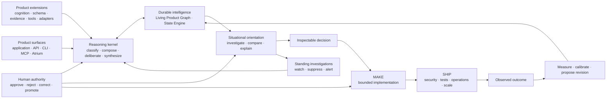

# ACE public roadmap

ACE is the open, provider-neutral Reasoning OS for building products that maintain context, reason
over evidence, make inspectable decisions, act under explicit authority, and learn from outcomes.
Models provide inference inside the loop. ACE owns the state, composition, lifecycle, authority,
provenance, and outcome loop around them. Extensions make that reasoning system belong to a
specific product without requiring a fork of Core.

This roadmap is the authoritative public view of ACE outcome state and dispatch. It describes
product capabilities rather than internal release operations, commercial plans, customer work, or
security-sensitive details. Priorities may change as maintainers learn from users and contributors.

## North star

The complete product loop is:

```text
understand → reason → decide → act with authority → observe outcomes → improve future reasoning
```

ACE is organized around three durable responsibilities:

- **Core** supplies provider-neutral reasoning orchestration, product-scoped identity, lifecycle,
  provenance, authority, execution contracts, and outcome semantics.
- **Extensions** supply product and domain cognition, schemas, evidence sources, tools, policies,
  actions, telemetry, and adapters through a stable boundary.
- **Product surfaces** expose the appropriate experience through an application, API, CLI, MCP,
  IDE, workflow, or Atrium without becoming the owner of durable intelligence.

The north-star acceptance test is:

> Can a builder use ACE to make a product more context-aware, evidence-driven, inspectable, and
> adaptive without forking the reasoning core or surrendering human authority?

One cross-cutting expression of that north star is **continuous situational intelligence**: ACE
maintains living orientation over any bounded, changing subject a user is authorized to examine.
The subject may be personal, organizational, market, geopolitical, scientific, technical, or
another extension-defined domain. Core owns neutral identity, time, evidence, investigation,
orientation, attention, authority, and outcome semantics; extensions own what entities, actions,
reactions, measurements, material changes, and source policies mean in a particular domain.

## Roadmap and design-document hierarchy

- **This file** owns current public outcome state, sequencing, and dispatch.
- [Architecture](docs/architecture.md) records the as-built system and dependency boundaries.
- [Governed cognition design](docs/design/capability-evolution.md) details how ACE can be taught,
  reviewed, versioned, measured, revised, and retired.
- [State Engine design and implementation record](docs/design/state-engine-roadmap.md) preserves the
  two-plane design, TP0–TP8 sequence, contracts, tests, and historical packet decisions.
- [Capability maturity](docs/capability-maturity.md) defines the current supported, experimental,
  internal, and planned product surface.
- The [evidence archive](docs/evidence/README.md) contains point-in-time acceptance and release
  receipts. Evidence records do not independently change roadmap state.

Roadmap outcome states are used strictly:

- **ready** — authorized and able to start;
- **active** — currently being executed;
- **candidate** — implementation exists, but evidence or reconciliation is incomplete;
- **not ready** — a dependency or acceptance gate remains;
- **passed** — outcome, verification evidence, limitations, and roadmap reconciliation are complete;
- **superseded** — replaced by an accepted newer outcome.

## Current release checkpoint

`ace-core` 0.3.0 is published on PyPI and GitHub from verified release commit `6738708`. It builds
on the 0.2.0 State Engine foundation and passes E1 for the exact released artifact set: one
canonical governed-cognition lifecycle with immutable revisions, human approval, bounded
selection/use attribution, current/N-1 compatibility evidence, deployment inventory, published
artifacts, independent AI security review, and release-owner countersignature.

The release preserves the supported CLI and exactly eleven thin MCP tools and upgrades the public
schema head from v168 to v171 through restart-safe migrations. E1 supports explicitly trusted
installed Python extensions running in process; it does not claim hostile-code sandboxing,
distributed approval, exactly-once external effects, a human penetration test, or certification.
The bounded single-node, non-causal State Engine limitations also remain.

ACE provides graph-grounded, calibrated foresight. It projects conditional consequences of
decisions, exposes the mechanisms and uncertainty behind them, observes what actually happens,
and uses resolved forecasts to improve later reasoning. F1 freezes the bounded contract; the
agent-only L1 v7 study establishes beneficial impact against every required control within its
frozen executable-workload scope, without claiming general real-world benefit.

## Public release plan

The [ACE Public Roadmap](https://github.com/orgs/augmented-cognition-engine/projects/1) is the live
operational view of this plan. Each release has one public milestone issue that owns its product
promise, included scope, acceptance gate, dependencies, and explicit boundaries. The Project shows
whether that issue is **Now**, **Next**, or **Later**; this file remains the canonical narrative and
maps each release to the granular outcome ledger below.

Release targets describe sequence, not calendar commitments. ACE follows three release rules:

1. one minor release makes one major product promise;
2. that promise requires a reproducible public acceptance journey, declared limitations, and
   reconciled evidence before it is complete;
3. patch releases harden a published promise without introducing a backward-incompatible public
   contract or silently widening authority.

| Target | Public milestone | Lane | Granular outcome map | Public issue |
|---|---|---|---|---|
| 0.2.x | State Engine stabilization | **Maintenance** | Inherits the passed R0, R1, R2, R3, R4, R5, R6, R7, G1, IA-R1, I1, I2, I3, F1, L1, K1, K2, and K3 foundation; patch work is limited to compatibility, migration, recovery, observability, reliability, security, and documentation hardening | [#1](https://github.com/augmented-cognition-engine/core/issues/1) |
| 0.3.x | Productized State | **Now** | Productizes the passed K1–K3 spine with the R1/R4 onboarding pattern, G1 and IA-R1 inspection, I1–I3 receipts, and the passed E1 extension/governance boundary shipped in 0.3.0 | [#2](https://github.com/augmented-cognition-engine/core/issues/2) |
| 0.4.0 | Governed Cognition | **Later** | Productizes the passed E1 foundation as an obvious teach, inspect, approve, use, measure, revise, and retire experience; supplies governed analytical policies and taxonomies required by SI1–SI4 | [#3](https://github.com/augmented-cognition-engine/core/issues/3) |
| 0.5.0 | Reasoning into Action | **Later** | Advances T1 and B1 from approved decision to bounded attributable action; uses I1 authority receipts and begins the execution-adapter slice of E2 | [#37](https://github.com/augmented-cognition-engine/core/issues/37) |
| 0.6.0 | Measured Intelligence | **Later** | Productizes the bounded L1 evidence loop, connects I3 material use to product-owned outcomes, advances the SI4 orientation/attention evaluation slice, and advances F2 only where evidence or demonstrated user need justifies a broader consequence contract | [#38](https://github.com/augmented-cognition-engine/core/issues/38) |
| 0.7.0 | Extension Platform | **Later** | Completes the stable third-party platform promise across E1 and E2 and advances SI3: SDK, conformance, compatibility, permissions, isolation, heterogeneous evidence sources, telemetry, adapters, and lifecycle policy | [#39](https://github.com/augmented-cognition-engine/core/issues/39) |
| 0.8.0 | Reasoning Workspace | **Later** | Builds on G1 and IA-R1 to expose the I1–I3, E1, B1, L1, and SI1–SI4 lifecycle through a coherent permission-aware human experience | [#40](https://github.com/augmented-cognition-engine/core/issues/40) |
| 0.9.0 | Collaborative Runtime | **Later** | Advances H1, SI3 sensitive-source governance, and the remaining T1/E2 operational guarantees across tenancy, shared authority, privacy, portability, recovery, and managed operation | [#41](https://github.com/augmented-cognition-engine/core/issues/41) |
| 1.0.0 | Reasoning OS | **Later** | Stabilizes the complete supported loop and all milestone-critical contracts across Core, extensions, product surfaces, governance, action, outcomes, situational intelligence, operation, and portability | [#42](https://github.com/augmented-cognition-engine/core/issues/42) |

### 0.2.x — State Engine stabilization

Public promise: keep the first major State Engine release dependable while the next product
milestone is built.

- Preserve the bounded single-node R7, F1, and K1–K3 contract across fresh invocations and runtime
  restarts.
- Harden compatibility, migrations, recovery, diagnostics, documentation, reliability, and
  security without changing the product promise.
- Keep failures and degraded states visible and preserve the published thin-tool boundary.

Release gate: required quality, security, compatibility, and publication checks pass, and no patch
introduces a backward-incompatible public contract. New promises or authority move to a later minor
release.

### 0.3.x — Productized State

Public promise: a builder can install ACE, add an extension, provide real product context, inspect
composed state, make and correct a decision, and observe the correction materially influence later
reasoning after a restart.

- Turn the passed K1–K3 bounded capability into the obvious supported product journey rather than
  requiring a builder to understand ACE internals.
- Integrate G1 and IA-R1 inspection with I1 decisions and corrections, I2 deliberation attribution,
  and I3 material-use receipts.
- Use the passed E1 packaging, compatibility, isolation, security, restart, and conformance
  boundary without placing domain logic in Core.
- Publish a clean-environment example, failure behavior, supported limits, and reproducible
  acceptance evidence.

Release gate: one public extension-first journey proves classification, composition, evidence,
provenance, decision capture, correction, persistence, and later material use through supported
interfaces. Passing K1–K3 and E1 are inputs to this gate, not by themselves completion of the
0.3.x product promise.

Candidate status: the frozen `productized-state-public-journey-v1` engineering acceptance passes
and its implementation is merged into `main`. The ace-core 0.3.1 release candidate adds
authenticated adapter discovery/ingestion, the builder-facing `ace state` workflow, and integrated
read-only I1–I3/State Engine receipt inspection; it also passes schema-zero v171 and v168→v171
upgrade checks. The release-line outcome remains `candidate`, not `passed`, until the versioned
public artifacts, fresh public-index installation, and issue/Project reconciliation are complete.

### 0.4.0 — Governed Cognition

Public promise: builders can teach and revise a reasoning system through a governed lifecycle:
propose, inspect, approve, version, use, measure, revise, roll back, or retire.

- Build the supported teaching experience on the canonical E1 model and published migration
  behavior for superseded paths.
- Create inspectable proposals from authorized tasks, corrections, conversations, and documents.
- Use immutable revisions, durable approval receipts, provenance, explicit authority, and bounded
  discovery and loading.
- Support rejection, rollback, supersession, conflict, expiry, and retirement without erasing
  history or enabling silent self-modification.
- Let extensions govern versioned analytical ontologies, claim/action assessment rules, source
  policies, change-detection methods, and attention criteria without making them universal Core
  truth.

Release gate: an extension can teach ACE a reusable capability, a human can inspect and govern the
change, and a fresh invocation can materially use the approved revision with complete attribution.

### 0.5.0 — Reasoning into Action

Public promise: ACE can reason under explicit authority and carry an approved decision into
bounded, attributable action.

- Complete the T1 guarantees needed for writable work: cancellation, replay identity, restart
  recovery, portability, resource reporting, and explicit topology boundaries.
- Advance B1 through declared capabilities, permissions, preconditions, approvals, results,
  failures, recovery, review, repair, and promotion.
- Keep product tools and domain actions in extensions while Core enforces neutral authority and
  execution contracts.
- Require MAKE artifacts to pass independent SHIP security, testing, observability, operations,
  and scale gates before promotion.

Release gate: a reproducible journey proceeds from context to decision to authorized action to
result to updated state, including denial, timeout, retry, duplicate-request, partial-failure, and
human-approval behavior. ACE makes no unrestricted-autonomy claim.

### 0.6.0 — Measured Intelligence

Public promise: reasoning revisions are promoted, rejected, rolled back, or retired because of
measured outcomes rather than intuition alone.

- Link outcome identity and provenance to decisions, actions, cognition revisions, forecasts, and
  observed results.
- Compare unchanged and revised behavior under matched conditions and report quality, latency,
  cost, failures, degraded states, and important limitations.
- Carry the passed bounded L1 method into product-owned outcome journeys without broadening its claim
  or substituting material influence for beneficial impact.
- Advance F2 only when demonstrated evidence or user need justifies broadening the F1 consequence
  contract.
- Add matched, leakage-bounded evaluation for situational orientations and attention signals,
  including citation correctness, contradiction recall, source and time coverage, calibration,
  detection delay, false-alert rate, revision stability, and useful, harmful, or unproven impact.

Release gate: a public evaluation journey traces a governed change from proposal through measured
result and explicit promotion, rejection, rollback, or retirement. ACE does not self-certify
improvement or optimize outside product-defined outcomes and authority.

### 0.7.0 — Extension Platform

Public promise: third parties can build, test, distribute, and operate ACE extensions that remain
portable across compatible hosts.

- Publish a versioned SDK, manifest and capability model, permission declarations, and conformance
  suite.
- Demonstrate independent extensions from multiple domains without forking or embedding product
  logic in Core.
- Establish supported Core/extension version skew, upgrade and deprecation policy, isolation,
  security review, recovery and effect semantics, telemetry, and failure diagnosis.
- Grow E2 across product-owned sources, scheduled work, IDEs, messaging, webhooks, and bounded
  execution adapters.
- Demonstrate extension-owned qualitative, quantitative, time-series, geospatial, track, event,
  and market-contract evidence with explicit units, vintages, precision, coverage, revisions, gaps,
  and source-specific semantics rather than flattening every observation into prose.

Release gate: independent extensions pass the same public compatibility and conformance checks;
their requested authority is visible before activation; and their failures remain isolated and
diagnosable.

### 0.8.0 — Reasoning Workspace

Public promise: builders and operators can inspect and govern the full reasoning lifecycle from one
coherent, permission-aware workspace.

- Evolve the G1 and IA-R1 read foundation into navigable views of context, evidence, provenance,
  decisions, corrections, cognition revisions, actions, outcomes, uncertainty, and conflict.
- Add permission-aware case files for standing investigations, as-of orientations, claim versus
  action assessments, reaction timelines, competing hypotheses, unknowns, watch conditions,
  revision diffs, and entitled source deep links.
- Expose approvals and other governed controls only when their underlying public authority and
  runtime contracts are supported.
- Drive workspace behavior through the same public interfaces available to products and extensions.
- Preserve accessibility, stable identity, visible degraded behavior, and the durable records as
  the source of truth.

Release gate: one end-to-end journey can be understood, inspected, and governed from the workspace
without reading internal implementation details. The workspace is optional and does not become a
second source of truth.

### 0.9.0 — Collaborative Runtime

Public promise: teams can operate shared reasoning systems with explicit tenancy, authority,
portability, and recovery guarantees.

- Establish isolation between products, teams, and tenants plus attributable roles, approvals,
  concurrent changes, and shared audit history.
- Enforce consent, access, redaction, retention, deletion, export, and source-entitlement policy for
  personal, organizational, licensed, or otherwise sensitive situational evidence.
- Complete backup, export, import, migration, restore, interruption recovery, and disaster-recovery
  journeys.
- Publish supported deployment modes, operational guarantees, resource expectations, and degraded
  behavior.
- Support managed operation without requiring ACE or another hosted organization to own a user's
  durable intelligence.

Release gate: isolation and authorization boundaries are reproducibly tested; shared changes remain
attributable and recoverable; and portability preserves required public records across supported
deployment modes.

### 1.0.0 — Reasoning OS

Public promise: ACE is a stable, open, provider-neutral reasoning technology stack that any product
can extend to become more context-aware, evidence-driven, inspectable, governable, and adaptive.

- Stabilize the public contracts for context, state, evidence, deliberation, decisions, correction,
  cognition, authority, action, outcomes, standing investigations, versioned orientations,
  attention policy, extensions, and operation.
- Preserve a domain-neutral Core, product-owned extensions, optional product surfaces, portable
  durable intelligence, and explicit human authority.
- Publish compatibility, migration, recovery, security, governance, deprecation, and breaking-change
  policies.
- Demonstrate the complete loop through multiple independent product and extension journeys across
  supported providers and deployment modes.

Release gate: every milestone-critical contract is supported and reproducible from public artifacts
and evidence, with no hidden mutation, implicit execution authority, provider lock-in, deployment
lock-in, or organizational ownership requirement.

## Continuous situational intelligence sequence

**Product promise:** ACE can maintain living, source-grounded orientation over any bounded subject
a user is authorized to examine. The same neutral loop can support personal, organizational,
market, geopolitical, scientific, technical-system, or other extension-defined intelligence:

```text
observe → detect material change → update bounded state → compare claims, commitments, and behavior
→ identify reactions and consequences → orient → watch what could change the conclusion
```

This is a cross-cutting product outcome, not a new domain in Core and not an additional promise
silently added to an earlier minor release. It uses the passed K1–K3 and I1–I3 foundations and is
delivered incrementally through governed cognition, measured intelligence, the extension platform,
the reasoning workspace, and the collaborative runtime. The public SI1–SI4 outcome and acceptance
work are tracked in [issue #47](https://github.com/augmented-cognition-engine/core/issues/47).

### SI1. Reproducible situational orientation

- Accept a bounded subject, as-of question, optional entities and time window, and explicit
  evidence, context, latency, and cost budgets.
- Produce an immutable, versioned orientation with a concise bottom line; supporting,
  contradicting, superseding, missing, and unavailable evidence; alternative explanations;
  uncertainty and causal limits; falsifiers and watch conditions; source-level citations and deep
  links; and an exact diff from the prior orientation.
- Preserve the answer that was justified at each historical cutoff. Later evidence creates a new
  revision and never leaks backward into an as-of answer or rewrites the prior receipt.
- Keep statement, observation, belief, hypothesis, simulation, action, reaction, and outcome
  identities distinct and prove which items materially affected the orientation.

### SI2. Standing investigations and accountable change

- Make a question a durable case rather than a one-off prompt: subject, owner, scope, current
  orientation, open unknowns, competing hypotheses, falsifiers, watch conditions, cadence,
  authority, and revision history remain inspectable across restarts.
- Represent statements and commitments with actor and role, modality, target, magnitude, timeframe,
  preconditions, exceptions, and a declared observable test. Represent legal, administrative,
  financial, enforcement, operational, and other extension-defined actions separately.
- Assess commitment against observed behavior as `aligned`, `partially_aligned`, `contradicted`,
  `too_early`, `unverifiable`, or `insufficient_evidence`, with the exact interpretation and
  evidence frozen in the assessment receipt.
- Build reaction dossiers that distinguish attributed verbal response, policy or legal response,
  market repricing, physical or operational behavior, and mere temporal co-movement. A reaction or
  sequence edge alone never establishes causation.

### SI3. Heterogeneous evidence and source governance

- Let extensions map source-specific records into Core-owned temporal identity and provenance while
  preserving structured measurements, time series, locations, tracks, events, market-contract
  states, data vintages, revisions, units, precision, coverage, gaps, and degraded conditions.
- Track epistemic role, proximity, domain expertise, primary versus commentary status, ownership,
  syndication or common origin, and historical performance without collapsing source trust into one
  universal scalar. Repeated reporting from one origin must not masquerade as independent
  corroboration or dominate bounded retrieval.
- Preserve source spans and access-controlled deep links while enforcing consent, entitlement,
  quotation, redaction, retention, deletion, export, and audit policy. Licensed or sensitive content
  may ground an answer without being reproduced to an unauthorized reader.
- Keep source connectors, entity resolution, domain ontologies, change-point algorithms, materiality
  rules, and specialized trust policies in extensions; Core owns scope, identity, time, provenance,
  bounded selection, receipts, authority, and failure semantics.

### SI4. Attention and measured orientation quality

- Maintain explicit, correctable attention policy over subjects, entities, geography, horizons,
  novelty, magnitude, confidence, source diversity, time sensitivity, acceptable interruption, and
  delivery channels. Personalization must remain attributable and must not silently broaden access.
- Trigger work from material state change or a standing watch condition rather than raw ingestion
  volume. Rank signals using user relevance and expected consequence while penalizing duplication,
  weak coverage, stale evidence, and unresolved conflict; silence must remain a valid result.
- Record why an orientation or alert was generated, suppressed, grouped, delayed, delivered,
  dismissed, corrected, or used, including the evidence and policy revisions involved.
- Evaluate historical questions only with frozen as-of cutoffs and test citation correctness,
  primary-source and contradiction coverage, calibration, detection delay, false-alert rate,
  revision stability, analyst action, and beneficial, harmful, or unproven effect against declared
  controls.

Acceptance gate: independent extensions from at least three materially different scopes reproduce
the same Core lifecycle without embedding their domain ontology in Core. Given a bounded as-of
question, each journey ingests mixed evidence, produces a source-linked orientation, distinguishes
claims from observed behavior and reactions, exposes contradictions and unknowns, establishes a
standing watch, emits or suppresses a material-change signal under explicit policy, survives a
runtime restart, and updates by append-only revision when later evidence arrives. Evaluation must
include future-information leakage controls, duplicated-origin and entitlement negative controls,
causal overclaim checks, alert-quality measures, and declared limits; it does not claim omniscience,
general real-world causal accuracy, or universal benefit.

## Reasoning OS architecture sequence



## Product phases

| Phase | Product question | Current position | Outcomes | Release target |
|---|---|---|---|---|
| 1. Reasoning foundation | Can ACE reliably reason, remember, and explain what happened? | **Passed** | R0–R7, G1, IA-R1, I1–I3, and F1 passed | through 0.2.x |
| 2. Product state | Can a product maintain grounded state and reason about change and consequences? | **Engineering acceptance passed; publication pending** | K1–K3 and E1 passed; PS1 is a public-artifact candidate | 0.3.x |
| 3. Governed cognition | Can a builder teach the product how to reason without silent self-modification? | **Foundation passed; product experience next** | E1 passed for ace-core 0.3.0; the obvious supported teaching experience remains | 0.4.0 |
| 4. Reasoning into action | Can an approved decision safely produce attributable work? | **Gated** | T1 and B1 not ready; I1 authority foundation passed | 0.5.0 |
| 5. Measured intelligence | Can ACE prove when retained intelligence or a capability helped, hurt, or remains unproven? | **Bounded evidence gate passed; productization next** | L1 and I3 passed; F2 not ready | 0.6.0 |
| 6. Extension ecosystem and operation | Can any product adopt, extend, operate, and retain ownership of ACE intelligence? | **Governance boundary passed; ecosystem gated** | E1 passed; E2 and H1 not ready | 0.7.0 and 0.9.0 |
| 7. Human experience | Can people inspect and govern the full loop without learning ACE internals? | **Read-only and governance foundations passed** | IA-R1, G1, E1, and L1 passed; the writable workspace remains bounded by B1 and H1 | 0.8.0 |
| 8. Continuous situational intelligence | Can ACE maintain a trustworthy, changing orientation over any bounded subject without making its domain ontology part of Core? | **State and attribution foundations passed; product outcome not ready** | SI1–SI4 require K1–K3, I1–I3, E1/E2, L1, F2 where justified, and the workspace and collaboration slices of H1 | cross-cuts 0.4.0–0.9.0; complete by 1.0.0 |

## Immediate dispatch

### Completed technical prerequisite: bounded Product State outcomes

K1, K2, and K3 are `passed` for the bounded single-node contract. The independent Fjord Operations
extension and frozen acceptance receipt complete the required product-builder journey:

1. install ACE and a product extension without modifying Core;
2. ingest and replay product-scoped temporal evidence;
3. inspect supported, contested, provisional, superseded, and unknown belief state;
4. review transition hypotheses and compare action, no-action, and alternative rollouts;
5. use the bounded result in a durable ACE decision;
6. capture a later outcome and reconcile the original rollout without rewriting it;
7. preserve identity, provenance, authority, isolation, degraded behavior, and restart continuity;
8. publish the supported surface, limitations, clean-user journey, and acceptance receipt.

Exit condition: **passed.** A builder can give a product a bounded State Engine through the extension
boundary, and the
[K1-K3 product-journey evidence](docs/evidence/state-engine-k1-k3-product-journey-v1.md) records the
clean install, exact receipts, restarts, failure semantics, limitations, and unchanged eleven-tool
surface. E1 passed separately through the exact ace-core 0.3.0 release evidence; this journey does
not promote T1, distributed guarantees, or real-world causal accuracy.

### 1. Close the 0.3.x Productized State release-line gate

The Fjord Operations K1–K3 receipt proves the bounded capability and independent extension journey.
E1 separately passed with ace-core 0.3.0. The new Productized State receipt now proves the integrated
implementation through authenticated ingestion, supported CLI orchestration, read-only receipt
inspection, v171 schema zero, a v168→v171 upgrade, real restarts, correction, and later material use.

The 0.3.x implementation sequence is:

1. freeze one obvious extension-first golden path that begins with product value and progressively
   reveals deeper ACE surfaces;
2. bind the passed E1 packaging, compatibility, isolation, security, restart, and conformance
   evidence to that journey;
3. connect G1 and IA-R1 inspection to I1 decisions and corrections, I2 deliberation attribution,
   and I3 material-use receipts without adding domain logic to Core;
4. publish clean-environment installation, configuration, recovery, degraded-state, and limitation
   guidance for a product builder;
5. run the required compatibility, security, release, and public-artifact acceptance matrix; and
6. reconcile the evidence, milestone issue, Project lane, capability maturity, and this roadmap
   before publication.

Items 1–4 pass on `main` and are recorded in
[Productized State evidence](docs/evidence/productized-state-journey-v1.md). Item 5 is the ace-core
0.3.1 repository/artifact release matrix, and item 6 remains open until the candidate is published
and the public records are reconciled. The acceptance runner finding that real SurrealDB
product-scope binding returned empty inspection families was corrected with typed record IDs and
retained as a regression.

Exit condition: the [0.3.x milestone](https://github.com/augmented-cognition-engine/core/issues/2)
passes its public acceptance gate and the versioned public release is reproducible from published
artifacts. Until then, K1–K3 remain passed inputs while Productized State remains **Next**.

### 2. Productize the passed governed-cognition foundation

E1 passed for ace-core 0.3.0 and establishes one canonical cognition model. The 0.4.0 work now makes
that lifecycle an obvious supported teaching experience:

```text
teach → propose → inspect → approve → use → measure → revise or retire
```

The dependency sequence is:

1. preserve the converged recipe and legacy `Skill`/`Job`/`Phase` migration behavior;
2. create inspectable learning proposals from tasks, corrections, conversations, and documents;
3. approve immutable recipe, instrument, or framework revisions with durable human receipts;
4. support rejection, rollback, supersession, conflict, expiry, and retirement without deleting
   history;
5. discover and load only relevant approved cognition within explicit context and cost budgets;
6. record the exact cognition revisions considered, selected, used, omitted, or unavailable.

Exit condition: an extension can teach ACE a reusable reasoning capability, a human can govern the
change, and a fresh invocation can materially use the approved revision without widening the thin
MCP contract.

### 3. Strengthen the runtime before writable action

T1 must establish cancellation, replay identity, restart recovery, portability, resource
reporting, and explicit single-process versus distributed guarantees. Only then should B1 progress
from read-only inspection to a local writable workspace, isolated container execution, and later
remote adapters. MAKE artifacts must pass independent SHIP security, testing, observability,
operations, and scale gates before promotion.

Exit condition: approved reasoning can produce attributable work without giving a model implicit or
unbounded execution authority.

### 4. Productize bounded learning-impact evidence

L1 is `passed` for the bounded executable-workload claim. Its first leakage-bounded retrospective
probe and the agent-only v5 result remain negative; v6 remains formally invalid because one ACE case
failed the frozen I3 field-level lineage check. The independently seeded v7 correction replicate
froze that already-required check before collection, completed 192 decisions across 48 eligible
clusters on one matched live route, and passed last-observation persistence, naïve/base-rate, and
matched model-only with all three cluster-adjusted 95% lower bounds above zero. The claim does not
extend to humans, customers, providers, external products, or general real-world benefit. I3
material influence alone still does not establish benefit. F2 remains gated until demonstrated
evidence or user need justifies a broader consequence contract.

Exit condition: ACE can state, with reproducible evidence, when a capability helped, hurt, or
remains unproven and can propose—not silently apply—a revision or retirement.

### 5. Grow the extension and product-surface ecosystem

E1 has established N-1 compatibility, isolation and security review, recovery/effect semantics,
operability, and conformance evidence for the exact ace-core 0.3.0 trusted in-process boundary. E2
can now add product-owned telemetry, scheduled work, IDEs, messaging, webhooks, and remote execution
adapters. H1 later adds tenancy, shared authority, portability, recovery, and managed operation
without transferring ownership of a user's durable intelligence.

Atrium evolves alongside these phases as a read-first view of state, reasoning, approvals, actions,
outcomes, and proposed cognition changes. It gains no new write or execution authority merely by
rendering them.

### 6. Prepare continuous situational intelligence without displacing the release spine

SI1–SI4 should begin as extension-led contract and evaluation work after the 0.3.x Productized State
gate rather than widening that release. The preparation sequence is:

1. freeze neutral contracts for a standing investigation, statement/commitment/action assessment,
   immutable orientation revision, reaction dossier, attention policy, and attention receipt;
2. freeze extension boundaries for structured measurements, time series, geospatial tracks,
   market-contract state, source-origin clustering, entitlement, privacy, and source-specific
   materiality;
3. implement one narrow reference vertical with historical as-of fixtures, mixed narrative and
   structured evidence, primary-source deep links, duplicated-origin controls, and known reactions;
4. add at least two materially different independent extensions so the acceptance journey proves a
   domain-neutral Core rather than a disguised world-intelligence ontology;
5. connect governed analytical policies to evaluation and only then expose standing watches,
   alerts, case files, timelines, maps, and revision controls through supported surfaces; and
6. reconcile SI1–SI4 evidence into the 0.4–0.9 milestone gates without silently changing any
   release's one-major-promise rule.

Exit condition: the SI1–SI4 acceptance gate is reproducible from public artifacts across the required
independent scopes, with privacy, entitlement, future-leakage, duplicated-origin, causal-overclaim,
restart, degraded-state, and attention-quality evidence. Until then, continuous situational
intelligence is a planned cross-cutting outcome, not a supported general-intelligence claim.

## Outcome ledger

| ID | State | Public outcome | Dependency / acceptance evidence |
|---|---|---|---|
| R0 | passed | Publish `ace-core` 0.1.0 through a credential-free release path | GitHub Release, PyPI release, successful OIDC workflow, and public-index install verified |
| R1 | passed | Make first use effortless and outcome-led for product builders | [Clean-trial evidence](docs/evidence/r1-onboarding-evidence.md) covers isolated macOS and Linux journeys, recovery, and `ace doctor` |
| R2 | passed | Ship the focused 0.1.1 onboarding, packaging, and documentation release | [Release evidence](docs/evidence/r2-release-evidence.md) covers installs, artifacts, CI, tag, trusted publication, GitHub Release, and public-index verification |
| R3 | passed | Validate provider setup, authentication, diagnostics, and degraded behavior | [Provider evidence](docs/evidence/r3-provider-validation.md) covers the supported matrix, live subscription routes, degraded behavior, and current-main CI |
| R4 | passed | Publish a reproducible product-builder golden-path demonstration | [Golden-path evidence](docs/product-builder-golden-path.md) proves a decision, human correction, restart, later material use, and provenance through supported surfaces |
| R5 | passed | Ship ace-core 0.1.2 inspectability and foresight | [R5 release evidence](docs/evidence/r5-release-readiness.md) records artifacts, regressions, migration/restart health, publication, provenance, and public installation |
| R6 | passed | Ship ace-core 0.1.3 attributable deliberation and experimental extension invocation | [R6 release evidence](docs/evidence/r6-release-readiness.md) records boundaries, regressions, publication, provenance, and public installation |
| R7 | passed | Ship ace-core 0.2.0 State Engine | [R7 release evidence](docs/evidence/r7-release-readiness.md) records architecture, migrations, regressions, scale, merge/tag identity, GitHub Release, trusted PyPI publication, provenance, and public installation |
| G1 | passed | Promote the read-only Living Product Graph into a supported inspectable journey | [G1 evidence](docs/evidence/g1-living-product-graph-evidence.md) proves the bounded, deterministic, assertion-backed read contract and strict no-write boundary |
| IA-R1 | passed | Define the read-only information architecture for inspecting ACE state | [IA-R1 evidence](docs/evidence/ia-r1-product-map.md) establishes the operator hierarchy, provenance, uncertainty, failures, identity, and no-write/no-execution authority |
| I1 | passed | Make decisions, evidence, corrections, approvals, and outcomes inspectable | [Decision and correction receipts](docs/decision-correction-receipts.md) prove stable identity, disposition, provenance, isolation, redaction, and restart continuity |
| I2 | passed | Make deliberation and synthesis attributable without exposing hidden chain-of-thought | [I2 evidence](docs/evidence/i2-attributable-deliberation-evidence.md) proves selection, bounded contributor artifacts, disagreement, synthesis lineage, failure behavior, and restart continuity |
| I3 | passed | Make retained-intelligence use and its decision effect inspectable | [I3 evidence](docs/evidence/i3-intelligence-use-evidence.md) proves retrieval/use distinctions, exact decision deltas, controls, failure cases, and restart continuity |
| F1 | passed | Freeze the honest contract for graph-grounded calibrated foresight | [F1 evidence](docs/evidence/f1-foresight-evidence.md) proves the bounded forecast, observation, resolution, scoring, comparator, and non-causal contract |
| K1 | passed | Maintain grounded temporal state over large product-scoped knowledge bases | [K1-K3 product evidence](docs/evidence/state-engine-k1-k3-product-journey-v1.md) adds clean extension install, temporal ingestion/replay, exact counts/lineage/isolation, five belief meanings, supported v168 migrations, restarts, and a supported guide to the prior scale/readiness evidence |
| K2 | passed | Model inspectable world dynamics and state-transition hypotheses | [K1-K3 product evidence](docs/evidence/state-engine-k1-k3-product-journey-v1.md) proves an extension-owned product hypothesis with mechanism, preconditions, horizon, uncertainty, evidence/counterevidence challenge, review, stale behavior, and explicit causal limits |
| K3 | passed | Simulate, compare, and reconcile consequences of possible actions | [K1-K3 product evidence](docs/evidence/state-engine-k1-k3-product-journey-v1.md) proves action/no-action/alternative comparisons, durable decision/I3/promotion receipts, immutable outcome reconciliation, correction supersession, real restart/interruption recovery, later material use, and honest failure bounds |
| PS1 | candidate | Make the passed State Engine an obvious supported extension-first product journey | [Productized State evidence](docs/evidence/productized-state-journey-v1.md) passes authenticated adapter discovery/ingestion, `ace state` orchestration, integrated G1/IA-R1 and I1–I3 receipt inspection, v171 schema-zero, v168→v171 upgrade, restarts, correction, and later material use; the implementation is merged and public artifact verification remains |
| T1 | not ready | Strengthen task recovery, replay, portability, cancellation, and resource reporting | [TP1 evidence](docs/evidence/state-engine-tp1-reliable-memory-lifecycle-v1.md) closes reliable observation claiming/recovery; cancellation, portability, reporting, and topology guarantees remain |
| E1 | passed | Stabilize the extension and governed-cognition boundary | [E1 release evidence](docs/evidence/e1-governed-cognition-release-v1.md) binds the canonical E1-A–G lifecycle to ace-core 0.3.0, exact current/N-1 and mixed-package evidence, public artifacts and fresh install, deployment inventory, independent AI security acceptance, and release-owner countersignature; the pass is limited to trusted in-process extensions and is not a human penetration test or certification |
| L1 | passed | Use resolved conditional forecasts to improve later reasoning and decision quality | [L1 evidence](docs/evidence/l1-foresight-impact-evidence.md) preserves the negative retrospective probe and v5/v6 failures, then records the preregistered v7 correction replicate: all 192 cases and 48 clusters were eligible, and ACE passed persistence, naïve/base-rate, and matched model-only under the frozen all-controls interval rule; the claim is limited to the executable benchmark |
| B1 | not ready | Carry approved decisions through attributable implementation, review, repair, and promotion | Requires I1 approval receipts, stronger T1 guarantees, and explicit execution authority |
| F2 | not ready | Broaden consequence types where product evidence justifies the complexity | Bounded L1 evidence now exists; F2 still requires demonstrated product need and its own consequence-contract evidence without reopening F1 |
| H1 | not ready | Support secure collaboration and managed operation without transferring ownership of durable intelligence | Requires tenancy, portability, authority, and recovery guarantees |
| E2 | not ready | Grow the provider-neutral extension, telemetry, and execution-adapter ecosystem | Requires E1 conformance and a stable compatibility policy |
| SI1 | not ready | Produce reproducible, source-linked situational orientation over any bounded authorized subject | Requires the K1–K3 state spine, I1–I3 attribution, a versioned orientation contract, historical as-of isolation, explicit uncertainty and causal limits, deep-link and omission receipts, restart evidence, and independent extension journeys |
| SI2 | not ready | Maintain standing investigations and inspectable claim, commitment, action, reaction, and revision history | Requires SI1, governed extension-owned assessment policy through E1, durable investigation/watch identity, exact assessment tests and dispositions, reaction-type separation, correction and supersession, and no causal promotion from sequence alone |
| SI3 | not ready | Govern heterogeneous evidence, source independence, privacy, entitlement, and structured deep links | Requires E1/E2 source and telemetry contracts plus typed measurement/time-series/geospatial/track/market evidence, origin and syndication lineage, access and retention policy, bounded retrieval controls, and H1 guarantees for shared or sensitive operation |
| SI4 | not ready | Deliver material-change attention and measure orientation and alert quality | Requires SI1–SI3, explicit correctable interest/watch policy, attributable generation and suppression receipts, delivery controls, leakage-bounded historical evaluation, alert-quality measures, and product-owned outcome evidence under L1/F2 limits |

## Product and architecture guardrails

- ACE remains provider-neutral; an LLM is an inference resource, not the owner of the loop.
- Core remains domain-neutral; product-specific cognition and integrations attach through extensions.
- Models may propose; deterministic code and explicit human authority own identity, activation,
  consequential execution, and promotion.
- Evidence, belief, hypothesis, simulation, decision, action, and observation remain distinct.
- Statement, commitment, observed action, attributed reaction, and outcome remain distinct; a
  narrative source establishes what it reported, not that its account is true.
- As-of reasoning may use only evidence available under the frozen historical cutoff; later data or
  revisions cannot leak backward into an earlier orientation.
- Source volume is not source independence. Syndicated, commonly owned, or derivative reports do
  not become corroboration merely because they appear in multiple artifacts.
- Retrieval is not use, material influence is not benefit, and correlation is not causation.
- Hidden chain-of-thought, private prompts, credentials, and unrestricted transcripts remain outside
  public receipts.
- The supported thin MCP boundary remains exactly eleven tools until a separate compatibility
  decision explicitly changes it.
- Durable intelligence remains product-scoped, portable, inspectable, and owned by its user.
- Attention policy cannot widen evidence access, and sensitive or licensed evidence cannot be
  reproduced outside its consent, entitlement, retention, and redaction policy.
- New capability claims require reproducible evidence, declared limits, and roadmap reconciliation.

## Follow and contribute

Follow the live [ACE Public Roadmap](https://github.com/orgs/augmented-cognition-engine/projects/1)
for operational status. Repository issues should state the user outcome, scope, acceptance
evidence, dependencies, and maturity impact without including credentials, vulnerability details,
customer information, private agreements, or unpublished business and release plans.

The roadmap is a projection of ACE's product state, not a substitute for evidence. Implemented code,
a demonstration, or a design note advances no outcome by itself.
