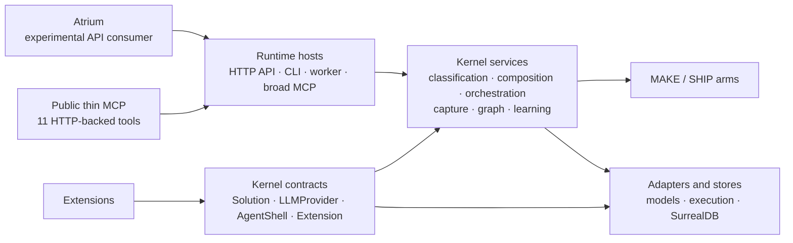
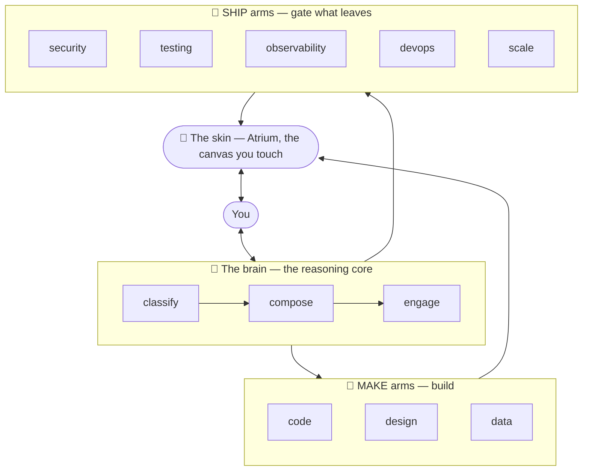
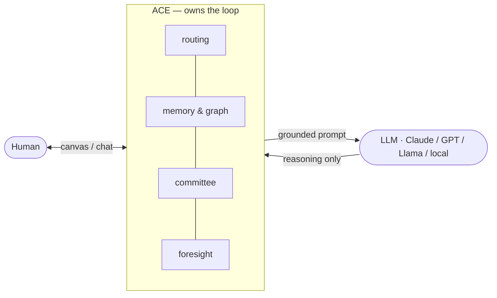
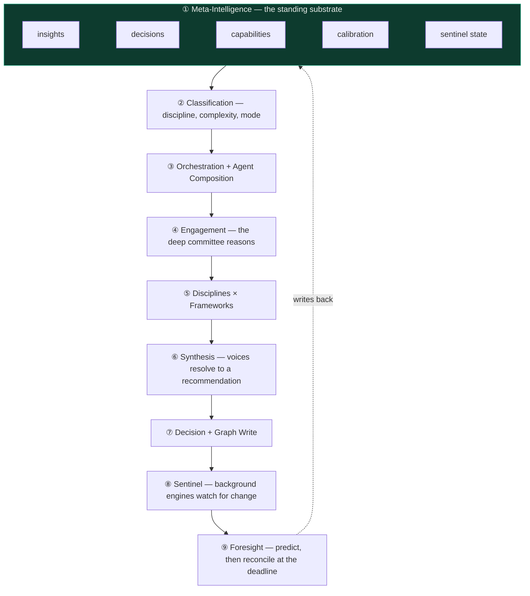
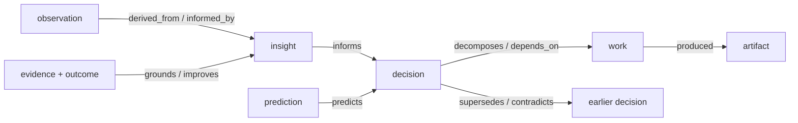
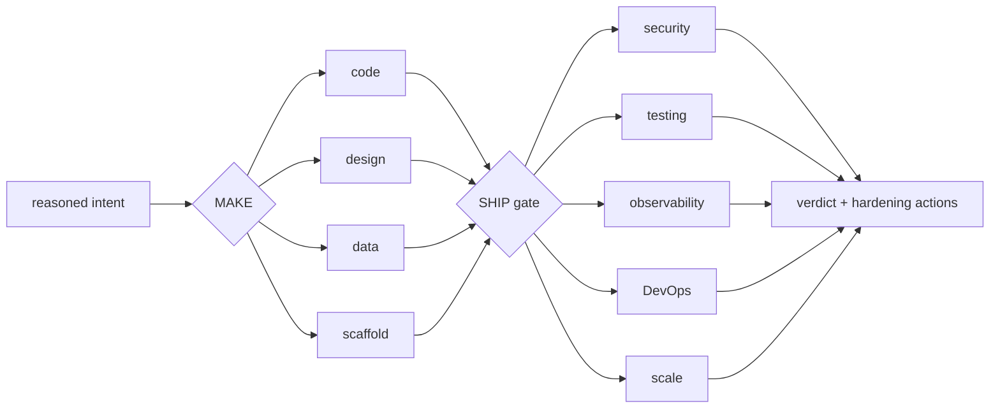
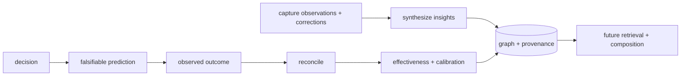
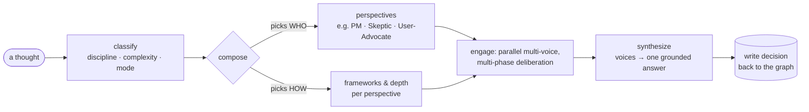

# ACE Architecture

**ACE — the Augmented Cognition Engine.** A reasoning core you partner with, not a chatbot you
operate. You bring a problem; ACE composes a problem-fit set of perspectives, routes them through
the model provider you configure, and synthesizes the result. The model does not drive the loop —
ACE does.

This document is the map: how the pieces fit, why they're shaped that way, and where your own work plugs in.

## Developer-preview as-built map (verified 2026-07-19)

This section records the repository that exists today. Statements labelled **verified** come from
source/import inspection or executable tests. Statements labelled **direction** describe the
boundary ACE intends to converge toward; they are not claims that every module already complies.

### Intended dependency direction



**Direction:** contracts and use-case services must not depend on a transport host. Hosts compose
services and adapters. Extensions depend on the registry/contract facade; core never imports an
extension package. The thin public MCP server is a remote HTTP adapter and never imports the
engine. Atrium consumes API and event state and is not a kernel composition root.

### Boundary and composition-root inventory

| Boundary / root | As built | Protection and status |
|---|---|---|
| Public MCP | `ace_mcp_client/server.py` registers exactly 11 wire tools; `client.py` and `tools.py` call the HTTP API | **Verified:** exact-name/count tests plus source and clean-process import guards; no engine or extension import |
| Full engine MCP | `core/engine/mcp/server.py` declares 112 built-in tools and eagerly adds extension tools at import through `registered_tools()` | **Verified:** broad advanced/experimental host; import-time extension discovery means it is not the preview contract |
| HTTP API | `core/engine/api/main.py` owns the FastAPI app, lifespan, database/schema startup, event/sentinel/notification registration, and a broad router list | **Verified:** largest composition root; required preview endpoints and legacy/experimental routes share one host |
| CLI | `core/engine/cli/main.py` imports and registers Click commands explicitly; commands primarily call HTTP | **Verified:** preview host, but broader than the minimal golden commands |
| Worker | `core/engine/worker/app.py` owns a separate FastAPI lifecycle, SurrealDB live query, capture processing, filesystem watcher, and session services | **Verified:** optional automation/runtime host; not required by the preview allowlist |
| Brain | `orchestrator/`, `orchestration/`, and `cognition/` implement classification, dispatch, patterns, composition, engagement, synthesis, and run traces | **Verified:** `orchestration/executor.py` is the principal reasoning use-case coordinator |
| Meta-Intelligence | `capture/`, `graph/`, `intelligence/`, `learning/`, `foresight/`, and `sentinel/` load and write durable intelligence, outcomes, predictions, and background signals | **Verified:** many modules access the shared DB pool directly; store boundaries are mixed with service logic |
| MAKE / SHIP | `arms/base.py` defines the abstract arm contract; code/design/data/scaffold are MAKE implementations and `ship_arm.py` is the composite gate | **Verified:** arm discovery is lazy but registration is decorator/import based in `arms/registry.py` |
| Model providers | `core/llm.py` owns `LLMProvider`, provider resolution, and several concrete routes; LiteLLM and any-llm adapters are optional extras and lazy imports | **Verified:** protocol is narrow; the main module still combines contract, resolver, and concrete Anthropic/subprocess implementations |
| Execution adapters | `runtime/adapters/`, `session/adapters/`, arm execution modules, Git/GitHub and command tooling connect approved intent to tools | **Verified:** multiple seams exist; there is not yet one preview-stable execution-adapter contract |
| Extensions | `extensions/base.py` defines `Extension`; `extensions/registry.py` is the facade; `loader.py` discovers `ace.extensions` entry points and `ACE_EXTENSIONS` | **Verified:** individual failures are logged and skipped; `ACE_DISABLE_EXTENSIONS=1` supports a naked kernel; the in-tree `extensions/reference` package is registered by `pyproject.toml` |
| SurrealDB/schema | `core/db.py` owns the pool; `core/schema.py`, `scripts/schema_apply.py`, and the versioned `core/schema/v*.surql` files own core migration order | **Verified:** graph/capture/intelligence services frequently query through the concrete global pool; extension schema registration exists but is documented as not consumed by the kernel migration runner |
| Atrium | `core/ui/canvas` is a separate React/Vite client using HTTP, WebSocket, and canvas/event APIs | **Verified:** it depends outward on host state and can fail independently of the MCP/CLI golden path |

### Durable public-task lifecycle

The public `ace_task` path is an asynchronous application boundary rather than a long-held model
request:

```text
thin MCP / CLI
→ authenticated POST /tasks
→ persist product- and user-owned receipt (pending)
→ bounded 202 response
→ in-process orchestration (running)
→ update the same task record with result, reasoning trace, and provenance
→ ace_status / GET /tasks/{id} retrieves terminal state and output
```

The receipt is created before provider or orchestration work, so losing the submitting connection
does not erase task identity or cancel execution. Retry identity is product/user scoped. The
single-process preview reconciles receipts left `pending` or `running` by a runtime restart to
`degraded`; it does not claim resumable distributed execution or public cancellation. Pattern
deadlines (normally 600 seconds), agent/provider deadlines, database acquisition/connect bounds,
and the thin client's ordinary 30-second HTTP timeout remain independent. Because submission no
longer waits for orchestration, MCP-host or proxy request limits do not set the reasoning duration.
Public semantic model aliases are resolved before orchestration, and receipt provenance falls back
to the selected provider and resolved request model when nested execution does not populate the
aggregate provider/model counters.

### Actual inward dependencies and duplication

The following are audit findings, not a request for a speculative rewrite:

- **Verified:** several MAKE/SHIP planners and strategy modules import functions from
  `core.engine.mcp.tools`. This reverses the intended direction: an arm depends on a host-oriented
  tool facade instead of a kernel service. It is deferred until M2 or a MAKE/SHIP path exercises a
  specific call, when that call can be moved behind an existing service with a compatibility shim.
- **Verified:** `foresight/forecaster.py` and `foresight/reconciler.py` import an API canvas helper,
  and `review/providers.py` imports an API PR helper. These are host dependencies inside services.
  They are outside the current preview signature path and need event/port extraction before G2 or
  execution hardening, not a directory move.
- **Verified:** the same eleven conceptual operations exist in both the HTTP-backed thin client
  and the broad in-process MCP server. Their transport behavior and return shapes differ, so the
  thin server is intentionally not implemented by importing the broad server. Contract-name drift
  is protected; shared generated descriptors are deferred until they have a second real consumer.
- **Verified:** the API lifespan and router registration are centralized and extensive, while
  sentinel and arm registration also relies on imports/decorators. This makes startup composition
  understandable only by reading roots and conventions. Extension and arm loading are isolated
  and idempotent, but full API registration remains broad.
- **Verified:** direct global-pool queries are widespread across graph, capture, and intelligence.
  `CaptureService` accepts a pool, but no uniform decision/run/intelligence store boundary exists.
  Introduce a store only when G1 or an exercised preview caller needs an independently testable
  read model; do not wrap every query pre-emptively.

### Optional and experimental seams

- Optional provider routers (`litellm`, `any-llm`), Discord, and browser tooling are dependency
  extras or guarded imports. Extensions have a process-lifetime kill switch and fail independently.
- Atrium, worker automation, sentinels, MAKE/SHIP execution, foresight/calibration, and the broad
  engine MCP are implemented architecture outside the developer-preview shipping allowlist. That
  support boundary does not make them placeholders; it means their APIs and end-to-end behavior are
  not yet compatibility-stable 0.1.x contracts.
- The API still mounts broad reporting, research, voice, notification, and compatibility routes.
  Their presence is not a public compatibility promise.

### Boundary evidence and remaining conventions

Executable tests protect core-not-importing-extensions, naked-kernel loading, reference registry
behavior, exact thin MCP names/count, thin source independence, and clean-process host isolation.
The intended no-host-imports-in-services rule, narrow store ownership, API profile composition,
and a unified execution-adapter boundary remain conventions with known exceptions. New violations
should not be added; existing exceptions should be removed only when an active scenario supplies a
real consumer and verification target.

---

## Inspired by the octopus

ACE takes architectural inspiration from the octopus: a lean coordinating brain working with
specialized arms. The analogy describes the intended distribution of coordination and specialized
work; it is not a literal claim about the ratio of code or intelligence in each component.



- **The brain** decides *who should think about this* and convenes them: `classify → compose → engage`. Selection combines explicit policy, configuration, and learned signals.
- **The arms** are first-class parts of the engine. MAKE turns approved reasoning into code, design,
  data, and scaffold artifacts. SHIP challenges production readiness across security, testing,
  observability, DevOps, and scale; the current gate assesses and proposes without mutating. The
  implementations are present today, while their APIs and end-to-end paths remain experimental
  rather than compatibility-stable 0.1.x contracts.
- **The skin** is Atrium, the experimental ACE Canvas research track. MCP and CLI carry the
  supported developer-preview interaction path.
- **Extensions grow new arms.** A domain (personas, frameworks, recipes, instruments, tools, schema) attaches to the brain without forking it. That's the whole extension model, and it's covered in [build-your-first-extension.md](build-your-first-extension.md).

---

## The nested loop: `Human ↔ ACE ↔ LLM`

The single most important structural decision: **the LLM is inside ACE's loop, not the other way around.**



The LLM is the inference resource ACE *calls* — it cannot write to the graph, choose the next
step, or decide which perspective speaks next. ACE owns those decisions. That separation keeps
the core provider-neutral across its documented routes and lets ACE shape model calls with retained
intelligence rather than surrendering orchestration to a provider.

ACE's Living Product Graph extends this ownership from reasoning into planning and execution. It
connects intent, outcomes, capabilities, decisions, work packets, dependencies, evidence,
observations, approvals, and learning. A roadmap is one projection of that graph—not a separate
task database—and Atrium is initially a view over the same kernel-owned state.

---

## The cognitive pipeline — 9 layers

ACE is implemented as a nine-layer cognitive loop. The supported developer-preview contract is
narrower than the whole engine, but the other layers are real code rather than roadmap
placeholders. **Layer 1, Meta-Intelligence** is the standing substrate of past insights, decisions,
capabilities, provenance, graph relationships, outcomes, calibration, and sentinel state.



The dotted line is an implemented architectural loop with maturity boundaries: exercised paths can
feed accepted conclusions, evidence, and reconciled outcomes back into Layer 1, so later work can
load retained context. Not every host enables every layer, and persistence creates the opportunity
for better-informed later reasoning rather than guaranteeing that every run improves automatically.

### Meta-Intelligence — meaning lives in nodes *and* edges

ACE does not treat memory as a transcript or an undifferentiated vector store. Durable nodes hold
things such as observations, insights, decisions, capabilities, work, reasoning journeys,
predictions, and outcomes. Typed edges carry the meaning between them: dependency, provenance,
composition, effect, conflict, change history, prediction, production, and improvement are distinct
relationships rather than generic similarity.



The relationship-assertion layer validates ontology vocabulary and type compatibility; centralized
edge writers validate endpoints and deduplicate supported writes. Capture records source kind and
trust prior, including deliberately lower priors for ACE's own reasoning and composition, so
generated conclusions are not silently laundered into external evidence. Timestamps, evidence, and
context make a connection inspectable rather than merely retrievable. Grounding edges also support
the reverse question—*which beliefs depend on this object?*—so graph metabolism can enqueue focused
re-evaluation when the grounded object changes.

### Reasoning — compose, engage, synthesize, remember

Classification identifies the discipline, complexity, and mode. Composition selects perspectives,
frameworks, depth, and orchestration shape. Engagement runs that shape through the configured model
provider; synthesis resolves contributions into a recommendation. Decisions, receipts, reasoning
traces, and provenance can then be written through the capture and graph boundary. The model
contributes inference inside these stages; it does not choose the architecture around them.

### Inspectable retained-intelligence use

I3 makes the transition from memory to later decision an explicit read receipt rather than an
inference from logs or prose. `intelligence-use-receipt-v1` links each retained observation or
insight to its source product and receiving product, task, decision, component, stage, and
invocation. It records four distinct evidence states:

```text
retrieved → injected → reflected → decision-material
```

Each arrow is conditional. A missing control stops at the observable state; an identifier mention
or verbatim overlap can be reflected but cannot support materiality; stale, invalidated, foreign,
or incompletely traced intelligence is denied material credit. Decision-material requires an
isolated matched treatment/control pair on the same provider, exact model, configuration, task and
prompt contracts, decision schema, and toolset, plus an exact change to at least one of the six I1
decision fields. Both variants, changed and unchanged fields, metrics, failures, and limitations
remain in the receipt.

The task API persists the receipt and `ace_status` normalizes it without returning private prompts
or retained content. The read-only Living Product Graph projects the same task field; it creates no
second write contract and no execution authority. Unknown versions, missing controls, provider
failures, and partial lineage remain degraded rather than being reconstructed. Material influence
is explicitly not beneficial impact: benefit requires later L1 outcome evidence.

### MAKE and SHIP — reason into action, then gate what leaves

MAKE and SHIP extend the loop beyond recommendation:



The arm registry discovers and routes the built-in scaffold, code, design, data, and SHIP
implementations. MAKE arms share a depth-aware brain/hand loop. SHIP is intentionally an
adversarial production-readiness gate: it produces a verdict and hardening actions, performs no file
mutation, and refuses a vacuous pass. These are substantive engine components. What remains
experimental in 0.1.x is their public compatibility boundary and supported end-to-end journey, not
their place in the architecture.

### Continuous learning — outcomes close the loop

ACE's learning path is an evidence loop, not a claim of automatic self-improvement:



Outcome detection can open and resolve observations from product events when closed-loop learning is
enabled. Foresight attaches measurable, falsifiable predictions to decisions with a horizon,
leading indicators, and a falsification condition. Reconciliation compares predictions with later
measurements, records outcomes, and updates calibration signals. Calibration is loaded into later
orchestration context; effectiveness scores are persisted as an inspectable outcome ledger, with
broader prioritization use still evolving. Each step is inspectable, feature-gated where required,
and designed to degrade without blocking the primary reasoning path.

### Sentinel and foresight — time enters the graph

ACE provides graph-grounded, calibrated foresight. It projects conditional consequences of
decisions, exposes the mechanisms and uncertainty behind them, observes what actually happens,
and uses resolved forecasts to improve later reasoning. This is a bounded, inspectable consequence
model over a product or domain, not a foundation-scale learned model of the physical world. The
[foresight contract](foresight.md) records the current maturity boundary; the
[F1 closeout evidence](f1-foresight-evidence.md) records the passed continuous-delta v1 scope and
the claims that remain gated by I3 and L1.

Sentinel engines run on registered schedules or explicit triggers and record correlated runs and
signals. They watch for gaps, changes, and emerging information without turning background output
into unquestioned truth. Foresight moves decisions forward in time by making predictions that can be
proven wrong; reconciliation brings the evidence back. Together they let ACE retain not only *what
was decided*, but also *what the decision expected and what actually happened*.
Frozen capability-quality indicator rules can produce separate versioned evidence before the
forecast horizon; prose-only indicators remain explicitly manual, and the operational evidence
summary never rewrites the original forecast.
Settled outcome retrieval also freezes a product-scoped outside-view reference class with explicit
similarity features, provenance, sample sufficiency, and limitations. It is kept separate from the
model projection, cannot be confused with a no-action counterfactual, and is compared against the
forecast only after an eligible resolution.
Eligible continuous consequences also produce a separate Prediction Score v1 record using the
declared central interval coverage. Unsupported or under-specified predictions abstain; the older
bounded absolute-delta calibration remains a compatibility diagnostic rather than being renamed a
proper score.
Optional observed comparator records can add no-action, holdout, phased-rollout, or alternative-
intervention evidence after a decision. Eligible rows expose difference-in-differences effects and
design-specific attribution strength at resolution; they never rewrite the frozen forecast and
are not required for cold-start use.
Forecasts can also freeze an optional Comparator Plan v1 that proposes target-grounded assignment,
measurement, timing, and guardrails. Plans require operator confirmation, do not estimate sample
size without statistical inputs, and remain explicitly non-evidence until a separate comparator
observation is captured.
Observed comparators retain a deterministic link to the prediction's frozen plan when available.
Resolution provenance records whether execution aligned, partially aligned, or departed from the
plan and downgrades effective attribution for missing or conflicting execution details. Alignment
never upgrades a design into a verified causal claim.

### Architecture versus the 0.1.x compatibility promise

| Area | Implemented architectural role | 0.1.x promise |
|---|---|---|
| CLI + thin MCP | Supported entry to reasoning, capture, retrieval, and task receipts | Compatibility focus; exactly 11 thin MCP tools |
| Brain + graph | Classification, composition, engagement, synthesis, capture, provenance, and durable relationships | Supported preview path, subject to documented limits |
| Extensions | Add perspectives, frameworks, recipes, tools, and schema without forking core | Reference mechanism and documented boundary are compatibility focus |
| MAKE + SHIP | Build artifacts and challenge production readiness | Implemented; APIs and end-to-end execution paths experimental |
| Learning + outcomes | Detect action/outcome evidence and update effectiveness signals | Implemented; feature-gated and experimental |
| Sentinel + foresight + calibration | Watch for change, predict, reconcile, and calibrate | Implemented; scheduling and public APIs experimental |
| Atrium + broad hosts | Visual research surface and wider API/MCP/worker composition roots | Repository beta / advanced surfaces, not the golden path |

---

## Dynamic composition — policy-guided and assembled at runtime

ACE does not use one fixed committee for every task. The classifier evaluates discipline,
complexity, and mode using explicit policy, configuration, and learned signals. The composer then
**assembles the reasoning shape at runtime** — which perspectives convene, which frameworks apply,
and how many phases the task receives.



**Orchestration** picks *who* engages. **Composition** assembles *how* each one reasons. The path is
runtime-composed within explicit policies and compatibility boundaries; it is not an unconstrained
claim that every problem receives a perfect team. Extensions use the same public registration and
composition seams rather than a separate privileged path.

---

## Where your code plugs in

| You want to… | You touch… |
|---|---|
| Reason about a new domain | an **extension** — personas, frameworks, recipes, instruments, tools, schema, registered via the `ace.extensions` entry point |
| Add a reasoning capability | a **recipe + instrument** pair, addressable by slug; the composer routes to it by discipline, never by name |
| Contribute a pre-built team | a **committee** builder — a composed set of voices |
| Use a supported model route | configure one of the documented provider paths; the ACE loop remains separate from the provider |

Extensions never fork the core. They attach. The core ships empty of any single domain's specifics; you teach it yours. Start at **[build-your-first-extension.md](build-your-first-extension.md)**, and the stability you can build against is in **[extension-api.md](extension-api.md)**.

---

## Reading the code

| Layer | Lives in |
|---|---|
| Classification | `core/engine/orchestrator/` |
| Orchestration · composition | `core/engine/orchestration/` · `core/engine/cognition/composer.py` |
| Engagement (deep committee) | `core/engine/orchestration/deep_committee.py` |
| Meta-intelligence & graph | `core/engine/graph/` · `core/engine/capture/` |
| Sentinel engines | `core/engine/sentinel/` |
| Foresight | `core/engine/foresight/` |
| The canvas (skin) | `core/ui/canvas/` |
| The extension contract | `core/engine/extensions/` |

The brain coordinates; specialized components contribute depth around it. That is the design intent
behind the octopus metaphor.
