# ACE Agent Memory charter, architecture, and current-state audit v1

- Date: 2026-08-11
- Status: **architecture baseline and repository audit; not a supported product claim**
- Roadmap source: [Agent Memory roadmap](agent-memory-roadmap.md)
- Implementation target: `ace-core`

## Evidence posture

This document separates three kinds of evidence:

- **Verified current behavior** is grounded in repository source, tests, accepted evidence records,
  or the published capability inventory.
- **Architectural direction** is a target contract or migration disposition. It is not a claim that
  the current runtime behaves that way.
- **Vendor-described capability** records what a public source says about its own system. It is not
  independent performance, safety, or correctness evidence.

The isolated AM0 baseline is current `origin/main` at `492b99667b0a119234d4a8af26e448254c0a6abd`.
It declares package version `0.6.0`, identifies 0.6.0 as the current published checkpoint, and binds
the bounded Measured Intelligence release evidence. Core 0.6 is therefore a closed, reusable
foundation for project sequencing. Agent Memory must not reopen that release or imply that its L1/I3
evidence is Agent Memory-specific evidence.

## Architectural boundary

Agent Memory is a Meta-Intelligence capability inside ACE. “Meta-Intelligence” is a cross-cutting
capability name, never a fourth package or architectural layer. Agent Memory spans existing Core,
Intelligence, application, and adapter responsibilities without creating a third ACE bounded
context, a second state engine, a second reasoning loop, or a memory sidecar.

Core owns only memory identity and scope, exact source coordinates, ledger/knowledge/world time,
append-only lifecycle, authority bindings, opaque immutable receipts, and erasure dependency proof.
Intelligence owns semantic memory families and reconciliation, semantic queries, ranking-signal
contributions, candidate records and receipts, graph projection/query ports, selection, context
composition, and governed evolution proposals. Application services compose those responsibilities.
SurrealDB remains the first storage implementation. Domain Packs and Organization Overlays may
constrain vocabulary and policy, but cannot mint Core identity, scope, authority, or lifecycle state.

The decisive separation is:

> Recording is not believing; retrieval is not authorization; authorization is not selection;
> selection is not injection; injection is not material use; material use is not benefit.

## Project charter

### Mission

Support ACE as the Intelligence Builder and Intelligence Operating System by providing durable,
portable, evidence-linked continuity across sources, sessions, briefings, monitors, and feedback.
Agent Memory remains largely invisible while ACE preserves authority, provenance, uncertainty,
temporal meaning, scope isolation, lifecycle obligations, and reproducible evidence of material use.

### Public product frame

> **ACE, the Intelligence Builder. Build intelligence, not infrastructure.**

ACE is presented publicly as an Intelligence Builder and, at the complete platform boundary, an
Intelligence Operating System—not as a reasoning engine or a memory product. Cognition is the broad
internal capability spanning memory, learning, planning, and reasoning. Meta-Intelligence is an
internal cross-cutting capability name, never a customer-facing fourth layer.

The primary user journey is:

```text
install → connect sources → map concepts and ontology → receive briefings
→ let monitors keep them current → provide feedback that improves relevance
```

Agent Memory supports this journey through source and context continuity, corrections, scoped
preferences, governed learning, and fresh briefing updates. Users should not need to select memory
families, configure graphs, manage retrieval tiers, or understand memory architecture.

### Bounded product trace

| User-visible step | Invisible Agent Memory support | Authority and evidence boundary |
|---|---|---|
| Connect an authorized source | Preserve exact source/version identity, scope, source coordinates, and three clocks | Connection authority comes from Core; captured content cannot choose its scope |
| Map concepts and ontology | Retain the exact mapping/policy revision references used by Intelligence | Memory does not invent ontology or activate a mapping |
| Receive the first briefing | Supply only authorized current assertions through Candidate Receipt → Context Manifest lineage | Retrieval is not injection, material use, correctness, or benefit |
| A source changes or a user corrects ACE | Append the new evidence/correction and preserve supersession history | No last-write-wins overwrite; correction authority and target must resolve |
| A monitor requests a fresh briefing | Re-evaluate current sources, corrections, preferences, validity, and lifecycle before selection | A monitor proposes work; telemetry does not become memory or ranking authority |
| A later session resumes the product | Restore eligible continuity without exposing private bodies or requiring memory setup | Product, principal, source, visibility, and lifecycle checks run before ranking |
| User feedback improves relevance | Record feedback/outcome evidence as a governed proposal | No automatic self-promotion or benefit claim |

The AM0 acceptance target is the contract and receipt trace across these steps, not an onboarding
agent, source connector, ontology mapper, briefing generator, monitor scheduler, or user-interface
implementation.

### In scope

- an episodic source ledger for sessions, turns, documents, tool events, traces, and external events;
- typed, source-located assertion proposals;
- one reconciliation policy for identity, authority, conflict, uncertainty, supersession, and time;
- one canonical logical memory graph with typed epistemic and lifecycle distinctions;
- rebuildable lexical, vector, document, temporal, spatial, and graph projections;
- authorization-first structured and fused retrieval with bounded traversal and tier escalation;
- Candidate Receipts and Context Manifests;
- governed feedback from decisions, corrections, actions, and outcomes;
- expiry, supersession, redaction, export, erasure, and derivative invalidation;
- SurrealDB-first implementation behind storage-neutral ports; and
- matched evaluation of quality, safety, materiality, latency, tokens, calls, and cost.

### Out of scope

- a new public MCP tool or copied vendor API;
- an onboarding agent or a new onboarding workflow implementation;
- a separate memory service, database, provider router, context-window manager, or reasoning engine;
- automatic promotion of transcript text, tool output, reflection, consolidation, telemetry, or
  model self-assessment;
- treating repetition, retrieval frequency, freshness, or supersession as truth or source trust;
- a second-backend support claim without complete conformance evidence; and
- human-like memory, autonomous improvement, or general benefit claims.

### Definition of done

Agent Memory is complete only when its frozen public contracts, failure semantics, conformance
fixtures, migration behavior, operations guidance, security review, release artifact, and roadmap
state reconcile. Local code, one passing test, or one benchmark cannot independently make the claim.

## Canonical end-to-end architecture

```mermaid
flowchart LR
    subgraph W["Write path"]
        SRC["Authorized sources<br/>sessions · turns · documents · tools · external events"]
        ADMIT["Core admission<br/>principal · product · scope · policy · idempotency"]
        LEDGER["Episodic source ledger<br/>exact bytes/regions · source identity · three clocks"]
        EXTRACT["Typed extraction proposals<br/>identity · fact · context · preference · instruction · uncertainty · correction"]
        RECON["One reconciler<br/>authority · identity · conflict · provenance · supersession · validity"]
        SRC --> ADMIT --> LEDGER --> EXTRACT --> RECON
    end

    subgraph G["Graph construction path"]
        GRAPH["Canonical logical memory graph<br/>evidence · assertions · beliefs · decisions · cognition · outcomes · corrections"]
        INDEX["Derived projections<br/>lexical · vector · document · temporal · spatial · graph"]
        RECON --> GRAPH --> INDEX
    end

    subgraph R["Authorized read path"]
        AUTH["Authorization and lifecycle filter"]
        LOOKUP["Exact typed lookup"]
        FUSE["Fused ranking and bounded traversal"]
        ESC["Visible tier escalation"]
        RECEIPT["Candidate Receipt"]
        GRAPH --> AUTH
        INDEX --> AUTH
        AUTH --> LOOKUP --> FUSE --> ESC --> RECEIPT
    end

    subgraph C["Consumption path"]
        PLAN["Context Planner<br/>budget · freshness · contradiction · dependency checks"]
        MANIFEST["Context Manifest<br/>eligible · authorized · selected · omitted · injected"]
        REASON["ACE reasoning"]
        USE["Decision / response / action / material-use receipts"]
        RECEIPT --> PLAN --> MANIFEST --> REASON --> USE
    end

    subgraph F["Feedback path"]
        OUTCOME["Authenticated correction, review, test, or outcome"]
        PROPOSAL["Governed evolution proposal<br/>rank · reliability · cognition · policy"]
        REVIEW["Existing proposal → review → activation lifecycle"]
        USE --> OUTCOME --> PROPOSAL --> REVIEW
        REVIEW --> RECON
    end

    subgraph L["Lifecycle path"]
        POLICY["Retention / expiry / supersession / redaction / export / erasure"]
        IMPACT["Derivative impact plan"]
        INVALIDATE["Atomic removal or invalidation<br/>sources · assertions · edges · embeddings · summaries · caches"]
        PROOF["Content-free lifecycle receipt"]
        GRAPH --> POLICY --> IMPACT --> INVALIDATE --> PROOF
        INVALIDATE --> INDEX
    end
```



Authorization and lifecycle policy narrow the candidate universe before lookup, ranking, traversal,
or cache access. Derived indexes never authorize a record and never become a competing truth store.

## Repository-backed current-state matrix

### Classification meanings

- **Canonical:** part of the supported contract and intended to remain an owning foundation.
- **Reusable:** sound implementation or contract material that should be composed into Agent Memory.
- **Adapter:** source-specific or persistence-specific implementation behind a new canonical port.
- **Compatibility:** retained temporarily so existing callers continue to work during migration.
- **Experimental:** implemented but outside the stable support boundary or missing required evidence.
- **Retire:** must not remain an independent selector, writer, authority, or truth path after cutover.
- **Candidate:** local implementation exists, but release reconciliation or public acceptance remains.

| Current path | Verified current behavior | Classification | Agent Memory disposition |
|---|---|---|---|
| Grounded State contracts and persistence | Separates immutable evidence, belief assertions, hypotheses, and rollouts; uses product-scoped stable identities, temporal scopes, provenance, replay, receipts, review, correction, and supersession. See [`grounded_state/contracts.py`](../../core/engine/grounded_state/contracts.py), [`ingestion_contracts.py`](../../core/engine/grounded_state/ingestion_contracts.py), and the [capability inventory](../capability-maturity.md). | **Canonical and reusable** | Own source evidence, assertion/belief boundaries, temporal primitives, product scope, deterministic identity, and durable receipts. Extend rather than duplicate. |
| Governed cognition | Immutable revisions, human review, scoped heads, bounded selection/use, expiry, rollback, retirement, and effectiveness proposals are supported in the current release boundary. | **Canonical and reusable** | Own approval and activation for instruction policies, reusable procedures, and durable cognitive memory. Memory evolution submits proposals here. |
| I1–I3 decision, correction, deliberation, and material-use receipts | Supported receipts distinguish decision/correction identity and retrieved, injected, reflected, and decision-material states. [`intelligence_use.py`](../../core/engine/product/intelligence_use.py) requires observed injection, supported reflection, isolated decision delta, validity, scope, and lineage. | **Canonical and reusable** | Own feedback and material-use proof. Do not create a parallel memory-use receipt family where an additive projection suffices. |
| Deterministic candidate infrastructure | [`candidates.py`](../../core/engine/candidates.py) provides provider-neutral bounded lexical, vector, entity, temporal, graph, and source-diversity scoring, versioned index snapshots, explicit unavailable signals, deterministic ordering, and receipts. Product filtering is enforced. | **Canonical foundation; partial for Agent Memory** | Reuse ranking and receipt mechanics. Add pre-ranking actor/session/source/visibility/lifecycle authorization, independent ledger/knowledge/world selectors, and memory-specific policy versions. |
| Grounded State retrieval service | [`grounded_state/retrieval.py`](../../core/engine/grounded_state/retrieval.py) loads product-fenced records before constructing and ranking the snapshot and fails unavailable foreign-product record lookups without disclosing a result. | **Reusable; product-scope partial** | Use as the initial authorized-candidate pattern. It does not yet establish principal, source, session, or tenant authorization. |
| Context Manifest contract identity | The historical [Context Manifest evidence record](../evidence/context-manifest-code-context-v1.md) freezes `ace.context.manifest/v1` as a metadata-only candidate projection, but its referenced implementation file is not present on the isolated current-main baseline. | **Candidate reference; runtime implementation absent from this baseline** | Keep `MemoryContextLineageV1Alpha1` reference-only and additive. Do not copy the preserved dirty-checkout implementation or create a competing manifest/use-receipt family; runtime composition waits for the owning Context Manifest work to land independently. |
| Core canonical source snapshot and immutable record seams | [`ace/core/source.py`](../../ace/core/source.py) treats captured payload as inert evidence, keeps host-owned source definition/scope outside the payload, and preserves publication/effective/observed/ingested times and locators. Immutable-record modules and v174–v175 add atomic opaque records and replay. | **Candidate and reusable** | Reuse as the admission/source-envelope direction. Reconcile with Grounded State rather than creating a second evidence ledger. |
| Session model and adapters | [`session/models.py`](../../core/engine/session/models.py) normalizes events and turns; [`session/adapter.py`](../../core/engine/session/adapter.py) defines an adapter protocol. The generic adapter generates random identities, defaults missing timestamps to now, returns no reconstructed turns, and treats unknown sources as graceful passthrough. | **Experimental adapter** | Keep only behind AM1 source adapters. Replace random/defaulted canonical identity, implicit time, missing participant/role authority, and silent unknown-source fallback with fail-closed/versioned normalization receipts. |
| Stream capture pipeline | [`capture/pipeline.py`](../../core/engine/capture/pipeline.py) writes product-scoped observations and routes durable attempts through one lifecycle function, but observation schemas lack exact spans, authority, three-clock semantics, and canonical memory families. | **Experimental compatibility input** | Adapt accepted inputs into the Agent Memory admission service. Retire direct observation/insight writes as an independent memory truth path after migration. |
| Observation synthesis and insight store | [`capture/schemas.py`](../../core/engine/capture/schemas.py) defines LLM-produced observations and mutable insight updates/conflicts. [`atomic_write.py`](../../core/engine/capture/atomic_write.py) atomically writes a SurrealDB-specific insight, edges, and embedding. | **Experimental; storage adapter plus compatibility** | Preserve useful retry/atomicity patterns. Move semantics to source-grounded proposals and one reconciler; keep SurrealQL and `RecordID` behind the Surreal adapter. Retire `insight` as a competing canonical memory record. |
| Document API and ingestion | [`api/documents.py`](../../core/engine/api/documents.py) stores full text, asynchronously splits headings/paragraphs, creates fragments, invokes the observation model, and marks the document ingested. Direct `GET /documents/{id}` is not product-fenced in the query; sections retain index/title but not exact byte/page/region locators; ingestion lacks a durable queued/partial/failed/repair contract. | **Experimental; high-priority adapter and security debt** | Replace with AM1/AM7 document source admission. Preserve source versions and exact locators, require authenticated product/source scope on every read, and emit durable ingestion receipts. |
| Static capture provenance and trust | [`capture/provenance.py`](../../core/engine/capture/provenance.py) maps string prefixes to static priors, defaults unknown sources to `0.60`, and multiplies trust by corroboration, propagation, and decay. | **Retire from authoritative memory decisions** | Keep only as historical compatibility metadata. Separate source identity, authenticated authority, reliability evidence, belief confidence, freshness, validity, relevance, and retention; missing values remain unknown. |
| Freshness, confidence decay, utilization archival, and graph metabolism | Multiple paths compute age labels, confidence multipliers, utilization scores, archival, and stale projections. They do not share one Agent Memory policy or lifecycle contract. | **Experimental/compatibility** | Inventory each consumer in AM0. Reuse explicit dependency invalidation and stale-state events; reject any path that changes trust, truth, or retention merely from age, retrieval, or use count. |
| Insight forget primitives | [`capture/forget.py`](../../core/engine/capture/forget.py) previews and atomically removes one insight, two edge families, and its row embedding, or scans same-product insight content hashes. It does not enumerate source material, observations, summaries, caches, other graph edges, exports, external bodies, or post-restart rebuild paths. | **Experimental compatibility only** | Do not call this hard erasure. Wrap or deprecate it after AM4 introduces a derivative dependency plan, authority check, atomic failure behavior, and content-free proof. |
| Broad engine MCP | The broad engine host exposes many internal tools, including forget operations. [`ace_mcp_client/server.py`](../../ace_mcp_client/server.py) separately exposes the supported exact eleven-tool HTTP-backed boundary. | **Broad host experimental; thin MCP canonical** | Agent Memory adds no public MCP tool. Administration begins on authenticated HTTP/CLI surfaces; task/status/load/search receive additive projections only. |
| L1 and I3 evaluation | The [L1 evidence record](../evidence/l1-foresight-impact-evidence.md) preserves negative and invalidated attempts and reports a v7 bounded agent-only result against matched controls. [`l1_agent_benchmark.py`](../../core/engine/evaluation/l1_agent_benchmark.py) freezes routes, resources, controls, failures, and one permitted analysis. | **Reusable technical foundation; not an Agent Memory benchmark** | Reuse preregistration, matched-control, route/resource, failure-preservation, and claim-bounding methods for AM6. Build memory-family, correction, authorization, temporal, erasure, and material-use fixtures separately. |
| SurrealDB schema and graph indexes | SurrealDB is the supported persistence implementation and supplies transactions, records, graph edges, full text, vectors, and schema migrations. Many current services query the global concrete pool directly. | **Canonical first adapter; coupling debt** | Keep SurrealDB first and optimize it fully. Freeze storage-neutral semantics and ports before schemas; architecture tests prevent driver, SurrealQL, and concrete record types from entering public Agent Memory contracts. |

## Initial capability matrix

| Capability | Exists today | Target state | Evidence status |
|---|---|---|---|
| Product-scoped immutable evidence and replay | Yes, bounded Grounded State contract | Extend to episodic sessions, turns, tools, documents, and external events | **Supported foundation; Agent Memory extension proposed** |
| Exact source locations | Partial (`source_span` string and source locators) | Versioned byte/page/region/frame/timecode locator union on every assertion | **Partial** |
| Typed memory families | Legacy observation/insight types plus distinct evidence/belief/cognition types | Frozen Agent Memory families with unknown versions failing closed | **Partial and fragmented** |
| One reconciler | Grounded belief review and legacy capture synthesis are separate | One admission and reconciliation path for every proposal origin | **Gap** |
| Three independent clocks | World-time primitives and multiple supporting timestamps exist | Ledger, knowledge, and world selectors with explicit unknown forms | **Partial** |
| Canonical logical memory graph | Several graphs and receipt lineages exist | One typed identity/lineage contract across sources, assertions, cognition, decisions, outcomes, and corrections | **Partial and fragmented** |
| Authorization before ranking | Product-fenced Grounded candidate loading exists | Principal/product/session/source/visibility/lifecycle authorization before every signal and cache | **Partial** |
| Multi-signal retrieval receipts | Deterministic six-signal receipt exists | Memory policy adds typed lookup, temporal axes, bounded traversal, omission, and tier receipts | **Reusable partial** |
| Context selection and material-use evidence | Context Manifest and I3 exist locally/supported in parts | Stable Candidate Receipt → Context Manifest → I3 lineage | **Strong foundation; release reconciliation pending** |
| Governed instruction/procedure promotion | Governed cognition lifecycle exists | Memory proposals bridge into it without direct activation | **Supported foundation** |
| Complete lifecycle and erasure | Supersession, expiry, retirement, and narrow insight forget exist in different paths | Unified retention/export/redaction/erasure with derivative dependency proofs | **Gap** |
| Storage portability | Contracts are often provider-neutral, but many services use SurrealDB directly | Surreal-first ports plus later second-backend conformance | **Partial; second backend absent** |
| Memory-specific benchmark | L1/I3 measurement machinery exists | Frozen AM6 corpus and matched memory/no-memory/full-context/tier controls | **Gap** |

## Risk register

| Risk | Failure mode | Required control | AM owner | Initial severity |
|---|---|---|---|---|
| Memory poisoning | Repeated or model-generated claims become treated as reliable truth | Immutable source lineage; independence detection; proposal posture; governed review; no frequency-based trust | AM2/AM5 | Critical |
| Prompt injection | Retrieved source text becomes behavioral instruction | Separate instruction-policy channel; authenticated authority; source text never self-authorizes; injection fixtures | AM2/AM3 | Critical |
| Scope leakage | Candidate generation, traversal, cache, or exports reveal foreign material or existence | Authorization and lifecycle filter before all indexes; non-disclosing failures; scope-keyed dependencies and receipts | AM3/AM4/AM9 | Critical |
| Scope laundering | Extracted text or adapter metadata selects product, actor, session, or authority | Host-injected Core scope; adapter cannot mint IDs or grants; exact admission receipt | AM0/AM1/AM7 | Critical |
| Identity collision | Two sources or principals merge incorrectly, or identical bytes collapse distinct authority | Source identity includes origin, version, scope, and locator; unresolved identity remains explicit; divergent replay conflicts | AM1/AM2 | High |
| Self-reinforcement | Retrieval/use telemetry boosts its own future rank or belief confidence | Telemetry separated from semantic receipts; feedback only creates versioned proposals; matched evaluation and review required | AM5/AM6 | Critical |
| Stale reuse | Cached or summarized output survives correction, access change, or policy/index update | Full dependency keys; pre-use revalidation; invalidation on every semantic, authority, policy, and index dependency | AM3/AM5 | Critical |
| Graph contamination | Weak extraction creates durable typed edges that spread through traversal | Proposal edges; typed epistemic status; bounded traversal; exact extraction receipt; uncertainty and repair path | AM2/AM3 | High |
| Incomplete erasure | Erased content reappears from source bodies, embeddings, edges, summaries, caches, backups, or rebuild | Derivative dependency index; dry-run impact plan; atomic mutation; post-restart/rebuild/export probes; declared backup limits | AM4 | Critical |
| Backend coupling | SurrealQL, `RecordID`, MVCC, or index behavior becomes public semantics | Dependency-light contracts and ports; architecture import tests; second-backend conformance before portability claim | AM0/AM9 | High |
| Unknown-value fabrication | Missing time, authority, identity, confidence, or reliability receives a convenient default | Explicit unknown variants; contract validation; no `now`, full-trust, or global-scope fallback | AM0/AM1/AM2 | High |
| Unbounded transcript exposure | Receipts, errors, traces, or UI return private source bodies | Metadata-only public projections; bounded locators; redaction; source-body authority checked separately | AM1/AM3/AM8 | High |
| Partial write/replay drift | Retries duplicate events or leave graph/index state inconsistent | Deterministic identities; atomic canonical write; idempotent exact replay; divergent replay fail-closed; repair receipts | AM1/AM2/AM4 | High |
| Misleading benefit claim | Material influence or one successful task is reported as improvement | Matched controls, preregistration, negative-result preservation, product-owned outcomes, bounded claims | AM6 | High |

## Decision ledger

All Spectron entries below are vendor-described capabilities from its public
[deep dive](https://surrealdb.com/spectron/deep-dive) and
[documentation](https://surrealdb.com/docs/spectron). They are research inputs, not ACE evidence.

| Public pattern or choice | Decision | ACE rationale |
|---|---|---|
| Typed episodic, identity, knowledge, context, instruction, and uncertainty material | **Adopt capability pattern with ACE-native meanings** | Typed lifecycles are useful, but ACE additionally keeps evidence, belief, cognition, decision, and outcome authority distinct. |
| Exact source spans and provenance on derived facts | **Adopt** | Required for correction, audit, replay, authorization, and erasure. |
| One reconciliation path for turns and documents | **Adopt and broaden** | Every extraction, reflection, consolidation, and adapter proposal must receive identical identity, authority, conflict, time, and lifecycle guarantees. |
| Canonical temporal graph with episode provenance | **Adopt pattern** | Graphiti publicly demonstrates episode → entity/fact lineage and validity windows. ACE requires three independent clocks and its own identities. [Graphiti](https://github.com/getzep/graphiti) |
| Schema-free entity-to-memory co-occurrence graph | **Use only as a derived retrieval signal** | Mem0 documents co-occurrence links rather than typed entity relations. Co-occurrence cannot become canonical semantic truth. [Mem0](https://docs.mem0.ai/platform/features/graph-memory) |
| Semantic, lexical, graph, temporal, document, and optional spatial retrieval | **Adopt as versioned derived signals** | Signals improve recall only after authorization and remain explainable projections. |
| Tiered exact lookup, dependency-valid reuse, fused retrieval, and explicit fallback | **Adopt with ACE safety gates** | Cheap routes may win only after scope, freshness, contradiction, uncertainty, dependency, and answer-shape checks. |
| Response caching keyed to cited facts | **Adopt and broaden dependencies** | Include principal/scope, policy, lifecycle, model/config, index, and source versions; check authorization before lookup. |
| Persistent always-visible, agent-managed memory blocks | **Reject as canonical authority model** | Letta's pattern is useful for context ergonomics, but ACE cannot make retrieved or agent-edited blocks unconditional prompt authority. [Letta](https://docs.letta.com/v1-sdk/memory/memory-blocks) |
| Semantic, episodic, and procedural memory categories plus foreground/background formation | **Adopt descriptive taxonomy and timing options only** | LangMem's storage-neutral enrichment pattern is useful; ACE adds authenticated authority, exact lineage, and lifecycle gates. [LangMem](https://langchain-ai.github.io/langmem/concepts/conceptual_guide/) |
| Storage-neutral memory interface | **Adopt principle, not API** | AutoGen shows a storage/retrieval-neutral protocol. ACE will define its own contracts and keep context mutation governed. [AutoGen](https://microsoft.github.io/autogen/stable/reference/python/autogen_core.memory.html) |
| One multi-model physical substrate as the product boundary | **Reject** | SurrealDB is first and should be used well, but one logical graph does not require one physical store and public semantics must remain portable. |
| Trace history directly boosting useful rows or demoting corrected rows | **Reject** | Telemetry cannot self-promote; correction, use, and supersession are evidence for a governed policy proposal, not automatic trust or rank authority. |
| Supersession lineage lowering source trust | **Reject** | A changing world or corrected claim does not by itself make a source less reliable. Reliability needs separately governed outcome evidence. |
| Reflection, elaboration, or consolidation persisting as ordinary facts | **Reject direct promotion; adopt proposals** | Derived material retains full inputs, lower/separate authority, reconciliation, and review. |
| Vendor SDKs, APIs, schemas, identifiers, MCP contracts, generated clients, or runtime dependencies | **Reject** | ACE implements public capability patterns independently in ACE vocabulary and contracts. |
| Vendor benchmark figures and marketing comparisons as targets | **Reject** | ACE acceptance uses frozen fixtures, matched controls, recorded failures, tokens, latency, provider calls, and actual cost. |

## Immediate conclusion

ACE already has the hardest governance foundations. AM0 should not start by designing another graph
or storage schema. It should freeze the shared vocabulary and ports, classify every legacy writer and
reader, and prove that only the accepted Grounded State, governed cognition, receipt, and Context
Manifest foundations can become canonical. AM1 and later packets can then implement episodic data
without inheriting legacy capture semantics by accident.
