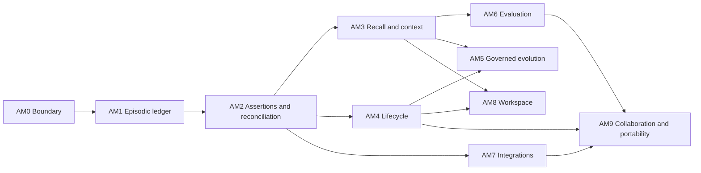

# ACE Agent Memory roadmap

Status: **AM0–AM4 are composed into the passed public Core 0.7.0–0.8.0 releases (0.7.0 composes
AM0–AM3; 0.8.0 consumes AM4 through the authorized resource plane); AM5 onward remain a proposed
cross-release roadmap, not accepted or supported product outcomes.** See the
[public roadmap](../../ROADMAP.md) for authoritative outcome state.

This roadmap defines an open, ACE-native Agent Memory capability inside the internal,
cross-cutting Meta-Intelligence capability. Meta-Intelligence is not a customer-facing package or
fourth layer. Agent Memory turns conversations and agent experience into durable, scoped,
inspectable context without adding
a second reasoning system, a second state engine, or a memory sidecar. It aligns the capability to
the existing ACE release spine; it does not create an additional release promise or override the
[public roadmap](../../ROADMAP.md).

The design is informed by public agent-memory product capabilities, including Spectron, but ACE
will implement the capability independently. No Spectron binary, SDK, API contract, MCP shape,
schema, identifier, generated client, or runtime dependency enters ACE.

## Decision

Agent Memory is an **internal Meta-Intelligence capability**, not a new ACE layer.

- The **Grounded State Engine** owns source identity, temporal evidence, reconciliation,
  supersession, uncertainty, bounded retrieval candidates, and durable receipts.
- The **cognitive memory plane** owns sparse durable decisions, corrections, preferences,
  procedures, and accepted conclusions that may influence later reasoning.
- The **Context Composer and Context Manifest** own authorized task-time selection, injection,
  omission, freshness, budget, and observed-use projections.
- **Core authority** owns actor and product scope, approval, promotion, retention, erasure, and
  future principal and tenancy enforcement.
- The **ACE cognition runtime** decides how retrieved memory participates in classification,
  composition, deliberation, decisions, actions, and outcome evaluation.

Agent Memory spans those existing responsibilities; it creates no parallel persistence, provider,
reasoning, provenance, authority, or learning plane.

## Product promise

ACE is framed publicly as the **Intelligence Builder** and, at the complete platform boundary, the
**Intelligence Operating System**:

> **ACE, the Intelligence Builder. Build intelligence, not infrastructure.**

The customer journey is `install → connect sources → map concepts and ontology → receive briefings
→ let monitors keep them current → provide feedback that improves relevance`. Cognition remains the
broad internal capability spanning memory, learning, planning, and reasoning. Agent Memory remains
largely invisible: it supplies durable source/context continuity, corrections, preferences,
governed learning, and fresh briefing inputs without asking users to manage memory architecture.

When this roadmap is complete, an ACE deployment can:

1. retain the exact authorized experience of agents and users across sessions;
2. extract typed memory assertions while preserving the source transcript and exact source span;
3. distinguish a reported statement from a reviewed belief, instruction, correction, decision, or
   approved procedure;
4. reconcile updates, conflicts, uncertainty, validity, and source authority without silent
   last-write-wins behavior;
5. answer independently what the memory ledger contained, what ACE knew, and what was true in the
   represented world at a requested time;
6. retrieve only authorized, relevant, current memory under explicit item, token, time, and cost
   budgets;
7. show what was eligible, selected, omitted, injected, reflected, and decision-material;
8. expire, supersede, redact, export, or erase memory through explicit lifecycle policy;
9. propose elaboration and consolidation without silently promoting model output; and
10. reproduce the same identities, authority decisions, and lifecycle history after restart,
   upgrade, export/import, and a supported backend change.

## Memory model

The public contract should freeze meanings before table names or physical indexes.

| Family | Meaning | Default posture | Promotion rule |
|---|---|---|---|
| Episodic experience | Ordered sessions, turns, tool events, and participant roles as authored | Immutable source evidence; bounded transcript access | Never promoted merely because it was recorded |
| Identity assertion | A source-attributed statement about a person, agent, organization, or durable role | Long-lived but contestable; no global identity inference | Review or explicit source policy determines authoritative use |
| Learned fact | Something a participant, tool, or document reported | Grounded evidence, not ACE truth | Must pass reconciliation and any required review |
| Active context | Short-lived task, incident, sprint, meeting, or local working state | Expiring and replaceable | Cannot become durable solely through repeated retrieval |
| Preference | A stated choice about presentation, collaboration, or working style | Scoped to the named principal/product and correctable | Explicit user statement or governed review |
| Instruction policy | Behavioral direction that may affect future agent behavior | Untrusted as data until authority and scope are resolved | Requires authenticated authority; source text cannot self-authorize |
| Uncertainty | A known conflict, missing fact, weak extraction, unresolved identity, or insufficient authority | First-class and retrievable | Resolution appends evidence or review; it is never overwritten silently |
| Correction | An explicit challenge or replacement of prior memory or output | High-priority lifecycle event with exact target lineage | Authenticated correction authority; preserves prior history |
| Durable cognitive memory | Accepted decision, reusable procedure, governed cognition, or eligible conclusion | Sparse, versioned, inspectable, and outcome-linked | Existing governed proposal, review, activation, and promotion lifecycle |

These are semantic families, not necessarily one table each. A record may participate in multiple
read projections, but it has one canonical identity, source lineage, authority state, and lifecycle.

## Temporal contract

Agent Memory needs three independently queryable clocks. ACE should expose them in its own
storage-neutral vocabulary rather than making a database's MVCC behavior part of the product
contract.

| ACE clock | Question it answers | Canonical meaning |
|---|---|---|
| Ledger time | What record or projection did ACE persist at this transaction coordinate? | Append-only revision, activation, supersession, expiry, and erasure events ordered by a Core-owned commit coordinate. Native database history may accelerate this query but cannot define its semantics. |
| Knowledge time | What evidence or assertion had become available to ACE by this time? | Immutable first-known time plus subsequent review and supersession lineage. Re-import, replay, projection rebuild, or backend migration cannot move first-known time forward. |
| World time | When did the represented event occur or assertion apply? | `occurred_at` or `valid_from`/`valid_to`, including precision, uncertainty, and provenance. It is independent of publication, ingestion, extraction, and ACE knowledge time. |

The public query shape should therefore carry distinct ledger, knowledge, and world-time selectors,
including interval and unknown-time forms. A single undifferentiated `as_of` is insufficient. Source
publication, ingestion, extraction, ACE creation, review, use, expiry, and deletion timestamps remain
separate supporting evidence; none is silently substituted for another clock.

## Structural graph and trace contract

Agent Memory should expose one **canonical logical memory graph**: sessions, turns, documents,
entities, assertions, uncertainty, decisions, cognition, retrieval receipts, responses, actions,
outcomes, and corrections share stable identities and typed, versioned relationships. Document
bodies, embeddings, lexical indexes, and graph projections are derived access paths linked to those
identities, not competing sources of truth.

One logical graph does not require one physical table, index, or database. ACE preserves the
epistemic boundary among source evidence, reviewed belief, simulation, decision, and governed
cognition while making their lineage traversable through one contract. SurrealDB may store native
edges efficiently; another adapter may reproduce the same contract with relational edges and
indexes.

Operational traces and Agent Memory receipts also remain distinct:

| Artifact | ACE posture |
|---|---|
| Operational telemetry | OpenTelemetry spans, logs, metrics, and provider timings diagnose execution. They are not durable memory or behavioral authority by default. |
| Semantic trace receipt | Bounded retrieval, context-selection, decision, response, action, and material-use receipts are durable graph-addressable records linked to exact inputs, policies, sources, and outputs. They expose no hidden chain-of-thought. |
| Outcome and calibration evidence | Authenticated corrections, reviews, observed outcomes, and controlled evaluations may propose rank or source-reliability changes through a governed, versioned policy lifecycle. |

This separation makes “why did ACE answer that?” replayable without allowing raw telemetry, model
self-assessment, or an unverified positive response to modify future behavior.

## Non-negotiable invariants

1. **Agent Memory is not chat-history stuffing.** Raw turns remain addressable source evidence;
   extracted assertions and prompt-ready context are separate projections.
2. **Recording is not believing.** A turn, tool result, document, or model extraction cannot promote
   itself into reviewed belief, instruction policy, cognition, or durable memory.
3. **Retrieval is not use.** Eligible, authorized, selected, injected, reflected, decision-material,
   beneficial, harmful, and still-unproven remain distinct states and receipts.
4. **Source instructions are data.** Prompt injection inside a turn, tool result, or document never
   acquires behavioral authority by being retrieved.
5. **Scope is authoritative input.** Product, actor, session, source, and future tenant scope come
   from authenticated Core context, never from extracted text or model output.
6. **Authorization narrows before ranking.** Search, graph expansion, cache lookup, elaboration,
   consolidation, and response reuse operate only over already-authorized candidates.
7. **The three clocks remain independently queryable.** Ledger time, knowledge time, and world time
   never collapse into one `as_of`; publication, ingestion, extraction, ACE creation, review,
   supersession, expiry, and deletion remain distinct supporting timestamps.
8. **Unknown stays unknown.** Missing identity, time, source, authority, or confidence is represented
   explicitly and cannot be replaced with a convenient default.
9. **Every context item has stable identity.** Version or digest, source span, scope, resolver,
   policy, freshness, and lifecycle state are available before an item is reported as selected.
10. **No silent self-modification.** Reflection, elaboration, consolidation, trace feedback, and
    measured outcomes create proposals or bounded ranking observations, not automatic authority.
11. **Corrections preserve history.** Supersession closes the prior current state and appends the new
    state; compliance erasure is a different, explicitly authorized operation.
12. **Erasure covers derivatives.** A hard-erasure plan identifies source records, extracted
    assertions, embeddings, graph edges, cached responses, derived summaries, and external bodies;
    the audit receipt retains no erased content.
13. **The public MCP boundary stays at eleven tools.** Agent Memory composes through existing tools
    and additive receipt projections. Import, retention, erasure, and administration begin on
    explicit CLI/HTTP management surfaces.
14. **Storage is an adapter, not the product boundary.** SurrealDB remains the first supported
    implementation, while contracts and conformance tests prevent SurrealQL or driver types from
    entering public Agent Memory interfaces.
15. **Portability is proved, not claimed.** A second backend becomes supported only after it
    reproduces canonical identities, temporal and scope behavior, retrieval receipts, lifecycle,
    replay, and failure semantics.
16. **One logical graph does not mean one truth bucket.** All memory families share canonical
    identities and typed lineage, while evidence, belief, hypothesis, simulation, decision,
    cognition, and outcome retain separate authority and lifecycle semantics.
17. **Telemetry cannot self-promote.** Operational spans and model self-assessment cannot directly
    become memory, boost a row, demote a source, or change a rank policy.
18. **The cheapest safe route wins.** Cost and latency may choose among routes only after scope,
    freshness, dependency, correctness, and escalation requirements are satisfied.
19. **Freshness is not truth or trust.** Age, real-world validity, relevance, belief confidence,
    source reliability, and retention are separate signals. Retrieval or repetition alone never
    reinforces a memory, and missing trust is never treated as fully trusted.
20. **A repair is not a reusable procedure.** Completing or recovering one task may supply evidence
    for a capability proposal, but only the governed cognition lifecycle can version, evaluate,
    approve, and activate it for later work.

## Intentional non-goals

- Recreating Spectron's seven MCP tools or its REST/SDK surface.
- Treating all conversation content as durable or useful memory.
- Giving a model direct write authority over instructions, profiles, cognition, or promotion.
- Exposing hidden chain-of-thought, unrestricted transcripts, private prompts, or credentials.
- Building a separate vector store, agent runtime, context-window manager, or memory database.
- Requiring every graph projection, body, index, or operational trace to live in one physical store.
- Treating OpenTelemetry spans, raw logs, model confidence, or answer popularity as self-authorizing
  memory or ranking feedback.
- Claiming human-like memory, general knowledge correctness, autonomous improvement, or beneficial
  impact without bounded evaluation evidence.
- Making cross-user or cross-product memory global for convenience.
- Replacing the Grounded State Engine, governed cognition, I1-I3 receipts, or Context Manifest.

## Existing foundations to reuse

ACE does not begin from zero:

- K1-K3 provide product-scoped temporal evidence, deterministic candidate/evidence receipts,
  reviewed as-of belief projections, correction, supersession, promotion, restart, and replay.
- E1 provides immutable governed-cognition revisions and the
  `teach -> propose -> inspect -> approve -> use -> measure -> revise or retire` lifecycle.
- I1-I3 provide decision/correction identity, attributable deliberation, and the distinction among
  retrieved, injected, reflected, and decision-material intelligence.
- `ace.context.manifest/v1` provides agent/stage attribution, budgets, omissions, freshness,
  degradation, and privacy-preserving durable metadata.
- Grounded State entities and evidence relations, relational assertions, the Living Graph, and
  cognition lineage provide substantial graph foundations, but they do not yet present one
  canonical Agent Memory graph contract.
- ACE emits OpenTelemetry GenAI spans and records provider usage, while I1-I3 and candidate/context
  receipts provide the safer semantic foundation for replayable memory traces. These remain
  separate until a governed trace-normalization contract exists.
- The current engine contains experimental session normalization, transcript capture, observation
  extraction, session summaries, consolidation, cost tracking, and audited insight erasure. These
  are implementation inputs, not automatically the canonical Agent Memory contract.
- The eleven public tools already cover session start, capture, load, search, task reasoning,
  status, briefing, and related-intelligence discovery.

The primary architectural debt is convergence: legacy capture, document, session, search, cache,
reflection, consolidation, and forget paths do not yet share one supported Agent Memory admission,
reconciliation, authority, lifecycle, and receipt model.

## Release integration

Agent Memory advances the existing release promises rather than competing with them.

| Existing release | Agent Memory contribution | Boundary |
|---|---|---|
| 0.3.x Productized State | Preserve the Context Manifest and later-material-use foundation; freeze this roadmap without widening the release | No new public memory promise |
| 0.4.0 Governed Cognition | Freeze Agent Memory contracts; import authorized sessions/documents; create inspectable memory and learning proposals; approve instructions, preferences, corrections, and procedures through E1 | No silent promotion and no new MCP tool |
| 0.5.0 Reasoning into Action | Recheck memory and instruction authority at action time; attach exact memory-use lineage to decisions and effects | Memory never authorizes an action by itself |
| 0.6.0 Measured Intelligence | Evaluate retrieval, correction recall, instruction adherence, latency, cost, material use, and outcome effects with matched controls | Material influence is not benefit |
| 0.7.0 Extension Platform | Publish Agent Memory adapter/conformance contracts; add document, prior-session, tool-trace, and optional multimodal ingress; generate supported client bindings | Extensions propose source material but never own Core identity or authority |
| 0.8.0 Intelligence Workspace | Add session, memory, uncertainty, lineage, profile-policy, context-manifest, review, retention, and erasure views | UI is not a second source of truth |
| Post-1.0 Collaborative Intelligence | Add principals, tenant/team/private scopes, delegation, shared retention and export/import, disaster recovery, horizontal operation, and supported backend portability | Shared administration does not imply read or use authority |
| 1.0.0 Intelligence Operating System | Stabilize Agent Memory as one complete public Core/Intelligence capability | Compatibility, recovery, governance, and portability evidence required |

## Work packets

### AM0 — Boundary and contract freeze

**Outcome:** one approved architecture boundary and vocabulary prevents another parallel memory
system from emerging.

Scope:

- classify current session, capture, document, insight, correction, context, cache, consolidation,
  forget, trace, static trust-prior, confidence-decay, freshness, and utilization-archive paths as
  canonical, adapter, compatibility, experimental, or retire;
- freeze session, turn, participant, source-span, memory-assertion, lifecycle, retrieval, context,
  and evolution contract requirements before schemas;
- freeze storage-neutral ledger-time, knowledge-time, and world-time meanings plus independent
  query selectors before relying on native database history;
- define the exact bridge to Grounded State, cognitive memory, governed cognition, I1-I3, and the
  Context Manifest;
- freeze a bounded Intelligence Builder trace from authorized source connection through first
  briefing, correction/update, monitor-triggered refreshed briefing, later-session continuity, and
  feedback proposal without implementing an onboarding agent;
- define storage ports without changing the supported SurrealDB implementation; and
- publish a threat model covering poisoning, prompt injection, identity collision, scope laundering,
  stale caches, cross-product leakage, silent promotion, and incomplete erasure.

Acceptance gate:

- an architecture test proves no Agent Memory contract imports an HTTP host, extension package,
  SurrealDB driver, or concrete database type;
- unknown contract versions and memory families fail closed;
- the bounded product trace preserves source/policy/Context Manifest/I3 lineage and proves that
  repeat briefing freshness and later-session continuity require no user-managed memory surface;
- the naked kernel and zero-Agent-Memory configuration still start; and
- the thin MCP inventory remains exactly eleven tools.

### AM1 — Episodic experience ledger

**Outcome:** ACE can retain and inspect authorized sessions and turns as exact source experience.

Scope:

- stable session, turn, participant, role, source-adapter, external-event, and idempotency identity;
- ordered user, assistant, system, and tool events without granting system/tool content authority;
- exact source spans and bounded transcript views;
- per-session product, actor, source, and optional task/decision linkage;
- batch and streaming adapter proposals with retry, partial, duplicate, and out-of-order handling;
- transcript privacy boundaries and public content-free receipts; and
- import of prior agent sessions as typed sources with queued, ready, partial, failed, stale,
  retry, and repair states.

Acceptance gate:

- two source adapters normalize the same frozen session into the same canonical identities;
- exact replay creates no new records and divergent material at the same coordinate conflicts;
- turns remain correctly ordered after database/API restart;
- foreign-product and unauthorized transcript reads fail without revealing existence; and
- public receipts contain source identities and spans but no unrestricted transcript body.

Candidate posture (2026-08-12): AM1 is implemented and verified on
`codex/v0.7-agent-memory-am1` from exact convergence commit
`a55edc2848c742dc98cfa01f6632bb75d5f31d81`. That convergence commit has exactly two parents:
AC7 `c7ff511a80ab3bdd3a13e7ca270567eaf6b3b1bf` and AM0
`48e1aea6ff848be63aab2d49adda1428231ca522`. PR #108 remains authoritative for all AM0-owned
files and claims. The convergence history must not be squashed or rewritten. AM1 acceptance and
publication evidence are still required; this coordinate is not a release, maturity, durability,
or benefit claim.

AM2 remains closed. It may not begin until the control tower accepts the AM1-only publication,
records its exact integrated base, and confirms that AM1 stayed within provider-neutral episodic
identity, authorized ingestion/read, lifecycle, privacy, and durable replay boundaries.

### AM2 — Typed memory assertions and reconciliation

**Outcome:** ACE converts experience into typed, source-grounded memory assertions without silently
turning extraction into truth.

Scope:

- identity, learned fact, active context, preference, instruction policy, uncertainty, and
  correction proposals;
- one reconciliation path for turn, document, explicit capture, reflection, elaboration, and
  consolidation proposals;
- source authority, confidence, source independence, temporal validity, supersession, conflict,
  duplicate, and unresolved-identity handling;
- a source envelope on every fact-bearing node and edge containing source kind and identity,
  modality-aware location, exact span or region, derivation lineage, and separately governed source
  reliability;
- immutable first-known coordinates and append-only knowledge-revision lineage distinct from
  real-world validity and ledger commit time;
- a canonical typed graph projection over sources, sessions, turns, entities, assertions,
  decisions, cognition, outcomes, corrections, and their versioned lineage without flattening
  epistemic status;
- Domain Pack vocabulary and Organization Overlay policy as versioned constraints;
- preview-without-write extraction and exact extraction/reconciliation receipts; and
- governed promotion into reviewed belief, instruction policy, cognition, or durable cognitive
  memory.

Acceptance gate:

- same-source updates create an inspectable supersession chain;
- cross-source disagreement produces explicit uncertainty rather than a silent winner;
- a prompt-injection sentence remains source data and cannot become an instruction policy;
- low-confidence and unresolved-identity cases remain proposals or uncertainty;
- absent source reliability, freshness, or validity never defaults to full trust, current truth, or
  retrieval eligibility;
- a correction wins later retrieval only after its exact authority and target are resolved;
- document, turn, and reflection inputs receive identical lifecycle guarantees; and
- the same assertion can be queried independently by ledger, knowledge, and world time without
  substituting ingestion time for an unknown value.

### AM3 — Recall and Context Planner

**Outcome:** later ACE reasoning receives the smallest authorized memory set that materially
orients the task, with complete selection and omission evidence.

Scope:

- pre-ranking authorization over product, actor, session, source, visibility, and lifecycle;
- deterministic structured lookup for typed identity, instruction, correction, and current-state
  questions;
- authenticated instruction-policy resolution as a separate context-assembly input rather than an
  ordinary relevance-ranked fact; retrieved source text cannot enter that policy channel;
- independent ledger-time, knowledge-time, and world-time filters, including interval and unknown
  forms, applied before temporal ranking;
- a versioned fused-rank policy over lexical/BM25, vector, entity, temporal, bounded graph
  traversal, personalized graph rank, keyword bridges, section-level embeddings, source diversity,
  governed trust, optional radius/polygon/nearest-neighbor spatial predicates, and governed
  prior-use/correction/outcome signals;
- progressive resolution through exact governed projection, dependency-valid response reuse,
  structured or fused retrieval, bounded graph expansion, compact synthesis, and full reasoning,
  stopping at the cheapest safe tier that satisfies the request;
- profile, instruction, fact, uncertainty, decision, cognition, document, and code-context blocks;
- durable semantic retrieval, decision, response, and use receipts linked by typed graph edges to
  cited sources, route/tier, policy and index snapshots, corrections, and observed outcomes;
- stable Context Manifest expansions for candidates, scores, omission reasons, freshness, cost,
  latency, receiving agent/stage, injection, reflection, and decision-material use; and
- explicit degraded states for missing indexes, stale sources, denied access, thin evidence,
  budget exhaustion, and provider failure.

Acceptance gate:

- authorization is applied before every retrieval signal and cache lookup;
- frozen queries reproduce exact selected identities under an unchanged policy/index snapshot;
- changing only one temporal selector changes only that query dimension and produces an
  attributable candidate and omission receipt;
- every fused result reports per-signal scores, unavailable signals, policy version, selected and
  omitted candidates, and deterministic tie behavior; signal ablations remain reproducible;
- contradictions and current corrections are retrieved ahead of superseded assertions;
- exact projection or response reuse bypasses a model only when authorization, dependency,
  freshness, contradiction, uncertainty, and answer-shape checks pass; otherwise the route
  escalates visibly;
- any synthetic query expansion is labeled as a retrieval aid, recorded in the receipt, and barred
  from minting entity identity, evidence, belief, or instruction authority;
- a replay can traverse the exact evidence, selection, decision, response, and correction lineage
  without exposing private source bodies or hidden reasoning;
- omission and truncation are visible and bounded;
- an independent later invocation materially uses eligible memory after restart; and
- a matched no-memory control establishes materiality without claiming benefit.

### AM4 — Lifecycle, retention, export, and erasure

**Outcome:** users and operators control how long Agent Memory exists and where it can travel.

Candidate posture (2026-08-12): AM4 is implemented on the isolated
`codex/v0.7-agent-memory-am4` lane from exact cumulative integration base
`f761a682164d10e2ff81ba38cd2d0c987b4f8efd`. Its bounded contract, ownership, backup limitation,
verification matrix, and AM5/AM8/AM9 handoff are recorded in
[`agent-memory-am4-work-packet-v1.md`](agent-memory-am4-work-packet-v1.md). This is a stacked draft
candidate only; it changes no package identity, supported capability claim, release, or AM5+ state.

Scope:

- separate supersession, expiry, archival, redaction, soft forget, and hard erasure meanings;
- category-, scope-, source-, and policy-specific retention with dry-run impact receipts;
- derivative dependency index covering assertions, embeddings, graph edges, summaries, cached
  responses, context profiles, and external content bodies;
- content-free, tamper-evident erasure receipts;
- product/session/principal export with canonical identities, lifecycle, provenance, and policy;
- import validation, replay, collision, missing-body, and incompatible-policy behavior; and
- documented backup interaction, recovery window, and compliance limitations.

Acceptance gate:

- expiry removes material from current retrieval without rewriting history;
- hard erasure removes every enumerated primary and derived copy while preserving no erased content
  in the receipt;
- an erased item cannot reappear from an embedding, graph edge, cache, summary, or restart;
- export/import preserves supported identities and lifecycle state; and
- denied retention or erasure operations leave no partial mutation.

### AM5 — Governed memory evolution

**Outcome:** ACE can connect and consolidate experience between interactions while preserving
authority, uncertainty, and review.

Scope:

- elaboration proposals for entity, source, decision, procedure, and evidence relationships;
- consolidation proposals from repeated independent observations with proof counts and full
  `derived_from` lineage;
- on-demand reflection that returns synthesis without persisting by default;
- persisted reflection as a lower-trust proposal requiring ordinary reconciliation and promotion;
- authenticated correction, review, material-use, and observed-outcome evidence as bounded
  rank/calibration proposals, with no automatic “good answer” boost or “corrected answer” demotion;
- source-reliability proposals that distinguish contradiction, correction, ordinary supersession,
  domain volatility, freshness, and confirmed outcome accuracy rather than treating update count as
  trust;
- dependency-aware semantic response reuse whose key includes query, authorized scope, supporting
  records, policy/index versions, and freshness; and
- invalidation on supersession, correction, uncertainty, access change, source retirement, policy
  change, or index change.

Acceptance gate:

- evolution jobs cannot widen scope or promote their own output;
- consolidation never treats duplicated or syndicated origins as independent corroboration;
- persisted reflection retains all supporting identities and a lower trust posture than primary
  evidence;
- trace-derived feedback cannot change ranking or source reliability without a versioned policy
  proposal, bounded evidence, evaluation, and the required authority;
- repeated supersession alone cannot lower source trust;
- a changed supporting assertion invalidates every dependent reused response; and
- a cache hit still emits an inspectable use receipt distinguishing reused from fresh synthesis.

### AM6 — Memory quality and impact evaluation

**Outcome:** Agent Memory changes only when measured evidence shows what is useful, harmful, or
still unknown.

Measures:

- session/turn ingestion completeness and replay correctness;
- extraction precision/recall by memory family and source-span accuracy;
- identity resolution error and unresolved rate;
- correction, contradiction, uncertainty, and instruction-policy recall;
- retrieval precision/recall, rank quality, citation correctness, and omission coverage;
- unauthorized retrieval and cross-scope leakage rate, which must remain zero in acceptance;
- context tokens, residual window occupancy, latency, provider calls, cache reuse, and cost;
- per-tier route frequency, escalation rate, deterministic no-model answer rate, dependency
  invalidation rate, and quality at each route;
- selected, injected, reflected, and decision-material rates;
- stale or superseded memory influence;
- task outcome under matched memory/no-memory controls; and
- beneficial, harmful, neutral, and underpowered results without collapsing material influence into
  benefit.

Acceptance gate:

- a frozen public-data or synthetic corpus covers every family, conflict, correction, time, scope,
  retention, failure, and injection case;
- matched model, route, prompt, and task controls are reproducible;
- a matched full-context baseline and the cheapest-safe tier ladder report answer quality,
  correction safety, tokens, latency, provider calls, and actual cost; illustrative vendor figures
  are neither ACE evidence nor an ACE performance target;
- failures and negative results remain published with the successful result; and
- no rank, retention, consolidation, or promotion policy changes automatically from one evaluation.

### AM7 — Open integrations and heterogeneous memory sources

**Outcome:** third parties can supply agent experience and knowledge without embedding domain logic
or storage assumptions in Core.

Scope:

- versioned session, document, tool-trace, message, structured-event, and optional OpenTelemetry
  adapter protocols; operational spans enter only as scoped source proposals and never as memory or
  ranking authority by themselves;
- versioned ingestion profiles that select permitted modalities, extraction depth, cost ceilings,
  privacy handling, and failure behavior without changing canonical source identity;
- conformance fixtures for idempotency, source spans, scopes, time, retries, partial failure,
  redaction, and hostile content;
- asynchronous document ingress with content-addressed external bodies, cached normalized
  representations, and reprocessing receipts; the digest proves bytes but does not replace source,
  scope, version, or authority identity;
- content-aware passages with byte, page, region, frame, or timecode locators plus derived entity,
  section, document, and deterministic keyword/keyphrase relationships;
- optional image, audio, OCR, geospatial, time-series, and structured-measurement adapters when a
  product demonstrates need;
- generated client bindings from ACE-owned contracts; and
- compatibility, deprecation, isolation, upgrade, rollback, and uninstall policy.

Acceptance gate:

- at least three materially different independent adapters pass the same conformance suite;
- no adapter can select Core IDs, product scope, authority, review, promotion, or retention policy;
- rechunking and re-embedding can reuse an unchanged normalized representation while preserving the
  original source, parser, segmenter, embedder, and lineage versions;
- identical bytes imported through different sources retain distinct scope and authority lineage;
- missing optional adapters degrade visibly without breaking the Agent Memory core; and
- source-free installed artifacts reproduce the supported integration journey.

### AM8 — Agent Memory workspace

**Outcome:** users can inspect and govern Agent Memory without reading database tables or internal
receipts.

Scope:

- session and transcript views with bounded source access;
- current versus superseded memory, uncertainty, corrections, and provenance;
- context profile and actual task-manifest comparison;
- proposal/review queues for preference, instruction, procedure, reflection, and consolidation;
- retention, export, redaction, and erasure preview/confirmation;
- retrieval trace, omission, freshness, cost, and material-use inspection; and
- accessible, read-first interfaces that call the same public APIs as other products.

Acceptance gate:

- every displayed state traces to a stable public contract and source identity;
- the UI cannot manufacture approval, authority, completeness, or successful deletion;
- inaccessible content remains redacted consistently across list, detail, search, export, and live
  update paths; and
- a complete memory journey is understandable without database access.

### AM9 — Collaboration, operation, and backend portability

**Outcome:** teams operate shared Agent Memory with explicit ownership, authority, isolation,
recovery, and deployment choice.

Scope:

- human, agent, and service principals with separately governed identities;
- exact/private/subtree scopes and separate read, write, forget, grant, export, and administration
  authorities;
- attenuated API keys and on-behalf-of delegation where every hop can only narrow access;
- historical effective-authority inspection;
- private, product/team, restricted, and role/agent-targeted memory sharing;
- stateless API/worker roles, durable distributed jobs, backpressure, rate and token budgets,
  horizontal scaling, and explicit topology guarantees;
- backup, restore, migration, disaster recovery, tenant deletion, and verified export/import; and
- a second storage adapter, beginning with PostgreSQL/pgvector only if its conformance work is
  authorized and justified, that reproduces the supported Agent Memory contract, including all
  three temporal query axes without requiring native MVCC history.

Acceptance gate:

- concurrent agents cannot widen each other's access or write into another session/scope;
- delegation is the intersection of caller, key, target, product, and operation authority;
- historical authority and memory-use receipts survive revocation and remain non-reusable;
- multi-instance restart and worker interruption preserve exact job and memory identities;
- tenant export/delete/restore journeys are reproducible with declared backup limitations; and
- the second backend passes the same semantic, lifecycle, isolation, replay, retrieval, migration,
  recovery, temporal, and failure suite without changing public Agent Memory identities.

## Critical path

AM0 through AM4 form the minimum credible Agent Memory product. AM5 is not allowed to precede the
authority and lifecycle guarantees it could otherwise bypass. AM7 begins only after the canonical
contracts are frozen. AM9 does not claim backend portability merely because interfaces exist; it
requires a second implementation and full conformance evidence.

## Initial signature acceptance journey

The first end-to-end journey should use public or synthetic data and no customer material:

1. create two products, two human principals, two agent principals, and isolated sessions;
2. ingest a conversation containing identity, preference, current-context, instruction, correction,
   uncertainty, and ordinary non-memory chatter;
3. ingest a conflicting authoritative document and preserve both exact source spans;
4. extract typed proposals, reject a prompt-injection-shaped instruction, and surface the real
   conflict as uncertainty;
5. approve one preference or correction through the governed lifecycle;
6. start a fresh client after a real API/database restart and ask a decision task that should use
   the approved memory;
7. prove through the Context Manifest and I3 receipt that the item was authorized, selected,
   injected, reflected, and decision-material;
8. run a matched no-memory control and report the decision delta without claiming benefit;
9. supersede the preference, expire active context, and prove only current material is retrieved;
10. query one superseded assertion at independent ledger, knowledge, and world-time coordinates and
    prove that each clock answers its own question without fabricating unknown time;
11. hard-erase one selected item and prove it is absent from source projections, assertions,
    embeddings, graph edges, caches, exports, and post-restart retrieval; and
12. attempt cross-product, cross-principal, stale-cache, replay, divergent replay, unauthorized
    instruction, and interrupted-worker cases and verify fail-closed or explicit degraded results.

The journey passes only when all identities, source spans, authority evaluations, context
selections, lifecycle transitions, and failure dispositions are independently reproducible.

## Independent implementation boundary

Spectron and other agent-memory products may be evaluated only through public behavior and public
documentation. ACE work packets must:

- express requirements in ACE vocabulary and contracts;
- use ACE-owned schemas, identifiers, APIs, tests, and fixtures;
- prohibit Spectron binaries, SDKs, generated types, protocol compatibility layers, or runtime
  calls in production and test dependencies;
- avoid copying examples, documentation text, implementation details, or private evaluation data;
- preserve an auditable record of sources used for product research; and
- require ordinary license, provenance, dependency, and security review for every new package.

The objective is capability independence: an open Agent Memory subsystem that remains useful if
Spectron changes, disappears, or cannot be used in a customer's environment.

## Roadmap reconciliation rule

This document becomes actionable only through bounded work packets in the authoritative public
release roadmap. A packet must name its user outcome, contracts, dependencies, acceptance fixture,
failure behavior, authority change, compatibility impact, and explicit non-goals. Completion
requires reproducible evidence and reconciliation across the public roadmap, capability maturity,
architecture inventory, operations guidance, release artifact, and issue ledger.

Until that reconciliation occurs, the AM1 implementation remains a bounded candidate and the
remaining Agent Memory sequence remains a proposed cross-release capability roadmap—not a
supported ACE claim.
