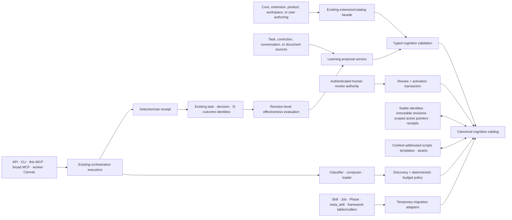

# Governed cognition architecture and migration work packet v1

- Date: 2026-08-04
- Roadmap outcome: E1
- Packet status: **architecture frozen; E1 implementation and release evidence passed**
- Implementation authority: granted by the user after this architecture freeze on 2026-08-04

## Canonical decision

ACE will have one catalog and one executable procedural representation.

- A **recipe** is the only executable, phased reusable-cognition form.
- A **phase** is an immutable value inside a recipe revision, not an independently selectable
  procedure.
- **Instruments**, **frameworks**, **tools**, and **perspectives** are typed cognition components
  with stable identities and immutable revisions. Recipes refer to their exact identities and
  compatible revision ranges.
- A current `MetaSkill` becomes recipe discovery and activation metadata. It is not a second
  durable identity.
- A capability remains an outcome description. It is not another executable record type.
- Retained procedural instructions, templates, scripts, and assets are either the content of an
  approved recipe/instrument revision or immutable resources referenced by that revision. ACE will
  not introduce a third `procedure` or renamed `Skill` abstraction.
- The legacy `Skill` / `Job` / `Phase` engine, the package/YAML `MetaSkill` recipe path, database
  frameworks, extension registrations, and retained-use telemetry converge behind one internal
  cognition catalog. Adapters are temporary migration seams, not permanent parallel selectors or
  executors.

The target lifecycle is:

```text
teach → propose → inspect → approve → use → measure → revise or retire
```

An unapproved proposal is never a catalog candidate. Approval creates an immutable revision and a
durable review receipt, then changes a scope-specific active pointer atomically. A model may draft
or recommend a change; it cannot approve, activate, roll back, retire, or promote it.

## Readiness decision

E1 is **passed** for the exact ace-core 0.3.0 artifact set recorded in
[`e1-governed-cognition-release-v1.md`](../evidence/e1-governed-cognition-release-v1.md). E1-A
through E1-G provide canonical identity and immutable revisions, atomic approval/activation,
governed discovery, exact selection/use receipts, deterministic legacy dispositions, lifecycle and
rollback, matched-cohort effectiveness evaluation, extension conformance, a trusted-code threat
model, bounded telemetry, and operations guidance.

The external release gates closed on 2026-08-05: the published PyPI wheel and source distribution
byte-match the complete matrix at the immutable tagged commit; every discovered configured/running
upgraded deployment retained matching dry-run and persisted/read-verified inventory receipts; and
a fresh Anthropic Claude Fable 5 invocation outside the implementation workstream independently
accepted all 14 security boundaries. The release owner countersigned its five low and two
informational residual findings. This is an independent AI review, not a human penetration test,
professional audit, or certification. The supported execution boundary remains trusted
in-process Python packages only.

## Scope and parallel-work boundary

This began as an architecture and migration packet. The subsequently authorized implementation is
now represented by the canonical cognition modules, schema migrations v169-v171, compatibility
facades, tests, threat model, operations guide, and the closeout record below. No twelfth MCP tool or
autonomous writable authority was added.

The following remain excluded from every E1 packet unless a later packet says otherwise:

- K1-K3 State Engine contracts, fixtures, readiness results, and acceptance evidence;
- the contents of `evaluations/results/state_engine_k1_k3_raw/`;
- B1 local or remote writable execution;
- T1 distributed task claiming, cancellation, and portability work except where E1 consumes an
  already accepted contract;
- E2 messaging, scheduling, IDE, webhook, telemetry-source, and remote-execution adapters;
- a twelfth thin MCP tool;
- autonomous approval, activation, or revision;
- benefit claims based on usage, popularity, phase confidence, task completion, or one successful
  invocation.

## Evidence classification

This packet uses two labels strictly:

- **Verified current behavior** means the claim was established by source inspection, executable
  inventory, or an existing test named in the verification section.
- **Architectural direction** means the target contract or migration disposition. It is not a claim
  that the current runtime already behaves that way.

## Verified current architecture inventory

### Executable and descriptive cognition representations

| Representation | Source of truth today | Identity and scope today | Create / revise / retire today | Runtime status |
|---|---|---|---|---|
| Python `MetaSkill` recipes | `core/engine/cognition/recipes/*.py` and `_RECIPE_MODULES` in `cognition/composer.py` | Process-local slug; no revision; implicit Core/global visibility | Edit package source; restart to reload; remove module to retire | Canonical composer input today |
| YAML `MetaSkill` recipes | `core/engine/cognition/recipes/*.yaml`, `recipes/schema.py`, `recipes/loader.py` | Process-local slug; no revision; implicit Core/global visibility | Edit file; import-time discovery; restart to reload | Canonical composer input today |
| Extension recipes | `Registry.register_recipe`, module path or in-memory `MetaSkill` | Global process registry keyed only by slug; routing keyed by discipline/task type | Extension code registration; restart or package replacement | Composer consumes them through the existing facade |
| `MetaSkill` database rows | `meta_skill` table from v057; `cognition/seed.py::seed_meta_skills` | Globally unique slug; no product, owner, revision, approval, or active pointer | Seeder deletes then recreates each row | Write-only snapshot; composer never reads it |
| Recipe phase | `RecipePhase` dataclass | Position and cognitive-function string inside a `MetaSkillRecipe` | Changed in package/YAML source | Executed by fusion or multiphase paths |
| Recipe instrument slot | `InstrumentSpec` in recipe phase | Slug/family/fallback strings; no stable component or revision identity | Changed with recipe source | Ambiguously resolves to a DB framework prompt or a Python instrument slug |
| Recipe tool slot | `ToolSpec` in recipe phase | Advisory slug/family/fallback strings | Changed with recipe source | Selected from `tool_perf` or fallback; rendered as advisory text, not enforced authority |
| Database framework | `framework` table from v011, repaired by v158; Pydantic `reasoning.Framework` | `(product, slug)` index; `product IS NONE` means built-in by convention | Startup seed mutates metadata in place and preserves prompt; self-optimizer can create rows | Prompt source for composer and separate legacy framework engine |
| Python instrument | `cognition/instrument_registry.py` | Global process registry keyed only by slug | Extension registration is last-write-wins; package replacement retires it | Callable resolver exists, but the main recipe executors do not call it |
| Legacy `Skill` | `skills.models.Skill`; `skill` table from v010/v019 | Product field plus legacy null/global conventions; mutable slug | HTTP CRUD and self-optimizer creation; PUT overwrites; DELETE hard-deletes custom rows | Separate legacy selector/executor, outside the composer |
| Legacy `Job` | `skills.models.Job`; `skill.steps` / `skill.jobs` | Embedded mutable value with no stable identity | Jobs are overwritten with the parent skill | Converted to a solo `Phase` in memory |
| Legacy `Phase` / `Slot` | `skills.models.Phase`, `Slot`, `PhaseExit` | Embedded mutable value with no revision identity | Overwritten with the parent skill | Executed by `skills/executor.py`, not `MultiPhaseExecutor` |
| Extension frameworks/personas/committees | module-level lists/maps in `extensions/registry.py` | Process-global registration values | Extension registration | Accessors exist, but no Core runtime consumer exists |
| Extension tools | `Registry.register_tool` | Callable plus title in a process-global list | Extension registration | Added only to the broad engine MCP host; not the eleven-tool thin MCP contract |
| Extension schema paths | `Registry.register_schema` | String path in a process-global list | Extension registration | Accessor exists; Core schema runner does not consume it |
| Retained observations, insights, decisions, corrections | graph/capture/intelligence tables and I1/I3 projections | Stable product-scoped record identities where the accepted receipt contracts apply | Existing capture, disposition, correction, and lifecycle flows | Inputs to later reasoning; not typed reusable procedural cognition today |

An executable inventory on 2026-08-04 loaded 21 Core Python recipes, one Core YAML recipe, and one
reference-extension recipe: 23 recipe slugs total, each with five to seven phases. It also found 177
built-in framework seed records and two registered Python instruments in the reference extension.

### Selectors, registries, loaders, executors, and optimizers

| Responsibility | Current implementation | Verified behavior and boundary |
|---|---|---|
| Recipe discovery | `cognition/composer.py`, `recipes/loader.py`, extension recipe accessors | Core Python, Core YAML, and extension recipes are enumerated separately, then cached by slug in each composer process |
| Recipe selection | `CognitiveComposer._rank_meta_skills_dynamic` | Scores activation signals, affinities, domains, and composability; selected values are slugs, not approved revision identities |
| Phase blending | `_blend_best_fit` | Chooses one phase per cognitive-function slot across selected recipes; output loses the owning recipe revision because none exists |
| Instrument selection | `cognition/classifier.py::FrameworkClassifier` | Explicit slugs win; learned selection reads `instrument_perf`; cold start uses the fallback slug |
| Tool selection | `cognition/tool_classifier.py::ToolClassifier` | Mirrors instrument selection against `tool_perf`; tool presence is advisory |
| Fused execution | `cognition/fusion.py` through `orchestration/shell.py` | Loads framework prompts by slug and injects a single structured prompt |
| Deep execution | `cognition/multiphase.py` through `orchestration/executor.py` | Runs active phases sequentially, with best-of-N, evaluator, retrieval, and optional capture behavior |
| Standalone/canvas execution | `cognition/reasoning_run.py`, `api/canvas.py`, `orchestration/deep_committee.py` | Executes the same composition shape and writes `reasoning_run`/`reasoning_event` ledgers |
| Python-instrument execution | `orchestration/python_dispatcher.py` | Has no production caller; rejects mixed Python/DB phases; calls registered functions synchronously although shipped reference functions are async |
| Legacy skill selection | `skills/selector.py` | Queries the `skill` table and scores keyword signals independently of recipe selection |
| Legacy skill execution | `skills/executor.py` | Runs a separate phase state machine with its own patterns, framework loading, confidence and transition rules |
| Legacy framework selection/execution | `reasoning/selector.py`, `reasoning/executor.py` | Deprecated but callable; selects one to three database frameworks and runs a separate stacked/layered/iterative executor |
| Self-optimizer | `sentinel/engines/self_optimizer.py`, `api/self_optimizer.py` | Model classifies accepted-task clusters as `skill` or `framework`; API materializes mutable legacy rows on approval |
| Skill emergence | `sentinel/engines/skill_emergence.py` | Deprecated and unscheduled; still callable in tests/code |
| Extension loading | `extensions/loader.py` | Entry points and `ACE_EXTENSIONS`; per-extension failure logs and skips; naked-kernel kill switch is process-lifetime |

### Persistence and migration inventory

| Schema/table | Current meaning | Canonical-migration significance |
|---|---|---|
| v010 `skill`, `skill_execution`, `task.skill_used` | First legacy procedure engine | Definitions must adapt to recipes; execution rows become degraded or exact cognition-use records |
| v019 `skill.jobs`, `skill_execution.jobs_completed/job_results` | `steps` to `jobs` compatibility copy | Both old field shapes must remain accepted by the importer |
| v011/v158 `framework`, `framework_perf`, `task.strategies_used` | Prompt frameworks and an unused aggregate-performance table | Framework rows become stable components/revisions; old performance is evidence only |
| v027/v160 `self_optimizer_proposal/state` | Mutable `skill`/`framework` proposal drafts and thresholds | Proposals require deterministic import; old approvals lack sufficient authority provenance |
| v043/v110/v111 `composition_signal` | Composition, feedback, token, cost, confidence, and lens telemetry | Must link to exact revisions before it can support cognition evaluation |
| v057 `meta_skill` | Destructive seed snapshot of Core Python recipes | Reconcile and archive; do not promote this table into the canonical store |
| v057/v119 `instrument_perf` | Per-product framework-slug scores by recipe slot | Current `outcome_score` is phase-confidence proxy, not observed outcome or benefit |
| v117/v121 `reasoning_run` and v130 `reasoning_event` | Run/progress ledgers | Retain; add exact selection/use identities rather than replacing the ledgers |
| v118 `tool_perf` | Per-product advisory tool-slug scores | Same evidence-only treatment as `instrument_perf` |
| v145/v155/v156 task receipt fields | I1 decision, I3 intelligence-use, and I2 deliberation projections | Reuse identities and receipt patterns; do not create parallel task/decision/outcome subsystems |
| v157 extension invocation receipt | Versioned extension task lifecycle | Reuse its negotiation, redaction, restart, and unavailable-extension behavior |
| v163-v168 State Engine tables | Product state, dynamics, rollouts, promotion, operations | Explicitly excluded from E1 mutation |

The `org` to `product` migrations added product fields and later removed `org`, but legacy callers
still contain `org IS NONE` predicates. Null product also continues to mean “built-in/global” by
convention. Neither condition is an acceptable target scope contract.

### API, CLI, MCP, worker, seed, and product consumers

| Consumer | Current path | Migration requirement |
|---|---|---|
| Public task API | `POST /tasks` → `orchestration.orchestrate` → `CognitiveComposer` | Must select only approved active revisions and return an additive selection/use receipt |
| Extension invocation API | extension preparation → ordinary task runtime | Must use the same catalog; extension absence/version mismatch remains explicit and resumable only under the existing lifecycle contract |
| Skills HTTP API | `/skills` mutable CRUD | Compatibility facade over recipe proposal/history operations; no direct overwrite or hard-delete after cutover |
| Frameworks HTTP API | `/frameworks`, `/framework-perf` | Read facade over canonical framework identities/revisions and evidence summaries |
| Self-optimizer HTTP API | `/self-optimizer/proposals` approve/dismiss | Compatibility facade over canonical proposals/review receipts; current non-atomic materialization must end |
| CLI `ace run` | sends `deep`, hidden `--skill`, and framework hints to `/tasks` | Preserve command shape; translate legacy hints through aliases to approved stable identities |
| Hidden CLI `skills` | reads `/skills`; displays `steps` | Preserve temporarily as a deprecation view; never expose it as the new vocabulary |
| CLI `frameworks` | reads database framework API | Preserve as a canonical catalog view |
| Thin MCP (exactly eleven tools) | HTTP-backed `ace_task` accepts skill/framework hints | No name/count change; hints become compatibility aliases and receipts ride through task/status |
| Broad engine MCP | direct orchestration plus extension tools and cognition introspection | Experimental caller; move internal reads to the catalog without treating it as the public contract |
| Canvas/Atrium | direct composer/`run_reasoning` paths and API receipts | Read selected revision identities; no new activation or execution authority |
| Chat, away summary, product agent orchestrator | direct legacy `orchestrator.executor.execute_task` | Move to ordinary orchestration before deleting legacy skill/framework executors |
| Worker/API startup | `ensure_frameworks_seeded` | Replace mutable seed repair with signed/bundled canonical revision synchronization and verification |
| Manual seed command | `cognition.seed::seed_all` writes framework and `meta_skill` rows | Retire after catalog bootstrap/migration; never delete/recreate canonical revision history |
| Sentinel self-optimizer | task/insight clustering → legacy proposal | Emit sourced canonical proposals only; no approval or activation capability |
| Evaluations | M2 and R4 results retain recipe/meta-skill/instrument slugs; I2/I3 retain task and intelligence receipts | Add exact revision and selection/use identities while preserving the frozen historical artifacts |

### Evaluation fixtures and compatibility tests

The current cognition evidence spine is distributed across:

- recipe/model/loader/composer/fusion/multiphase/run-ledger tests under `tests/cognition/` and
  `tests/test_cognition_*`, `tests/test_recipe_loader.py`, and `tests/test_cognition_recipes.py`;
- legacy compatibility tests in `tests/test_skill_models.py`, `tests/test_skill_selector.py`,
  `tests/test_skill_executor.py`, `tests/test_api_skills.py`, and `tests/test_cli_skills.py`;
- framework seed/selector/executor/API/CLI tests;
- composition scoring, signal-hook, cost, and staleness tests;
- extension recipe/instrument/scaffold/tutorial/registry/naked-kernel tests;
- task, I1, I2, I3, extension-invocation, migration, kernel-boundary, and exact MCP tests;
- frozen M2/R4 composition artifacts and I2/I3 receipt fixtures.

These tests prove current local contracts. They do not prove immutable cognition revisions,
approval-to-selection isolation, cross-release extension compatibility, or a canonical round trip.

## Verified current lifecycle traces

### Package/YAML/extension recipe

```text
author Python/YAML or call Registry.register_recipe
→ process import/discovery
→ global slug stores
→ score MetaSkill fields
→ blend RecipePhase values
→ resolve framework/tool slugs
→ fetch framework prompt rows by slug
→ fuse or execute sequential phases
→ write task/reasoning/composition telemetry containing slugs
```

Create and revise mean changing code or YAML. Reload means a new process. There is no proposal,
review receipt, immutable revision, active pointer, expiry, rollback, or retirement history.

### Legacy skill

```text
POST /skills or self-optimizer approval
→ mutable skill row (jobs/steps/phases)
→ legacy select_skill keyword scorer
→ jobs convert in memory to Phase/Slot
→ separate execute_skill state machine
→ legacy execute_task may put skill_used on task
→ PUT overwrites or DELETE removes the definition
```

The supported public task runtime does not execute the selected legacy skill. `force_skill` changes
orchestration dispatch to a pipeline, but does not load that skill definition. Framework hints are
accepted and included in cost estimates, but the current orchestration composer does not resolve
those hints into an exact framework selection.

### Self-optimizer proposal

```text
accepted/edited task clusters + reflected insight IDs
→ model classifies skill | framework | neither
→ mutable self_optimizer_proposal
→ approve endpoint creates legacy row
→ separate update marks proposal approved
```

Materialization and proposal status update are not one database transaction. A materialized row can
survive an approval-status failure. Review actor, authority, rationale, policy, semantic diff,
revision identity, activation, rollback, and retirement are absent.

### Use and measurement

```text
composition slug + selected framework/tool slugs
→ task/reasoning/composition telemetry
→ phase-confidence proxy written as instrument_perf/tool_perf outcome_score
→ later task feedback may update composition_signal
```

`reasoning_run`, `composition_signal`, `instrument_perf`, `tool_perf`, task `skill_used`, and task
`strategies_used` do not identify immutable cognition revisions. `framework_perf` has no runtime
writer. `skill_execution` has no runtime writer. Current telemetry cannot support revision-level
benefit, retirement, or rollback decisions.

## Duplication, incompatibility, and dead-path findings

| Finding | Consequence | Target disposition |
|---|---|---|
| Recipe composer and legacy skill engine each own phases, selection, and execution | Two incompatible procedural models and hint semantics | Recipe wins; skill adapter emits recipe revisions; legacy selector/executor deleted after caller migration |
| `MetaSkill` code/YAML is executed while `meta_skill` DB is seeded but unread | Two alleged sources of truth; DB recreation loses history | Package sources import into canonical revisions; archive `meta_skill` snapshots |
| `InstrumentSpec` calls a DB framework an instrument while Python instruments share the same slug space | Ambiguous type and unavailable execution behavior | Typed component IDs and dependency kinds; no slug-only dispatch |
| Python dispatcher is uncalled, synchronous, and rejects mixed recipes | Reference-extension callable instruments are not exercised through the claimed main path | Wire one async canonical executor adapter or classify those registrations unavailable; add end-to-end test before claims |
| Extension recipe slug, instrument slug, and routing maps are process-global | Cross-extension collision and last-write-wins behavior | Extension namespace is part of stable identity; exact duplicate/conflicting routes fail closed |
| Core-vs-extension recipe collision is hidden by Core precedence | An extension may register a recipe that can never run | Registration conformance rejects the collision with an actionable diagnostic |
| Framework/persona/committee/schema registration accessors are unconsumed | Stable extension API advertises capabilities with no runtime effect | Consume through the canonical catalog or deprecate with SemVer policy; no silent success |
| Null product means built-in/global; legacy queries still use removed `org` | Implicit global scope and potential cross-product reads | Explicit scope object; null scope is malformed |
| Skill and framework get/update/delete and prompt fetches often omit product scope | Same slug can resolve to a foreign or arbitrary record | Every read carries authenticated scope and exact identity; foreign reads are not found |
| Skill PUT mutates and DELETE erases history | No revision, rollback, or retirement evidence | Proposal → approved revision; retirement pointer/event; no hard delete |
| Framework seeding mutates rows in place | Package updates overwrite metadata without revision lineage | Each package definition has a content-addressed revision and release provenance |
| Self-optimizer approval is non-atomic and status vocabulary drifts (`proposed`/`pending`) | Phantom selectable rows and ambiguous proposal state | One versioned proposal state machine and one atomic review/activation transaction |
| Composer catches broad errors and returns empty cognition | Missing/conflicting cognition can look like ordinary fallback execution | Required cognition failures are explicit; only policy-declared optional omissions may degrade |
| Extension loader skips a broken package with no selection receipt | A formerly active recipe may silently disappear | Catalog marks its revision unavailable/incompatible and receipts record the omission |
| Framework prompt fetches use slug without product/namespace | Product override selection is nondeterministic | Fetch by exact revision dependency ID and scope |
| `composition_signal` main-hook writes omit `product` despite passing it | Product-scoped learning queries can miss ordinary runs | Required scope on write; migration flags orphan signals |
| Instrument/tool `outcome_score` is mean phase confidence | Model confidence is mislabeled as outcome evidence | Rename/import as routing-confidence evidence; never treat as effectiveness |
| Main deep-run ledger can write phase functions into `meta_skills` | Run telemetry cannot reliably recover recipe identity | Exact selection receipt is authoritative; legacy field is diagnostic only |
| Frozen evaluations record slugs but not revisions | Replay can unknowingly exercise changed cognition | New fixtures freeze revision hashes and catalog manifests; old evidence remains historical |

## Architectural direction: canonical dependency boundary



Rules:

1. Hosts and extensions call catalog/use-case services; they do not query cognition tables or
   mutate active pointers directly.
2. Core imports no domain extension. Runtime discovery invokes the existing generic extension
   facade; domain packages depend on Core contracts.
3. The catalog returns typed, approved, active revisions. Existing executors receive temporary
   `MetaSkill`/framework views only from adapters at the last possible boundary.
4. Large resources remain outside the graph only when their immutable digest, location class,
   provenance, owner, scope, approval, and lifecycle are in the revision.
5. Outcome evaluation can create a proposal. It cannot change the active pointer.

## Canonical identities and schema contract

### Identity classes

| Identity | Meaning | Derivation / mutation rule |
|---|---|---|
| Stable cognition identity | The enduring recipe, instrument, framework, tool, or perspective | Deterministic from owner namespace, type, and normalized stable key; never includes revision content |
| Immutable revision identity | One exact approved definition | Content-addressed hash of stable ID, typed schema version, canonical body, exact dependencies, resource digests, and source provenance; never updated |
| Active revision pointer | Which approved revision a scope may select | One compare-and-swap head per stable cognition + scope; changes only in the review transaction; history remains in receipts/events |
| Proposal identity | One idempotent proposed change | Hash of target/new stable key, scope, intent, ordered source identities+hashes, draft hash, extraction policy, and proposal policy |
| Review receipt identity | Approval, rejection, request-changes, rollback, expiry, or retirement decision | Idempotent review request identity plus proposal/revision, actor, authority, disposition, policy, and rationale; immutable |
| Selection receipt identity | Complete discovery decision for one invocation/stage | Invocation + stage + policy + budget + ordered considered/selected/omitted/unavailable revision IDs |
| Cognition-use identity | Observable load/injection/execution of one revision | Invocation + receiver component/stage + exact revision + use state; distinct from retrieval |
| Outcome identity | Later completion, acceptance, artifact-quality, or real-world outcome | Existing task/decision/observation/outcome identities; not inferred from cognition use |
| Effectiveness identity | One reproducible revision/cohort evaluation | Revision set + cohort definition + metric/policy versions + comparator identities + analysis hash |

Recommended record prefixes are `cognition:`, `cognition_revision:`, `cognition_head:`,
`cognition_proposal:`, `cognition_review:`, `cognition_selection:`, `cognition_use:`, and
`cognition_effectiveness:`. Human-readable namespace/type/slug fields remain separately indexed;
record IDs do not rely on delimiter parsing.

### Target records

The first schema packet should reserve v169-v171 after the current v168 head.

| Record | Required fields | Invariants |
|---|---|---|
| `cognition` | contract version, type, namespace, stable key, owner, created provenance | Unique owner-namespace/type/key; no nullable owner or scope convention |
| `cognition_revision` | stable cognition, type schema version, canonical body, content hash, exact dependency specs, resource manifests, sources, proposal, approval receipt, created time | Immutable; approved review must match exact draft/material hash; type cannot change |
| `cognition_head` | stable cognition, normalized scope, active revision, generation, lifecycle, effective/expiry times, review receipt | Exact revision belongs to cognition; CAS generation; no model authority; one head per cognition/scope |
| `cognition_activation_event` | prior/new revision, scope, generation, review receipt, disposition, time | Append-only history for activation, rollback, expiry, disable, and retirement |
| `cognition_proposal` | target/new identity material, scope, source edges/hashes, draft, semantic diff base, validation, route/policy provenance, state | Never selectable; immutable draft revisions or superseding proposal, not in-place edits |
| `cognition_review_receipt` | proposal/material hash, actor, actor class, authority, disposition, rationale, surface, policy, time, transaction result | Model authority cannot approve/activate; rejection creates no cognition revision |
| `cognition_selection_receipt` | invocation/stage, scope chain, policy, budgets, candidates, selected, omitted, unavailable, failures, totals | Bounded, ordered, redacted; exact revision IDs; no hidden fallback |
| `cognition_use` | selection receipt, revision, receiver, retrieved/loaded/injected/executed states, route/tool/resource coverage, cost/latency | Observable states only; no benefit claim; product scope must match receiver |
| `cognition_effectiveness` | revision/cohort/comparator/metric IDs, outcomes, uncertainty, analysis hash, limitations, result | `helped`, `hurt`, or `unproven`; never computed from popularity alone |

Approval of a new revision and movement of the active head occur in one database transaction:

```text
verify proposal pending + exact material hash
→ verify authenticated non-model review authority
→ create immutable revision if absent (idempotent)
→ compare-and-swap cognition_head generation
→ append review + activation receipts
→ commit
```

Any failed step rolls back the entire transaction. A revision may exist only if its approval receipt
exists in the same committed transaction. A rejected proposal creates only a rejection receipt.

### Typed bodies

- **Recipe revision:** activation metadata; ordered phase value objects; phase keys; depth gates;
  orchestration patterns; exact instrument/framework/tool/perspective dependencies; context/capture
  declarations; outputs; constraints; success measures; authority requirements.
- **Instrument revision:** operation contract; input/output schemas; prompt or callable resource;
  deterministic/non-deterministic classification; authority and side-effect declaration; fallback
  behavior. Prompt instruments and Python instruments cannot share an untyped slug.
- **Framework revision:** bounded reasoning instructions, family, activation metadata, affinities,
  composability, constraints, and prompt/resource digest.
- **Tool revision:** descriptive schema, resolver/implementation reference, required authority,
  side effects, version negotiation, and availability contract. Catalog selection never grants the
  authority declared here.
- **Perspective revision:** role description, activation/affinity metadata, bounded instruction
  resource, and allowed contribution contract. A perspective label remains distinct from an I2
  execution/contribution identity.
- **Procedural resources:** immutable references owned by a recipe or instrument revision. If the
  material is independently selectable and phased, it must be a recipe; if it is a reusable
  operation, it must be an instrument. No generic executable `procedure` type is permitted.

## Ownership and scope semantics

Ownership answers who may propose a successor. Scope answers where an approved revision may be
selected. They are separate fields.

| Profile | Owner | Eligible scope | Activation authority | Failure/absence behavior |
|---|---|---|---|---|
| Core-bundled | `core:<distribution>` plus release provenance | Explicit `core_default` eligibility for all products, not null product | Accepted Core release manifest; product policy may disable, not rewrite | Missing/tampered manifest is startup failure for required Core cognition |
| Extension-bundled | exact extension ID and package revision | Only when package is installed, compatible, enabled, and permitted for the product | Extension package manifest supplies definition; product/human policy activates its use | Missing/skewed package is `unavailable`/`incompatible`, never a same-slug fallback |
| Product-owned | authenticated product | That product only | Product cognition-review authority | Foreign products receive not-found; no cross-product sharing |
| Workspace-owned | authenticated product + workspace | Exact workspace inside that product | Workspace cognition-review authority constrained by product policy | Missing/foreign workspace fails closed |
| User-owned | authenticated product + user, optionally workspace | That user only inside the named product/workspace | User cognition-review authority where product policy permits | Never portable across products by matching user string alone |
| Intentionally global | named global publisher/governance authority | Explicit global catalog eligibility | Separate global-promotion authority and review policy | Cannot arise from `product IS NONE`, missing owner, popularity, or extension install |

Selection scope precedence for the same stable cognition is exact user+workspace, workspace,
product, explicitly enabled extension default, Core default, then intentionally global. More
specific heads may select a different approved revision only under an explicit override policy.
Two eligible heads at the same precedence are a conflict and make that cognition unselectable.

All workspace and user scopes include the parent product in their normalized scope key. A caller
cannot supply product scope when authenticated Core context already owns it. Null/missing scope is
malformed, not global.

## Deterministic failure contract

| Condition | Write behavior | Discovery/load behavior | Public receipt/diagnostic |
|---|---|---|---|
| Malformed definition/proposal | Reject before persistence or persist a failed validation result only | Never a candidate | `malformed_cognition` plus bounded field paths |
| Unknown contract or typed-body version | Preserve raw stored object; do not reinterpret | Empty degraded projection; required active revision fails closed | `unsupported_cognition_version` |
| Duplicate stable identity with different owner/type | Reject registration/import | Existing identity unchanged | `cognition_identity_conflict` |
| Conflicting active revisions at same scope precedence | Quarantine heads; do not choose newest | Stable cognition unavailable | `conflicting_active_revisions`, exact safe IDs, durable attention |
| Unavailable extension/package/resource | Preserve identity/history | Required dependency makes candidate unavailable; optional dependency may be omitted only by declared policy | `cognition_dependency_unavailable` with omission state |
| Unapproved proposal/revision | Proposal remains inspectable | Excluded before scoring | `not_approved`; never shown as selected |
| Expired head/revision/resource | Append expiry event; preserve records | Excluded at the effective time | `expired` with timestamp and policy |
| Superseded revision | Preserve immutable revision | Not selected unless a later governed rollback points the head back to it | `superseded` or `rollback_active` |
| Retired cognition | Append retirement event and clear/retire head | Excluded; aliases report retirement | `retired`, successor identity if present |
| Dependency version mismatch | No mutation | Candidate unavailable; no nearby-version guessing | `incompatible_dependency` with accepted range |
| Required content exceeds budget | No mutation | Candidate omitted or the requested explicit cognition fails before model execution | `budget_incompatible` with exact required/remaining totals |
| Artifact hash mismatch | Quarantine revision/resource | Never load the artifact | `artifact_integrity_failed` |
| Foreign product/workspace/user | No mutation | Not found; no identity/content leakage | Existing not-found isolation behavior |
| Model attempts approval/activation | Reject authorization before transaction | Current head unchanged | `human_authority_required` |

Compatibility fallback is permitted only when an explicit alias maps a legacy identity to one exact,
approved, compatible revision. Slug similarity, latest-created row, registration order, and
last-write-wins are forbidden fallback policies.

## Authority ladder

The levels are distinct receipt domains, not an implication that remote execution or promotion is
automatically “higher” authority. Possessing one does not grant another.

| Domain | What it permits | Required receipt | E1 treatment |
|---|---|---|---|
| Reasoning | Discover/load approved cognition and make provider calls inside task budgets | Selection + cognition-use receipt | In scope |
| Writing | Persist a sourced proposal, review comment, task output, or content-addressed draft artifact; never change active cognition | Proposal/artifact receipt and authenticated scope | Proposal writing in scope; filesystem/workspace mutation out of scope |
| Local execution | Execute a declared tool/script in an explicitly writable local root | Local execution + before/after evidence + approval where policy requires | Not introduced; B1/T1 dependency |
| Remote execution | Dispatch to remote/managed compute or external services | Remote adapter, authorization, retry/effect, and delivery receipts | Not introduced; E2/B1/H1 dependency |
| Promotion | Approve/activate/rollback/retire cognition or promote produced work | Authenticated human review/promotion receipt and atomic policy transaction | Cognition promotion in scope only for non-execution definitions; models are categorically excluded |

Ordinary system-owned persistence of task, selection, and use receipts is audit logging, not model
write authority. A cognition tool dependency declares required authority; selection does not grant
it. E1 adds no writable execution adapter.

## Progressive discovery and budgets

### Discovery levels

| Level | Material | Loading rule |
|---|---|---|
| 0 | Stable ID, exact candidate revision ID, type, bounded description, normalized scope, activation state, trust summary, effectiveness summary | Deterministic metadata query; no package resource or model call |
| 1 | Selected revision body, phases, authority, exact instrument/framework/tool/perspective dependencies, compatibility and resource manifests | Only for approved candidates that survive Level 0 policy and budgets |
| 2 | Referenced instructions, templates, scripts, assets, and source evidence | Only required/explicit resources for selected Level 1 revisions, verified by digest |

### Frozen default budget contract

The selection request carries all limits; defaults are explicit and versioned as
`cognition-discovery-budget-v1`.

| Budget | Depth 1 | Depth 2 | Depth 3 | Depth 4 |
|---|---:|---:|---:|---:|
| Level 0 candidate limit | 64 | 64 | 64 | 64 |
| Selected revision limit | 4 | 5 | 7 | 8 |
| Level 0 serialized bytes | 24,576 | 24,576 | 24,576 | 24,576 |
| Level 1 cognition tokens | 256 | 512 | 1,024 | 1,536 |
| Level 2 resource tokens | 0 | 512 | 2,048 | 4,096 |
| Level 2 artifact fetches | 0 | 4 | 8 | 12 |
| Selection-time provider calls | 0 | 0 | 0 | 0 |
| Selection-time provider cost | $0 | $0 | $0 | $0 |

These cognition budgets are separate named allocations inside the task input budget. They do not
silently expand the existing retained-intelligence, output-token, model-call, latency, or USD
budgets. A caller may request smaller limits. Larger limits require policy authorization and are
recorded.

Each revision declares conservative Level 1/2 token estimates, required artifact fetches, expected
incremental model calls, tool calls, and cost class. Selection checks the worst-case declared cost
against the remaining task call/token/USD budget. Actual calls, tokens, latency, retries, and cost
remain in the ordinary task provenance and are linked from the cognition-use receipt.

### Deterministic ordering and omission

1. Reject foreign, malformed, unapproved, expired, retired, conflicting, and incompatible records.
2. Mark unavailable required dependencies before relevance scoring.
3. Score remaining Level 0 candidates with a versioned provider-neutral policy.
4. Sort by score descending, then stable cognition ID, then revision ID.
5. Load Level 1 in that order until the selected-revision and token budgets are exhausted.
6. Load required Level 2 resources first in recipe phase/dependency order, then optional resources
   by stable identity. A required resource that does not fit makes the candidate budget-incompatible.
7. Never truncate a schema, script, template, or instruction body mid-object. Omit the whole bounded
   unit and record its digest and reason.

The selection receipt records requested and effective budgets, candidate totals, every considered
candidate, filters, scores, selected revisions, omitted/unavailable revisions and dependencies,
loaded levels, estimated and actual totals, policy versions, and degraded/failure state. Redaction
and collection bounds follow the I2/I3 and extension-receipt patterns.

## Extension compatibility and security contract

Extensions continue to use the existing `ace.extensions` entry point and `Registry` facade. E1 does
not create a second extension loader.

### Registration conformance

Every extension cognition registration must include or deterministically derive:

- exact extension ID/version and package/distribution digest;
- cognition type, stable key, typed body version, description, sources, and owner;
- accepted Core cognition-contract versions and dependency version ranges;
- resource manifests and hashes;
- required authorities and side-effect declaration;
- routing/activation metadata; and
- a callable-free Level 0/1 public manifest.

The old `register_recipe(name, recipe, disciplines, task_types)` and
`register_instrument(slug, module_path)` signatures remain compatibility inputs for N-1. Their
adapters namespace the identity to the extension, hash the resolved package resource, validate the
typed contract, and either produce one canonical revision or fail registration. Framework,
persona/perspective, tool, and schema registrations must no longer report success without a named
consumer or explicit unsupported diagnostic.

### Required package matrix

| Combination | Required result before E1 readiness |
|---|---|
| Current Core + current reference extension | Full cognition registration/discovery/use conformance passes |
| Current Core + current independent extension | Same, without importing domain code into Core |
| Current Core + N-1 versions of both packages | Compatibility adapters pass or fail before registration with the documented deprecation diagnostic |
| N-1 Core + current extension | Install/import succeeds only if declared compatible; otherwise deterministic package/contract refusal, never partial registration |
| Current Core + no extensions | Naked-kernel API/CLI/eleven-tool MCP, composer, migration, and package tests pass |
| Extension disappears after restart | Stored identity/history remains; active revision becomes unavailable; fresh selection fails or omits per dependency policy |
| Mixed wheel/sdist installs | Entry points, resource hashes, schema contents, and package exclusions pass from clean environments |
| Unknown future cognition contract | Empty degraded projection; no revision/artifact reinterpretation |

### Isolation and security

Current extensions execute as trusted in-process code. That remains acceptable only for explicitly
trusted installed packages. Before any stable third-party ecosystem claim, E1 requires:

- a threat model that separates declarative cognition resources from executable callbacks;
- an independent security review of registration, resource resolution, prompt/data boundaries,
  product isolation, and package skew;
- a decision whether untrusted code is out of scope or must run in a process/container boundary;
- digest verification before loading Level 2 resources;
- no secrets, private resolved content, or arbitrary server detail in public catalog/selection
  receipts;
- bounded registration/candidate/resource counts and timeouts;
- no authority inherited from instructions embedded in resources; and
- recovery that cannot present missing/incompatible extension work as successful use.

The extension-invocation Phase 3-7 receipts remain authoritative for current-version task lifecycle,
projection, restart, and product experience. They do not establish N-1 cognition compatibility,
safe untrusted-code isolation, distributed effects, or cognition activation governance.

### Verified extension compatibility and security gaps

| Area | Verified current evidence | Remaining E1 gap | Required closure evidence |
|---|---|---|---|
| Current-version lifecycle | Phase 3-7 invocation receipts cover preparation, task linkage, outcome projection, restart, recovery, and the reference product journey | Those receipts do not bind selected cognition revisions or prove callable-instrument material use | Ordinary task receipt links exact extension cognition selection/use identities through restart |
| Registry and loader | The generic `Registry` facade and `ace.extensions` loader keep Core domain-neutral; one broken extension is logged and skipped | Registrations use process-global slug/list stores, collisions are incomplete, and skipped cognition is absent from selection evidence | Namespaced registration conformance, deterministic collision/unavailable receipts, and no static Core import of domain packages |
| Extension cognition surfaces | Recipe registrations are consumed by the composer; tool registrations reach the broad MCP host | Framework, persona, committee, and schema accessors have no Core runtime consumer; Python instruments have no production caller in the main recipe path | Each advertised surface has an exercised catalog/runtime consumer or an explicit unsupported/deprecation result |
| Version negotiation | Extension invocation contracts carry explicit receipt versions and unknown-version degradation rules | Cognition definitions, resources, and dependency ranges have no independent negotiated contract | Current/current, current/N-1, N-1/current, and unknown-future conformance fixtures with deterministic refusal |
| Naked kernel | Existing kill-switch and naked-kernel tests cover extension-free startup and public boundaries | They do not yet prove canonical catalog migration, stored missing-extension heads, or eleven-tool receipt additions | Clean extension-free catalog bootstrap, migration, task, API/CLI, and exact MCP tests |
| Package artifacts | Phase 5-7 package evidence covers current Core/reference distributions and package exclusions | No independent consumer, N-1 skew, mixed wheel/sdist cognition-resource, or digest matrix | Clean-environment matrix for Core, reference, independent consumer, resources, schemas, and exclusions |
| Missing dependencies and recovery | Extension invocation can preserve terminal/degraded lifecycle evidence across restart | An active cognition dependency can silently disappear when its package fails or is removed | Stored history remains readable; fresh selection emits unavailable/incompatible state and never same-slug fallback |
| Isolation and code trust | Extension callbacks currently run as trusted in-process code | No accepted threat-model boundary or independent review for untrusted cognition code/resources | Explicit trusted-only support statement or implemented isolation, plus security review of registration, resolution, data, scope, and skew |
| Effects and operability | Phase 7 records current lifecycle metrics and conditional stabilization evidence | Distributed/external side effects, resource ceilings, extension-specific selection/use metrics, and operator recovery remain open | Accepted effect/recovery disposition, bounded resource tests, operational metrics, alerts, backup/restore, and rollback exercise |

## Current-to-target mapping

| Current concept | Target concept | Identity treatment |
|---|---|---|
| `MetaSkill.slug` | Recipe stable key plus activation metadata | Alias retained; stable ID adds owner namespace/type |
| `MetaSkill` | Approved recipe revision | Full normalized body is hashed; no independent meta-skill record |
| `MetaSkillRecipe.phases` | Recipe revision phase value objects | Immutable within revision; ordered phase keys |
| `RecipePhase` | Embedded phase value | No independently selectable stable identity |
| `InstrumentSpec` explicit/family/fallback slug | Typed instrument or framework dependency spec | Exact type + stable ID + version range; fallback names one exact compatible ID |
| `ToolSpec` | Typed tool dependency | Descriptor never grants execution authority |
| `reasoning.Framework` / `framework` row | Framework stable identity + immutable revision | Product/global convention converted to explicit owner/scope |
| Python instrument module | Instrument revision with callable resource manifest | Exact extension/package digest and async contract |
| Legacy `Skill` | Recipe stable identity + imported revision/proposal | Alias preserves old slug; no second selector/executor after cutover |
| Legacy `Job` | Solo recipe phase with one perspective/slot | Conversion retains original field evidence |
| Legacy `Phase`/`Slot`/`PhaseExit` | Recipe phase, perspective dependencies, orchestration and failure policy | Unsupported transition semantics quarantine rather than approximate |
| Extension persona | Perspective revision | I2 contribution identity remains execution-specific |
| Extension tool | Tool revision plus existing host registration | Broad MCP exposure remains separate from cognition identity |
| `meta_skill` row | Legacy snapshot evidence | Reconcile to a package revision or quarantine/archive |
| `self_optimizer_proposal` | Canonical cognition proposal + legacy provenance | Old status/actor gaps explicit |
| `composition_signal` | Selection/use/evaluation evidence link | Not a cognition definition or benefit record |
| `instrument_perf` / `tool_perf` | Legacy routing-confidence evidence | Never imported as beneficial effectiveness |
| `skill_execution`, `task.skill_used`, `task.strategies_used` | Cognition-use records or degraded legacy-use evidence | Exact revision only when deterministically recoverable |
| `reasoning_run` / `reasoning_event` | Existing execution ledger linked to selection/use receipt | Retained, not replaced |
| Observation/insight/correction | Proposal source or Level 2 evidence reference | Existing stable product-scoped identity retained |

## Legacy migration matrix

| Legacy record/source | Deterministic conversion | Activation disposition | Failure/quarantine rule | Compatibility and deletion criterion |
|---|---|---|---|---|
| Core Python recipe | Normalize loaded `MetaSkill`, package source/digest, and route metadata into Core-owned recipe revision | Core release manifest activates as `core_default` | Import/module/schema/hash error is startup failure when required | Delete direct `_RECIPE_MODULES` execution only after all Core recipes round-trip through catalog and package/restart tests |
| Core YAML recipe | Strict YAML schema → same recipe revision contract | Core release manifest activates | Unknown field/version/hash mismatch fails startup | Delete `_RECIPE_YAML` global store after catalog loader is sole consumer |
| Extension module-path recipe | Resolve in scoped registry; hash package/module resource; normalize `MetaSkill` | Eligible only when package compatible and product policy enables it | Missing package, mixed owner, collision, or unverifiable resource is unavailable | Remove direct extension-recipe lookup after current/N-1 and missing-extension tests pass |
| Extension in-memory `MetaSkill` | Normalize with extension owner and package provenance | Same as module path | No package/source digest → quarantine `unverifiable_source` | Old signature adapter retained for one deprecation window |
| v057 `meta_skill` matching a package revision | Compare normalized body/hash | Never independently active; link as legacy snapshot | Differences become `legacy_snapshot_conflict` | Archive table after zero unresolved snapshots and restart backup/restore test |
| v057 `meta_skill` without package match | Import as unscoped legacy proposal evidence | Not active | Missing owner/scope/approval requires operator disposition | Delete/archive only after every row has mapped ID or durable quarantine receipt |
| Product-scoped `skill` with valid phases | Convert phase/slot/exit schema to recipe draft, preserving source row ID/hash | Requires explicit product migration review before active | Unsupported pattern/transition, empty phases, foreign framework, or malformed fields quarantine | `/skills` facade reads canonical record; delete row only after two-release read parity and use backfill |
| Product-scoped `skill` with jobs/steps | Each Job → solo phase; framework slugs resolve in same product/Core scope | Same as valid phases | Ambiguous/missing framework maps to unavailable proposal | Same criterion |
| Null-product `skill` | Match exact shipped legacy manifest if one exists | Core import only when exact manifest matches | Otherwise ambiguous global scope; operator must assign Core/product/global authority | No null-is-global shim after all rows reconciled |
| `skill_execution` | Map skill+task to exact imported revision when timestamps/head history prove it | Historical use only | Missing task/revision becomes degraded legacy-use receipt | Drop table after row-count/hash parity and public history test |
| `task.skill_used` | Alias/record ID → exact revision at task time when recoverable | Historical use only | Slug-only/unknown revision remains explicit incomplete lineage | Remove field after additive receipt is available through task/status for one compatibility window |
| Product framework row | Normalize prompt and metadata into product-owned framework revision | Requires explicit migration review if currently custom | Missing product, duplicate body, invalid nested fields, or conflicting active rows quarantine | Framework API parity, exact prompt-load parity, restart, and rollback tests |
| Seeded null-product framework matching v158 seed manifest | Normalize to Core-owned revision with package digest | Core release manifest activates | Seed/body mismatch becomes conflict; do not overwrite | Remove mutable startup seeding after clean install/upgrade catalog bootstrap passes |
| Null-product framework not in seed manifest | Legacy unscoped proposal evidence | Not active | Requires explicit global/product owner decision | No null-global shim after disposition |
| `framework_perf` | Import as legacy aggregate evidence with missing cohort/revision limitations | Never affects active pointer | Unknown framework/product quarantined | Drop after export and zero consumers |
| Python instrument registration | Create extension-owned instrument revision with callable resource digest | Eligible through exact recipe dependency and package policy | Duplicate slug across namespaces okay only via exact IDs; same ID/different material fails | Remove process-global last-write store after async end-to-end execution passes |
| `instrument_perf` / `tool_perf` | Link to exact revision if possible; relabel as routing-confidence evidence | May inform discovery only under a new versioned policy | Orphan product/slug/revision remains degraded | Legacy tables retire after selection receipts and observed-outcome evaluator replace them |
| `self_optimizer_proposal` proposed/pending | Canonical proposal with source task/insight edges and legacy draft hash | Not active | Missing source hashes/intent/policy marked incomplete | Old API delegates; table retires after proposal parity and idempotency tests |
| `self_optimizer_proposal` approved | Import proposal plus `legacy_approval_provenance_missing`; link materialized row | Not active without explicit migration authority, except exact signed Core manifest | Never synthesize actor/authority/rationale | Operator review closes each row before old table retirement |
| `self_optimizer_proposal` dismissed | Preserve as legacy dismissal event; actor/authority may be incomplete | Not active | Cannot be reopened without a new proposal | Retire after history parity |
| `composition_signal` with exact task/product/revision lineage | Link as legacy selection/use/evaluation evidence | No activation effect | Confidence remains confidence, not benefit | Keep or supersede only after current readers move to versioned receipt |
| Orphan/unscoped `composition_signal` | Preserve in quarantine export | No effect | Product/revision cannot be inferred | Deletion requires operator-approved retention/export policy |
| `reasoning_run`/`reasoning_event` | Add links to selection/use identities where exact | Historical execution only | Do not rewrite ambiguous `meta_skills` | Tables remain; legacy fields become explicitly non-authoritative |
| Extension framework/persona/committee/schema registrations | Convert supported typed records; unsupported surfaces fail registration explicitly | Per package/product policy | No consumer means `unsupported_registration`, not success | Deprecate or implement before stable E1 conformance claim |

No migration infers a human approval from a status string, prose, task acceptance, package presence,
or prior selectability. No migration deletes a malformed row merely to make the gate pass.

## Public and support-boundary impact

| Surface | Planned impact | Compatibility posture |
|---|---|---|
| Eleven thin MCP tools | No names, count, or execution authority change | `ace_task`/`ace_status` carry additive receipts; legacy hints translate through aliases |
| CLI `run`/`status` | Add opt-in cognition inspection later; preserve existing task journey | No new activation command until proposal/review service is accepted |
| Hidden CLI `skills` | Deprecation view over canonical recipes | Keep for one documented compatibility window; do not promote |
| CLI `frameworks` | Read canonical framework catalog/history | Existing command can remain |
| Task HTTP schema | Add selection/use receipt fields; preserve async receipt v1 compatibility rules | Unknown future nested cognition versions degrade explicitly |
| `/skills` | Compatibility facade; POST/PUT/DELETE translate to proposal/review/retirement workflows | Mutable overwrite/hard-delete behavior is experimental and will be deprecated with notes |
| `/frameworks` | Read canonical identities/revisions/effectiveness summary | No slug-only foreign-scope reads |
| `/self-optimizer` | Compatibility facade over canonical proposal/review service | Existing IDs map through aliases; no phantom approval |
| Extension API | Add typed descriptors/registration handles; adapt N-1 signatures | Stable surfaces require SemVer-compatible additive change and a published deprecation window |
| Broad MCP and Canvas | Read catalog/selection receipts | Remain experimental; no authority expansion |
| Database | Add v169-v171 records and explicit migration receipts | K1-K3 tables untouched; rollback disables new reads, never down-migrates/delete revisions |
| Packages | Include schemas, typed contracts, conformance fixtures, and reference resources | Clean wheel/sdist and mixed-package matrix required |

## First vertical-slice acceptance design

The first complete user journey uses an existing ACE task and a recipe target. It does not add
document/path teaching, writable execution, scheduled automation, or a new MCP tool.

1. **Teach from task.** Resolve one authenticated product-scoped task plus its I1/I2/I3 and
   correction/source identities. Freeze source hashes and a bounded intent. Missing/private source
   material degrades or fails rather than being copied into an untraceable prompt.
2. **Create sourced proposal.** Deterministically derive a recipe proposal ID. Every draft field is
   linked to a source identity or marked inference. The proposal is not in discovery.
3. **Inspect semantic diff.** Compare against the exact active recipe revision. Show activation,
   phases/order, instruments/frameworks/tools/perspectives, authority, constraints, outputs,
   resources, budgets, and success measures. Unknown base revision fails closed.
4. **Approve immutable revision.** An authenticated human with product cognition-review authority
   approves the exact material hash. One transaction creates the revision, review receipt,
   activation event, and new head generation. A model-authored approval attempt is rejected.
5. **Select and materially use in a fresh invocation.** A fresh client/process discovers the new
   active revision, records considered/selected/omitted candidates, loads within budget, and
   executes at least one changed phase/instrument. A matched no-revision control demonstrates an
   exact structured decision or phase-output delta under the I3-style matching rule. This proves
   material influence, not benefit.
6. **Restart continuity.** Stop the API, start a new API/client against the same store, and retrieve
   identical stable/proposal/review/revision/head/selection/use/task identities and hashes.
7. **Reject or roll back later change.** A second proposal is either rejected without creating a
   revision, or approved then rolled back by moving the head to the prior immutable revision under
   a new human receipt. Later history remains inspectable; rejected/superseded material never leaks
   into selection.

Acceptance cases also cover malformed draft, future version, active conflict, expired head,
missing extension/resource/tool, foreign product/workspace/user, insufficient budget, duplicate
approval idempotency, concurrent approval CAS, and naked-kernel operation.

## Ordered implementation packets

### E1-A — canonical recipe contract and exercised catalog read seam

Outcome: every currently executable Core/package/extension recipe is normalized to one typed
revision contract before the existing composer can use it.

Owned files:

- new `core/engine/cognition/contracts.py`;
- new `core/engine/cognition/catalog.py` and `store.py`;
- new `core/engine/cognition/legacy_adapters.py`;
- `core/engine/cognition/composer.py` only at its recipe enumeration/load boundary;
- `core/engine/extensions/registry.py` only for additive scoped registration metadata/handles;
- new `core/schema/v169_governed_cognition_catalog.surql`;
- new canonical contract, migration, round-trip, scope, collision, package, and naked-kernel tests.

Excluded files: State Engine files/results/evidence; task/I1-I3 wire shapes; skill CRUD; self-optimizer;
execution adapters; thin MCP registration; Canvas.

Acceptance:

- all 23 current recipes normalize and hash deterministically;
- Python/YAML/module/in-memory extension recipes round-trip to the existing `MetaSkill` execution
  view with phase/dependency parity;
- composer reads only through the catalog interface;
- Core/extension/same-namespace collisions fail closed;
- product/global/null scope cases are explicit;
- clean process and naked kernel pass; exactly eleven thin MCP tools remain.

Rollback: feature flag routes catalog-approved package revisions back through the existing
`MetaSkill` adapter; v169 tables remain additive and inert. Do not delete or down-migrate them.

Legacy deletion criterion: none in this packet. `_RECIPE_MODULES`, `_RECIPE_YAML`, and old extension
signatures remain adapter inputs until N-1 evidence and two-sided read parity pass.

### E1-B — legacy record inventory, import, and compatibility reads

Outcome: every `skill`, `framework`, `meta_skill`, proposal, execution, and telemetry row has one
mapped target identity or one durable quarantine disposition.

Owned files: migration/import service under `core/engine/cognition/`; read-only adapter changes in
skills/reasoning APIs and selectors; migration fixtures; no legacy mutation endpoints yet.

Migration: additive v169 import receipts/aliases; no table deletion.

Acceptance: zero silent drops; deterministic rerun; product isolation; malformed/ambiguous rows
quarantine; exact counts and hashes before/after restart; legacy API reads match canonical views.

Rollback: disable canonical legacy reads and return to old read path; import records remain inert.

Deletion criterion: no legacy table is deleted until every row has mapped/quarantined receipt and
all callers use catalog reads for one compatibility release.

### E1-C — teach, proposal, semantic diff, and atomic human review

Outcome: teach from an existing task creates an inspectable proposal and human approval creates an
immutable revision plus active head atomically.

Owned files: new proposal/review services and routes behind existing authenticated API composition;
new `core/schema/v170_governed_cognition_review.surql`; CLI additions only after API acceptance;
self-optimizer adapter emits proposals but has no review authority.

Acceptance: source fingerprint/idempotency; sourced-vs-inferred fields; exact diff; approve/reject;
model-authority rejection; concurrent CAS; rollback/restart; no unapproved selection.

Rollback: disable proposal/review routes; prior heads stay authoritative; never delete revisions or
receipts.

Deletion criterion: self-optimizer approve/dismiss implementation can be removed only after ID,
history, failure, and access compatibility tests pass.

### E1-D — progressive discovery, budgets, and selection/use receipts

Outcome: ordinary task orchestration selects only approved active revisions and records exact
considered/selected/omitted/unavailable/use states.

Owned files: catalog discovery policy; composer/loader integration; additive task projection;
`core/schema/v171_governed_cognition_use.surql`; focused API/CLI/thin-client reads.

Acceptance: Level 0/1/2 bounds; deterministic ordering; zero selection-time provider calls; exact
token/call/USD omissions; unavailable dependencies; material fresh-invocation use; I3-compatible
matched control; restart; eleven-tool invariant.

Rollback: policy selects only signed Core package revisions through the same catalog. No direct
legacy selector fallback on conflict or unknown version.

Deletion criterion: legacy selector/executor stays until every direct caller has an exercised
catalog/orchestration replacement.

### E1-E — legacy mutation facades, rollback, expiry, supersession, and retirement

Outcome: `/skills`, `/frameworks`, and legacy hints map deterministically to canonical proposals,
heads, aliases, and history; no in-place overwrite or hard delete remains.

Owned files: legacy API/CLI adapters, task hint resolver, explicit deprecation headers/docs, and
migration tests.

Acceptance: all legacy calls have a disposition; unknown/ambiguous aliases fail; rollback changes
selection without deleting later history; expiry/retirement fail closed.

Rollback: keep old routes read-only; mutation returns a bounded temporary-unavailable diagnostic.

Deletion criterion: remove legacy `skills/selector.py`, `skills/executor.py`, deprecated reasoning
selector/executor, and mutation SQL only after chat/away-summary/product-agent/API/CLI/MCP consumers
pass canonical journeys and no packaged N-1 caller still needs them.

### E1-F — revision-level measurement and evidence-backed revise/retire proposals

Outcome: exact revision use links to existing task/decision/outcome identities; evaluation reports
helped, hurt, or unproven and can emit a proposal only.

Owned files: cognition evaluator and receipt; links to existing I3/outcome contracts; frozen
provider-free evaluation fixtures and optional preregistered live evaluation.

Acceptance: compatible cohorts, controls, uncertainty, harmful/null/unused/stale cases, cost and
failure evidence, no popularity/one-task benefit claim, no automatic activation.

Rollback: disable evaluator/proposal emission; use receipts remain historical.

Deletion criterion: `instrument_perf`/`tool_perf` influence ends only when versioned replacement
policy passes matched evaluation and legacy results are preserved as evidence.

### E1-G — extension stability, security, operability, and final legacy deletion

Outcome: current/N-1/zero-extension packages, trusted-code boundary, recovery/effects, resource
ceilings, and operations evidence close; only then can E1 readiness be reconsidered.

Owned files: extension conformance harness/fixtures, package matrix automation, security and
operations docs/tests, deprecation removals that have met their criteria.

Acceptance: package matrix above; independent security review; threat-model decision; missing
extension/restart/recovery; operational metrics/resource ceilings; clean artifacts; full enabled and
naked suites; public product journey; rollback/backup restore.

Rollback: retain N-1 adapters for the documented window; disable extension cognition activation
without affecting Core or stored history.

Deletion criterion: all row/caller/package criteria in this document plus a release note and
operator migration report. Deletion is a separate authorized packet, never an incidental cleanup.

## Original recommended first implementation packet (completed)

Dispatch **E1-A only**. It is the smallest packet that creates a real canonical direction while
exercising an existing consumer. It deliberately does not teach, approve, mutate legacy records,
change task receipts, or widen public authority.

The key acceptance is not merely “new models validate.” It is: every current recipe source crosses
one typed, content-addressed catalog boundary and then the existing composer executes the adapted
view with parity. That makes later proposal, persistence, and migration work extend the selected
path instead of forming a parallel subsystem.

Historical decision at architecture freeze: roadmap impact after E1-A alone would leave E1 **not
ready**. The authorized workstream subsequently completed E1-A through E1-G; current status is in
the implementation closeout below.

## Verification record

### Source and executable inventory

- All authoritative roadmap, architecture, governed-cognition, extension Phase 3-7, I1, I2, and I3
  documents named by the work request were inspected.
- Recipe, skill, framework, instrument, tool, perspective, extension, proposal, persistence,
  orchestration, API, CLI, MCP, worker, seed, evaluation, and compatibility paths in this packet
  were inspected at their current source locations.
- The executable inventory loaded 23 recipe slugs, 177 framework seed definitions, the reference
  extension, and its two Python instruments without a model or database call.

### Test and lint record

Verification was run from the repository virtual environment on 2026-08-04. Historical acceptance
totals in the referenced evidence documents are not represented as current-worktree reruns.

| Gate | Exact result |
|---|---|
| Cognition, recipe, composition, legacy skill, and framework tests | Initial batch: 426 passed, 4 skipped, 1 blocked because the sandbox denied the test's local database socket. The isolated database-backed trace test then passed with local-service access: effective result 427 passed, 4 skipped. |
| Extension, invocation, registry, package-identity, kernel-boundary, and exact MCP tests | 134 passed |
| Explicit naked-kernel run with `ACE_DISABLE_EXTENSIONS=1` | 35 passed, 1 skipped |
| Public task, I1 decision/correction, I2, I3, and related decision-receipt tests | Initial batch: 92 passed, 1 blocked because the sandbox denied binding a local restart-test port; the real API/database restart test then passed with local-process access. |
| Schema migration lint/error/safety and lock migration tests | 34 passed |
| Ruff and Python formatter | Not applicable: this work packet changes no Python source. |
| `git diff --check` | Passed for the tracked worktree. A no-index whitespace check of this untracked packet produced no diagnostics. |
| Staged-scope secret scan | Not run: no file was staged, as required by the workstream boundary. |

The two permission-blocked first attempts were environmental preconditions, not assertion failures;
both exact tests passed unchanged once their localhost behavior was permitted. No K1-K3 contract,
fixture, result, or evidence file was changed by this workstream.

## Implementation closeout — 2026-08-04

The authorized E1-A through E1-G implementation is complete in this worktree. The following local
gates passed after the final migration correction and extension-registry isolation fix:

| Gate | Exact result |
|---|---|
| Governed-cognition, extension, schema, and real restart acceptance set | 105 passed |
| Full extension-enabled repository lane (`not e2e`) | 6,949 passed, 46 skipped, 247 deselected |
| Full extension-disabled repository lane (`not e2e and not requires_extensions`) | 6,935 passed, 48 skipped, 259 deselected |
| Kernel-boundary gate | 4 passed |
| Ruff | All checks passed |
| Formatter | 1,917 in-scope files already formatted; one unrelated concurrent untracked benchmark file was reported and intentionally left untouched |
| Whitespace | `git diff --check` passed |
| Real database schema application | v171 applied and validated; zero audited legacy compatibility events |
| Final package build | Wheel and source distribution built successfully |
| Final wheel clean-install smoke | Frozen selection/use contracts loaded, 22 Core recipes reconstructed, packaged v171 correction present |
| Final wheel payload scan | No tests, `.env` file, credential-named, or secret-named payloads found |
| Local actual-tag package matrix | Current Core + v0.2.0 reference adapted; v0.2.0 Core + current reference refused before mutation; current wheel/independent sdist and current sdist/independent wheel loaded; zero-extension and exclusions passed |
| Deployment inventory command on local test database | 1,151 of 1,151 legacy row dispositions persisted and read-verified; dry-run and persisted receipt-set hashes matched |
| Independent-review handoff bundle | 51 review-surface files hashed; provider-free security conformance and lint passed; the generated bundle correctly remains `pending_independent_review` because approval is a separate external record |
| Independent security review | Claude Fable 5 independently inspected the complete frozen surface read-only, accepted all 14 boundaries, found no critical/high/medium issue, and bound its verdict to the exact release tree and evidence hashes |
| Release-owner security acceptance | The authenticated release owner accepted F1–F7 with explicit expiries and containment; follow-up hardening is tracked in [issue #49](https://github.com/augmented-cognition-engine/core/issues/49) |
| Published artifact binding | The v0.3.0 PyPI wheel and source distribution byte-match the complete matrix rerun at the immutable tagged release commit; the fresh public-index install verified version 0.3.0, schema 171, eleven MCP tools, and naked loading |

Final artifact hashes belong in the external release receipt rather than this packaged document;
embedding an archive's own digest in content inside that archive would make the digest recursive.

The first naked-kernel attempt had one existing database transaction conflict in
`test_forget_removes_from_search`; the exact test passed immediately in isolation and the entire
naked-kernel lane then passed unchanged on repeat. This is retained as a transparent flake record,
not hidden from the gate history.

No K1-K3 contract, fixture, readiness result, or evidence file was changed by this workstream. The
11-tool MCP contract remains unchanged; task responses only gained additive receipt projections.

## Release blocker closure

All three external/evidence blockers closed for the exact v0.3.0 release:

1. GitHub Release `v0.3.0` triggered the pinned trusted-publishing workflow. PyPI published the
   wheel and source distribution, both byte-identical to the artifacts produced by the complete
   matrix at release commit `673870817a0d4a5e05af7f4149330acbb1012c80`. The registry URLs and
   hashes are bound in the retained publication receipt.
2. A fresh `claude-fable-5` invocation, isolated from author conclusions and limited to read-only
   inspection, independently accepted all 14 threat-model boundaries. It found five low and two
   informational residuals and no release-blocking finding. The authenticated release owner
   countersigned every residual with expiry and containment. The record explicitly says it is an
   independent AI review, not a human security certification.
3. The sole configured/running upgraded deployment discovered by the operator,
   `local-compose-infra-surrealdb-1`, retained matching dry-run and persisted receipts at schema
   171. All 1,151 rows were persisted and read-verified. No legacy history was deleted, and any
   later-discovered deployment must run the same inventory before legacy removal.

Accepted post-release hardening F1–F7 is tracked in
[issue #49](https://github.com/augmented-cognition-engine/core/issues/49); those items do not widen
the passed boundary or silently become deferred release blockers.

L1 beneficial impact is not silently made an E1 pass condition for basic governed selection. E1
measurement can report `helped`, `hurt`, `unproven`, `unused`, or `stale`; automated activation,
approval, rollback, retirement, or broad benefit claims remain prohibited.

## Final E1 decision

**PASSED.** E1-A through E1-G, repository verification, published artifact binding, deployment
inventory, independent AI security review, and release-owner acceptance are complete for the exact
ace-core 0.3.0 release. The roadmap may show E1 as passed within the documented trusted in-process,
eleven-tool, no-model-write-authority boundary. The pass is void for changed artifacts or a widened
execution boundary without fresh evidence.
