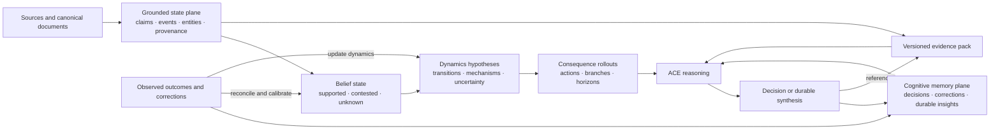
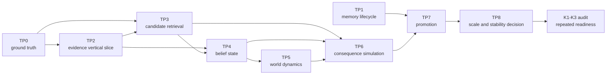

# ACE State Engine roadmap

This roadmap describes how ACE can reason over large, continuously changing knowledge bases without
turning every source claim into durable cognitive memory. It is the companion design note for the
public K1/K2/K3 outcomes, not an implementation work packet.

**Definition:** The ACE State Engine is shared, evidence-grounded state for reasoning about change
and consequences.

> The [public roadmap](../../ROADMAP.md) remains authoritative for outcome state and dispatch. This
> document does not by itself advance K1, K2, or K3 beyond `not ready`.

## Decision

ACE should adopt two logical intelligence planes joined by a versioned, inspectable reasoning
bridge:

1. The **grounded state plane** contains an evidence ledger, versioned belief state, inspectable
   dynamics hypotheses, and consequence rollouts. Together—not the evidence graph alone—these form
   ACE's State Engine.
2. The **cognitive memory plane** preserves sparse, durable intelligence that should change later
   reasoning: decisions, corrections, preferences, reusable patterns, and accepted conclusions.

ACE reasons over bounded evidence packs and consequence rollouts selected from the grounded state
plane. It promotes only durable, decision-relevant conclusions into the cognitive memory plane.
Retrieval is not promotion, and promotion does not delete or rewrite the source evidence.



The planes are logical responsibility boundaries, not a requirement that all deployments use two
physical databases. The grounded-state lifecycle, identity, temporal semantics, isolation, retrieval,
and reasoning receipts are Core responsibilities. Connectors, extractors, domain ontologies, and
specialized entity resolution remain extension responsibilities. Large source bodies may remain in
external content-addressed storage without making ACE's shared epistemic state external to Core.

## Product thesis

ACE is intended to reason over large knowledge bases, maintain an evolving evidence-grounded account
of external state, and simulate the consequences of possible actions. It should not reduce that
capability to “send more context to an LLM.” The LLM is an inference resource inside ACE's loop;
ACE owns what was observed, what was inferred, which
sources disagree, what applies at a given time, what entered a reasoning run, and what became a
durable conclusion.

The engine is inspectable and scoped, not omniscient. It represents attributed evidence, canonical
entities and events, provisional or contested assertions, derived external-world insights, and their
validity through time. It must be able to say “unknown,” “sources disagree,” and “this was true
during a different interval” without collapsing those states into one embedding or one model answer.
A collection of entities, claims, and relationships is only a grounded-state substrate.
Even after ACE adds dynamics and rollouts, this roadmap does **not** claim a general learned world
model, latent physical simulator, or the research capability associated with that term.

An **external-world insight** is a derived, time-scoped assertion supported by one or more evidence
records and an inspectable inference receipt. It lives in the grounded state plane while it
describes external state. If it also becomes a durable operator belief, strategy, decision premise,
correction, or reusable analytical pattern, an explicit promotion links it into the cognitive
memory plane.

The stronger grounded-state and consequence loop is:

```text
observe -> estimate state -> propose dynamics -> simulate alternatives -> decide -> observe outcome -> calibrate
```

## Why this is an ACE architecture change

The current capture path is optimized for sparse durable memory:

```text
memory -> observation -> synthesis -> insight -> relationship
```

That path is valuable for operator corrections, decisions, preferences, failures, and durable
lessons. It is not a safe canonical representation for hundreds of thousands of time-varying world
claims. Generic observations do not consistently preserve event time, publication time, validity,
source identity, extraction lineage, or entity identity. Semantic deduplication can also conflate a
later world state with an earlier one.

The missing capability is not “bulk observation ingestion.” It is a first-class State Engine and a
bounded bridge from evidence, state, dynamics, and simulated consequences into reasoning and
cognitive memory.

## Plane responsibilities

| Concern | Grounded state plane | Cognitive memory plane |
|---|---|---|
| Primary unit | Evidence record, belief-state assertion, transition hypothesis, consequence rollout | Decision, correction, preference, reusable pattern, durable conclusion |
| Volume | High and continuously growing | Sparse and intentionally selective |
| Mutation | Append new versions; preserve prior states | Revise through correction, contestation, supersession, expiry, or retirement |
| Time | Event/valid time, publication, ingestion, extraction | Creation, confirmation, reconsideration, expiry, observed outcome |
| Deduplication | Exact source identity and content fingerprint | Semantic merge only under type- and time-aware policy |
| Retrieval | Entity, time, lexical/vector, provenance, graph filters | Product, discipline, relevance, trust, validity, prior use |
| Relationships | Mentions, participates in, precedes, reacts to, co-occurs | Informs, depends on, improves, breaks, supersedes, contradicts |
| Truth posture | Separates observations, inferred state, hypotheses, predictions, and reconciled outcomes | Durable intelligence with explicit authority and lifecycle |
| Model use | State estimation, hypothesis generation, constrained rollout, challenge, and calibration | Synthesis and later reasoning |

## Vocabulary to freeze

- A **source record** is an immutable or version-addressed external artifact with a stable identity,
  content hash, source kind, publisher or producer, and ingestion provenance.
- A **claim** is one source-attributed assertion. It is not automatically true and is not an ACE
  insight merely because extraction succeeded.
- An **event** is an occurrence with an instant or interval and participating canonical entities.
- An **entity** is a product-scoped canonical identity plus versioned, source-attributed aliases.
  Entities are not disciplines, specialties, or free-form tags.
- An **evidence relation** is a cheap, source-grounded or deterministic relation such as `mentions`,
  `participates_in`, `precedes`, or `reacts_to`.
- An **epistemic assertion** is a reviewed proposition such as `corroborates`, `contradicts`, or
  `causes`. It carries evidence, policy, confidence, validity, and review state.
- An **external-world insight** is a derived temporal assertion with a reproducible candidate set, evidence
  pack, inference route, counterevidence search, and lifecycle state. It is not a renamed source
  claim.
- A **belief state** is ACE's versioned, time-scoped assessment of what is supported, contested,
  superseded, or unknown after resolving attributed evidence. It is a projection that can be
  rebuilt from evidence and policy, not an untraceable mutable fact table.
- A **transition hypothesis** describes how one world state may produce another, with mechanism,
  preconditions, time horizon, uncertainty, evidence, counterevidence, and causal strength.
- A **consequence rollout** is a bounded branch from a frozen belief state under an explicit action
  or no-action alternative. It records assumptions, transition versions, predicted states,
  uncertainty, failure, and later reconciliation; it is not an observed fact.
- An **evidence pack** is a bounded, immutable receipt of which evidence was selected for one
  reasoning invocation, which candidates were omitted, and why.
- **Promotion** creates a durable memory item from a reasoning result and links it to its evidence
  pack. It never reclassifies the underlying claims as insights.

## Non-negotiable invariants

1. **Product isolation is end to end.** Every record, index, query, relationship, receipt, deletion,
   and replay path is product-scoped unless a separately documented global scope is intentional.
2. **Time meanings never share one field.** `occurred_at` or `valid_from`/`valid_to`, `published_at`,
   `ingested_at`, `extracted_at`, and ACE `created_at` remain distinct.
3. **Unknown time remains unknown.** Missing dates are not silently replaced with ingestion time.
   Precision such as exact, day, month, range, inferred, or unknown is retained.
4. **Evidence is append-only by default.** A correction or new world state creates a new version or
   superseding record. Semantic similarity does not destructively merge time-distinct claims.
5. **Every resolved context item has identity.** Stable ID, version or digest, product scope, content
   hash, and resolver identity are required before ACE reports a reference as retrieved.
6. **Selection is bounded and inspectable.** Every evidence pack declares record, character/token,
   time, and cost budgets plus truncation, omission, and degraded-state reasons.
7. **Retrieval is not use.** Receipts preserve the I3 distinction among retrieved, injected,
   reflected, and decision-material evidence.
8. **Correlation is not causation.** Co-occurrence and reaction candidates do not become causal
   assertions without the ontology's evidence and human-confirmation policy.
9. **Models propose; deterministic code owns identity and lifecycle.** Model output cannot select
   product scope, mint authoritative entity identity, accept an assertion, or silently rewrite
   history.
10. **No model call is required per persisted claim.** Initial and continuous evidence ingestion
    must remain operable without serial primary-model synthesis.
11. **Belief state is reproducible.** The same evidence set, ontology, and resolver policy rebuild
    the same supported/contested/unknown projection independent of arrival order.
12. **Prediction never masquerades as observation.** Proposed dynamics, simulated states, and
    counterfactual branches use separate identities and tables from evidence and reconciled outcomes.
13. **Every rollout freezes its starting state.** Action, baseline, horizon, assumptions, transition
    versions, constraints, route, and uncertainty are immutable inputs to a consequence receipt.
14. **The system learns from misses.** Observed outcomes score compatible predictions and update
    calibration or transition proposals without rewriting the original rollout.

## Existing foundations to reuse

ACE does not start from zero:

- `memory` already represents a raw ingestion buffer, though its current contract is too thin for
  a temporal evidence corpus.
- The relational assertion engine already has stable semantic identities, proposal/review events,
  validity intervals, deterministic resolution, and operational projection.
- Extension schemas let a domain adapter own tables without reversing the kernel dependency.
- Experimental extension invocation already requires exact per-reference accounting and private,
  bounded `ResolvedContextRecord` content.
- I1 and I3 already provide durable decision/correction identity and the distinction between
  retrieval, injection, reflection, and decision-material use.
- The Living Product Graph already provides a bounded read model for inspectable ACE state.

Those foundations need tightening before reuse. Current relationship assertion persistence is not
uniformly product-scoped, generic capture lacks a uniform synthesis outcome receipt, Cognify chooses
from a small confidence-sorted set, and worker health does not prove queue drain health.

## Contracts to freeze before schema names

### Evidence record v1

The contract must cover:

- product-scoped stable ID, external ID, version, and content hash;
- record kind: source document, claim, event, entity, alias, or mention;
- source URI or local reference without requiring raw content in public receipts;
- source publisher/producer and immutable source version where available;
- `occurred_at` or `valid_from`/`valid_to` plus time precision;
- `published_at`, `ingested_at`, and `extracted_at`;
- extractor, model/provider, prompt/schema version, confidence, and source span;
- canonical entity references plus retained raw surface forms; and
- exact idempotency identity and supersession lineage.

Large content may remain in an extension-owned or external content-addressed store. Core receipts
need identity, hashes, scope, bounds, and lineage—not an unbounded copy of every document.

### Evidence query v1

The query contract should accept a question plus optional entity identities, time window, source and
record-kind filters, trust policy, and explicit budgets. Product and actor scope come from Core,
never from model-generated query text.

### Evidence pack v1

A pack must include:

- stable pack ID, contract version, query hash, product scope, and resolver identity/version;
- selected evidence references with version/digest and compact bounded content;
- selection signals and rank, without exposing hidden chain-of-thought;
- temporal coverage, entity coverage, source diversity, contested evidence, and known gaps;
- candidate count, selected count, omissions, truncation, failures, latency, and cost; and
- an immutable pack hash usable by task, decision, I1, and I3 receipts.

### Belief-state projection v1

A belief-state projection must include:

- product, as-of time, state ID/version, ontology version, and resolver policy version;
- entity/property/relation assertion, value or distribution, validity interval, and status;
- supporting, contradicting, superseding, and missing evidence references;
- epistemic confidence separated from source confidence and freshness;
- explicit `supported`, `contested`, `provisional`, `superseded`, and `unknown` states; and
- a deterministic projection hash that replay can reproduce.

### Transition hypothesis v1

A transition hypothesis must name its source and target state patterns, trigger or action,
preconditions, mechanism, expected delay/horizon, probability or bounded uncertainty, scope,
supporting and contrary evidence, causal status, model/policy versions, and review requirement.

### Consequence rollout v1

A rollout must freeze:

- starting belief-state ID and projection hash;
- proposed action or intervention plus a declared no-action or alternative branch;
- horizon, transition hypotheses, constraints, assumptions, and unavailable inputs;
- predicted state sequence with uncertainty at each material step;
- model/provider, recipe, policy, random seed where meaningful, calls, tokens, latency, and cost;
- falsifiable outcomes, indicators, and reconciliation deadlines; and
- later observed outcome links, scoring, calibration update, and degraded reasons without rewriting
  the original forecast.

### Promotion receipt v1

Promotion records the source evidence pack, resulting memory identity, promoter and authority,
policy version, rationale, and disposition. It distinguishes model recommendation, human acceptance,
automatic policy acceptance where explicitly authorized, rejection, and later supersession.

## Implementation status

**TP0 is complete on the current worktree.** Its reference corpus and current-runtime-baseline
packets were completed on 2026-08-03, and TP2 now supplies the real restart, replay, and
foreign-product persistence matrix that TP0 deliberately deferred. The reference corpus and its
zero-write baseline remain frozen. The provider-free Core packet includes:

- immutable, extra-forbid v1 contracts for grounded evidence, belief-state assertions, transition
  hypotheses, probability intervals, and action/no-action rollout requests in
  [`core/engine/grounded_state/contracts.py`](../../core/engine/grounded_state/contracts.py);
- explicit stale belief state, separate epistemic/source/freshness confidence meanings, stricter
  exact/range/unknown temporal shapes, evidence content/digest integrity, causal review references
  bound to exact transition material and structured evidence-origin pairs, explicit unavailable
  rollout inputs, and a no-action branch that may honestly contain no transition;
- versioned case, expected-semantics, corpus, maturity, review-disposition, relationship,
  eligibility, and record-meaning contracts in
  [`core/engine/grounded_state/corpus.py`](../../core/engine/grounded_state/corpus.py);
- typed relationship endpoints that keep semantic subjects and objects separate from supporting
  evidence, separate `causal_candidate` and accepted `causes` labels, and completed reviews bound
  to the exact expected-semantics hash plus a disposition for every current judgment;
- a versioned 18-case maintainer-review policy that cannot be downgraded by changing a case's
  self-declared review status, plus evidence-availability cutoffs and structural replay/version-lineage
  validation enforced by the corpus contract;
- a deterministic evaluator in
  [`core/engine/grounded_state/evaluator.py`](../../core/engine/grounded_state/evaluator.py) that
  reports validation failures, category counts, duplicate case and evidence identities, missing
  categories, pending subjective judgments, maturity, and canonical identity without a database,
  network connection, or model provider;
- a 40-case fictional and public-safe frozen corpus in
  [`temporal_reference_candidate_v1.json`](../../tests/fixtures/grounded_state/temporal_reference_candidate_v1.json)
  covering all required positive and negative categories;
- focused contract, honesty, identity-sensitivity, JSON-key-order, unordered-reference,
  evidence-arrival-order, evaluator, temporal-boundary, causality, product-isolation, and
  prediction/observation tests in
  [`tests/test_grounded_state_contracts.py`](../../tests/test_grounded_state_contracts.py); and
- a frozen, replayable current-ACE public-surface baseline in
  [`core/engine/grounded_state/baseline.py`](../../core/engine/grounded_state/baseline.py), with its
  configuration under `evaluations/fixtures`, recorded outputs under `evaluations/results`, and
  durable [TP0 runtime-baseline evidence](../evidence/state-engine-tp0-runtime-baseline-v1.md).

### TP0 frozen corpus result

The canonical frozen corpus hash is
`4b029bff64564abc226d431b373a3d75cbf971c66aa6bb53e2cf29c7198c4b09`.
The provider-free evaluator reports:

| Measure | Frozen result |
|---|---:|
| Cases validated | 40 / 40 |
| Required category coverage | 33 / 33 |
| Contract-validation failures | 0 |
| Duplicate case identities | 0 |
| Duplicate evidence identities | 2, both expected replay/duplicate-arrival controls |
| Missing required categories | 0 |
| Completed subjective owner adjudications | 18 |
| Accepted current subjective judgments | 112 / 112 |
| Pending or rejected subjective judgments | 0 |
| Maturity | `frozen` |
| Frozen acceptance ready | yes |

The two duplicate evidence identities are deliberate: one exact replay and one identical source
item delivered at different ingestion times. They remain visible in the report and do not count as
independent evidence. Corpus and case hashes are insensitive to JSON key order and to reordering
inputs declared semantically unordered. Evidence content/fingerprint, product scope, contract
version, expected semantics, policy material, or maturity changes alter the appropriate identity;
editorial corpus name and purpose changes do not.

The frozen corpus incorporates repeated semantic and adversarial audits. Independent corroboration uses a direct
independent operations record; overlapping incompatible values explicitly carry both overlap and
intersection-scoped contradiction; delivery claims use the same customer-delivery predicate;
reaction evidence explicitly attributes the reaction without claiming causation; contrary
mechanism evidence resolves the observed episode separately while retaining a narrowed no-bypass
hypothesis; and alias replacement records both source lineage and the time-scoped entity-property
change. All belief expectations now use a post-ingestion reference cutoff while preserving world
validity separately; stale and superseded expectations carry their required reasons or successor
references; exact replay and source replacement are checked against evidence identity and lineage;
and the causal negative controls prohibit accepted causation with correctly typed endpoints. A
final semantic pass recommends approval of all 18 pinned subjective cases after six focused
corrections: scheduled closure is represented as a provisional dated schedule rather than an
observed closure; dated factory closure, contested delivery, market reaction, and event sequence
beliefs preserve their available world times; the continuing post-closure state uses range
precision; and an observed temporal state change without a mechanism no longer qualifies for a
transition hypothesis. Regression assertions bind these corrected meanings.

### Owner adjudication

ACE owner `maintainer:eamirian` approved all 18 pinned subjective cases and all 112 current
judgments after the final semantic corrections. Each completed disposition records the reviewer,
review time, stable review reference, exact expectation hash, and a decision for every judgment.
The durable review ledger is
[`state-engine-tp0-owner-review-v1.md`](state-engine-tp0-owner-review-v1.md). Editing an expectation
invalidates its review binding and makes the corpus fail validation until it is adjudicated again.

### Current-runtime baseline

The baseline freezes ACE 0.1.4 on source revision
`6b6342f65224ca0c3db2f38c3bc141a58de9e8ea`, CPython 3.12.13, Darwin 25.6.0, arm64, the supported
thin 11-tool MCP surface, a 40-case/20-input/30-second execution budget, evaluation seed `1729`, and
zero model calls, tokens, estimated provider cost, or database writes. Strict scoring requires exact
machine-checkable semantics; the adapter cannot see expected answers, generic prose earns no credit,
unsupported capability counts as failure, and negative controls cannot pass vacuously.

Against corpus hash `4b029bff64564abc226d431b373a3d75cbf971c66aa6bb53e2cf29c7198c4b09`,
current ACE produced **0 exact matches and 40 unsupported cases, matching 0 of 247 judgments**. The
reference environment matched, there were no execution errors, and the material outcome hash is
`7aed1cdd929dc6159b7233ebab5bc90bdb9a7e07be7ed38529dc959b2930357f`. This is the honest baseline:
the current public contract cannot accept the frozen grounded-evidence input or emit typed belief
state, relationships, transition hypotheses, or consequence rollouts. It is not an LLM quality
comparison and does not say ACE lacks its existing memory, graph, or reasoning capabilities.

### TP0 persistence closeout

TP2's disposable-database acceptance now closes TP0's deferred real restart, exact replay, and
foreign-product isolation matrix for the grounded-evidence plane; TP1 independently proves the
memory-plane restart boundary. This later evidence does not rewrite the recorded zero public-surface
baseline and does not add belief-state resolution, dynamics, consequence execution, or rollout
behavior to TP0. K1, K2, and K3 remain `not ready`, and F1 retains its passed but bounded
non-world-model maturity.

### Frozen-corpus verification

Verification on 2026-08-03 produced:

- Ruff lint over `core/engine/grounded_state`, `tests/test_grounded_state_contracts.py`, and
  `tests/test_grounded_state_runtime_baseline.py`: passed;
- Ruff format check over the same paths: passed;
- focused State Engine contracts, complete frozen corpus, runtime-baseline replay, and honesty
  checks: 44 passed;
- F1 foresight contract tests: 3 passed;
- roadmap and package-identity tests: 10 passed;
- kernel-boundary and explicit naked-kernel tests: 5 passed and 1 expected built-in-discovery
  check skipped because extensions were deliberately disabled; and
- full non-E2E, extension-disabled compatibility suite: 6,711 passed, 47 skipped, and 244
  deselected;
- total failures in those declared lanes: 0.

## Capability sequence

### TP0. Freeze the reference scenario and ground truth

**Outcome:** The team can evaluate the architecture against a small, adversarial temporal corpus
before optimizing throughput or adding public surface area.

Scope:

- freeze 30–100 timeline pairs or triples containing updates, true same-time contradictions,
  restatements, corroboration, unrelated controls, missing-time claims, and entity aliases;
- include source documents and expected canonical entities, candidate neighbors, temporal ordering,
  and permitted relationship labels;
- record the current ACE behavior as a baseline without rewriting results into success;
- define reference hardware, provider/model routes, budgets, and evaluation seeds; and
- include at least one real restart, replay, and foreign-product isolation case.

Acceptance evidence:

- every expected relationship has source IDs and an explicit temporal rationale;
- test authors can distinguish a changed world state from an epistemic contradiction;
- the corpus contains negative controls and cannot pass by relating everything;
- checksums and evaluation rules are frozen before the implementation run; and
- unresolved labeling disagreements remain explicit.

### TP1. Make the memory-plane lifecycle trustworthy

**Outcome:** Every observation reaches an explainable terminal state and every operator can tell
whether the queue is draining.

Scope:

- replace one-batch reconnect drain behavior with a continuous, bounded drain loop;
- claim work through product-scoped leases with retry time, attempt count, owner, and expiry;
- freeze legal states such as `pending`, `leased`, `processing`, `succeeded`, `retryable_failed`, and
  `dead_letter`;
- persist one synthesis outcome receipt per observation: created, updated, merged, conflicted,
  skipped, or failed;
- make deduplication, embedding, and post-processing use the observation's product identity;
- expose queue depth, oldest pending age, throughput, retries, dead letters, and last successful
  outcome; and
- add supported worker startup, shutdown, restart, and supervision guidance.

Acceptance evidence:

- no pending record is stranded across worker downtime and restart;
- concurrent workers do not process one lease simultaneously;
- retry exhaustion produces a durable inspectable dead-letter result;
- a green health result requires bounded queue lag, not merely recent hook activity;
- every processed legacy observation maps to an explicit outcome or an honest legacy gap; and
- product-isolation tests fail closed.

Roadmap dependency: contributes to **T1** and is required before promoted evidence can reliably enter
the cognitive memory plane.

#### TP1A implementation status: truthful observation outcomes

TP1A is complete on the current worktree. The versioned immutable outcome contract, additive v161
receipt persistence, deterministic replay identities, product-scoped shared finalizer, honest
retry/dead-letter behavior, legacy-gap classification, and existing-surface health projection are
implemented and provider-free tested. A real disposable SurrealKV stop/start check preserved the
receipt and its observation/insight references across restart and rejected a foreign-product read.
See the [TP1A architecture and evidence record](../evidence/state-engine-tp1a-truthful-observation-outcomes-v1.md).

This advances only the truthful-outcome slice. TP1A does not independently claim leases, concurrent
claiming, continuous draining, processing-death recovery, or supported supervision.

#### TP1 completion status: reliable worker claiming and recovery

TP1 is complete on the current worktree. The immutable lease contract, additive v162 migration,
single-transaction product-scoped claim, owner/expiry/generation fences, heartbeat renewal, bounded
conflict retry, abandoned-attempt recovery, continuous bounded drain, fail-closed queue health, and
supervised Compose worker are implemented. Real concurrent claims produced exactly one owner; a
disposable SurrealKV two-restart scenario recovered the same attempt coordinate and preserved its
terminal TP1A receipt. See the
[TP1 architecture and evidence record](../evidence/state-engine-tp1-reliable-memory-lifecycle-v1.md)
and [worker operating guide](../worker-operations.md).

This completes the memory-plane packet and contributes evidence to T1. TP1 alone did not close
TP0's grounded-evidence matrix or make T1, K1, K2, or K3 ready: durable task
cancellation/portability and the grounded-evidence, belief, dynamics, and rollout planes remain
separate work.

### TP2. Build the grounded temporal evidence substrate

**Outcome:** ACE can persist and replay temporal source evidence through a Core-owned grounded-state
substrate without writing claims directly to observation or insight tables. This is the evidence
foundation, not yet a consequence engine. OLC is the first domain adapter, not the owner of the
architectural boundary.

Scope:

- add experimental, product-scoped Core contracts for source, entity, alias, claim, event, and
  evidence relation records;
- define a provider-neutral ingestion adapter so extensions map source-specific extraction into
  those contracts without owning Core lifecycle semantics;
- implement exact idempotent upsert by product, external identity, source version, and content hash;
- preserve all timestamp meanings and unknown-time precision;
- retain raw entity surface forms while binding canonical product-scoped entity IDs;
- represent extraction corrections and changed source versions through append-only supersession;
- provide batch ingestion that performs no primary-model call per record; and
- run the slice in a disposable database or namespace, not a supposedly disposable product alone.

Acceptance evidence:

- replaying the same import creates no new semantic records or edges;
- a changed source version creates explicit lineage rather than overwriting history;
- exact counts reconcile from source manifest through persisted claims and events;
- missing dates, aliases, and extraction failures remain queryable degraded states;
- foreign-product entity, claim, and source reads return nothing; and
- the naked kernel starts and operates with an empty grounded-state substrate when the OLC adapter
  is absent.

Roadmap dependency: uses the **E1** extension boundary for connectors and domain meaning, while the
grounded-state identity, time, isolation, persistence, and receipt contracts remain Core-owned.

#### TP2 implementation status: grounded temporal evidence

TP2 is complete on the current worktree. Immutable provider-neutral contracts, additive v163
append-only persistence, deterministic bounded ingestion, item and batch reconciliation,
supersession lineage, product-fenced reads, interruption recovery, and the E1 adapter seam are
implemented. A bounded fixture-backed OLC-style reference adapter remains outside Core and performs
zero primary-model calls. Real disposable SurrealKV acceptance proves exact replay through a fresh
service after stop/start, version and correction lineage, timestamp and degraded-state durability,
partial-item rejection, and fail-closed foreign-product access. Observation and insight counts are
unchanged, the naked kernel has no adapter, and the thin public MCP surface remains eleven tools.
See the [TP2 architecture and evidence record](../evidence/state-engine-tp2-grounded-temporal-evidence-v1.md).

This closes TP2 and TP0's deferred persistence matrix. It does not claim full OLC import readiness,
candidate retrieval, belief projection, dynamics, rollouts, promotion, beneficial impact, or K1
completion. E1 remains the existing boundary, and T1 and K1–K3 remain `not ready`. The evidence
record's prior cleanup caveat is closed: a read-only exact-scope audit found zero rows for all four
named synthetic product scopes, so there was nothing to delete and no destructive query was issued.

### TP3. Add multi-signal candidate retrieval

**Outcome:** Association candidates come from the relevant corpus rather than the same small set of
highest-confidence memory items.

Scope:

- define a provider-neutral candidate-finder interface shared by evidence retrieval and Cognify;
- generate candidates from canonical entity overlap, temporal window, lexical/vector similarity,
  graph neighborhood, source diversity, and explicit filters;
- separate deterministic candidate generation from optional model relationship judgment;
- make every signal, cap, fallback, and unavailable index visible in an internal receipt;
- support unknown-time evidence without pretending it passed a time filter; and
- keep domain labels as routing facets rather than the primary association mechanism.

Acceptance evidence:

- the frozen TP0 gold neighbors achieve a predeclared candidate-recall target at a bounded `k`;
- unrelated controls remain below a predeclared false-association ceiling;
- results are deterministic for the same index versions, query, and budgets;
- removing vector, entity, or temporal signals produces an attributable ablation result;
- index absence degrades visibly to a bounded fallback; and
- no candidate crosses product scope.

The recommended initial target is at least 95% candidate recall at `k <= 50` on TP0. The target must
be frozen before execution and reported even if it fails.

#### TP3 implementation status: multi-signal candidate retrieval

TP3 is complete on the current worktree. Core now owns immutable provider-neutral candidate record,
filter, request, index-snapshot, signal-contribution, result, and receipt contracts plus a bounded
deterministic finder shared by grounded evidence retrieval and Cognify. The finder combines lexical,
vector, canonical-entity, temporal, graph-neighborhood, and source-diversity signals; keeps filters,
index versions, signal availability, both score and return caps, fallbacks, and per-result
contributions inspectable; and treats unknown time as `unknown_time_not_scored`. Domain labels remain
facets rather than a ranking shortcut. Optional Cognify relationship judgment remains a separate
step after deterministic generation.

The TP0 target was frozen before the first implementation execution at at least 95% recall with
`k=20` and no more than 10% false associations in the top 10. The first run retained 100% recall but
honestly failed the negative ceiling at 50%; the general policy was then corrected so explicitly
disjoint canonical entities with no graph bridge cannot be associated by lexical similarity or
coincident timing alone. The unchanged frozen evaluation now finds 38 of 38 directed gold neighbors
(100% recall, MRR 1.0) and 0 of 6 negative controls, with attributable vector, entity, and temporal
ablations and an explicit vector-index-unavailable fallback. All paths are provider-free.

Real disposable SurrealKV acceptance proves that a receipt is identical after database and client
restart and that a foreign-product record fails closed. Candidate generation is internal, bounded to
200 records and `k <= 50`, adds no schema migration, and does not alter the eleven-tool public MCP
surface. See the [TP3 evidence record](../evidence/state-engine-tp3-multi-signal-candidate-retrieval-v1.md)
and [recorded evaluation](../../evaluations/results/state_engine_tp3_candidate_retrieval_v1.md).
This closes only TP3. The TP4 status below now closes belief projection and the minimum reviewed-
assertion compatibility work; dynamics, rollouts, promotion, beneficial impact, and K1–K3 remain
unimplemented or `not ready` as specified below.

### TP4. Build the versioned belief-state projection

**Outcome:** ACE distinguishes source-grounded sequence and participation from contested epistemic
or causal assertions, projects what it currently believes as of a chosen time, and derives
inspectable external-world insights without confusing them with source claims.

Scope:

- keep cheap evidence relations such as `mentions`, `participates_in`, `precedes`, and `reacts_to`
  in the grounded state plane's evidence ledger;
- extend the relational assertion contract only for reviewed meanings such as `corroborates`,
  same-validity `contradicts`, `supersedes`, and carefully gated `causes`;
- add product identity to proposal, assertion, review, event, and projection semantics;
- extend endpoint typing to evidence records without weakening existing insight/decision types;
- preserve `valid_from` and `valid_to` in semantic identity and resolution;
- prevent a later state from being labeled contradiction solely because its text differs; and
- require source diversity and human confirmation for causal promotion;
- persist hypothesis, supporting evidence, counterevidence search, inference route, policy/model
  version, confidence, validity, and review state for every derived external-world insight; and
- reopen affected assertions when new evidence changes an entity, event, validity interval, or
  source assessment rather than recomputing the entire model blindly.

Acceptance evidence:

- TP0 update, contradiction, restatement, and sequence fixtures receive different expected states;
- reciprocal or mutually exclusive assertions remain contested under deterministic policy;
- assertion replay is independent of arrival order and provider output order;
- cheap evidence edges cannot silently become operational causal truth;
- every operational projection links to its accepted assertion and evidence references; and
- a derived external-world insight can be reproduced from its frozen candidates and inference
  receipt; and
- temporal and product isolation survive a real database/API restart.

#### TP4 implementation status: versioned belief-state projection

TP4 is complete on the current worktree. Core now owns immutable provider-neutral contracts for
typed evidence endpoints, bounded frozen evidence packs, epistemic proposals, counterevidence
search, authority-bound reviews, append-only assertion revisions, as-of belief projections,
inference receipts, external-world insights, and targeted reprojection receipts. Product, temporal,
evidence, review, ontology, policy, route, and model-version material participates in stable identity
and exact replay.

The deterministic resolver distinguishes changed state from same-interval contradiction and
restatement from independent corroboration. Reciprocal or exclusive assertions remain contested.
Causal acceptance requires human confirmation, at least two supporting evidence records, at least
two independent sources, a complete non-degraded evidence pack, and a completed exact-material
counterevidence search over that pack. Projection emits reviewed world-state subject, predicate, and
value material, retains historical states and explicit supersession lineage, and preserves unrelated
entries byte-for-byte during targeted reprojection. Operational
projection retains accepted-assertion, revision, review, and evidence links; unknown event time is
never replaced with ingestion time. New dependency evidence reopens only affected assertion
revisions. Derived external-world insight remains a separate reproducible record and is not promoted
to cognitive memory.

Additive migration v164 makes the existing reviewed-assertion path product-fenced and adds nine
append-only TP4 record tables. Real disposable database and service/API restart acceptance proves
exact bounded projection (including omitted assertion and target material), inference, insight,
revision, and reprojection replay plus foreign-product
fail-closed behavior. The frozen provider-free target passes 13 of 13 selected TP0 cases and 13 of
13 deterministic replays with zero product-isolation, causal-negative-control, or unlinked-
operational-entry violations and zero model calls, tokens, or cost. Each case now records the real
projection hash; the repaired machine outcome hash is
`f09127fda74a31246c69eded4e78983f9a6678d770de2134082c21e5bd757bd0`. No MCP tool was added; the
supported public contract remains exactly eleven tools. See the
[TP4 evidence record](../evidence/state-engine-tp4-belief-state-projection-v1.md) and
[machine result](../../evaluations/results/state_engine_tp4_belief_projection_v1.json).

This closes only TP4. The TP5 status below now closes bounded transition dynamics; TP6 rollouts,
promotion, beneficial impact, T1, and K1–K3 remain out of scope or `not ready`.

### TP5. Model world dynamics and state transitions

**Outcome:** ACE can represent inspectable hypotheses about how world state changes, including
preconditions, mechanisms, delay, uncertainty, contrary evidence, and causal limits.

Scope:

- implement Transition Hypothesis v1 separately from observations, belief-state assertions, and
  predictions;
- derive candidate transitions from repeated temporal sequences, accepted mechanisms, domain rules,
  and extension-contributed dynamics without treating frequency as causality;
- type state variables, triggers/actions, preconditions, constraints, target states, and horizons;
- require stronger evidence, independent challenge, and human disposition as causal consequence
  rises;
- version transition hypotheses and preserve supported, provisional, contested, rejected, stale,
  and superseded states;
- retrieve both supporting and contrary episodes before a transition enters a rollout; and
- link forecast reconciliation and observed outcomes back to hypothesis calibration without
  rewriting the original hypothesis revision.

Acceptance evidence:

- deterministic rules and invariants block impossible state transitions;
- temporal association alone cannot earn a causal transition status;
- the same starting state and transition revision reproduce the same deterministic branch inputs;
- challenged, missing-input, and out-of-domain transitions remain visible degraded states;
- later outcomes update calibration while preserving the original prediction and hypothesis; and
- transition lookup and review remain product-scoped across restart.

#### TP5 implementation status: inspectable transition dynamics

TP5 is complete on the current worktree. Core now owns immutable provider-neutral contracts for
typed state variables, conditions, target assignments, triggers, deterministic preconditions and
constraints, transition proposals, complete independent challenges, exact-material reviews,
append-only hypothesis revisions, deterministic branch inputs, observed outcomes, and separate
calibration receipts. Every authoritative record is product-scoped and binds the exact TP4 belief
projection, evidence pack, assertion material, policy versions, omissions, failures, and degraded
conditions that produced it.

The resolver keeps associative, predictive, mechanistic, and causal strength distinct. Sequence,
reaction, or repeated state change alone cannot earn accepted transition status. Provisional rollout
eligibility requires a mechanistic or causal hypothesis, complete search of the frozen evidence
pack, no contrary evidence, and no missing, omitted, failed, or degraded input. Accepted causal
status additionally requires exact human review and at least two supporting records from two
independently reviewed source origins. Models may propose transition material but cannot govern its
lifecycle or resolve an observed outcome.

Typed domains reject impossible target assignments. Deterministic source conditions,
preconditions, and constraints freeze reproducible branch inputs without simulating or persisting a
future state. Contrary episodes remain contested and degraded; missing mechanisms, human review,
unknown time, and out-of-product inputs remain visibly ineligible. Stale and superseded revisions
retain prior lineage. Later observed outcomes bind the exact immutable revision, optionally bind
paired Foresight prediction and resolution references, require a separate post-revision evidence
pack frozen no later than observation, and update a separate calibration receipt rather than
rewriting either the hypothesis or its original probability.

Additive migration v165 adds seven append-only TP5 record tables. Real disposable SurrealKV
acceptance applies v165 twice, persists the complete TP4-to-TP5 lineage, reproduces the exact
revision and deterministic branch input after restart through a fresh service, denies foreign-
product lookup, records a later outcome, recalibrates, restarts again, and reloads the exact outcome
and calibration receipt. The outcome uses its own later evidence pack. The acceptance also repaired
typed product lookup for valid hyphenated record identifiers in the TP4/TP5 stores.

The frozen provider-free target passes 8 of 8 selected TP0 transition cases and 8 of 8 reverse-order
replays, all ten required invariant/challenge/calibration checks, and zero product-isolation or
causal-gate violations with zero model calls, tokens, or cost. The machine outcome hash is
`233c24afb28a273c057c5adaf988dc77824caef267e3442ae380405b69989a15`. No API endpoint or MCP tool
was added; the supported thin contract remains exactly eleven tools. See the
[TP5 evidence record](../evidence/state-engine-tp5-transition-dynamics-v1.md) and
[machine result](../../evaluations/results/state_engine_tp5_transition_dynamics_v1.json).

This closes only TP5. TP6 rollouts, TP7 promotion, TP8 scale/stability, beneficial impact, T1, and
public K1–K3 readiness remain out of scope or `not ready`.

### TP6. Simulate consequences and bridge them into ACE reasoning

**Outcome:** A task can resolve ACE's large grounded-state substrate into a small provenance-rich context pack,
simulate bounded action and no-action futures, and prove which evidence, state, dynamics, and
consequences entered reasoning.

Scope:

- implement Evidence Query v1 and Evidence Pack v1 through an extension task action first;
- adapt the existing exact reference-accounting and `ResolvedContextRecord` contract instead of
  adding a twelfth thin MCP tool;
- delimit evidence as untrusted data and keep it separate from task instructions;
- persist pack identity, hash, resolver/index versions, budgets, coverage, omissions, and failures;
- implement Consequence Rollout v1 over a frozen TP4 belief state and explicit TP5 transition
  revisions;
- require an action, no-action, or named alternative branch plus horizon, assumptions, constraints,
  predicted state sequence, uncertainty, and falsifiable outcomes;
- separate deterministic transition execution, model-proposed branches, independent challenge, and
  final bounded synthesis in the receipt;
- link selected evidence to I3 retrieved, injected, reflected, and decision-material states; and
- expose a bounded read projection through the existing task/status and Living Product Graph paths.

Acceptance evidence:

- a fresh task resolves the expected TP0 evidence after a real restart;
- source text that contains instructions gains no execution or prompt authority;
- missing, rejected, truncated, stale, and contested records remain visible degraded coverage;
- the task receipt names exact evidence versions and pack hash without exposing unrelated content;
- action and no-action branches share the same frozen starting state and expose mismatches;
- simulated states cannot be queried or rendered as observed facts;
- a later outcome reconciles and scores the compatible rollout without rewriting it;
- a matched no-evidence control distinguishes retrieval from decision-material influence; and
- the public thin MCP surface remains exactly eleven tools.

#### TP6 implementation status: bounded consequence rollouts and reasoning bridge

TP6 is complete on the current worktree. The reference extension now contributes an experimental
`evidence-query` task action over the existing extension-invocation and durable task lifecycle. Core
derives the trusted product, workspace, user, task coordinate, invocation, and authorization-scope
hash; resolves a bounded TP3 candidate receipt and TP4 evidence pack; records all nine supported,
provisional, contested, superseded, stale, rejected, unknown, missing, and truncated coverage
states; and returns source content only inside an explicit untrusted-data delimiter. Evidence text
cannot choose scope, call tools, reveal secrets, mutate state, or become task/system instruction.

Core owns immutable provider-neutral TP6 contracts and deterministic services for exact TP4/TP5
lineage, action/no-action/named-alternative branches, assumptions, constraints, bounded steps and
horizon, uncertainty, consequences, falsifiable outcomes, model-proposal non-authority,
independent challenge, append-only rollout revisions, I3 reasoning-use receipts, and separate
later-outcome reconciliation. Action and no-action branches share one exact starting projection,
hash, evidence pack, as-of time, and horizon. Mismatch, impossible assignments, violated
constraints, unavailable transition lineage, overlong horizons, incomplete challenge, prompt
injection, or degraded required inputs fail closed or remain explicitly degraded. Simulated states
and consequences have distinct record meanings and never enter observations, beliefs, external
insights, Foresight resolutions, or cognitive memory.

I3 receipts account for exact evidence, belief, transition, assumption, branch, and consequence
items across retrieved, injected, reflected, and decision-material states. Decision-material credit
requires a matched rollout/no-rollout comparison on task, provider, exact model, configuration,
decision schema, and toolset; exact treatment/control hashes must differ and structured decision
fields must change. Otherwise the receipt stops honestly before materiality. A later observation
binds the immutable rollout and a separate post-rollout evidence pack, optionally retains paired
Foresight prediction/resolution references, and produces matched, contradicted, mixed, or unresolved
reconciliation without rewriting the rollout, projection, transition, probability, or consequence.

Additive migration v166 adds ten append-only, product-scoped TP6 tables. Disposable SurrealKV
acceptance applies v166 twice, resolves evidence through a fresh post-restart service, replays the
exact context pack, rejects foreign-product content and identity collisions, persists the complete
rollout atomically, restarts and reproduces it, reloads its I3 receipt, records and reconciles a later
outcome, restarts again, and reloads the exact immutable records. Schema-zero API/client restart
reaches migration head v166. The Living Product Graph exposes only bounded read-only rollout and
reconciliation metadata under `state_engine`; it labels rollouts as simulations and never renders
their payload as historical observation or belief.

The frozen provider-free target passes 5 of 5 scenarios, 2 of 2 deterministic replays, and all 11
required checks, with zero product-isolation, prompt-authority, or simulated-observation violations
and zero provider calls, tokens, latency, retries, or cost. Its outcome hash is
`dfeeb1128166b6dc93bfb41a8911b8a9d3fd3a298a6cd85fff7d709783aab915`. The first two evaluator
attempts are retained as failures: one enum-alias validation error and one missed corpus-hash method
call; neither started a case or provider call, and both corrections were evaluator-only. No API
endpoint or MCP tool was added; the supported thin contract remains exactly eleven tools. See the
[TP6 evidence record](../evidence/state-engine-tp6-consequence-rollouts-v1.md) and
[machine result](../../evaluations/results/state_engine_tp6_consequence_rollout_v1.json).

This closes only bounded TP6. The TP7 status below now closes bounded promotion governance; TP8
scale/stability, beneficial impact, T1, and public K1–K3 readiness remain out of scope or `not ready`.

### TP7. Add explicit promotion and feedback

**Outcome:** A durable conclusion can move from evidence-grounded reasoning into memory with review,
lineage, and later correction.

Scope:

- implement Promotion Receipt v1;
- restrict promotion targets to durable conclusions, decisions, corrections, preferences, and
  reusable patterns—not arbitrary source claims;
- link the memory record to the evidence pack and its task/decision receipt;
- make model proposals non-authoritative until policy or human disposition permits promotion;
- preserve rejection, expiry, contestation, invalidation, and supersession;
- route later observed outcomes and human corrections through existing I1/F1/I3 semantics; and
- measure whether promoted memory is later retrieved and materially used without equating use with
  benefit.

Acceptance evidence:

- no evidence record becomes memory without a promotion receipt;
- rejected and merely retrieved claims never leak into durable memory;
- a promoted conclusion survives restart and is retrieved by a fresh later invocation;
- a correction can invalidate or supersede the conclusion without deleting its evidence lineage;
- the same receipt represents accepted, rejected, expired, contested, and degraded promotion; and
- beneficial-impact claims remain gated by **L1**.

#### TP7 implementation status: explicit governed promotion and correction

TP7 is complete on the current worktree. Core now owns immutable, extra-forbid, product-scoped v1
contracts for promotion proposals, authoritative reviews, receipts, memory lineage, and retrieval.
A proposal binds exact I1 task and decision receipt material, TP4 projection, TP5 transition
revisions, TP6 evidence/context pack, rollout and reasoning-use receipt, evidence versions,
provenance, authority, omissions, failures, degraded and contested inputs, policy and ontology
versions, and material-derived identity. Only durable conclusions, decisions, corrections, stable
preferences, and reusable reasoning patterns are typed promotion targets.

Models can propose but cannot govern lifecycle state. An accepted receipt requires an authenticated
human or exact allow-listed deterministic policy; incomplete, contested, stale, rejected,
truncated, foreign-product, instruction-bearing, simulated-as-observed, or lineage-conflicting
material fails closed or remains explicitly non-accepted. Accepted material is written to the
existing `insight` memory plane, never a second memory system. Rejected, expired, contested,
invalidated, superseded, failed, and degraded receipts remain append-only and inspectable.

Additive migration v167 creates four append-only TP7 lifecycle tables and optional lineage fields
on existing insights without mutating or backfilling source, belief, transition, rollout,
observation, decision, or memory rows. Review, receipt, lineage, and accepted memory are written
atomically; replay is idempotent, conflicts are visible, and product scope is strict. A real
SurrealKV restart and fresh service retrieve the accepted conclusion. A later I1 correction creates
a new accepted receipt that supersedes the conclusion while preserving its complete earlier
lineage; a fresh task-time load returns only the corrected authoritative memory.

TP7 reuses I3 to distinguish retrieved, injected, reflected, and decision-material states. A
matched control can establish material use, but every receipt still reports that beneficial impact
is unsupported. The reference extension contributes an authority-gated `promotion-review` task
action through existing task/status journeys. The Living Product Graph exposes read-only bounded
proposal/review/receipt/lineage metadata, proposal payloads remain hidden, and no twelfth MCP tool or
new public API endpoint was added.

The frozen provider-free target passes all 4 positive cases, 14 adversarial cases, 26 required
checks, and 3 real-path sabotage checks, with all eight lifecycle dispositions visible and zero
provider use or boundary violations. Its outcome hash is
`d35a4543f63ac021bd398dbc0c7d76bd0d92632effd321f4d774208ae4a7866f`. See the
[TP7 evidence record](../evidence/state-engine-tp7-promotion-feedback-v1.md) and
[machine result](../../evaluations/results/state_engine_tp7_promotion_feedback_v1.json).

This closes only bounded TP7. TP8 scale/stability, L1 beneficial impact, T1, B1, E1, public K1–K3,
and release readiness remain unchanged or `not ready`.

### TP8. Prove scale and promote the Core boundary

**Outcome:** Maintainers have scale, recovery, and compatibility evidence to promote the
domain-neutral grounded-state, dynamics, and reasoning-bridge contracts in Core while leaving connectors,
extractors, and domain ontologies extensible.

Scope:

- run a disposable initial load at or above 200,000 claims plus continuous ingestion at twice the
  reference workload's measured daily peak;
- measure persistence throughput, association lag, query latency, pack latency, storage growth,
  model calls, tokens, cost, failures, and recovery time separately;
- prove that ingestion does not enqueue one primary-model synthesis per claim;
- test schema-zero migration, N-1 extension compatibility, backup/restore, product deletion or
  archival, and interrupted batch replay;
- compare same-database and external content/evidence storage adapters without changing Core
  identity, isolation, query, and receipt semantics; and
- publish the stable Core contract, migration and portability policy, supported adapter boundary,
  and any features that remain experimental.

Acceptance evidence:

- source-manifest counts reconcile after initial load, interruption, replay, and restart;
- the declared steady-state queue-lag and pack-latency objectives pass on named reference hardware;
- no cross-product record or relationship is returned under adversarial tests;
- cost and latency budgets are reported for each plane rather than averaged together;
- the eleven-tool boundary and extension-removal behavior are reverified; and
- limitations and negative scale results are published rather than hidden by aggregate success.

The State Engine is an intended ACE capability. TP8 decides when each
contract has earned stability and which physical storage adapters are supported; it does not
revisit whether ACE owns the grounded-state and consequence reasoning lifecycle.

**TP8 closeout (2026-08-04):** The frozen single-node trial reconciles 200,000 claims and 236,000
semantic records after database, adapter, and client interruption; sustains 990.410 claims/second
against the frozen 68,000/day target; records 14.189 ms candidate and 16.510 ms evidence-query/pack
p95; preserves zero provider use and product-isolation violations; restores exact identities,
receipts, counts, and lineage; applies schema zero and the v0.1.x upgrade to v168; resumes a
hard-stopped v167→v168 migration; passes N−1, naked-kernel, exact eleven-tool, package-boundary, and
adapter-portability checks; and publishes all preliminary latency and migration failures. The
[TP8 evidence](../evidence/state-engine-tp8-scale-stability-v1.md),
[Core-boundary decision](state-engine-core-boundary-v1.md), and
[readiness receipt](../../evaluations/results/state_engine_tp8_readiness_v1.md) are authoritative for
the measured packet. K1 is `ready`; K2 and K3 are `candidate`. Arbitrary interruption inside
historical pre-v142 migrations, distributed guarantees, broad-domain dynamics at scale, repeated
fresh-process large-corpus task p95, causal accuracy, and benefit remain open or out of scope.

**Subsequent K1-K3 readiness closeout (2026-08-04):** The frozen follow-on audit revalidates K1
against the retained post-sustained 220,000-claim/256,000-semantic-record store, repeats all eight
TP5 domains five times, and runs five repeated database/API/worker/thin-client journeys. K2 records
40/40 exact case and replay matches, 35 required abstentions, five predeclared later-outcome
calibrations, and 8.924 ms transition p95. K3 records 5/5 passing journeys, five matched outcome
reconciliations and correction supersessions, exact before/after-correction material use, 81.799 ms
task / 42.534 ms promotion / 11.214 ms retrieval p95, and 2.186 s maximum restart. Provider use,
retries, isolation leaks, simulation-as-observation rows, and degraded states are zero. The
[readiness evidence](../evidence/state-engine-k1-k3-readiness-v1.md) advances K1, K2, and K3 to
`ready` for these bounded single-node capabilities. It does not establish broad causal accuracy,
real-world calibration, benefit, distributed guarantees, or release readiness.
The [Core-boundary readiness addendum](state-engine-core-boundary-readiness-v1.md) records the
classification delta without mutating the frozen TP8 boundary input.

## Dependency map



TP1 can run alongside TP2–TP5. TP6 must not claim trustworthy consequence reasoning until candidate
selection, belief-state projection, and dynamics semantics pass. TP7 must not depend on an
unreliable observation lifecycle.

## Reference OLC pilot

The OLC corpus is an appropriate reference workload if it is treated as design evidence rather than
as permission to backfill Core tables.

Recommended pilot:

1. Freeze approximately 100 claims across 30–50 documents, with known entity aliases, timelines,
   reactions, restatements, contradictions, and negative controls.
2. Persist them through the experimental Core grounded-state contract in a disposable database, using
   the OLC adapter for source-specific mapping and entity resolution.
3. Replay the import and prove exact idempotency and source-count reconciliation.
4. Run Association Radius through the TP3 candidate interface and score the frozen neighbors.
5. Build a frozen as-of belief state and at least one inspected transition hypothesis.
6. Produce one bounded evidence pack and action/no-action consequence rollout for a real analytical
   question.
7. Run an ACE task with the grounded rollout and matched evidence-free/model-only controls.
8. Promote at most a few genuinely durable conclusions, each with a promotion receipt.
9. Restart the database and API, repeat the question through a fresh client, and inspect I1/I3
   lineage.
10. Only then run the 200,000-claim disposable scale trial.

The initial 182,315 extracted records remain useful as claims. They should not be relabeled as ACE
insights merely to fit the current pipeline.

## Deliberate non-goals

- Turning ACE into the canonical document lake or copying every source body into public receipts.
- Treating every extracted claim as durable memory.
- Using specialties as entity identities or allowing unbounded source/theme slugs to emerge.
- Equating product boundaries with taxonomy or relying on product deletion as cleanup before it has
  cascading acceptance evidence.
- Destructive semantic deduplication across different validity intervals.
- Asking an LLM to discover associations across an unbounded corpus in one prompt.
- Automatically promoting co-occurrence into causality.
- Adding a twelfth thin MCP tool during the extension-first proof.
- Claiming that retrieved evidence improved decisions without matched outcome evidence.
- Creating a second extension system or permitting Core to import a domain extension.

## Proposed public outcomes

The public roadmap should express the user capabilities rather than every internal packet:

> **K1 — Maintain grounded temporal world state.** A user can ingest and replay a large,
> product-scoped corpus as source records, entities, events, and claims, then reproduce an as-of
> belief state with exact identity, provenance, disagreement, validity, unknowns, degraded states,
> and restart continuity.

> **K2 — Model inspectable world dynamics.** ACE can derive and govern versioned state-transition
> hypotheses with mechanisms, preconditions, time horizons, uncertainty, supporting and contrary
> evidence, causal limits, review state, and calibration from later outcomes.

> **K3 — Simulate and reconcile consequences.** Given a frozen belief state and explicit action,
> no-action, or alternative branches, ACE can produce bounded consequence rollouts, compare likely
> futures, expose assumptions and uncertainty, use them in later reasoning, and reconcile predictions
> against observed outcomes without presenting simulations as facts.

K1, K2, and K3 are now `ready` for the bounded single-node contracts and measurements recorded by
TP8 and the subsequent readiness audit. That decision does not generalize to real-world causal
accuracy, forecast calibration, benefit, distributed operation, or release readiness. TP1 also
contributes to T1; connectors depend on the E1 extension boundary; durable promotion reuses I1 and
I3; beneficial impact remains an L1 question.

## Recommended dispatch

TP0–TP8 and the bounded K1-K3 readiness audit now have passing implementation and acceptance
packets. The explicit pre-R7 remediation is complete, so R7 may be planned as a separate authorized
packet; it was not started by this audit. Keep source connectors, extraction policy, and domain
ontologies behind the extension boundary; do not backfill the OLC corpus into cognitive memory or
infer L1 benefit, T1, distributed guarantees, real-world calibration, or release readiness from the
single-node evidence.

The signature capability is a temporal, inspectable State Engine—not bulk storage by itself and not
a general learned world-model claim. ACE must turn a changing external world into bounded
attributable evidence, test derived external-world insights, simulate explicit alternatives, use
them in reasoning, and trace durable conclusions back to the exact evidence that justified them.
