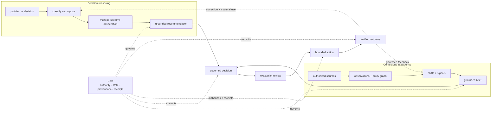
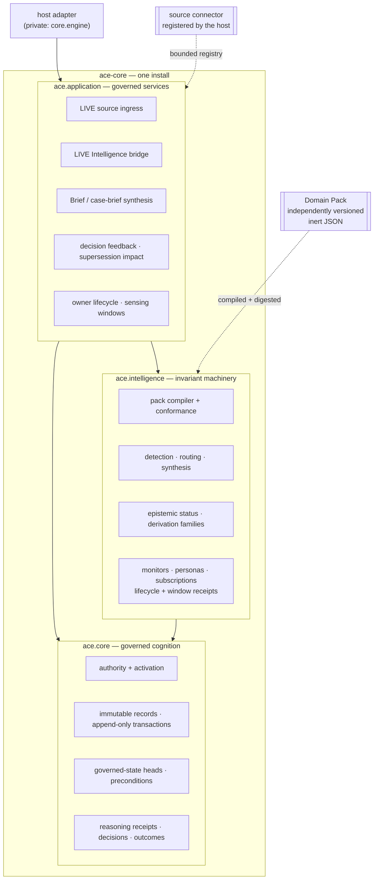

# Intelligence OS and Intelligence Builder

This guide explains ACE's current product journey, connected reasoning and continuous-intelligence loops, Core/Intelligence boundary, Solution Bundles, and inert Domain Packs. For installation, use [Getting started](getting-started.md). For the complete implementation map, use [Architecture](architecture.md).

## What ACE does

ACE is an **Intelligence Operating System**, experienced first through the **Intelligence Builder**:
a guided way to turn authorized, changing sources into useful intelligence without asking each
product team to build its own ingestion, ontology, monitoring, briefing, provenance, authority, and
feedback infrastructure. A configured model may supply inference inside the loop; ACE owns the
governed intelligence lifecycle around it.

- **Understand.** Admit evidence with source identity and time, resolve it into a temporal entity
  graph, and preserve the difference between observations, claims, inference, and unknowns.
- **Reason.** Classify a problem, dynamically compose useful perspectives and methods, orchestrate
  deliberation, and synthesize an inspectable recommendation grounded in the admitted context.
- **Decide.** Record the recommendation, human disposition, decision, rationale, and evidence as
  durable, attributable state rather than leaving them in a chat transcript.
- **Act.** Carry an authorized Decision into an effect-free plan, exact human review, bounded
  execution, honest terminal state, verification, repair, and separate promotion through an
  explicitly registered trusted adapter.
- **Observe and improve.** Reconcile decisions and forecasts with later outcomes, preserve
  corrections, and make governed feedback available to later reasoning. ACE does not silently
  rewrite history or grant itself new authority.

### The Intelligence OS journey

ACE's north-star experience is deliberately simpler than its internal architecture:

```text
Choose Intelligence → Connect → Map → Watch → cited Brief → Activate → Learn
```

1. **Choose Intelligence.** Start with the decision context you want to improve: World, Market, or
   a custom personal Intelligence experience.
2. **Connect.** Inventory and bind the exact sources you approve. A source adapter can wrap an API,
   MCP server, data provider, cloud store, warehouse, document system, or recorded files; ACE does
   not pretend one universal connector catalog exists.
3. **Map.** ACE proposes an editable, cited **concept model** for the entities, relationships,
   terminology, and exclusions it found.
4. **Watch.** ACE proposes what to monitor, what counts as material change, who it matters to, and
   how often to look.
5. **Brief.** A cited first Brief appears with uncertainty, disagreement, and why each item
   matters—even before every optional integration is configured. Later source revisions append a
   new Brief and preserve what changed, why, and the evidence behind it.
6. **Activate.** You review the exact permissions and effects, approve the plan, and receive an
   activation receipt. ACE then keeps watching.
7. **Learn.** Decisions and outcomes return as governed feedback proposals. Nothing silently
   rewrites history, changes policy, or expands authority.

Builders should not hand-author Domain Pack JSON or learn compiler mechanics to reach this moment.
Generated material still passes the same fail-closed schema, compatibility, conformance, authority,
and activation boundaries as an expert-built pack.

**Maturity:** ACE 1.0 is the stable single-user Intelligence OS for the documented local,
single-node topology. It composes the Builder foundation, governed Agent Composition, authorized
Agent Memory, one authorized Intelligence resource plane, and Atrium into a resumable personal
workflow. Independent World and Market products reproduce the same public contracts. The Python
artifact remains usable without Atrium, and the public MCP surface remains exactly eleven tools.

### Two connected loops

ACE supports deliberate reasoning over a problem and continuous intelligence over changing
sources. They converge on the same governed decision and outcome model.



The **decision-reasoning loop** begins when a person or product brings a problem. ACE selects and
coordinates a problem-fit reasoning approach, records how the result was produced, and keeps the
decision available for inspection and correction.

The **continuous-intelligence loop** begins with an authorized source. ACE admits an Observation,
updates entity state, detects a Shift against a baseline, routes a meaningful Signal, and assembles
a cited Brief for a subscriber or decision context.

The same application can use both: an intelligence Brief can trigger deeper deliberation, and the
resulting decision and outcome can change what the intelligence system watches next.

### What you can build

- **Domain intelligence applications** such as World Intelligence for public-issue sensemaking or
  Market Intelligence for competitors, products, narratives, customers, and go-to-market change.
- **Decision systems** for product, strategy, research, operations, and other work where the
  reasoning and its evidence must survive beyond one model response.
- **Governed AI backends** that need provider-neutral inference, scoped authority, append-only
  state, replay, human disposition, and attributable outcome feedback.

ACE supplies both the Intelligence Builder experience and the governed runtime beneath it. Ready-
to-use domain applications ship separately, but their users should encounter first intelligence
value—not the names of ACE's internal layers.

---
## How ACE is structured

Most AI systems treat state as a side effect: a chat log, a vector index, or a cache. ACE treats
governed state as part of the product and makes the reasoning replayable.

- **One install, one repository.** `ace-core` ships **Core** and **Intelligence** together. There is
  no second service to run to get the reasoning and intelligence contracts.
- **Core owns cognition and control.** Authority, temporal and immutable state, reasoning,
  receipts, decisions, and outcomes. Nothing durable is written except through Core.
- **Intelligence owns sensing and orientation.** The Observation → Entity Snapshot → Shift → Signal
  → Brief pipeline, owner-governed monitor/subscription lifecycle, explicitly requested sensing
  windows, routing, and pack conformance are domain-neutral.
- **Domain Packs supply vocabulary and policy.** Ontology, source mappings, shift definitions,
  personas, synthesis templates, and policy ship as independently versioned, **inert declarative
  data** — compiled and content-addressed, never imported or executed.

Adding a vertical means supplying a pack and registered connectors, not modifying the kernel.

### How continuous intelligence runs

Each hop from Observation through Brief is a typed contract, not a convention. Every resource
carries lineage to its exact inputs, including content digests and availability time, so a Brief
can be walked back to the admitted source material that produced it.

The pipeline runs in two clearly separated modes:

| Mode | What it means | What it can touch |
|---|---|---|
| **PREPARED** | Analysis over supplied material. Pure functions over contract values. | No network, no clock authority, no side effects. |
| **LIVE** | Governed effects against an authorized real source. | One exact resolved source definition, through an activation-bound, authority-checked adapter. |

Interpretation functions are mode-typed and refuse to cross: `detect_numeric_shift` accepts only
PREPARED snapshots, `detect_live_numeric_shift` only LIVE ones. **No pure Intelligence function
grants LIVE authority** — the application bridge must independently prove a committed activation
and authorize persistence through Core.

### Trustworthy intelligence is the feature

ACE wraps a **lean coordinating** Core around specialized reasoning and Intelligence capabilities;
the octopus is useful inspiration for that shape, **not a literal ratio** of code or intelligence.
The existing cognitive runtime remains visible inside this architecture: **Human ↔ ACE ↔ LLM**,
**A nine-layer cognitive pipeline**, and **Dynamic composition** describe how ACE assembles and
governs reasoning. Core + Intelligence + Domain Packs describe how the same machinery becomes a
reusable intelligence-building system without putting domain nouns or executable behavior in the
kernel. These boundaries explain why the experience can be trusted; they are not concepts an
end-user must learn before receiving a useful Brief.

ACE provides graph-grounded, calibrated foresight. It projects conditional consequences of
decisions, exposes the mechanisms and uncertainty behind them, observes what actually happens, and
uses resolved forecasts to improve later reasoning.

---

## Architecture: one install, two bounded contexts



The dependency direction is enforced, not just described: `ace.application` depends on `ace.core`
and `ace.intelligence`; `ace.intelligence` depends on `ace.core`; **nothing under `ace/` imports the
host.** Architecture gates in the test suite assert this.

### What each layer owns

| Layer | Owns | Explicitly does not own |
|---|---|---|
| **`ace.core`** | Authority resolution and authority-use receipts; capability-use receipts; immutable records and atomic append-only transactions; governed-state heads with rechecked preconditions; canonical source snapshots and URI/IP validation; governed reasoning requests, bindings, and terminal receipts; decisions and outcomes. | Domain vocabulary. Core never learns what a "competitor" or a "port call" is. |
| **`ace.intelligence`** | The Domain Pack compiler and its fail-closed diagnostics; the Observation → Entity Snapshot → Shift → Signal → Brief resource contracts; numeric-delta and categorical-transition detection; signal routing; brief synthesis and canonical rendering; epistemic status and derivation families; supersession impact; monitors, persona bindings, subscriptions; owner-lifecycle and sensing-window receipts. | Persistence, network access, scheduling, delivery, or a clock. Importing `ace.intelligence` performs no discovery, I/O, compilation, activation, or host composition. |
| **`ace.application`** | Services that compose the two: LIVE source ingress, the LIVE Intelligence bridge, Brief and case-brief synthesis, prepared intelligence ledger, decision feedback, supersession-impact admission, domain-activation admission, owner-governed monitoring lifecycle, and sensing-window admission. | Connector implementations, source transport, scheduling, delivery, publication, or external action — those remain separately authorized host/application responsibilities. |
| **Domain Pack** (separate artifact) | Ontology, source mappings, detection rules, personas and routing rules, synthesis templates, epistemic-status vocabularies, feedback policy, capability requirements, authority requests, overlay slots. | Code. A pack is data all the way down. |

---

## Solution Bundles make the Intelligence OS useful

A **Solution Bundle** is the complete installable product unit: an exact Domain Pack or overlay,
source adapters and reviewed bindings, Monitors and Subscriptions, optional downstream destination
adapters, Atrium/application modules, outcome mappings, and conformance fixtures. This is how ACE
can support official web records, Snowflake, AWS, GCP, CSV, OneDrive, Obsidian, Notion, or a future
data provider without putting those systems—or their credentials—inside Core.

Personal Intelligence uses the same substrate. Notes and documents are approved sources; the
connections ACE forms become governed observations, entities, shifts, signals, and cited Briefs.
It may ship as its own Solution Bundle, but it does not need a separate Core ontology or a parallel
intelligence engine.

ACE owns the source-grounded state, knowledge formation, intelligence swimlanes, direction
packages, provenance, authority boundaries, and outcome learning. Mature external engines own
design, coding, campaigns, logistics, trading, and other effects: ACE is the brain, not the hands.

### Domain Packs: add a vertical without touching the kernel

A Domain Pack is a manifest plus JSON module resources. The compiler
(`ace.intelligence.packs.compiler.compile_pack_document`) is a **pure, deterministic function**: it
performs no discovery, import, I/O, clock read, model call, secret lookup, registry mutation, or
persistence operation.

JSON is the portable wire and audit format, not a requirement that customers author configuration
by hand. A UI, CLI, template, or guided agent can draft the same inert material from reviewed source
scope and concept proposals. Regardless of authoring surface, the compiler and conformance helper
validate the exact generated bytes before a separate approval can activate them.

What that buys you:

- **Content addressing.** Every resource is digest-checked; every module is canonicalized and
  hashed; the pack gets a `pack_digest`. Semantically identical packs with different key order or
  indentation compile to byte-identical IR. One changed attribute changes the digest.
- **No executable surface.** The compiler rejects any key named `regex`, `template`, `expression`,
  `predicate`, `handler`, `script`, `eval`, `exec`, `jsonpath`, and friends — and rejects mappings
  that try to select or override host-owned envelope fields such as `source_digest`,
  `activation_id`, or `product_id`. A pack cannot smuggle in behavior.
- **Fail-closed diagnostics.** Errors arrive as stable `(severity, code, path, message)` records:
  `unknown_target_entity_type`, `missing_required_outputs`, `module_cycle`, `digest_mismatch`.
- **Independent versioning.** Packs carry their own `pack_id` and semantic `version`, and declare
  the compiler and runtime contracts they target. They ship on their own schedule.
- **Independent verification.** A pack that declares no epistemic-status module for a template
  simply does not get status-aware synthesis — it does not silently get a permissive default.

### A generic pack, end to end

Domain Packs are **JSON** (`media_type` is fixed to `application/json`); the compiler parses with a
strict reader that rejects duplicate object keys, non-finite numbers, and lone surrogates. Nothing
below is vertical-specific — swap `watched_subject` for `vessel`, `competitor`, `service`, or
`counterparty` and the kernel is unchanged.

`modules/ontology.json` — what exists in your world:

```json
{
  "contract": "ace.intelligence.ontology/v1alpha1",
  "module_id": "domain_ontology",
  "entity_types": [
    {
      "entity_type_id": "watched_subject",
      "display_name": "Watched Subject",
      "attributes": [
        { "attribute_id": "name", "value_type": "string", "required": true },
        { "attribute_id": "tracked_value", "value_type": "number" },
        { "attribute_id": "status", "value_type": "string" }
      ]
    }
  ],
  "relation_types": []
}
```

`modules/detection.json` — what counts as a material change:

```json
{
  "contract": "ace.intelligence.detection/v1alpha2",
  "module_id": "domain_detection",
  "numeric_delta_rules": [
    {
      "detector_id": "tracked_value_moved",
      "entity_type_id": "watched_subject",
      "attribute_id": "tracked_value",
      "metric": "percent_change",
      "threshold": 10.0,
      "direction": "any",
      "shift_type": "tracked_value_shift",
      "signal_type": "tracked_value_signal"
    }
  ],
  "categorical_transition_rules": [
    {
      "detector_id": "status_changed",
      "entity_type_id": "watched_subject",
      "attribute_id": "status",
      "transitions": [{ "from_value": "nominal", "to_value": "degraded" }],
      "shift_type": "status_shift",
      "signal_type": "status_signal"
    }
  ]
}
```

`pack.json` — the manifest that binds them, with declared capabilities, authority requests, and
operator-tunable overlay slots:

```json
{
  "contract": "ace.intelligence.domain-pack-manifest/v1alpha1",
  "metadata": {
    "pack_id": "example_domain",
    "version": "0.1.0",
    "display_name": "Example Domain",
    "description": "A domain-neutral illustration of the pack contract."
  },
  "resources": [
    { "resource_id": "ontology",  "path": "modules/ontology.json",  "digest": "sha256:<64 hex>" },
    { "resource_id": "detection", "path": "modules/detection.json", "digest": "sha256:<64 hex>" }
  ],
  "modules": [
    {
      "module_id": "domain_ontology",
      "contract": "ace.intelligence.ontology/v1alpha1",
      "resource_id": "ontology"
    },
    {
      "module_id": "domain_detection",
      "contract": "ace.intelligence.detection/v1alpha2",
      "resource_id": "detection",
      "depends_on": ["domain_ontology"]
    }
  ],
  "capability_requirements": [
    {
      "requirement_id": "public_snapshot",
      "capability": "source_snapshot",
      "contract": "ace.source.snapshot/v1alpha1"
    }
  ],
  "authority_requests": [
    { "request_id": "read_public_source", "authority": "source_read" }
  ],
  "overlay_slots": [
    { "slot_id": "watched_subjects", "value_kind": "string_list", "required": true }
  ]
}
```

Additional module contracts a pack may declare, all compiled by the same function:
`ace.intelligence.source-mapping/v1alpha1` (source field → ontology attribute, with bounded
transforms only), `ace.intelligence.personas/v1alpha1` (personas plus signal-routing rules),
`ace.intelligence.synthesis/v1alpha1` and `/v1alpha2` (brief templates),
`ace.intelligence.epistemic-status/v1alpha1` and `/v1alpha2`, and
`ace.intelligence.decision-outcomes/v1alpha1` (feedback policy).

---
