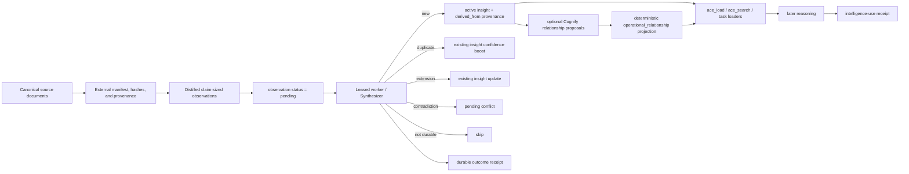

# ACE knowledge ingestion: architecture, best practices, and ground-truth checks

> Source-grounded against the ACE 0.2.0 / schema v168 release candidate and the verified TP1-TP8
> implementation. Use the exact R7 source commit recorded in the release-readiness evidence before
> relying on field or lifecycle behavior in a deployed build.

## The short version

ACE is not a general-purpose document lake or conventional RAG system. ACE 0.2.0 has two deliberately
separate ingestion meanings:

- use the **State Engine adapter boundary** for a bounded, high-volume temporal source corpus that
  must remain grounded evidence rather than cognitive memory; and
- use ordinary **observations** for a small, decision-relevant correction, decision, preference,
  pattern, failure, discovery, or fact that should enter the existing synthesis lifecycle.

Keep full source bodies in their canonical/content-addressed system. A State Engine adapter proposes
bounded source/entity/claim/event records with digests and provenance; Core owns product scope,
stable IDs, validation, receipts, and replay. A source claim becomes neither a reviewed belief nor
memory merely because an extractor or model emitted it. Only separately reviewed State Engine
assertions can enter belief projection, and only an eligible conclusion with explicit promotion
authority can enter cognitive memory. See the [State Engine Core boundary](design/state-engine-core-boundary-v1.md)
and [operations runbook](state-engine-operations.md).

The most important rules are:

1. **Do not use `processed` as a “new insight” signal.** It means a durable successful receipt exists;
   inspect that receipt to learn whether ACE created, updated, merged, preserved a conflict, or
   skipped.
2. **Do not expect one observation to create one insight.** Synthesis may create, update, deduplicate,
   flag a conflict, or skip.
3. **Use `product` in database queries.** `product_id` is an API/Python argument; the database field
   is `product`.
4. **Use `observation_type` on observations and `insight_type` on insights.** `knowledge_type` is a
   search argument, not a persisted field.
5. **Treat `domain_path` as a controlled routing slug, not a free-form subject or document tag.** Put
   the subject in the content and use search for subject queries.
6. **Use `ace_load` for a known routing slug and `ace_search` for a subject.** Be aware that search
   behavior differs between the standalone thin MCP client and the in-process MCP server.
7. **Cognify does not turn observations into insights.** It proposes typed relationships between
   insights after synthesis has already written them.
8. **Do not backfill thousands of records until a 10–50-claim pilot passes end to end.** For State
   Engine input this means exact item/batch receipts, evidence retrieval, belief/rollout separation,
   and replay. For ordinary observations it means a later task retrieves, injects, and reflects the
   retained item—not merely that rows exist.

### Recommendation for the plan described

Proceed with extraction, quality gates, and an external content-addressed manifest. Do **not** emit
7,900 ordinary observations or make a large backfill decision merely because extraction completed.
First map roughly ten documents through one adapter into one controlled product. Reconcile every
terminal receipt, query the exact grounded evidence, build/replay one reviewed belief projection,
keep simulations labeled, and promote only an independently eligible conclusion. Scale only after
the pilot and recovery rehearsal pass.

## The mental model



There are three different transformations here:

- **Observation → insight** is synthesis.
- **Insight → related insight** is Cognify plus deterministic relationship resolution.
- **Stored intelligence → later reasoning context** is retrieval and injection.

Calling all three “cognification” hides the failure boundary. Diagnose and measure them separately.

## What the fields actually mean

| Concept | API/tool name | Database field | What it controls |
|---|---|---|---|
| Product scope | `product_id` or authenticated product | `product` | Isolation and every meaningful read/write boundary |
| Observation kind | `observation_type` | `observation.observation_type` | Input classification such as correction, decision, preference, or pattern |
| Insight kind | `knowledge_type` search argument | `insight.insight_type` | Optional search filter; there is no general `knowledge_type` column |
| Routing label | `domain_path` | `domain_path`, `discipline_hint`, then insight `tags`/`source_domain` | Which discipline/specialty loaders can find the item |
| Queue state | n/a | `observation.status` | Whether the worker will attempt the observation |
| Old synthesis flag | n/a | `observation.synthesized` | Legacy field; the current worker selects by `status`, not this boolean |
| Specialty binding | specialty slug at classification time | `insight.specialty` record link | Specialty-scoped dual-loader retrieval |
| Provenance | returned observation ID | `derived_from` relation, insight → observation | Evidence that a new insight was written from an observation |
| Semantic links | n/a | `operational_relationship` | Accepted, operational insight-to-insight relationships |

Two especially common false alarms follow directly from this table:

- `knowledge_type` being `NULL` on observations says nothing. Query `observation_type` there and
  `insight_type` on insights.
- `product_id` being absent from a row is expected. The persisted record field is `product`.

## What turns an observation into an insight

### 1. Queue eligibility

The worker atomically claims only observations whose `status = 'pending'`, scoped to one `product`.
It processes at most 10 claims per poll cycle, but claims one row at a time so later work never sits
in an un-heartbeated client batch. It does not select on `synthesized = false`.

Current queue states have these practical meanings:

- `pending`: initially eligible, retryable after `next_retry_at`, or currently leased/processing.
- `processed`: a durable successful outcome receipt exists.
- `failed`: a durable dead-letter receipt records exhaustion of the three-attempt budget.
- `pre-worker`: legacy rows deliberately excluded when the queue fields were introduced.

The detailed `processing_state` distinguishes `pending`, `processing`, `succeeded`,
`retryable_failed`, and `dead_letter`. `processed` still does **not** mean “has a new insight”; its
receipt may instead record an update, merge, preserved conflict, or deliberate skip.

### 2. Synthesis outcomes

For each worker observation, the synthesizer loads a bounded set of existing active insights for the
same discipline. It then may:

- create a new insight;
- update an existing insight;
- detect a conflict;
- deduplicate against an embedded insight and boost its confidence; or
- skip content that is not a durable addition.

This is why observation and insight counts should not be expected to match.

### 3. New-insight persistence

For a genuinely new insight, ACE computes an embedding when possible and atomically writes:

- the active insight;
- its embedding or `needs_embedding = true`;
- an `informed_by` specialty edge when a specialty resolves; and
- `derived_from` edges to source observations.

The provenance edge direction is:

```text
insight -> derived_from -> observation
```

Do not look for the inverse direction.

### 4. Why a processed row may not have a new insight

Some cases are healthy:

- the observation duplicated an existing insight;
- it updated an existing insight;
- it became a conflict instead of active truth; or
- the synthesizer intentionally skipped it.

For rows processed through the current lifecycle, inspect `outcome_receipt`. Its immutable
disposition distinguishes created, updated, merged, conflict-preserved, and skipped results and
names the corresponding durable references or skip reason. Receipt persistence precedes the
compatibility `processed` marker.

Historical rows are different. A pre-v161 ordinary observation marked `processed` without a receipt
remains `legacy_unexplained`; ACE does not fabricate whether it was a consolidation, deliberate
skip, or failure. Therefore, an old “processed without derived insight” count is an unproven-outcome
count until it is stratified by receipt presence and specialized observation contract.

### 5. Corrections are a deliberate exception

The public REST/thin-client correction path stores corrections as `processed` without generic
synthesis. They remain directly retrievable as durable human guidance. A processed correction with
no insight is therefore expected.

This exception is another reason to group any “processed without insight” analysis by
`observation_type` and source surface.

## Domain paths, specialties, and subjects

These are different concepts:

- A **subject** is what the claim is about: cancellation handling, pricing elasticity, OAuth refresh,
  a specific customer, and so on.
- A **discipline/domain path** is a stable retrieval bucket such as `architecture`, `data`,
  `business_logic`, or `observability`.
- A **specialty** is a registry record and an optional record link on an insight.

The synthesizer prompt currently steers classification toward this controlled discipline set:

```text
security, testing, ux, performance, devops, data, accessibility,
documentation, ai_ml, architecture, api_design, data_modeling,
business_logic, integration, error_handling, observability,
configuration, deployment, versioning, scale, code_conventions,
dependency_management
```

For bulk imports, start with a small, frozen vocabulary based on that list. Do not use a document ID,
heading, customer name, or every distinct subject as `domain_path`. Dynamic routing slugs create
sparse buckets, make exact loads unpredictable, and can trigger specialty sprawl.

Put the specific subject in the observation content. For example:

```text
Bad domain_path: customer-1842-cancellation-reaction-fix
Good domain_path: business_logic

Good content: For Online Retail cancellation events, exclude rows whose invoice starts
with C before computing repeat-purchase conversion; including them reverses the measured effect.
```

### How specialty emergence actually works

After synthesis, ACE groups active insights that have `specialty = NONE` by exact `source_domain`.
When a group reaches five insights, a budget-model call proposes a specialty name/slug, ACE creates a
specialty record, and it reparents every unparented active insight in that exact group.

Important consequences:

- Emergence is not a global claim on every `specialty = NONE` row; it is grouped by product and exact
  `source_domain`.
- If the importer generates thousands of distinct routing values, every value that reaches five can
  mint another specialty.
- If an existing specialty slug matches the synthesized discipline, new insights bind to it at write
  time and do not wait for emergence.
- The registry's stored `specialty.insight_count` is cached metadata, not authoritative cardinality.
  In this revision, emergence creates a specialty with the default count but does not update that
  counter after reparenting. Compute the actual count from `insight.specialty` when auditing.
- The dual loader treats a registry specialty with stored `insight_count < 3` as a gap. A freshly
  emerged specialty can therefore have real linked insights while still looking empty to that read
  path until its counter is reconciled.

That last distinction can explain wildly different “specialty binding” percentages depending on
whether the calculation reads the record link, the registry counter, `source_domain`, or tags.

## Retrieval: use the right read for the question

### `ace_load`: known routing bucket

`ace_load("pricing strategy")` normalizes the input to `pricing_strategy` and performs an exact
discipline/tag-oriented load. It does not perform a free-form semantic subject search.

Use it when the input is the same stable slug used during capture:

```text
ace_load("business_logic")
ace_load("observability")
```

The standalone thin MCP client calls `/intel/context`. That endpoint also merges up to 50 directly
captured observations matching the exact domain, so it can return a raw observation even if no
insight exists. This is useful for continuity, especially for corrections, but it means a successful
thin-client `ace_load` does not by itself prove that the task reasoning loader can use the item as an
insight.

### `ace_search`: subject lookup

Use search for a concept or phrase. The in-process surface can optionally restrict it by routing
tags; the standalone thin surface searches across the authenticated product:

```text
ace_search("invoice cancellation repeat purchase")
```

The in-process MCP implementation and supported standalone thin client share the same product-scoped
retrieval service. It uses BM25 scoring plus SurrealDB indexed KNN, reciprocal-rank fusion, optional
`insight_type` and tag filters, an optional bounded reranker, and an explicit retrieval receipt. The
receipt reports embedding/index compatibility and degraded lexical-only fallbacks, so callers never
need to infer which path ran from a transport-specific docstring.

### `ace_task`: prove reasoning use

A task does not reason over every observation, memory row, document, or insight. Its classifier and
loaders select bounded discipline/specialty context.

After a pilot task, inspect `ace_status(task_id="task:...")` and its
`intelligence_use_receipt`. The useful progression is:

1. `retrieved`: ACE found the item.
2. `injected`: it entered the later reasoning context.
3. `reflected`: bounded output attribution showed that the item was used.
4. `decision_material`: a matched evaluation changed a declared structured decision field.

For a normal ingestion smoke test, require at least retrieved + injected + reflected. Do not claim
material improvement merely from retrieval or copied wording.

## What “Association Radius” can safely mean

There is no implementation symbol or public contract named **Association Radius** in this ACE
revision. Any stage using that term must document the exact table, edge family, seed selection,
depth, and caps it reads.

The closest built-in behavior is relationship-aware expansion in `ace_load`/`load_intelligence`:

- seed from at most five of the initially loaded insights;
- read accepted `operational_relationship` edges;
- traverse one hop;
- take at most three neighbors per seed and ten total; and
- include only active, open, same-product insight neighbors.

`ace_search` does not perform that graph expansion.

Cognify is also narrower than “associate everything with everything”:

- it runs only after a new insight is written;
- candidate generation uses Core's provider-neutral deterministic candidate finder over the bounded
  existing-insight set already loaded for the same discipline and product;
- that Cognify adapter requests lexical and vector signals and records their index versions,
  contributions, caps, and fallbacks in an internal receipt;
- it considers up to eight candidates per new insight by default;
- candidate generation makes no primary-model call; model output is only the later relationship
  proposal; and
- deterministic policy decides whether a proposal becomes an accepted operational edge.

Grounded evidence retrieval uses the same finder with canonical-entity, temporal,
graph-neighborhood, and source-diversity signals available in addition to lexical/vector similarity.
Unknown time is never counted as passing a temporal signal, cross-product candidates are filtered
before scoring, and domain kinds are routing facets rather than the primary association mechanism.
The candidate contracts and receipts are internal Core interfaces, not additional MCP tools.

If Stage 2 reads embeddings, `synapse`, `derived_from`, raw proposal rows, or specialty membership
instead of `operational_relationship`, it is measuring a different relationship concept.

## What to ingest

Prefer claim-sized, reusable intelligence:

- a decision and why it was chosen;
- a correction that should override a prior assumption;
- a stable user or organizational preference;
- a repeated pattern with its conditions;
- a failure with an identified cause and prevention;
- a fact or constraint that changes a decision; or
- a discovery that would save future investigation.

Do not ingest as ACE observations:

- entire documents merely because they exist;
- boilerplate, navigation, duplicated summaries, or examples with no durable lesson;
- one row per sentence without context;
- secrets, credentials, private keys, access tokens, or raw sensitive payloads;
- claims with no product scope or source identity; or
- speculative model output presented as independent evidence.

A useful observation is self-contained and normally contains:

```text
[claim] + [scope/conditions] + [why it matters] + [source/version reference]
```

Example:

```text
For cohort reports built from Online Retail II v2026-07-15, cancellation invoices
(invoice prefix C) must be excluded before repeat-purchase conversion is computed;
including them flips the rollout conclusion. Source: analysis/cancellation-cohort.md#v3.
```

Keep provenance in an external import manifest even when a public capture surface cannot store every
source field.

## Chunking rules for document extraction

The current document observer ignores chunks below roughly 20 estimated tokens and passes only the
first 1,000 characters of each chunk to the extraction prompt. The document chunker can create much
longer heading sections, so a large section may be accepted while most of it is invisible to the
observer.

Until that path is changed and covered by a real-database acceptance test:

- split on semantic boundaries;
- keep each extraction unit approximately 400–900 characters;
- repeat the minimum heading/entity context needed to make the unit self-contained;
- do not split a claim from its condition, exception, or evidence reference; and
- hash the normalized source unit so retries can be controlled externally.

For already-distilled knowledge, prefer one `ace_capture` call per durable claim over sending prose
back through a document observer that must rediscover the claim.

## Idempotency and replay

Generic observation capture does not have a general-purpose idempotency key. The task API has one,
and specialized foresight observations have contract-specific request IDs, but that does not make a
bulk ordinary-observation importer idempotent.

Maintain an external manifest with at least:

| Field | Purpose |
|---|---|
| `batch_id` | Isolate, audit, and stop one import |
| `source_id` and version | Point back to canonical material |
| normalized content hash | Detect unchanged retries |
| expected product | Prevent cross-product writes |
| expected observation type | Detect classifier drift |
| expected domain path | Detect routing drift |
| returned observation ID | Prove the write happened |
| lifecycle result | pending, processed, failed, or timed out |
| derived insight IDs | Prove new-insight provenance where applicable |
| acceptance-query result | Prove retrieval on the intended surface |

Never reset a large set of `processed` rows to `pending` as the first debugging move. Without a
uniform synthesis receipt and generic idempotency, replay can create duplicate insights, repeated
updates, or new LLM classifications. First sample and classify the unproven outcomes.

## A safe ingestion protocol

### Phase 0: freeze the contract

Before writing anything, record:

- ACE commit/version and schema version;
- the exact ingestion surface: thin MCP, REST `/observations`, worker `/observe`, or custom code;
- authenticated product and expected database `product` record;
- the controlled domain-path vocabulary;
- accepted observation types;
- source manifest and content hashes;
- model/provider used by observer and synthesizer; and
- stop conditions for error rate, cost, latency, and routing drift.

### Phase 1: preflight the path

Use a disposable product/database where possible. Capture one deliberately unique correction and one
ordinary pattern. Verify:

- both calls return non-empty observation IDs;
- the rows have the expected `product`, `observation_type`, `domain_path`, and source;
- the correction is immediately returned by exact-domain `ace_load`;
- the ordinary item becomes either a traceable new insight or an explicitly understood non-new
  outcome; and
- a later task receipt shows retrieval, injection, and reflection for at least one retained item.

### Phase 2: a 10–50-claim pilot

Use a frozen, hand-labeled set containing:

- obvious new facts;
- deliberate duplicates;
- an update;
- a contradiction;
- a correction;
- two subjects in the same discipline; and
- the same subject phrased differently.

Predict the expected outcome of each item before capture. If the result cannot be explained after
capture, the pilot failed even if every request returned green.

### Phase 3: acceptance gates

Require all of the following before scaling:

- zero writes with missing or wrong product;
- no unexplained queue accumulation;
- no failed observations after retry exhaustion;
- every processed-without-provenance pilot row classified as duplicate, update, conflict, deliberate
  skip, special observation-only type, or confirmed failure;
- stable domain-path distribution;
- no surprise specialty creation;
- acceptable embedding coverage;
- expected exact-domain load recall;
- expected subject-search recall on the actual client surface; and
- successful later-task retrieval + injection + reflection.

### Phase 4: scale gradually

Scale by measured steps—for example 50 → 250 → 1,000—not directly to 166,000. At every step,
compare deltas in observations, active insights, derived provenance edges, specialty bindings,
embeddings, queue failures, retrieval recall, and task use.

The worker processes pending observations sequentially and a worker observation can require a
primary-model synthesis call. Backlog size is therefore also a cost and latency decision, not just a
database capacity decision.

## Read-only ground-truth queries

Run these against a known product. Adjust the record ID once; do not remove product filters.

```surql
LET $p = product:platform;

-- Queue truth. This is the worker lifecycle, not insight success.
SELECT status, processing_state, count() AS n
FROM observation
WHERE product = $p
GROUP BY status, processing_state;

-- Lease ownership and expiry for work currently in flight.
SELECT id, processing_lease_owner, processing_lease_generation,
       processing_lease_heartbeat_at, processing_lease_expires_at
FROM observation
WHERE product = $p AND processing_state = 'processing'
ORDER BY processing_lease_expires_at;

-- Truthful current-version outcomes by disposition and failure state.
SELECT processing_state, disposition, count() AS n
FROM synthesis_outcome_receipt
WHERE product = $p
GROUP BY processing_state, disposition;

-- Always stratify by observation type.
SELECT observation_type, status, count() AS n
FROM observation
WHERE product = $p
GROUP BY observation_type, status
ORDER BY observation_type, status;

-- Durable insight state.
SELECT status, count() AS n
FROM insight
WHERE product = $p
GROUP BY status;

-- Embedding readiness for active retrieval.
SELECT needs_embedding, count() AS n
FROM insight
WHERE product = $p AND status = 'active'
GROUP BY needs_embedding;

-- Routing distribution. High-cardinality source_domain is a sprawl warning.
SELECT source_domain, count() AS n
FROM insight
WHERE product = $p AND status = 'active'
GROUP BY source_domain
ORDER BY n DESC;

-- Actual specialty binding. Use this, not only specialty.insight_count.
SELECT specialty, count() AS actual_insights
FROM insight
WHERE product = $p AND status = 'active'
GROUP BY specialty
ORDER BY actual_insights DESC;

-- Compare registry metadata to actual links.
SELECT id, slug, name, insight_count
FROM specialty
WHERE product = $p
ORDER BY slug;

-- Processed observations with no new-insight provenance edge.
-- Inspect their receipts: update, merge, conflict, and skip are not failures.
SELECT observation_type, outcome_receipt, count() AS without_new_lineage
FROM observation
WHERE product = $p
  AND status = 'processed'
  AND id NOT IN (SELECT VALUE out FROM derived_from)
GROUP BY observation_type, outcome_receipt
ORDER BY without_new_lineage DESC;

-- Inspect a bounded sample before changing any state.
SELECT id, observation_type, domain_path, discipline_hint, source, content, created_at
FROM observation
WHERE product = $p
  AND status = 'processed'
  AND id NOT IN (SELECT VALUE out FROM derived_from)
ORDER BY created_at DESC
LIMIT 100;

-- Proven new-insight lineage.
SELECT in AS insight_id, out AS observation_id, created_at
FROM derived_from
WHERE out IN (SELECT VALUE id FROM observation WHERE product = $p)
ORDER BY created_at DESC
LIMIT 100;

-- Accepted relationship projection used by relationship-aware loading.
SELECT predicate, count() AS n
FROM operational_relationship
WHERE in IN (SELECT VALUE id FROM insight WHERE product = $p)
   OR out IN (SELECT VALUE id FROM insight WHERE product = $p)
GROUP BY predicate
ORDER BY n DESC;
```

Also inspect application logs and metrics for:

- `capture.write_failed` events;
- `ace_capture_write_failures_total`;
- worker retry and terminal-failure logs;
- observation write responses with no returned ID;
- embedding failures and `needs_embedding = true`; and
- specialty-emergence warnings.

## Current implementation hazards for bulk knowledge ingestion

These are not reasons to abandon ACE. They are reasons to keep the import bounded until the path is
made observable.

### The portal document endpoint is not yet a trustworthy bulk path

The current `/documents` implementation now product-scopes document, memory, and observation writes
and routes created observations through the truthful outcome lifecycle. It still marks
`last_ingested` before every observation outcome is finalized, silently omits an observation create
that returns no row, and applies the observer's bounded prompt window. It can therefore report
document-level progress without proving complete extraction and reconciliation.

Do not use it for a large import until it has a real-SurrealDB acceptance test proving:

- product-scoped document creation and listing;
- product-scoped memory and observation rows;
- non-empty IDs checked after every create;
- complete section coverage;
- traceable observation-to-insight outcomes; and
- an explicit failed ingestion state instead of unconditional `last_ingested`.

### Historical queue rows may lack a uniform synthesis outcome receipt

Current ordinary processing has a uniform immutable receipt, but no receipt is invented for rows
processed before that contract existed. Treat `legacy_unexplained` as an explicit migration-era gap
and keep a bulk pilot bounded until the pilot's own rows all reconcile to receipts.

### Generic capture lacks replay protection

Ordinary capture retries can duplicate data. External manifest idempotency is mandatory until the
capture contract accepts and enforces a stable source key.

### Thin and in-process retrieval are not equivalent

The two MCP implementations currently have different search capabilities. Validate the surface the
friend actually uses, through the same process/authentication boundary used in production.

## What success looks like

A successful ACE knowledge import is not “166,000 rows inserted.” It is:

- the canonical corpus remains intact and versioned outside ACE;
- every ACE item is a durable, scoped, source-identifiable claim;
- replay is controlled by an import manifest;
- domain-path cardinality is bounded and intentional;
- queue and synthesis outcomes are explainable;
- active insights have usable provenance and embedding state;
- specialty membership and relationship edges are measured from their authoritative records;
- the intended `ace_load` and `ace_search` surfaces retrieve the gold-set items; and
- a fresh later task demonstrably receives and reflects relevant retained intelligence.

If the team still cannot predict what a query or pilot item will do, do not scale the import. That is
not excessive caution; it is the acceptance criterion for a reasoning substrate.

## Source map

The most relevant implementation files for re-verifying this guide are:

- [`core/engine/capture/leases.py`](../core/engine/capture/leases.py): atomic product-scoped claims,
  heartbeat renewal, expiry, and recovery fences.
- [`core/engine/capture/lifecycle.py`](../core/engine/capture/lifecycle.py): numbered attempts,
  durable outcome receipts, retry/dead-letter policy, finalization, and queue health.
- [`core/engine/worker/processor.py`](../core/engine/worker/processor.py): bounded leased draining,
  heartbeat-protected synthesis, and product-scoped post-processing.
- [`core/engine/capture/synthesizer.py`](../core/engine/capture/synthesizer.py): synthesis outcomes,
  dedupe, insight writes, specialty lookup, and Cognify scheduling.
- [`core/engine/capture/atomic_write.py`](../core/engine/capture/atomic_write.py): atomic insight,
  embedding, specialty, and `derived_from` persistence.
- [`core/engine/intelligence/emergence.py`](../core/engine/intelligence/emergence.py): five-insight
  emergence threshold and specialty reparenting.
- [`core/engine/orchestrator/loader.py`](../core/engine/orchestrator/loader.py): exact discipline/tag
  retrieval and temporal read behavior.
- [`core/engine/orchestrator/dual_loader.py`](../core/engine/orchestrator/dual_loader.py): specialty
  record resolution and stored `insight_count` gap behavior.
- [`core/engine/graph/insight_neighbors.py`](../core/engine/graph/insight_neighbors.py): one-hop accepted
  relationship expansion and caps.
- [`core/engine/capture/cognify.py`](../core/engine/capture/cognify.py): relationship candidate and
  proposal formation.
- [`core/engine/api/intel.py`](../core/engine/api/intel.py): standalone thin-client load/search API
  behavior and direct captured-observation merging.
- [`ace_mcp_client/tools.py`](../ace_mcp_client/tools.py): the supported standalone MCP client's HTTP
  calls and client-side search filtering.
- [`core/engine/api/documents.py`](../core/engine/api/documents.py) and
  [`core/engine/capture/document_chunker.py`](../core/engine/capture/document_chunker.py): current
  document ingestion path.
- [`docs/evidence/i3-intelligence-use-evidence.md`](evidence/i3-intelligence-use-evidence.md): the
  retrieval/injection/reflection/materiality contract.
